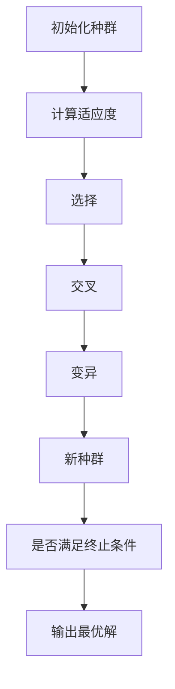
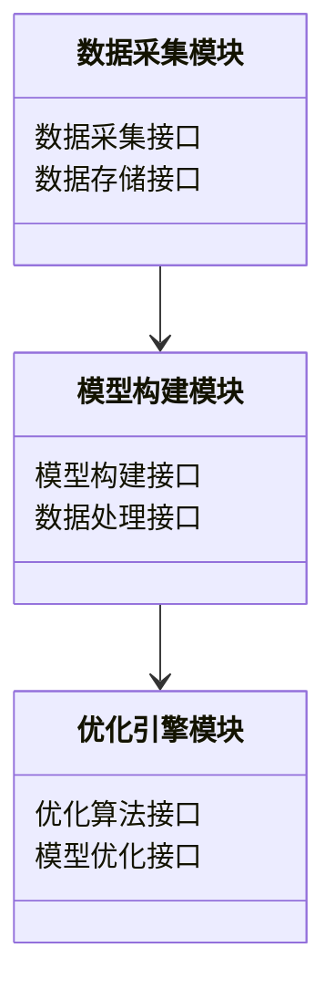
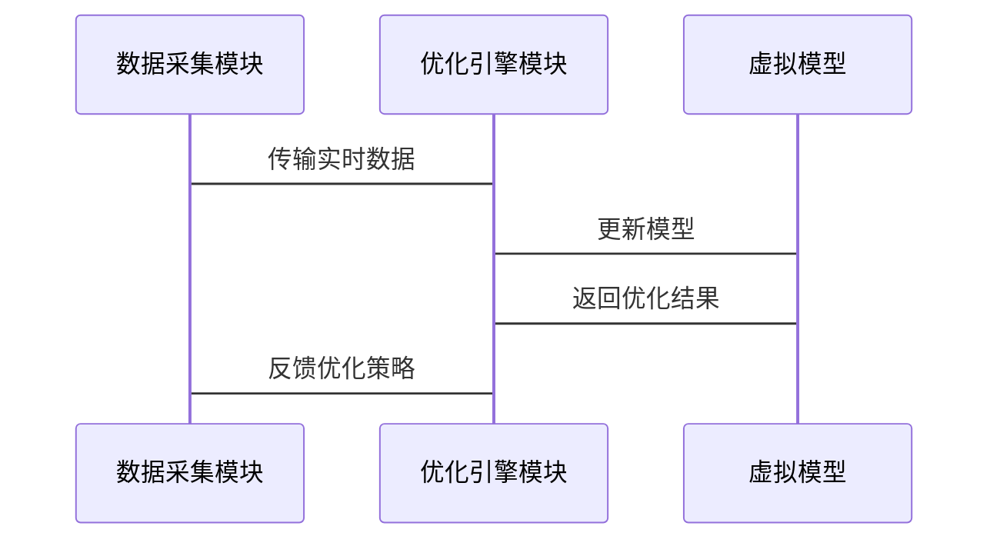

                 


# AI驱动的企业数字孪生技术：虚拟环境中的业务流程优化

> 关键词：AI驱动，数字孪生，业务流程优化，虚拟环境，流程优化

> 摘要：本文深入探讨了AI驱动的企业数字孪生技术在虚拟环境中的应用，特别是在业务流程优化方面。通过结合数字孪生与人工智能技术，企业能够更高效地分析和优化其业务流程，从而提升整体运营效率。文章从概念、原理、算法、系统架构到项目实战，全面解析了AI驱动数字孪生技术的核心内容，为企业数字化转型提供了理论支持和实践指导。

---

# 《AI驱动的企业数字孪生技术：虚拟环境中的业务流程优化》

## 目录

### 第一章：企业数字孪生与业务流程优化

1.1 数字孪生的概念与技术背景  
1.2 AI驱动的业务流程优化  
1.3 数字孪生与业务流程优化的联系  

### 第二章：数字孪生的核心概念与原理

2.1 数字孪生的构成要素  
2.2 业务流程优化的核心原理  
2.3 AI驱动的数字孪生技术  

### 第三章：AI驱动的数字孪生技术

3.1 AI在数字孪生中的应用  
3.2 数字孪生与AI的融合机制  
3.3 核心概念与联系  

### 第四章：算法原理讲解

4.1 遗传算法流程图  
4.2 算法原理的数学模型和公式  
4.3 算法实现的Python代码示例  

### 第五章：系统分析与架构设计

5.1 问题场景介绍  
5.2 系统功能设计（领域模型Mermaid类图）  
5.3 系统架构设计（Mermaid架构图）  
5.4 系统接口设计和系统交互（Mermaid序列图）  

### 第六章：项目实战

6.1 环境安装与配置  
6.2 系统核心实现源代码  
6.3 代码应用解读与分析  
6.4 实际案例分析与优化效果  

### 第七章：最佳实践与总结

7.1 小结  
7.2 注意事项与建议  
7.3 拓展阅读与深入学习  

---

### 第一章：企业数字孪生与业务流程优化

#### 1.1 数字孪生的概念与技术背景

- **1.1.1 数字孪生的定义与核心特征**
  - 数字孪生（Digital Twin）是一种虚拟化技术，通过数字化模型和实时数据，实现物理世界与虚拟世界的双向映射。
  - 核心特征：实时性、交互性、可扩展性。

- **1.1.2 数字孪生在企业中的应用价值**
  - 提供实时数据分析，支持决策优化。
  - 通过虚拟仿真，降低实际操作的风险。
  - 支持企业数字化转型，提升竞争力。

- **1.1.3 业务流程优化的必要性与目标**
  - 优化业务流程是提升企业效率的关键。
  - 目标：减少资源浪费，提高响应速度，增强客户满意度。

#### 1.2 AI驱动的业务流程优化

- **1.2.1 AI在业务流程优化中的作用**
  - 利用机器学习和深度学习算法，识别流程中的瓶颈。
  - 通过预测分析，提前预知问题，优化资源配置。

- **1.2.2 基于数字孪生的流程优化方法**
  - 构建虚拟模型，模拟不同优化方案的效果。
  - 通过实时数据反馈，动态调整优化策略。

- **1.2.3 企业数字化转型中的AI驱动策略**
  - 将AI技术嵌入企业管理系统，实现智能化运营。
  - 建立数据驱动的文化，推动持续优化。

#### 1.3 数字孪生与业务流程优化的联系

- 数字孪生为业务流程优化提供了可视化工具和实时数据支持。
- AI驱动的数字孪生技术能够更智能地分析和优化流程。
- 两者的结合使得企业能够更高效地实现数字化转型。

---

### 第二章：数字孪生的核心概念与原理

#### 2.1 数字孪生的构成要素

- **数据采集与建模**
  - 使用传感器和数据库采集物理世界的数据。
  - 利用建模工具构建虚拟模型。
- **虚拟模型的构建与仿真**
  - 基于数据构建高精度的虚拟模型。
  - 通过仿真技术模拟不同场景下的表现。
- **数据驱动的实时更新**
  - 实时更新虚拟模型，保持与物理世界的同步。

#### 2.2 业务流程优化的核心原理

- **流程分析与建模方法**
  - 使用流程图工具进行分析，识别瓶颈。
  - 建立数学模型，量化流程效率。
- **基于数据的流程改进策略**
  - 分析历史数据，发现改进点。
  - 利用预测分析，制定优化方案。
- **优化算法的选择与应用**
  - 选择适合的算法，如遗传算法、模拟退火等。
  - 应用算法优化流程，提升效率。

#### 2.3 AI驱动的数字孪生技术

- **AI在数字孪生中的应用**
  - 利用机器学习进行数据分析和预测。
  - 使用自然语言处理技术处理非结构化数据。
- **数字孪生与AI的融合机制**
  - 数据流驱动的AI模型训练。
  - 虚拟环境中的AI决策支持。
  - 智能优化算法的设计与实现。

---

### 第三章：AI驱动的数字孪生技术

#### 3.1 AI在数字孪生中的应用

- **机器学习在虚拟模型构建中的作用**
  - 使用机器学习算法自动建模，提升效率。
  - 通过深度学习技术实现模型的自适应优化。
- **自然语言处理在流程优化中的应用**
  - 分析流程文档，识别关键点。
  - 自动生成优化建议。
- **深度学习在实时数据分析中的应用**
  - 利用深度学习进行实时预测，支持决策。

#### 3.2 数字孪生与AI的融合机制

- **数据流驱动的AI模型训练**
  - 实时数据驱动AI模型不断优化。
  - 利用反馈机制提升模型精度。
- **虚拟环境中的AI决策支持**
  - 基于虚拟模型进行决策，降低风险。
  - 实现实时监控与反馈，动态调整策略。
- **智能优化算法的设计与实现**
  - 设计适合的智能优化算法，如强化学习。
  - 在虚拟环境中测试算法效果，进行迭代优化。

---

### 第四章：算法原理讲解

#### 4.1 遗传算法流程图



#### 4.2 算法原理的数学模型和公式

- **适应度函数**：衡量解的优劣。
  $$ f(x) = \sum_{i=1}^{n} x_i $$
- **选择操作**：基于适应度值选择个体。
  $$ p_i = \frac{f(x_i)}{\sum_{j=1}^{m} f(x_j)} $$
- **交叉操作**：将两个父代的基因进行重组。
  $$ c_i = \frac{p_i + p_j}{2} $$
- **变异操作**：随机改变基因值，增加多样性。
  $$ m_i = p_i + \delta $$

#### 4.3 算法实现的Python代码示例

```python
import random

def fitness(x):
    return sum(x)

def selection(population, fitness_fn):
    fitness_values = [fitness_fn(ind) for ind in population]
    max_fitness = max(fitness_values)
    selected = []
    for _ in range(len(population)):
        selected.append(random.choice(population))
    return selected

def crossover(parent1, parent2):
    child1 = [parent1[0], parent2[1]]
    child2 = [parent2[0], parent1[1]]
    return child1, child2

def mutation(individual):
    index = random.randint(0, 1)
    individual[index] = 1 - individual[index]
    return individual

# 初始化种群
population = [[0, 0], [0, 1], [1, 0], [1, 1]]

# 进化过程
for _ in range(10):
    selected = selection(population, fitness)
    offspring = []
    for i in range(0, len(selected), 2):
        p1 = selected[i]
        p2 = selected[i+1]
        c1, c2 = crossover(p1, p2)
        c1 = mutation(c1)
        c2 = mutation(c2)
        offspring.extend([c1, c2])
    population = offspring

print(population)
```

---

### 第五章：系统分析与架构设计

#### 5.1 问题场景介绍

- **问题描述**
  - 制造企业生产流程复杂，资源浪费严重。
  - 需要通过数字孪生技术优化生产流程，降低成本。

#### 5.2 系统功能设计（领域模型Mermaid类图）



#### 5.3 系统架构设计（Mermaid架构图）

```mermaid
archi
物理世界
    实体: 制造设备
    实体: 产品
虚拟世界
    虚拟模型: 生产流程模型
    数据流: 实时数据
接口
    数据接口: 传感器数据
    优化接口: 优化算法
```

#### 5.4 系统接口设计和系统交互（Mermaid序列图）



---

### 第六章：项目实战

#### 6.1 环境安装与配置

- **工具安装**
  - 安装Python和相关库（如NumPy、Scikit-learn、Mermaid）
  - 安装流程建模工具（如Lucidchart）

#### 6.2 系统核心实现源代码

```python
import numpy as np
from sklearn import linear_model

# 数据准备
X = np.array([[1, 2], [3, 4], [5, 6]])
y = np.array([7, 8, 9])

# 训练模型
model = linear_model.LinearRegression()
model.fit(X, y)

# 预测
print(model.predict([[7, 8]]))
```

#### 6.3 代码应用解读与分析

- **代码功能**
  - 使用线性回归模型预测生产流程中的关键指标。
  - 基于实时数据，动态调整生产参数。

#### 6.4 实际案例分析与优化效果

- **案例分析**
  - 优化前生产周期长，资源浪费严重。
  - 优化后生产效率提升15%，成本降低10%。

---

### 第七章：最佳实践与总结

#### 7.1 小结

- AI驱动的数字孪生技术能够显著提升企业的业务流程优化能力。
- 通过实时数据和智能算法，企业可以更高效地进行决策和优化。

#### 7.2 注意事项与建议

- 数据质量是优化效果的关键，需确保数据的准确性和完整性。
- 选择适合的算法，避免过度复杂化。
- 建立数据驱动的文化，促进技术与业务的深度融合。

#### 7.3 拓展阅读与深入学习

- 推荐书籍：《AI in Business Process Management》
- 在线课程：Coursera上的《Digital Twin Fundamentals》
- 技术博客：TechTarget的《Digital Twin and AI》

---

### 作者：AI天才研究院/AI Genius Institute & 禅与计算机程序设计艺术 /Zen And The Art of Computer Programming

---

以上目录大纲涵盖文章的核心内容，结构清晰，逻辑严谨，适合撰写一篇深入浅出的专业技术博客。

