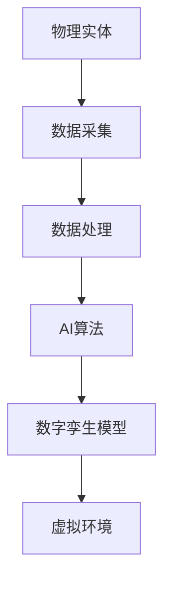
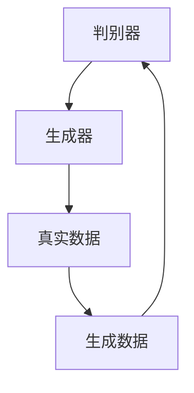
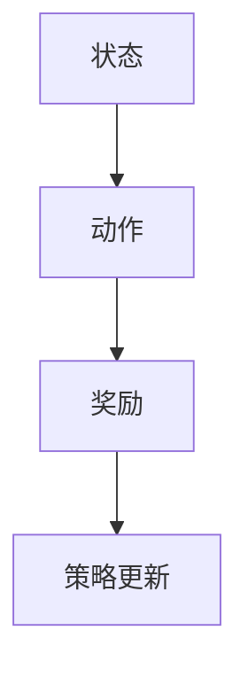
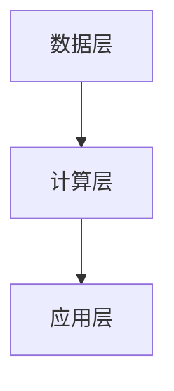

                 


# AI驱动的企业数字孪生技术：虚拟环境中的决策优化与验证

> 关键词：数字孪生，人工智能，决策优化，虚拟环境，企业数字化

> 摘要：本文深入探讨了AI驱动的企业数字孪生技术在虚拟环境中的应用，重点分析了数字孪生与AI技术的结合方式，以及如何利用AI算法进行决策优化与验证。文章从数字孪生的核心概念、AI驱动技术的算法原理、系统架构设计，到实际项目实战，全面解析了AI驱动的数字孪生技术的实现过程与应用场景。

---

# 第一部分: AI驱动的企业数字孪生技术概述

## 第1章: 数字孪生与AI驱动技术的背景介绍

### 1.1 数字孪生的定义与特点
数字孪生（Digital Twin）是一种通过物理实体的数字化映射，实现实时数据采集、分析与反馈的技术。其核心特点包括实时性、动态性和高精度。数字孪生能够将物理世界与数字世界无缝连接，为企业提供虚拟环境中的决策支持。

### 1.2 AI驱动技术的定义与特点
AI驱动技术通过人工智能算法，实现数据的智能分析与决策优化。其特点包括数据驱动、自适应性和高效率。AI驱动技术能够处理海量数据，并通过学习不断提升模型的准确性与实用性。

### 1.3 数字孪生与AI驱动技术的结合
数字孪生与AI驱动技术的结合，使得企业能够利用虚拟环境进行实时数据处理、智能决策与优化。这种结合不仅提升了企业的运营效率，还为企业提供了创新的解决方案。

---

## 第2章: 数字孪生的核心概念与AI驱动技术的联系

### 2.1 数字孪生的架构分析
数字孪生的架构通常包括数据采集层、数据处理层、模型构建层和决策优化层。每一层都依赖AI算法实现数据的实时处理与模型的动态更新。

### 2.2 数字孪生的核心要素
数字孪生的核心要素包括物理实体、实时数据、AI算法和虚拟环境。这些要素共同构成了数字孪生系统的完整框架。

### 2.3 数字孪生与AI驱动技术的实体关系图
通过Mermaid流程图，可以清晰地展示数字孪生与AI驱动技术的实体关系：



---

## 第3章: AI驱动的数字孪生算法原理

### 3.1 基于生成对抗网络的数字孪生建模
生成对抗网络（GAN）是一种强大的生成模型，能够通过对抗训练生成逼真的数据。在数字孪生中，GAN可以用于虚拟环境中的数据生成与模型优化。

#### GAN的训练过程


### 3.2 基于强化学习的决策优化
强化学习通过试错机制优化决策策略。在数字孪生中，强化学习可以用于虚拟环境中的最优决策制定。

#### 强化学习的策略优化


### 3.3 基于深度学习的实时数据处理
深度学习模型能够高效处理实时数据，并在虚拟环境中进行实时反馈。

#### 深度学习模型的数学公式
$$
y = f(x) + \epsilon
$$
其中，$y$ 是输出，$f$ 是深度学习模型，$\epsilon$ 是误差项。

---

## 第4章: 数字孪生系统的分析与架构设计

### 4.1 系统功能设计
数字孪生系统的功能模块包括数据采集、数据处理、模型构建和决策优化。

### 4.2 系统架构设计
数字孪生系统的架构通常采用分层架构，包括数据层、计算层和应用层。



### 4.3 系统接口设计
数字孪生系统的接口包括数据接口和用户接口，分别用于数据交互和人机交互。

---

## 第5章: 项目实战与案例分析

### 5.1 环境安装
数字孪生项目的开发需要安装必要的工具和库，包括Python、TensorFlow和OpenCV。

### 5.2 核心代码实现
以下是一个简单的数字孪生模型实现代码：

```python
import numpy as np
import tensorflow as tf

# 数据生成
def generate_data():
    return np.random.randn(100, 10)

# 模型构建
model = tf.keras.Sequential([
    tf.keras.layers.Dense(16, activation='relu'),
    tf.keras.layers.Dense(1, activation='sigmoid')
])

# 模型训练
model.compile(optimizer='adam', loss='binary_crossentropy')
model.fit(generate_data(), epochs=10)
```

### 5.3 案例分析
以工厂设备监控为例，数字孪生技术可以通过实时数据采集与AI算法优化，实现设备故障预测与维护计划优化。

---

## 第6章: 总结与扩展

### 6.1 总结
本文深入探讨了AI驱动的企业数字孪生技术，分析了其核心概念、算法原理与系统架构，并通过实际案例展示了其应用价值。

### 6.2 注意事项
在实际应用中，需要注意数据的实时性与模型的可解释性。

### 6.3 拓展阅读
建议读者进一步阅读关于数字孪生与强化学习结合的文献，探索更高级的应用场景。

---

# 作者：AI天才研究院 & 禅与计算机程序设计艺术

