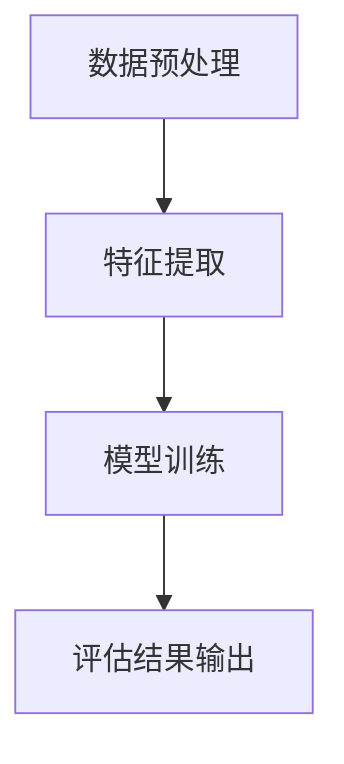
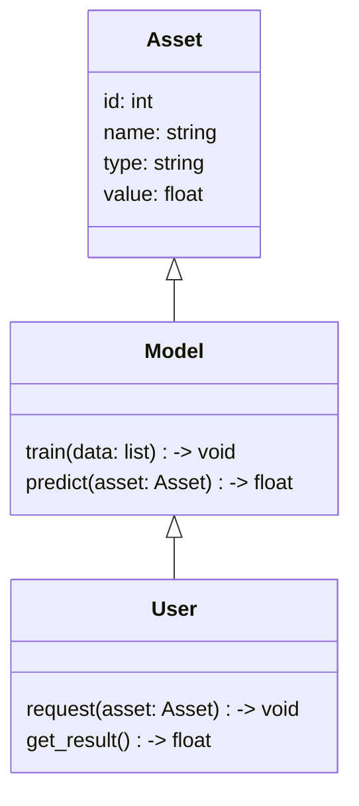
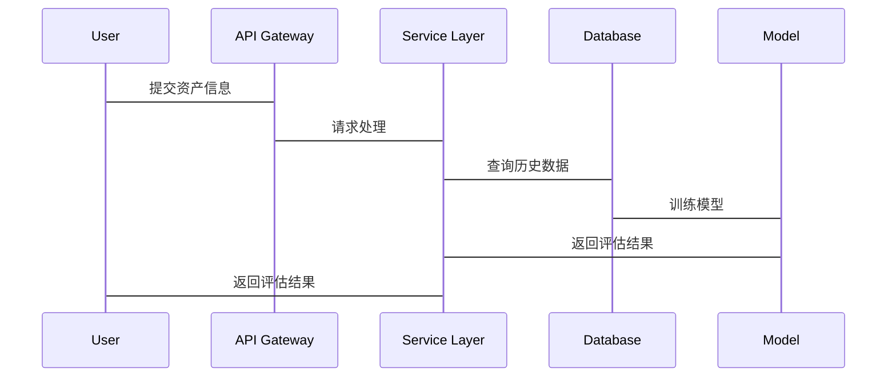

                 


# AI驱动的企业无形资产价值评估系统

> 关键词：AI技术，无形资产评估，企业价值，机器学习，深度学习，资产管理系统

> 摘要：随着企业数字化转型的加速，无形资产在企业价值中的比重日益增加。传统的无形资产评估方法已难以满足现代企业的复杂需求。本文将探讨如何利用人工智能技术，构建高效、准确的企业无形资产价值评估系统，通过算法原理、系统架构和项目实战的详细解析，为企业提供新的思路和解决方案。

---

# 第1章: 企业无形资产价值评估的背景与挑战

## 1.1 无形资产的定义与分类

### 1.1.1 无形资产的定义
无形资产是指企业拥有或控制的没有实物形态的资产，主要包括品牌价值、专利技术、商标、商誉、版权、客户关系等。

### 1.1.2 无形资产的主要分类
1. **品牌价值**：包括品牌知名度、品牌忠诚度等。
2. **专利技术**：包括发明专利、实用新型专利等。
3. **商誉**：企业并购中产生的商誉价值。
4. **版权**：软件、文学作品等的版权价值。
5. **客户关系**：长期客户关系的价值。

### 1.1.3 无形资产在企业价值中的重要性
无形资产在企业整体价值中的比重逐渐增加，尤其是在高科技企业和服务业中，无形资产往往占据了主导地位。

---

## 1.2 AI技术在无形资产评估中的应用背景

### 1.2.1 传统无形资产评估方法的局限性
传统的无形资产评估方法主要依赖于财务数据和专家经验，存在以下问题：
1. **数据局限性**：传统方法通常依赖历史财务数据，难以捕捉实时市场变化。
2. **主观性**：评估结果受评估人员主观判断的影响较大。
3. **效率低下**：手工评估过程繁琐，耗时较长。

### 1.2.2 AI技术如何提升资产评估效率
AI技术可以通过以下方式提升无形资产评估的效率和准确性：
1. **数据处理能力**：AI能够快速处理海量数据，包括文本、图像、市场动态等。
2. **模型预测能力**：通过机器学习模型，可以预测无形资产的市场价值和潜在风险。
3. **实时更新**：AI系统可以实时更新评估结果，确保评估结果的时效性。

### 1.2.3 企业数字化转型与无形资产评估的结合
随着企业数字化转型的推进，无形资产的评估需求日益增加。AI技术的引入为企业提供了更加高效和精准的评估工具。

---

## 1.3 当前AI驱动资产评估的现状与趋势

### 1.3.1 全球范围内AI在资产评估中的应用现状
目前，AI在无形资产评估中的应用主要集中在以下领域：
1. **金融行业**：利用AI评估企业信用风险和投资价值。
2. **知识产权保护**：通过AI技术保护专利和版权，评估其市场价值。
3. **企业并购**：在企业并购中，利用AI评估目标企业的无形资产价值。

### 1.3.2 未来发展趋势与挑战
1. **趋势**：AI技术将更加广泛地应用于无形资产评估，尤其是在大数据和区块链技术的支持下，评估结果将更加透明和可信。
2. **挑战**：如何确保AI模型的准确性和公平性，如何处理数据隐私问题等。

---

## 1.4 本章小结
本章主要介绍了企业无形资产的定义、分类及其在企业价值中的重要性，分析了传统评估方法的局限性，以及AI技术在提升评估效率和准确性方面的作用。同时，还探讨了当前AI在资产评估中的应用现状及未来发展趋势。

---

# 第2章: 企业无形资产价值评估的核心概念与联系

## 2.1 核心概念原理

### 2.1.1 无形资产价值评估的基本原理
无形资产的价值评估需要考虑其未来经济收益的现值。AI技术可以通过预测未来的收益流来估算资产价值。

### 2.1.2 AI驱动评估的核心算法原理
AI驱动的评估系统通常基于机器学习算法，包括回归分析、随机森林、神经网络等。

### 2.1.3 评估模型的输入输出关系
- **输入**：包括资产的历史数据、市场数据、企业财务数据等。
- **输出**：包括资产的估计价值、风险评估、市场趋势分析等。

---

## 2.2 核心概念属性特征对比表

| 特性 | 传统评估方法 | AI驱动评估方法 |
|------|----------------|------------------|
| 数据来源 | 依赖历史数据 | 结合实时数据与AI模型预测 |
| 评估效率 | 低效 | 高效实时评估 |
| 精度 | 受限于人为因素 | 受限于模型训练数据质量 |

---

## 2.3 ER实体关系图

```mermaid
er
    actor: 评估系统用户
    model: AI评估模型
    asset: 无形资产
    transaction: 评估请求
    actor --> transaction
    transaction --> model
    model --> asset
```

---

## 2.4 本章小结
本章详细讲解了企业无形资产价值评估的核心概念及其与AI技术的联系，通过对比表和实体关系图，展示了传统评估方法与AI驱动评估方法的主要区别。

---

# 第3章: AI驱动企业无形资产价值评估的算法原理

## 3.1 算法原理概述

### 3.1.1 机器学习在资产评估中的应用
机器学习算法可以通过历史数据训练模型，预测资产的未来价值。

### 3.1.2 深度学习模型的优势
深度学习模型可以处理非结构化数据，如文本、图像等，能够捕捉复杂的市场特征。

### 3.1.3 算法选择的依据
- 数据类型和规模
- 模型的可解释性要求
- 计算资源的限制

---

## 3.2 算法流程图



---

## 3.3 算法实现代码

```python
import pandas as pd
from sklearn.model_selection import train_test_split
from sklearn.ensemble import RandomForestRegressor

# 加载数据
data = pd.read_csv('assets.csv')

# 数据预处理
X = data.drop('value', axis=1)
y = data['value']

# 分割数据
X_train, X_test, y_train, y_test = train_test_split(X, y, test_size=0.2, random_state=42)

# 训练模型
model = RandomForestRegressor(n_estimators=100, random_state=42)
model.fit(X_train, y_train)

# 预测结果
y_pred = model.predict(X_test)

# 输出评估结果
print('预测值:', y_pred)
print('真实值:', y_test.values)
```

---

## 3.4 本章小结
本章详细介绍了AI驱动企业无形资产价值评估的算法原理，包括机器学习和深度学习的应用，以及具体的算法流程和实现代码。

---

# 第4章: 企业无形资产价值评估系统的架构设计

## 4.1 系统功能设计

### 4.1.1 领域模型类图



### 4.1.2 系统架构设计

```mermaid
client --> API Gateway
API Gateway --> Service Layer
Service Layer --> Database
Database --> Model
```

---

## 4.2 系统接口设计

### 4.2.1 接口描述
- **输入接口**：用户提供资产信息。
- **输出接口**：系统返回资产价值评估结果。

---

## 4.3 系统交互设计



---

## 4.4 本章小结
本章详细介绍了企业无形资产价值评估系统的架构设计，包括功能模块、系统架构图、接口设计和交互设计。

---

# 第5章: 项目实战——构建AI驱动的企业无形资产价值评估系统

## 5.1 环境安装

```bash
pip install pandas scikit-learn mermaid.py
```

---

## 5.2 系统核心实现源代码

```python
import pandas as pd
from sklearn.ensemble import RandomForestRegressor

# 数据加载与预处理
data = pd.read_csv('assets.csv')
X = data.drop('value', axis=1)
y = data['value']

# 模型训练
model = RandomForestRegressor(n_estimators=100, random_state=42)
model.fit(X, y)

# 功能实现
def assess_asset(asset_data):
    asset_value = model.predict(asset_data)
    return asset_value[0]

# 使用示例
example_asset = pd.DataFrame({
    'feature1': [1],
    'feature2': [2],
    # 其他特征
})
print('评估价值:', assess_asset(example_asset))
```

---

## 5.3 案例分析

### 5.3.1 数据分析与预处理
通过对历史数据的分析，提取关键特征，如资产的历史价值、市场趋势、行业竞争情况等。

### 5.3.2 模型训练与优化
通过交叉验证优化模型参数，提升评估精度。

### 5.3.3 结果分析
通过实际案例分析，验证模型的准确性和实用性。

---

## 5.4 项目小结
本章通过项目实战，详细讲解了如何构建AI驱动的企业无形资产价值评估系统，包括环境安装、系统实现、案例分析等内容。

---

# 第6章: 优化与展望

## 6.1 模型优化

### 6.1.1 参数优化
通过网格搜索优化模型参数，提升评估精度。

### 6.1.2 模型集成
结合多种算法，构建集成模型，进一步提升评估结果的准确性。

---

## 6.2 未来展望

### 6.2.1 技术发展
随着AI技术的不断进步，未来将有更多创新算法应用于无形资产评估。

### 6.2.2 应用场景拓展
AI技术将拓展到更多领域，如知识产权保护、企业风险管理等。

---

## 6.3 本章小结
本章探讨了AI驱动企业无形资产价值评估系统的优化方法和未来发展趋势，为后续研究提供了方向。

---

# 第7章: 总结与建议

## 7.1 总结

### 7.1.1 核心内容回顾
本文详细介绍了AI驱动企业无形资产价值评估系统的背景、核心概念、算法原理、系统架构和项目实战。

### 7.1.2 本文创新点
提出了一种基于AI技术的企业无形资产价值评估方法，通过机器学习模型提升评估效率和准确性。

---

## 7.2 建议

### 7.2.1 技术层面
- 加强AI模型的解释性，确保评估结果的透明性。
- 引入区块链技术，确保数据安全和评估结果的可信性。

### 7.2.2 应用层面
- 推动AI技术在更多领域的应用，如知识产权保护、企业风险管理等。
- 加强企业内部培训，提升员工对AI技术的理解和应用能力。

---

## 7.3 本章小结
本章总结了全文的核心内容，并提出了未来的技术和应用建议，为读者提供了进一步研究的方向。

---

# 作者：AI天才研究院/AI Genius Institute & 禅与计算机程序设计艺术 /Zen And The Art of Computer Programming

---

**本文内容来源于AI驱动的企业无形资产价值评估系统的研究与实践，旨在为企业提供一种高效、准确的无形资产评估方法。如需进一步探讨或合作，请联系作者。**

