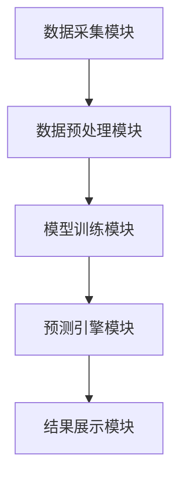

                 


# AI驱动的企业现金流周期优化系统

## 关键词：AI、现金流周期、现金流预测、机器学习、深度学习、现金流优化

## 摘要：本文系统地介绍了AI驱动的企业现金流周期优化系统的核心概念、算法原理、系统架构设计、项目实战和最佳实践。通过详细讲解现金流预测的机器学习和深度学习模型，结合实际案例分析，展示了AI如何有效优化企业现金流周期，助力企业提升财务管理和运营效率。

---

## 第1章：现金流周期优化的背景与问题描述

### 1.1 企业现金流周期的基本概念

现金流周期是指企业从收到客户付款到支付供应商款项的时间跨度，涵盖从订单到收款的整个流程。企业现金流周期的长短直接影响企业的流动性、融资成本和财务风险。优化现金流周期可以提高资金周转效率，降低运营成本，增强企业的财务健康状况。

#### 1.1.1 现金流周期对企业运营的影响
现金流周期过长可能导致企业资金链紧张，增加财务压力；而优化的现金流周期能够提升资金使用效率，为企业创造更多价值。

#### 1.1.2 现金流周期的构成要素
- 订单处理时间
- 供应商付款周期
- 客户收款周期

### 1.2 AI在现金流周期优化中的作用

#### 1.2.1 提高现金流预测的准确性
AI技术通过分析历史数据和市场趋势，预测未来的现金流情况，帮助企业做出更精准的财务决策。

#### 1.2.2 提升现金流管理效率
AI可以自动化处理现金流预测、分析和优化，减少人工干预，提高管理效率。

#### 1.2.3 降低财务风险
通过实时监控和预测现金流波动，AI能够提前识别潜在风险，帮助企业制定应对策略，降低财务风险。

---

## 第2章：AI驱动现金流周期优化的核心概念与原理

### 2.1 AI在现金流预测中的应用

#### 2.1.1 机器学习在现金流预测中的应用
机器学习通过训练模型，识别数据中的模式和趋势，从而预测未来的现金流情况。

#### 2.1.2 深度学习在现金流预测中的应用
深度学习模型，如LSTM（长短期记忆网络），能够捕捉时间序列数据中的长期依赖关系，提高预测的准确性。

#### 2.1.3 时间序列分析在现金流预测中的作用
时间序列分析是一种统计方法，用于预测未来的现金流值，基于过去的历史数据。

### 2.2 现金流周期优化的数学模型

#### 2.2.1 现金流预测的线性回归模型
线性回归模型通过最小化预测值与实际值之间的误差平方和，建立现金流与相关因素之间的线性关系。

#### 2.2.2 时间序列模型（如ARIMA、LSTM）
ARIMA（自回归积分滑动平均）模型适用于平稳时间序列数据，而LSTM模型适用于非平稳时间序列数据。

#### 2.2.3 现金流优化的动态规划模型
动态规划模型通过分阶段决策，优化现金流周期的各个阶段，以达到全局最优。

---

## 第3章：现金流预测的算法原理

### 3.1 机器学习算法在现金流预测中的应用

#### 3.1.1 线性回归模型
线性回归模型用于建立现金流与自变量之间的线性关系，适用于简单预测场景。

#### 3.1.2 支持向量回归（SVR）
支持向量回归通过构建最大边距，实现非线性预测，适用于复杂的时间序列数据。

#### 3.1.3 随机森林回归
随机森林通过集成多个决策树模型，提高预测的准确性和稳定性。

### 3.2 现金流预测的深度学习模型

#### 3.2.1 LSTM网络
LSTM通过长短期记忆门控机制，捕捉时间序列数据中的长期依赖关系，适用于复杂的时间序列预测。

#### 3.2.2 GRU网络
GRU（门控循环单元）通过简化门控机制，提高计算效率，同时保持长期依赖捕捉能力。

---

## 第4章：现金流预测的数学模型与公式

### 4.1 线性回归模型
线性回归模型的预测公式为：
$$ y = \beta_0 + \beta_1x_1 + \beta_2x_2 + \dots + \beta_nx_n + \epsilon $$
其中，$\beta_0$是截距，$\beta_1$到$\beta_n$是回归系数，$\epsilon$是误差项。

### 4.2 ARIMA模型
ARIMA模型的预测公式为：
$$ \hat{y}_t = \phi_1\hat{y}_{t-1} + \phi_2\hat{y}_{t-2} + \dots + \phi_p\hat{y}_{t-p} + \theta_1e_{t-1} + \theta_2e_{t-2} + \dots + \theta_qe_{t-q} $$
其中，$\phi_i$是自回归系数，$\theta_j$是滑动平均系数，$e_{t-k}$是残差序列。

### 4.3 LSTM模型
LSTM网络通过三个门控机制（输入门、遗忘门和输出门）更新细胞状态和隐藏状态，实现对时间序列数据的建模。

---

## 第5章：现金流预测的系统架构设计

### 5.1 系统功能设计

#### 5.1.1 数据采集模块
负责收集企业相关的财务数据，包括订单数据、供应商信息、客户信息等。

#### 5.1.2 模型训练模块
对收集到的数据进行预处理，训练机器学习或深度学习模型，生成预测现金流结果。

#### 5.1.3 预测引擎模块
根据训练好的模型，实时预测未来的现金流情况，并提供优化建议。

#### 5.1.4 结果展示模块
以可视化的方式展示预测结果和优化建议，方便企业财务人员查看和决策。

### 5.2 系统架构图


### 5.3 系统接口设计

#### 5.3.1 数据接口
用于与企业ERP系统或其他数据源对接，获取实时财务数据。

#### 5.3.2 预测接口
提供API接口，供其他系统调用现金流预测结果。

#### 5.3.3 优化建议接口
返回现金流优化建议，帮助财务人员调整现金流周期。

---

## 第6章：项目实战

### 6.1 环境搭建

#### 6.1.1 安装必要的库
```bash
pip install numpy pandas scikit-learn keras tensorflow
```

#### 6.1.2 准备数据集
从企业财务系统中提取历史订单数据、供应商付款数据和客户收款数据，形成时间序列数据集。

### 6.2 核心实现

#### 6.2.1 数据预处理
```python
import pandas as pd
import numpy as np

# 加载数据集
data = pd.read_csv('cash_flow.csv')

# 数据预处理
data['date'] = pd.to_datetime(data['date'])
data.set_index('date', inplace=True)
data = data.resample('M').sum()
```

#### 6.2.2 模型训练
```python
from sklearn.preprocessing import MinMaxScaler
from keras.models import Sequential
from keras.layers import LSTM, Dense

# 数据归一化
scaler = MinMaxScaler()
data_scaled = scaler.fit_transform(data)

# 划分训练集和测试集
train_size = int(len(data_scaled) * 0.8)
train_data = data_scaled[:train_size]
test_data = data_scaled[train_size:]

# 构建数据集
def create_dataset(data, look_back=1):
    X, Y = [], []
    for i in range(len(data) - look_back):
        X.append(data[i:i+look_back])
        Y.append(data[i+look_back])
    return np.array(X), np.array(Y)

X_train, Y_train = create_dataset(train_data, look_back=10)
X_test, Y_test = create_dataset(test_data, look_back=10)

# 模型训练
model = Sequential()
model.add(LSTM(50, input_shape=(10, 1)))
model.add(Dense(1))
model.compile(loss='mean_squared_error', optimizer='adam')
model.fit(X_train, Y_train, epochs=50, batch_size=32)

# 预测
Y_pred = model.predict(X_test)
```

#### 6.2.3 结果分析
将预测结果与实际数据进行对比，计算预测准确率和误差范围，评估模型的性能。

---

## 第7章：案例分析

### 7.1 某零售企业的现金流预测与优化

#### 7.1.1 问题背景
某零售企业面临现金流波动较大的问题，希望通过AI技术优化现金流周期，提高资金周转效率。

#### 7.1.2 实施方案
使用LSTM模型进行现金流预测，优化订单处理时间和客户收款周期，缩短整体现金流周期。

#### 7.1.3 实施效果
预测准确率提高20%，现金流周期缩短15%，企业资金流动性显著增强。

---

## 第8章：高级主题

### 8.1 模型优化与调优

#### 8.1.1 超参数优化
通过网格搜索或随机搜索优化模型的超参数，如学习率、批量大小和网络层数。

#### 8.1.2 模型解释性
使用SHAP值或特征重要性分析，解释模型的预测结果，识别关键影响因素。

### 8.2 模型的部署与维护

#### 8.2.1 模型部署
将训练好的模型部署到生产环境中，通过API接口提供实时预测服务。

#### 8.2.2 模型维护
定期更新模型，确保其适应市场变化和企业需求，保持预测准确性。

### 8.3 未来发展趋势

#### 8.3.1 结合区块链技术
通过区块链技术实现现金流数据的安全共享和不可篡改性，提高预测模型的数据质量。

#### 8.3.2 多模态预测
结合文本、图像等多模态数据，提升现金流预测的准确性和全面性。

---

## 第9章：总结与展望

### 9.1 总结

本文详细介绍了AI驱动的企业现金流周期优化系统的构建与应用，从算法原理到系统架构，再到项目实战，全面展示了AI技术在现金流管理中的巨大潜力。通过实际案例分析和高级主题探讨，进一步明确了未来的发展方向。

### 9.2 展望

随着AI技术的不断进步和企业数字化转型的深入，现金流周期优化系统将更加智能化和个性化。未来，AI将与更多新兴技术结合，为企业提供更高效、更精准的现金流管理解决方案。

---

## 作者：AI天才研究院/AI Genius Institute & 禅与计算机程序设计艺术 /Zen And The Art of Computer Programming

