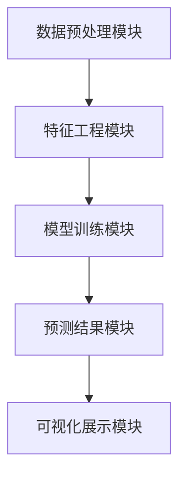
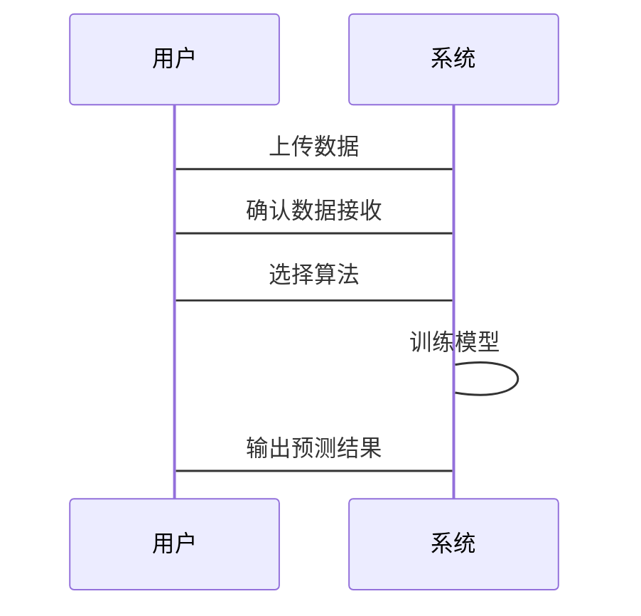

                 


# AI驱动的企业现金流预测

## 关键词：AI技术、现金流预测、时间序列分析、机器学习、企业财务管理、深度学习

## 摘要：  
本文详细探讨了如何利用AI技术提升企业现金流预测的准确性与效率。通过分析现金流预测的核心概念、AI算法原理、系统架构设计以及实际项目案例，本文为读者提供了从理论到实践的全面指导。文章还深入讨论了AI驱动现金流预测的优势、挑战及未来发展趋势，为企业财务管理提供了新的思路和解决方案。

---

# 第1章: 企业现金流预测的背景与挑战

## 1.1 企业现金流预测的重要性  
现金流是企业运营的核心命脉，直接关系到企业的生存与发展。通过预测现金流，企业可以更好地进行资金规划、投资决策和风险管理。然而，传统的方法往往依赖于历史数据和人工经验，存在预测精度低、效率慢、难以应对复杂市场变化等局限性。

## 1.2 AI技术在现金流预测中的应用前景  
AI技术的快速发展为现金流预测带来了新的可能性。通过机器学习算法，企业可以更准确地捕捉市场波动、识别潜在风险，并实时更新预测模型。AI不仅提高了预测的效率，还能够处理海量数据，挖掘出传统方法难以发现的模式和规律。

## 1.3 本章小结  
本章介绍了现金流预测在企业管理中的重要性，以及传统方法的局限性。同时，本文还展望了AI技术在现金流预测中的应用前景，为后续的深入分析奠定了基础。

---

# 第2章: AI驱动现金流预测的核心概念

## 2.1 时间序列分析  
时间序列分析是现金流预测的核心方法之一。通过对历史现金流数据的分析，可以发现数据的内在规律和趋势。  
- **2.1.1 时间序列的基本特征**：包括趋势、周期性、季节性等。  
- **2.1.2 时间序列分析的常见方法**：如ARIMA、LSTM、Prophet等。  
- **2.1.3 AI在时间序列预测中的应用**：AI技术可以通过深度学习模型捕捉复杂的时间依赖关系。

## 2.2 特征工程  
特征工程是AI驱动现金流预测的关键步骤。通过选择和构建合适的特征，可以显著提升模型的预测精度。  
- **2.2.1 特征选择的基本原则**：包括相关性、重要性、可解释性等。  
- **2.2.2 AI驱动特征工程的优势**：通过自动化特征提取和组合，可以发现传统方法难以察觉的特征模式。  
- **2.2.3 常见特征工程方法的对比分析**：如PCA、LASSO回归等。

## 2.3 模型评估与优化  
模型评估与优化是确保预测精度的重要环节。通过合理的评估指标和优化方法，可以提升模型的泛化能力。  
- **2.3.1 常见模型评估指标**：如均方误差（MSE）、平均绝对误差（MAE）、R²值等。  
- **2.3.2 AI驱动的模型优化方法**：如网格搜索、随机搜索、贝叶斯优化等。  
- **2.3.3 模型调优的注意事项**：包括过拟合的防范、数据泄漏的避免等。

## 2.4 本章小结  
本章详细介绍了AI驱动现金流预测的核心概念，包括时间序列分析、特征工程和模型评估等关键环节。这些内容为后续的算法实现奠定了理论基础。

---

# 第3章: AI驱动现金流预测的算法原理

## 3.1 时间序列预测算法  
时间序列预测算法是现金流预测的核心工具。以下是一些常用的算法及其原理：  
- **3.1.1 ARIMA算法**：ARIMA（自回归积分滑动平均模型）通过捕捉数据的自回归和滑动平均特性，实现对未来的预测。  
- **3.1.2 LSTM算法**：长短期记忆网络（LSTM）通过引入记忆单元，能够更好地处理长序列数据中的依赖关系。  
- **3.1.3 Prophet算法**：Prophet算法结合了时间序列的周期性、趋势和节假日效应，适合处理具有复杂模式的数据。

## 3.2 算法原理对比分析  
不同算法在预测精度、计算效率和可解释性等方面存在差异。  
- **3.2.1 ARIMA算法的数学模型**：  
  $$ ARIMA(p, d, q) = y_t = \phi_1 y_{t-1} + \dots + \phi_p y_{t-p} + \theta_1 \epsilon_{t-1} + \dots + \theta_q \epsilon_{t-q} + \epsilon_t $$  
- **3.2.2 LSTM算法的结构与原理**：通过输入门、遗忘门和输出门的交互，实现对长期依赖关系的捕捉。  
- **3.2.3 Prophet算法的核心思想**：Prophet通过分解时间序列的趋势、季节性和余项，实现对未来的预测。

## 3.3 算法实现的步骤与流程  
以下是时间序列预测算法的通用实现步骤：  
1. 数据预处理：包括数据清洗、缺失值填充、归一化等。  
2. 模型训练：根据选择的算法，训练模型并优化参数。  
3. 模型预测：利用训练好的模型，预测未来的现金流。  
4. 模型评估：通过评估指标（如MSE、MAE等）评估模型的预测精度。

## 3.4 本章小结  
本章详细介绍了几种常用的时间序列预测算法及其原理，并对比分析了它们的优缺点。这些算法为现金流预测提供了多种选择，企业可以根据具体需求选择合适的模型。

---

# 第4章: 系统分析与架构设计方案

## 4.1 系统分析  
AI驱动现金流预测系统需要满足以下需求：  
- 数据输入：支持多种数据格式的导入，如CSV、Excel等。  
- 数据处理：包括数据清洗、特征工程和数据增强。  
- 模型训练：支持多种算法的训练和参数调优。  
- 结果输出：提供可视化的预测结果和报告。

## 4.2 系统架构设计  
以下是系统的架构设计：  


## 4.3 系统接口设计  
系统接口设计需要考虑以下几点：  
- 数据接口：支持多种数据格式的输入和输出。  
- 模型接口：支持多种算法的调用和集成。  
- 用户接口：提供友好的人机交互界面，方便用户操作。

## 4.4 系统交互设计  
以下是系统的交互流程图：  


## 4.5 本章小结  
本章详细介绍了AI驱动现金流预测系统的架构设计和接口设计。通过合理的系统架构和接口设计，可以实现高效的现金流预测。

---

# 第5章: 项目实战——AI驱动现金流预测系统开发

## 5.1 环境安装与配置  
以下是环境安装的步骤：  
1. 安装Python：建议使用Python 3.6及以上版本。  
2. 安装必要的库：如numpy、pandas、scikit-learn、keras、tensorflow等。  
3. 配置开发环境：如Jupyter Notebook、PyCharm等。

## 5.2 数据准备与预处理  
数据预处理是AI驱动现金流预测的关键步骤。以下是具体步骤：  
1. 数据加载：读取CSV格式的现金流数据。  
2. 数据清洗：处理缺失值、异常值等。  
3. 数据归一化：将数据归一化到[0,1]范围，便于模型训练。

## 5.3 系统核心实现源代码  
以下是Python实现的现金流预测代码示例：  
```python
import numpy as np
import pandas as pd
from sklearn.metrics import mean_squared_error
from sklearn.preprocessing import MinMaxScaler
from keras.models import Sequential
from keras.layers import LSTM, Dense

# 数据加载与预处理
data = pd.read_csv('cash_flow.csv')
data = data['cash_flow'].values
data = data.reshape(-1, 1)
scaler = MinMaxScaler()
data_scaled = scaler.fit_transform(data)

# 划分训练集和测试集
train_size = int(len(data_scaled) * 0.8)
train_data = data_scaled[:train_size]
test_data = data_scaled[train_size:]

# 数据转换为时间步
def create_dataset(data, look_back=1):
    X, y = [], []
    for i in range(len(data) - look_back):
        X.append(data[i:i+look_back])
        y.append(data[i+look_back])
    return np.array(X), np.array(y)

X_train, y_train = create_dataset(train_data, look_back=10)
X_test, y_test = create_dataset(test_data, look_back=10)

# 模型训练
model = Sequential()
model.add(LSTM(50, input_shape=(10, 1)))
model.add(Dense(1))
model.compile(loss='mean_squared_error', optimizer='adam')
model.fit(X_train, y_train, epochs=50, batch_size=64, verbose=1)

# 模型预测
train_predict = model.predict(X_train)
test_predict = model.predict(X_test)

# 模型评估
print('Train RMSE:', np.sqrt(mean_squared_error(y_train, train_predict)))
print('Test RMSE:', np.sqrt(mean_squared_error(y_test, test_predict)))
```

## 5.4 代码应用解读与分析  
上述代码实现了一个基于LSTM的时间序列预测模型。通过数据预处理、模型训练和预测，可以得到预测的现金流结果。模型的评估指标包括均方根误差（RMSE）等。

## 5.5 实际案例分析和详细讲解剖析  
以下是一个实际案例分析：  
1. 数据来源：某企业的历史现金流数据。  
2. 数据预处理：清洗和归一化数据。  
3. 模型选择：选择LSTM算法进行预测。  
4. 模型训练：训练模型并优化参数。  
5. 模型预测：预测未来3个月的现金流。  
6. 模型评估：评估预测结果的准确性。

## 5.6 项目小结  
本章通过一个实际案例，详细讲解了AI驱动现金流预测系统的开发过程。从环境安装到代码实现，再到结果分析，为读者提供了完整的开发指导。

---

# 第6章: 总结与展望

## 6.1 本章总结  
本文详细介绍了AI驱动现金流预测的核心概念、算法原理和系统架构设计。通过实际案例分析，展示了AI技术在现金流预测中的应用价值。

## 6.2 未来展望  
随着AI技术的不断发展，现金流预测将更加智能化和精准化。未来的研究方向包括：  
1. 更加复杂的深度学习模型，如Transformer架构。  
2. 多模态数据的融合，如市场情绪、新闻数据等。  
3. 实时预测与动态调整，提升预测的灵活性和适应性。

## 6.3 最佳实践 tips  
- 数据质量是预测精度的关键，确保数据的完整性和准确性。  
- 模型选择要结合实际需求，不同场景下选择合适的算法。  
- 模型部署要考虑到计算资源和实时性要求。

## 6.4 本章小结  
本章总结了全文的主要内容，并展望了AI驱动现金流预测的未来发展方向。

---

# 作者：AI天才研究院/AI Genius Institute & 禅与计算机程序设计艺术 /Zen And The Art of Computer Programming

