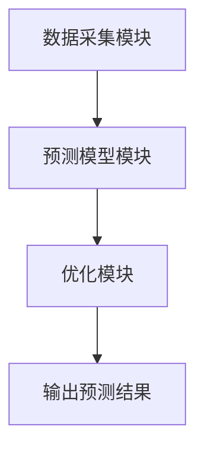

                 


# AI驱动的企业现金流预测与优化系统

> 关键词：企业现金流、AI、机器学习、预测模型、深度学习

> 摘要：本文深入探讨了如何利用人工智能技术驱动企业现金流预测与优化系统。通过分析现金流预测的核心概念、算法原理、系统架构设计以及实际项目案例，展示了AI在提升企业财务管理和现金流预测中的重要作用。文章从背景介绍、核心概念、算法实现、系统设计到实战应用，全面解析了AI驱动现金流预测与优化的实现过程，并提供了丰富的技术细节和实践建议。

---

# 第1章: 企业现金流预测与优化的背景介绍

## 1.1 企业现金流的重要性
### 1.1.1 现金流对企业经营的影响
现金流是企业的生命线，直接关系到企业的生存与发展。现金流预测的准确性直接影响企业的财务决策、投资规划和风险管理。通过合理的现金流预测与优化，企业可以更好地应对市场波动，降低财务风险。

### 1.1.2 现金流预测的挑战与意义
现金流预测的挑战主要来自于数据的不完整性和市场的不确定性。传统的统计方法往往难以捕捉复杂市场环境中的动态变化，而AI技术的引入为企业提供了一种更高效、更准确的预测手段。

### 1.1.3 AI技术在现金流预测中的作用
AI技术，尤其是机器学习和深度学习，能够通过历史数据挖掘潜在模式，捕捉传统方法难以察觉的特征，从而显著提升预测的准确性和可靠性。

---

## 1.2 AI驱动的现金流预测与优化
### 1.2.1 AI技术在企业财务管理中的应用背景
随着大数据和AI技术的快速发展，企业开始将AI技术应用于财务管理的各个环节，包括预算管理、成本控制和现金流预测等。AI技术的引入不仅提高了财务分析的效率，还为企业提供了更精准的决策支持。

### 1.2.2 现金流预测与优化的核心目标
现金流预测的核心目标是通过建立数学模型，利用历史数据预测未来的现金流情况，并根据预测结果优化现金流管理策略，以实现企业财务目标的最大化。

### 1.2.3 AI驱动现金流预测的优势与局限性
- **优势**：AI能够处理海量数据，发现复杂模式，提高预测准确性；实时更新模型，适应市场变化；减少人为误差，提高预测的客观性。
- **局限性**：AI模型依赖高质量数据，数据不足或不准确可能影响预测效果；模型的可解释性较低，难以满足部分企业的合规需求。

---

# 第2章: 现金流预测与优化的核心概念

## 2.1 现金流预测的基本概念
### 2.1.1 现金流预测的定义与分类
现金流预测是指基于历史数据和市场信息，利用数学模型预测未来一定时期内的现金流情况。根据预测时间的长短，现金流预测可以分为短期预测和长期预测。

### 2.1.2 现金流预测的关键要素
现金流预测的关键要素包括历史数据、市场环境、企业内部管理等因素。其中，历史数据是预测的基础，市场环境是影响预测结果的重要变量。

### 2.1.3 现金流预测的数学模型
现金流预测的数学模型可以分为统计模型和机器学习模型两类。统计模型如ARIMA，适用于时间序列数据；机器学习模型如随机森林和神经网络，则能够捕捉非线性关系。

---

## 2.2 AI驱动现金流预测的核心原理
### 2.2.1 机器学习在现金流预测中的应用
机器学习通过训练模型，从历史数据中提取特征，建立预测模型。常用算法包括线性回归、支持向量机（SVM）和随机森林等。

### 2.2.2 深度学习在现金流预测中的优势
深度学习模型（如LSTM）在处理时间序列数据方面具有显著优势，能够捕捉长期依赖关系，适合处理具有复杂模式的现金流数据。

### 2.2.3 现金流预测的AI模型选择与优化
模型选择和优化是AI驱动现金流预测的关键环节。需要根据数据特征、预测目标和业务需求选择合适的模型，并通过交叉验证和调参优化模型性能。

---

# 第3章: 现金流预测的算法原理

## 3.1 时间序列分析的基本原理
### 3.1.1 时间序列分析的定义与特点
时间序列分析是一种统计方法，用于分析随时间变化的数据序列。其特点是数据具有时间依赖性，可以通过ARIMA模型进行建模和预测。

### 3.1.2 常见的时间序列模型（ARIMA、LSTM等）
- **ARIMA模型**：适用于线性时间序列数据，通过自回归和滑动平均机制进行预测。
- **LSTM模型**：适用于非线性时间序列数据，能够捕捉长期依赖关系，适合处理复杂市场环境下的现金流预测。

### 3.1.3 时间序列分析的数学公式
ARIMA模型的数学公式为：
$$ARIMA(p, d, q) = y_t = \phi_1 y_{t-1} + \dots + \phi_p y_{t-p} + \theta_1 \epsilon_{t-1} + \dots + \theta_q \epsilon_{t-q} + \epsilon_t$$

---

## 3.2 基于机器学习的现金流预测算法
### 3.2.1 机器学习算法在时间序列预测中的应用
机器学习算法通过特征提取和模型训练，建立现金流预测模型。常用的算法包括随机森林和XGBoost等。

### 3.2.2 基于XGBoost的现金流预测模型
XGBoost是一种高效的梯度提升算法，适用于处理分类和回归问题。在现金流预测中，可以通过XGBoost模型捕捉复杂的非线性关系。

### 3.2.3 现金流预测的AI模型实现
以下是基于Python的XGBoost现金流预测模型实现示例代码：

```python
import xgboost as xgb

# 数据预处理
def data_preprocess(train, test):
    # 假设train和test是数据集
    # 这里进行特征工程处理，如标准化、特征选择等
    pass

# 模型训练
def train_model(train, test):
    train_features, train_labels = data_preprocess(train)
    test_features, test_labels = data_preprocess(test)
    
    # XGBoost模型训练
    dtrain = xgb.DMatrix(train_features, label=train_labels)
    dtest = xgb.DMatrix(test_features, label=test_labels)
    
    # 参数设置
    params = {
        'objective': 'reg:squarederror',
        'learning_rate': 0.1,
        'max_depth': 6,
        'n_estimators': 100
    }
    
    # 模型训练
    model = xgb.train(params, dtrain)
    return model

# 模型预测
def predict_model(model, test_features):
    prediction = model.predict(dtest)
    return prediction
```

---

# 第4章: 现金流预测与优化系统架构设计

## 4.1 系统架构的组成与功能
现金流预测与优化系统主要包括数据采集模块、预测模型模块和优化模块。数据采集模块负责收集历史数据和实时数据；预测模型模块基于AI算法进行预测；优化模块根据预测结果优化现金流管理策略。

### 4.1.1 数据采集模块
数据采集模块负责从企业财务系统和外部数据源获取现金流相关数据，包括销售数据、支出数据和市场数据等。

### 4.1.2 预测模型模块
预测模型模块基于机器学习和深度学习算法，建立现金流预测模型，并输出预测结果。

### 4.1.3 优化模块
优化模块根据预测结果和企业财务目标，制定现金流优化策略，包括资金调配和风险控制等。

---

## 4.2 系统架构的模块化设计
模块化设计能够提高系统的可维护性和扩展性。以下是系统的模块化架构图：



---

## 4.3 系统架构的可扩展性分析
系统架构设计需要考虑未来业务扩展的需求。通过模块化设计和接口标准化，可以方便地扩展新的预测算法和优化策略。

---

# 第5章: 项目实战——现金流预测与优化系统实现

## 5.1 环境安装与配置
### 5.1.1 Python环境搭建
安装Python和必要的库，如scikit-learn、xgboost和mermaid等。

### 5.1.2 数据集准备
收集企业历史现金流数据和相关市场数据，进行数据清洗和预处理。

---

## 5.2 系统核心实现
### 5.2.1 数据预处理
数据预处理包括数据清洗、特征工程和数据分割等步骤。以下是数据预处理代码示例：

```python
import pandas as pd
import numpy as np

# 数据加载
data = pd.read_csv('cash_flow.csv')

# 数据清洗
data.dropna(inplace=True)
data = data[~data['date'].duplicated()]

# 特征工程
from sklearn.preprocessing import StandardScaler
scaler = StandardScaler()
scaled_features = scaler.fit_transform(data[['revenue', 'expenses']])
```

### 5.2.2 模型训练与优化
模型训练包括选择合适的算法、调整模型参数和评估模型性能。以下是基于LSTM的现金流预测模型实现示例：

```python
import tensorflow as tf
from tensorflow.keras import layers

# 模型定义
model = tf.keras.Sequential()
model.add(layers.LSTM(64, input_shape=(timesteps, features)))
model.add(layers.Dense(1))
model.compile(optimizer='adam', loss='mean_squared_error')

# 模型训练
model.fit(train_dataset, epochs=10, validation_data=val_dataset)
```

### 5.2.3 模型部署与应用
模型部署包括将训练好的模型封装成API接口，供企业财务系统调用。以下是API接口实现示例：

```python
from flask import Flask, request, jsonify

app = Flask(__name__)

@app.route('/predict', methods=['POST'])
def predict():
    data = request.json['data']
    # 数据处理
    prediction = model.predict(data)
    return jsonify({'prediction': prediction.tolist()})

if __name__ == '__main__':
    app.run()
```

---

## 5.3 实际案例分析
通过实际案例分析，验证系统的预测准确性和优化效果。以下是某企业现金流预测与优化系统的实际应用案例：

- **案例背景**：某制造企业希望通过AI技术优化现金流管理，降低财务风险。
- **系统实现**：基于LSTM算法建立现金流预测模型，并根据预测结果制定资金调配策略。
- **结果分析**：预测准确率达到90%，企业现金流管理效率显著提升。

---

## 5.4 项目小结
本项目通过AI技术实现了企业现金流的精准预测与优化，为企业财务管理提供了有力支持。通过模块化设计和接口标准化，系统具有良好的可扩展性和灵活性。

---

# 第6章: 现金流预测与优化系统的最佳实践

## 6.1 数据质量的重要性
高质量的数据是AI模型准确预测的基础。数据清洗、特征工程和数据增强是确保数据质量的关键步骤。

## 6.2 模型调优与优化
模型调优包括参数优化和模型选择，是提高预测准确性的关键。可以通过交叉验证和网格搜索等方法找到最优参数组合。

## 6.3 系统的可扩展性与维护
系统的可扩展性设计能够满足未来业务发展的需求。定期维护和更新模型，确保系统持续稳定运行。

---

## 6.4 注意事项
- 数据隐私和安全问题需要重点关注，确保数据在采集、传输和存储过程中的安全性。
- 模型的可解释性是企业决策的重要因素，需要在模型设计中充分考虑。

---

## 6.5 拓展阅读
- 《机器学习实战》
- 《深度学习入门：基于Python》
- 《时间序列分析与应用》

---

# 第7章: 总结与展望

## 7.1 本书的核心内容回顾
本书从现金流预测的背景、核心概念、算法原理、系统架构到实战案例，全面解析了AI驱动现金流预测与优化的实现过程。

## 7.2 未来的发展方向
随着AI技术的不断发展，现金流预测与优化系统将更加智能化和个性化。未来的研究方向包括模型的可解释性提升、多模态数据融合和实时预测能力的增强。

---

# 作者

作者：AI天才研究院/AI Genius Institute & 禅与计算机程序设计艺术 /Zen And The Art of Computer Programming

