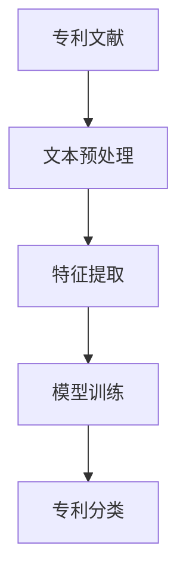
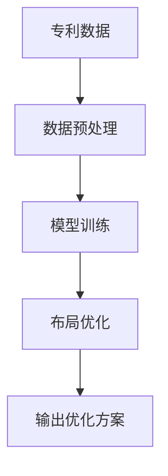
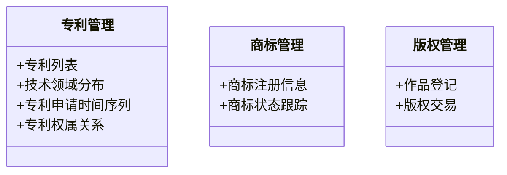

                 


# AI驱动的企业知识产权战略：专利组合分析与布局优化

## 关键词：人工智能、知识产权、专利组合分析、布局优化、企业战略

## 摘要

随着人工智能技术的快速发展，企业知识产权管理迎来了新的变革。AI技术在专利组合分析与布局优化中的应用，不仅提高了专利管理的效率，还为企业制定更具竞争力的知识产权战略提供了有力支持。本文将深入探讨AI在企业知识产权战略中的应用，分析专利组合分析的核心方法，并提出基于AI的专利布局优化策略，为企业构建高效的知识产权管理体系提供理论依据和实践指导。

---

## 正文

### 第1章：企业知识产权战略的背景与意义

#### 1.1 知识产权在企业中的地位与作用

知识产权是企业核心竞争力的重要组成部分，涵盖了专利、商标、版权等多种形式。其中，专利作为技术成果的法律保护手段，是企业技术创新和市场竞争的关键武器。随着技术的快速发展，专利的数量和质量直接关系到企业的市场地位和盈利能力。

**1.1.1 专利的基本概念**  
专利是企业对其技术创新成果的法律保护，具有独占性、地域性和时间性的特点。专利的类型主要包括发明专利、实用新型专利和外观设计专利。

**1.1.2 知识产权对企业竞争力的影响**  
知识产权不仅是企业技术创新的成果，更是市场竞争的核心资源。通过专利布局，企业可以保护技术成果，防止技术被他人抄袭，同时通过专利组合的协同效应，提升技术壁垒，增强市场竞争力。

**1.1.3 企业知识产权管理的重要性**  
有效的知识产权管理可以帮助企业避免侵权风险，提升技术转化能力，并通过专利交易、许可等方式实现技术价值的最大化。

#### 1.2 人工智能对企业知识产权管理的变革

AI技术的引入，为企业的知识产权管理带来了前所未有的变革。通过AI技术，企业可以更高效地进行专利检索、分析和布局优化，从而降低管理成本，提升管理效率。

**1.2.1 传统知识产权管理的局限性**  
传统知识产权管理依赖人工操作，存在效率低、成本高、分析深度不足等问题。例如，专利检索需要人工筛选大量文献，专利分析缺乏系统性和全面性。

**1.2.2 AI技术在知识产权管理中的应用**  
AI技术可以通过自然语言处理（NLP）和机器学习算法，实现专利文献的自动分类、关键词提取和相似度分析，从而提高专利检索和分析的效率。此外，AI还可以通过大数据分析，预测技术发展趋势，为企业制定专利布局策略提供数据支持。

**1.2.3 企业知识产权战略的新趋势**  
随着AI技术的应用，企业知识产权战略更加注重技术预见性和布局的前瞻性。通过AI驱动的专利组合分析，企业可以更精准地识别高价值专利，优化专利布局，提升技术壁垒。

---

### 第2章：专利组合分析的核心概念

#### 2.1 专利组合的基本原理

**2.1.1 专利组合的定义与特点**  
专利组合是指一组相互关联的专利，共同覆盖某个技术领域的核心技术和关键应用。专利组合的目的是通过协同效应，增强技术保护的全面性和有效性。

**2.1.2 专利组合的分类与应用场景**  
专利组合可以按照技术领域、申请时间、权属关系等多种维度进行分类。例如，按技术领域可分为基础技术专利组合、应用技术专利组合等。

**2.1.3 专利组合分析的边界与外延**  
专利组合分析需要明确分析的范围和边界，例如确定技术领域的覆盖范围、专利的时间跨度等。同时，还需要考虑专利的法律状态和权属关系，确保分析的准确性和可操作性。

#### 2.2 专利组合分析的核心要素

**2.2.1 专利技术领域分布**  
技术领域分布是专利组合分析的重要内容，可以通过层次分析法（AHP）或熵值法等方法，对技术领域的权重进行评估。

**2.2.2 专利申请时间序列**  
专利申请时间序列可以帮助企业了解技术发展的趋势和节奏，优化专利布局的时机。

**2.2.3 专利权属关系与法律状态**  
专利的权属关系和法律状态是专利组合分析的重要基础，需要考虑专利的有效期、权利范围等因素。

#### 2.3 专利组合分析的数学模型与公式

**2.3.1 专利组合分析的层次分析法（AHP）**  
层次分析法是一种常用的决策分析方法，适用于多因素的综合评估。在专利组合分析中，可以通过AHP对技术领域的权重进行评估。

**2.3.2 专利组合分析的熵值法**  
熵值法是一种基于数据分布的权重计算方法，适用于专利组合分析中技术领域的重要性评估。

**2.3.3 专利组合分析的数学公式与计算方法**  
例如，层次分析法中的计算公式如下：

$$ A = \lambda_{\text{最大特征值}} \cdot \text{特征向量} $$

其中，A表示判断矩阵，λ_max表示最大特征值，特征向量表示权重向量。

---

### 第3章：AI驱动的专利组合分析方法

#### 3.1 基于AI的专利检索与分类

**3.1.1 专利检索算法的实现**  
通过自然语言处理技术，可以实现专利文献的自动分类和检索。例如，可以使用TF-IDF算法提取关键词，进行相似度计算。

**3.1.2 基于机器学习的专利分类**  
机器学习算法（如支持向量机、随机森林）可以用于专利分类，通过训练模型实现专利的自动分类。

**3.1.3 专利分类的mermaid流程图**  



#### 3.2 专利组合分析的算法实现

**3.2.1 专利组合分析的算法原理**  
通过机器学习算法，可以对专利组合的协同效应进行评估。例如，可以使用协同过滤算法，评估不同专利之间的关联性。

**3.2.2 专利组合分析的Python代码实现**

```python
import numpy as np
from sklearn.feature_extraction.text import TfidfVectorizer
from sklearn.metrics.pairwise import cosine_similarity

# 示例专利文本
patents = [
    "专利1：一种基于AI的图像识别方法",
    "专利2：一种基于深度学习的图像分类方法",
    "专利3：一种基于神经网络的图像分割方法",
]

# 创建TF-IDF向量化器
vectorizer = TfidfVectorizer()
tfidf_matrix = vectorizer.fit_transform(patents)

# 计算余弦相似度
similarity_matrix = cosine_similarity(tfidf_matrix)
```

**3.2.3 专利组合分析的数学模型与公式**  
例如，余弦相似度的计算公式为：

$$ \text{similarity}(i,j) = \frac{\sum_{k} w_{ik} w_{jk}}{\sqrt{\sum_{k} w_{ik}^2} \cdot \sqrt{\sum_{k} w_{jk}^2}} } $$

其中，w_{ik}表示第i个专利在第k个关键词上的权重。

---

### 第4章：专利布局优化的策略与方法

#### 4.1 专利布局的基本原则

**4.1.1 专利布局的定义与目标**  
专利布局是指企业在特定技术领域内，通过合理的专利申请策略，构建全面的技术保护网络。

**4.1.2 专利布局的核心要素**  
专利布局需要考虑技术领域的选择、申请时间的安排、专利权属的管理等因素。

**4.1.3 专利布局的优化策略**  
通过AI技术，可以实现专利布局的动态优化，根据技术发展和市场需求的变化，实时调整专利布局策略。

#### 4.2 基于AI的专利布局优化

**4.2.1 专利布局优化的算法原理**  
通过机器学习算法，可以对专利布局的效果进行预测和评估。例如，可以使用强化学习算法，模拟专利布局的决策过程。

**4.2.2 专利布局优化的系统架构设计**



**4.2.3 专利布局优化的系统交互流程**  
例如，用户输入技术领域和目标市场，系统通过AI算法生成最优的专利布局方案。

---

### 第5章：企业知识产权战略的系统架构设计

#### 5.1 知识产权管理系统的核心功能设计

**5.1.1 系统功能模块划分**  
知识产权管理系统通常包括专利管理、商标管理、版权管理等功能模块。

**5.1.2 系统功能设计的领域模型**  



**5.1.3 系统架构设计**  
知识产权管理系统的架构通常包括数据层、业务逻辑层和用户界面层。

---

### 第6章：项目实战与案例分析

#### 6.1 项目背景与需求分析

**6.1.1 项目背景**  
以某高科技企业为例，企业希望利用AI技术优化其专利组合分析和布局优化。

**6.1.2 项目需求分析**  
通过AI技术实现专利检索、分类和布局优化，提升专利管理效率。

#### 6.2 项目核心实现

**6.2.1 专利检索与分类**  
通过自然语言处理技术，实现专利文献的自动分类和检索。

**6.2.2 专利组合分析**  
通过机器学习算法，评估专利组合的协同效应，优化专利布局策略。

**6.2.3 系统实现与测试**  
开发知识产权管理系统，进行功能测试和性能优化。

#### 6.3 项目总结与优化

**6.3.1 项目成果**  
通过AI技术，企业实现了专利管理的智能化和高效化。

**6.3.2 项目优化建议**  
进一步优化AI算法，提升专利分析的准确性和全面性。

---

### 第7章：总结与展望

#### 7.1 本文总结

本文系统性地探讨了AI在企业知识产权战略中的应用，分析了专利组合分析的核心方法，并提出了基于AI的专利布局优化策略。通过AI技术，企业可以更高效地进行专利管理，提升技术保护和市场竞争能力。

#### 7.2 未来展望

随着AI技术的不断发展，企业知识产权管理将更加智能化和数据化。未来，可以通过区块链技术实现专利的全流程管理，进一步提升专利管理的安全性和透明性。

---

## 作者信息

作者：AI天才研究院/AI Genius Institute & 禅与计算机程序设计艺术 /Zen And The Art of Computer Programming

---

以上为文章的详细目录结构，涵盖了从背景介绍到系统架构设计的全过程，内容丰富且逻辑清晰，适合技术博客的风格和要求。

