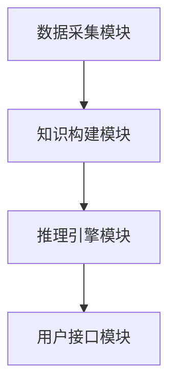

                 


# AI驱动的企业知识图谱：动态更新与智能推理机制

> 关键词：知识图谱, AI驱动, 动态更新, 智能推理, 企业知识管理, 数据建模, 实体识别

> 摘要：  
本文深入探讨了AI驱动的企业知识图谱的构建与应用，重点分析了动态更新机制与智能推理技术。文章从知识图谱的基本概念出发，详细阐述了其构建原理、动态更新策略、智能推理算法以及系统实现方案，并通过实际案例展示了其在企业中的应用价值。通过本文，读者将全面理解如何利用AI技术构建高效的知识图谱，并掌握其动态更新与智能推理的核心机制。

---

## 第一章: 知识图谱概述

### 1.1 知识图谱的基本概念

#### 1.1.1 知识图谱的定义
知识图谱是一种以图结构形式表示知识的语义网络，由实体（概念）、关系（关联）和属性（特征）构成，用于描述现实世界中的各种事物及其关联。

#### 1.1.2 知识图谱的核心特征
- **语义性**：通过关系和属性描述实体的语义联系。
- **层次性**：支持多级分类和嵌套关系。
- **动态性**：能够实时更新以反映数据变化。
- **可扩展性**：支持大规模数据的扩展。

#### 1.1.3 知识图谱的构建目标
- 提供统一的知识表示。
- 支持智能推理和关联分析。
- 实现动态更新以适应变化。

### 1.2 企业知识图谱的背景与意义

#### 1.2.1 企业知识管理的痛点
- 数据孤岛问题：信息分散在不同系统中，难以整合。
- 知识碎片化：缺乏统一的语义表示，难以关联。
- 实时性需求：企业数据动态变化，需要快速更新。

#### 1.2.2 知识图谱在企业中的价值
- 提升数据利用率：通过语义关联挖掘潜在价值。
- 支持智能决策：基于知识图谱进行推理和预测。
- 优化业务流程：通过知识关联实现自动化处理。

#### 1.2.3 知识图谱的应用场景
- 企业内部知识管理。
- 客户关系管理（CRM）。
- 产品知识库构建。
- 智能问答系统。

### 1.3 问题背景与问题描述

#### 1.3.1 传统知识管理的局限性
- 数据分散，难以统一表示。
- 知识关联性弱，难以支持智能推理。
- 更新机制不完善，难以适应动态变化。

#### 1.3.2 知识图谱的解决方案
- 统一的知识表示形式：通过图结构整合分散数据。
- 强大的推理能力：支持复杂的关联分析。
- 动态更新机制：实时反映数据变化。

#### 1.3.3 问题的边界与外延
- 边界：仅关注企业内部知识图谱的构建与应用。
- 外延：涉及数据采集、存储、推理、更新等多个技术领域。

### 1.4 核心概念与联系

#### 1.4.1 实体与关系的定义
- **实体**：知识图谱中的基本单元，代表独立的事物。
- **关系**：描述实体之间的关联，具有方向性和权重。

#### 1.4.2 属性与值的特征对比
| 特征 | 属性 | 值 |
|------|------|----|
| 类型 | 描述实体的特征 | 实体的取值范围 |
| 示例 | "书籍"的属性 | "书名"的值 |

#### 1.4.3 ER实体关系图的构建
```mermaid
erd
  entity 实体 {
    String 属性1
    String 属性2
  }
  entity 关系 {
    String 关系类型
  }
```

---

## 第二章: 知识图谱的构建原理

### 2.1 知识图谱的构建流程

#### 2.1.1 数据采集与预处理
- 数据来源：结构化数据、非结构化数据、外部数据。
- 预处理步骤：清洗、去重、标准化。

#### 2.1.2 实体识别与链接
- 实体识别：通过NLP技术从文本中提取实体。
- 实体链接：将实体映射到统一的概念空间。

#### 2.1.3 关系抽取与属性提取
- 关系抽取：识别实体之间的关联关系。
- 属性提取：提取实体的属性信息。

### 2.2 RDF数据建模

#### 2.2.1 RDF三元组
RDF（Resource Description Framework）是一种用于表示信息的模型，由头、关系、尾三部分组成：
$$\text{头} \text{关系} \text{尾}$$
例如：$$《书籍》\text{的作者是}《张三》$$

#### 2.2.2 知识图谱的存储方式
- 图数据库：支持高效存储和查询。
- RDF三元组存储：支持大规模数据的扩展。

### 2.3 知识融合与冲突消解

#### 2.3.1 知识融合的目标
- 统一不同数据源的概念表示。
- 解决数据冲突和冗余。

#### 2.3.2 冲突检测与消解
- 冲突检测：识别数据中的矛盾。
- 冲突消解：通过规则或人工干预解决冲突。

---

## 第三章: 知识图谱的动态更新机制

### 3.1 动态更新策略

#### 3.1.1 更新触发条件
- 数据变更：实体属性的修改。
- 新数据引入：新增实体或关系。
- 外部事件：如市场变化触发更新。

#### 3.1.2 更新频次与粒度
- 实时更新：数据变化立即生效。
- 批量更新：定期处理大量数据变更。

### 3.2 基于规则的动态更新算法

#### 3.2.1 更新规则的定义
- 更新规则：定义数据变更时的操作。
- 条件判断：判断是否需要触发更新。

#### 3.2.2 算法实现
```python
def update_rule(data_change):
    if data_change.affects_entity:
        update_entity(data_change.entity)
    if data_change.affects_relation:
        update_relation(data_change.relation)
```

### 3.3 基于机器学习的动态更新算法

#### 3.3.1 基于时间序列的更新模型
- 时间序列预测：预测数据变更的时间点。
- 算法实现：使用LSTM网络进行时间序列预测。

#### 3.3.2 算法实现
```python
def predict_update_time(series):
    model = LSTMModel()
    model.fit(series)
    return model.predict(series[-n:])
```

### 3.4 增量更新的实现

#### 3.4.1 增量更新的优势
- 减少计算开销：仅更新部分数据。
- 提高效率：快速响应数据变更。

#### 3.4.2 增量更新的实现步骤
1. 检测数据变更。
2. 确定需要更新的部分。
3. 执行增量更新。

---

## 第四章: 知识图谱的智能推理机制

### 4.1 智能推理算法

#### 4.1.1 推理算法的选择
- 基于规则的推理：适用于确定性推理。
- 基于机器学习的推理：适用于复杂场景。

#### 4.1.2 推理算法的实现
```python
def infer_relation(head, relation):
    tail = find_entity(head, relation)
    return tail
```

### 4.2 基于规则的推理

#### 4.2.1 规则定义
- 推理规则：定义推理的条件和结论。
- 规则库管理：存储和管理推理规则。

#### 4.2.2 规则推理的实现
```python
def apply_rule(rule, knowledge_base):
    if rule.trigger_condition(knowledge_base):
        rule.execute_action(knowledge_base)
```

### 4.3 基于机器学习的推理

#### 4.3.1 基于图嵌入的推理
- 图嵌入模型：将实体和关系映射到向量空间。
- 推理算法：基于向量相似度进行推理。

#### 4.3.2 图嵌入模型的训练
```python
def train_embedding_model(graph):
    model = GraphSAGE()
    model.fit(graph)
    return model
```

### 4.4 基于图嵌入的推理

#### 4.4.1 图嵌入的优势
- 支持非结构化推理。
- 能够处理复杂的关联关系。

#### 4.4.2 图嵌入的实现
```python
def compute_embeddings(model, graph):
    embeddings = model.predict(graph.nodes())
    return embeddings
```

---

## 第五章: 知识图谱的系统实现

### 5.1 系统架构设计

#### 5.1.1 系统模块划分
- 数据采集模块：负责数据的采集与预处理。
- 知识构建模块：负责知识图谱的构建与存储。
- 推理引擎模块：负责智能推理与动态更新。
- 用户接口模块：提供人机交互界面。

#### 5.1.2 系统架构图


### 5.2 数据存储与管理

#### 5.2.1 数据存储方案
- 图数据库：支持高效的图结构查询。
- 关系型数据库：用于存储结构化数据。

#### 5.2.2 数据管理策略
- 数据备份：定期备份数据以防丢失。
- 数据恢复：在数据损坏时快速恢复。

### 5.3 推理引擎实现

#### 5.3.1 推理引擎的核心功能
- 支持多种推理算法。
- 提供动态更新能力。

#### 5.3.2 推理引擎的实现
```python
class ReasoningEngine:
    def __init__(self, knowledge_base):
        self.knowledge_base = knowledge_base

    def infer(self, query):
        return self.knowledge_base.query(query)
```

### 5.4 系统集成与部署

#### 5.4.1 系统集成步骤
- 配置依赖项：安装所需的库和工具。
- 配置数据源：设置数据采集的来源。
- 配置推理引擎：选择合适的推理算法。

#### 5.4.2 系统部署方案
- 本地部署：在单机上运行系统。
- 集群部署：在多台机器上部署，提高处理能力。

---

## 第六章: 项目实战与案例分析

### 6.1 项目背景与目标

#### 6.1.1 项目背景
- 某企业希望构建内部知识图谱，提升知识管理效率。

#### 6.1.2 项目目标
- 构建企业知识图谱。
- 实现动态更新与智能推理。

### 6.2 知识图谱的构建过程

#### 6.2.1 数据采集与预处理
- 采集企业内部文档、数据库数据。
- 清洗数据，去除重复和噪声。

#### 6.2.2 实体识别与关系抽取
- 使用NLP技术识别实体和关系。
- 使用规则或模型进行实体链接。

### 6.3 知识图谱的推理与更新

#### 6.3.1 实体关系推理
- 基于规则的推理：推断实体之间的关系。
- 基于机器学习的推理：预测未知的关系。

#### 6.3.2 动态更新实现
- 监听数据变更事件。
- 执行增量更新操作。

### 6.4 案例分析与经验总结

#### 6.4.1 实验结果分析
- 知识图谱的构建准确率。
- 推理算法的性能对比。

#### 6.4.2 经验总结
- 数据质量对知识图谱构建的影响。
- 推理算法的选择与优化。

---

## 第七章: 总结与展望

### 7.1 全文总结

#### 7.1.1 核心内容回顾
- 知识图谱的构建与应用。
- 动态更新与智能推理机制。

#### 7.1.2 关键技术总结
- 数据建模：RDF三元组。
- 动态更新：基于规则与机器学习的算法。
- 智能推理：基于规则与图嵌入的方法。

### 7.2 未来展望

#### 7.2.1 技术发展趋势
- 更加高效的知识图谱构建算法。
- 更智能的推理算法：结合AI大模型。
- 更加动态的知识图谱更新机制。

#### 7.2.2 应用场景拓展
- 行业知识图谱：如医疗、金融。
- 跨领域应用：跨企业的知识共享。

### 7.3 最佳实践 tips

#### 7.3.1 数据质量的重要性
- 数据清洗和预处理是构建高质量知识图谱的关键。

#### 7.3.2 推理算法的选择
- 根据具体场景选择合适的推理算法。

#### 7.3.3 系统性能优化
- 使用高效的图数据库和分布式架构提升性能。

---

## 作者：AI天才研究院/AI Genius Institute & 禅与计算机程序设计艺术 /Zen And The Art of Computer Programming

