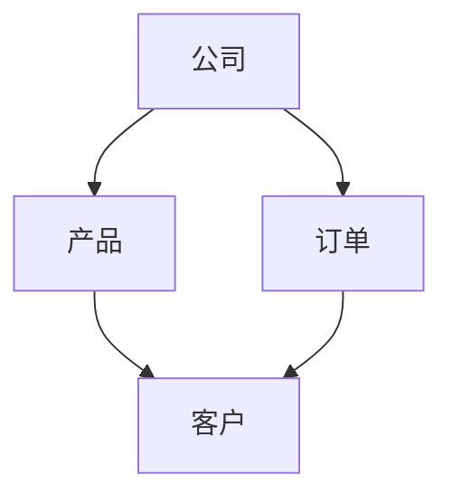
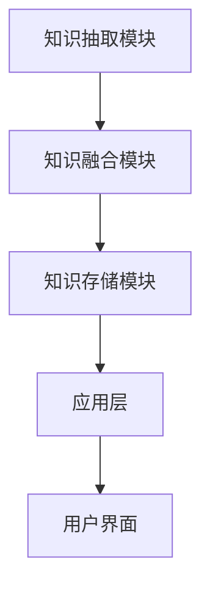

                 


# AI驱动的企业知识图谱：构建、维护与应用实践

---

## 关键词：
- 知识图谱
- AI驱动
- 企业构建
- 维护与应用
- 实践案例

---

## 摘要：
本文系统地探讨了AI驱动的企业知识图谱的构建、维护与应用实践。通过详细分析知识图谱的核心概念、构建算法、系统架构以及实际案例，本文为读者提供了从理论到实践的全面指导。文章首先介绍了知识图谱的基本概念与背景，接着深入讲解了构建过程中的关键算法与数学模型，随后分析了系统的架构设计，最后通过实际案例展示了如何在企业中应用知识图谱。本文还提供了最佳实践建议和未来研究方向，帮助读者更好地理解和应用知识图谱技术。

---

## 第一部分: AI驱动的企业知识图谱基础知识

## 第1章: 知识图谱的基本概念与背景

### 1.1 知识图谱的定义与核心要素

知识图谱是一种以图结构形式表示知识的技术，由节点（实体）和边（关系）组成。其核心要素包括：

- **实体**：代表现实世界中的具体事物，如公司、产品、客户等。
- **关系**：描述实体之间的关联，如“公司生产产品”。
- **属性**：用于丰富实体或关系的语义信息，如“产品价格为100元”。

### 1.2 企业知识图谱的必要性

随着企业数据的快速增长，传统数据管理方式难以满足复杂的关联需求。知识图谱通过构建实体间的关系，帮助企业实现跨领域、跨部门的数据整合与分析，支持智能决策。

### 1.3 知识图谱的技术背景

知识图谱的构建依赖于自然语言处理（NLP）、机器学习和大数据技术。AI技术在知识抽取、关系挖掘和语义理解中发挥着重要作用。知识图谱与大数据技术的结合，为企业提供了强大的数据管理和分析能力。

### 1.4 企业知识图谱的行业应用现状

知识图谱在多个行业中已得到广泛应用：

- **金融行业**：用于风险评估、欺诈检测和客户画像。
- **医疗行业**：支持疾病诊断、药物研发和患者管理。
- **零售行业**：优化供应链、提升客户体验和精准营销。

---

## 第2章: 知识图谱的核心概念与联系

### 2.1 知识图谱的构建原理

知识图谱的构建过程包括知识抽取、知识融合和知识存储三个主要阶段：

1. **知识抽取**：从文本中提取实体、关系和属性。
2. **知识融合**：将多个数据源中的知识进行整合和关联。
3. **知识存储**：将结构化的知识存储到数据库中，便于后续查询和分析。

### 2.2 知识图谱的核心要素对比表

| 核心要素 | 描述 | 示例 |
|----------|------|------|
| 实体     | 知识图谱中的基本单元，代表人、物、概念等 | 例如：公司、产品、客户 |
| 关系     | 实体之间的关联，表示实体间的关系 | 例如：公司-生产-产品 |
| 属性     | 实体的描述性信息，用于丰富实体的语义 | 例如：产品-价格-100元 |

### 2.3 知识图谱的ER实体关系图



---

## 第3章: 知识图谱的构建算法与数学模型

### 3.1 知识抽取算法

知识抽取的关键算法包括：

1. **命名实体识别（NER）**：用于从文本中提取实体。
2. **关系抽取**：用于识别实体之间的关系。

#### 命名实体识别算法

常用算法包括：
- 基于规则的方法
- 基于统计的方法（如HMM）
- 基于深度学习的方法（如LSTM、BERT）

#### 示例代码

```python
import spacy

nlp = spacy.load("en_core_web_sm")
text = "Apple is a company founded by Steve Jobs."
doc = nlp(text)
for ent in doc.ents:
    print(f"Entity: {ent.text}, Label: {ent.label_}")
```

### 3.2 知识融合与关联

知识融合的目标是将多个数据源中的知识进行整合，消除冗余和冲突。常用方法包括：
- 数据清洗
- 关系匹配
- 融合推理

### 3.3 数学模型与公式

知识图谱的构建可以看作是一个图结构学习问题。节点表示学习是其中的重要组成部分，常用模型包括：

- **Word2Vec**：用于实体嵌入。
- **TransE**：通过向量运算建模实体间的语义关系。

#### TransE 模型公式

$$
\text{score}(e_i, r_j, e_k) = ||e_k - e_i + r_j||_2
$$

其中：
- $e_i$ 是头实体的向量
- $r_j$ 是关系的向量
- $e_k$ 是尾实体的向量

---

## 第4章: 知识图谱的系统分析与架构设计

### 4.1 项目背景

以某电商平台为例，构建企业知识图谱的目标是实现产品、客户和订单之间的关联分析，支持精准营销和供应链优化。

### 4.2 系统功能设计

系统功能模块包括：
- 数据采集模块：从数据库和文本中采集数据。
- 知识抽取模块：提取实体、关系和属性。
- 知识融合模块：整合多个数据源的知识。
- 知识存储模块：将知识图谱存储到图数据库中。

### 4.3 系统架构设计



---

## 第5章: 知识图谱的项目实战

### 5.1 环境安装

- 安装Python和必要的库：
  ```bash
  pip install numpy spacy transformers
  ```

### 5.2 核心代码实现

```python
import spacy
from spacy.lang.zh import Chinese

nlp = Chinese()
text = "苹果是一家由史蒂夫·乔布斯创立的公司。"
doc = nlp(text)
for ent in doc.ents:
    print(f"实体: {ent.text}, 标签: {ent.label_}")
```

### 5.3 案例分析

以某电商平台为例，构建产品-客户知识图谱，支持精准营销和客户画像。

---

## 第6章: 知识图谱的应用案例与未来展望

### 6.1 应用案例

- **精准营销**：基于客户画像推荐个性化产品。
- **风险控制**：识别供应链中的潜在风险。

### 6.2 未来展望

- 更智能的知识抽取算法。
- 更高效的图数据存储技术。
- 更广泛的应用场景。

---

## 第7章: 总结与建议

### 7.1 总结

本文系统地介绍了AI驱动的企业知识图谱的构建、维护与应用实践，涵盖了从理论到实践的全过程。

### 7.2 最佳实践

- 数据质量是关键。
- 选择合适的工具和技术。
- 定期更新和维护知识图谱。

---

## 参考文献

- [1] 知识图谱构建技术综述
- [2] 基于深度学习的实体识别研究
- [3] 知识图谱在企业中的应用案例

---

## 作者

作者：AI天才研究院/AI Genius Institute & 禅与计算机程序设计艺术/Zen And The Art of Computer Programming

