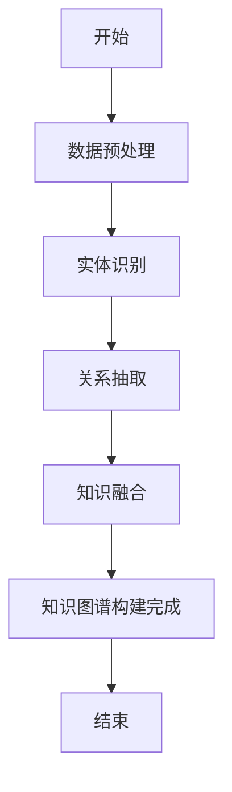

                 


# AI驱动的企业知识图谱：自动化构建与智能推理的深度融合

> **关键词**: 知识图谱, AI驱动, 自动化构建, 智能推理, 企业应用, 技术实现

> **摘要**: 本文深入探讨了AI驱动的企业知识图谱的构建与应用，重点分析了知识图谱的核心概念、自动化构建方法、智能推理技术及其在企业中的深度融合。通过详细的技术分析和实际案例，展示了如何利用AI技术提升企业知识管理的效率和智能化水平，为企业数字化转型提供强有力的支持。

---

# 第一章: AI驱动的企业知识图谱背景与概述

## 1.1 问题背景与问题描述

### 1.1.1 传统企业知识管理的挑战
在企业信息化发展的过程中，知识管理一直是企业运营的核心问题之一。传统的知识管理方式依赖于人工整理和存储，存在以下问题：
- 知识分散：企业中的知识分布于各个部门和系统中，难以统一管理和利用。
- 更新延迟：人工整理知识的效率低下，导致知识更新缓慢，难以适应快速变化的商业环境。
- 难以扩展：面对海量数据和复杂业务场景，传统的知识管理方式难以扩展和适应。

### 1.1.2 知识图谱的提出与目标
知识图谱是一种以结构化的形式表示知识的模型，通过将实体和概念之间的关系显式化，能够更高效地进行知识的存储、检索和推理。AI驱动的知识图谱的目标是通过自动化技术，构建一个统一、动态、可扩展的知识网络，支持企业的智能化决策。

### 1.1.3 AI驱动的知识图谱的优势
AI技术的引入，使得知识图谱的构建和应用更加智能化：
- **自动化构建**：利用自然语言处理（NLP）和机器学习技术，自动从文本、数据库等多源异构数据中抽取实体、关系和属性。
- **动态更新**：通过实时数据流处理和持续学习，保持知识图谱的动态更新。
- **智能推理**：基于知识图谱的结构化数据，支持复杂的逻辑推理和语义理解，为企业提供深层次的知识服务。

## 1.2 问题解决与边界

### 1.2.1 知识图谱如何解决企业知识管理问题
知识图谱通过以下方式解决了传统知识管理的痛点：
- **统一知识表示**：将分散在不同系统中的知识统一表示为结构化的图数据，便于管理和检索。
- **动态更新与扩展**：通过自动化构建和持续学习，实时更新知识图谱，适应企业的快速变化。
- **支持智能应用**：基于知识图谱的智能推理能力，支持企业中的智能问答、推荐系统、知识关联分析等应用场景。

### 1.2.2 知识图谱的边界与外延
知识图谱的构建和应用需要明确其边界：
- **边界**：知识图谱主要关注企业内部的知识管理，不涉及外部公开数据的整合。
- **外延**：知识图谱可以与其他技术（如大数据、云计算、区块链等）深度融合，拓展其应用范围。

### 1.2.3 核心概念与核心要素组成
知识图谱的核心概念包括：
- **实体**：企业中的具体事物，如“员工”、“项目”、“客户”等。
- **属性**：实体的描述性特征，如“员工ID”、“员工职位”等。
- **关系**：实体之间的关联，如“员工属于部门”、“部门负责项目”等。
- **事实**：由实体、关系和属性构成的基本陈述，如“张三属于研发部门”。

---

# 第二章: 知识图谱的核心概念与联系

## 2.1 知识图谱的定义与原理

### 2.1.1 知识图谱的定义
知识图谱是一种以图结构形式表示知识的模型，节点表示实体或概念，边表示实体之间的关系或属性。通过构建大规模的知识图谱，可以实现对海量数据的语义理解和关联分析。

### 2.1.2 知识图谱的核心原理
知识图谱的核心原理包括：
- **语义表示**：通过结构化的图数据，将知识表示为实体和关系的组合。
- **动态更新**：利用流数据处理和机器学习技术，持续更新知识图谱。
- **智能推理**：基于图结构进行路径分析、最短路径计算、相似性度量等推理操作。

### 2.1.3 知识图谱与传统数据库的区别
| 特性          | 知识图谱                     | 传统数据库               |
|---------------|------------------------------|--------------------------|
| 数据模型      | 图结构                      | 行数据结构               |
| 查询能力      | 支持复杂语义查询             | 支持简单字段查询         |
| 应用场景      | 智能问答、推荐系统           | 基于事务的 CRUD 操作     |

## 2.2 实体关系与属性特征

### 2.2.1 实体与属性的对比
- **实体**：代表企业中的具体事物，如“员工”、“部门”。
- **属性**：描述实体的特征，如“员工ID”、“员工职位”。

### 2.2.2 关系与事实的对比
- **关系**：描述实体之间的关联，如“员工属于部门”。
- **事实**：由实体、关系和属性构成的基本陈述，如“张三属于研发部门”。

### 2.2.3 知识图谱的层次结构
知识图谱的层次结构包括：
1. **基础层**：定义基本实体和属性。
2. **关系层**：定义实体之间的关系。
3. **应用层**：基于基础层和关系层构建上层应用，如智能问答、推荐系统等。

## 2.3 ER实体关系图架构

### 使用 Mermaid 绘制的 ER 实体关系图

```mermaid
erDiagram
    actor 用户 {
        +string 用户ID
        +string 用户名
        +string 用户密码
    }
    actor 实体 {
        +string 实体ID
        +string 实体名称
        +string 实体类型
    }
    actor 关系 {
        +string 关系ID
        +string 关系名称
        +string 关系类型
    }
    用户 --> 关系 : 参与
    实体 --> 关系 : 参与
```

---

# 第三章: 知识图谱构建的算法原理

## 3.1 知识抽取算法

### 3.1.1 基于规则的抽取算法
基于规则的抽取算法通过预定义的规则从文本中提取实体和关系。例如，使用正则表达式从简历中提取“员工ID”和“员工职位”。

### 3.1.2 基于统计的抽取算法
基于统计的抽取算法利用统计学习方法，如条件随机场（CRF），从文本中抽取实体和关系。

### 3.1.3 基于深度学习的抽取算法
基于深度学习的抽取算法使用神经网络模型，如BERT，从文本中抽取实体和关系。

## 3.2 知识图谱构建算法

### 3.2.1 实体识别算法
实体识别算法通过自然语言处理技术，从文本中识别出实体，并将其映射到知识图谱中的实体节点。

### 3.2.2 关系抽取算法
关系抽取算法通过模式匹配或深度学习方法，从文本中识别出实体之间的关系，并将其映射到知识图谱中的关系边。

### 3.2.3 知识融合算法
知识融合算法将来自不同数据源的知识进行融合，消除冲突，并保持知识的一致性。

## 3.3 算法流程图

### 使用 Mermaid 绘制的算法流程图



---

# 第四章: 智能推理与知识应用

## 4.1 智能推理算法

### 4.1.1 基于图的推理算法
基于图的推理算法通过遍历知识图谱中的节点和边，进行路径分析和最短路径计算。

### 4.1.2 基于符号逻辑的推理算法
基于符号逻辑的推理算法通过谓词逻辑进行推理，支持复杂的逻辑运算。

### 4.1.3 基于概率的推理算法
基于概率的推理算法通过贝叶斯网络进行概率推理，支持不确定性的推理场景。

## 4.2 智能问答系统

### 4.2.1 智能问答系统的构建
智能问答系统通过知识图谱进行语义理解，生成符合用户需求的答案。

### 4.2.2 智能问答系统的应用
智能问答系统可以应用于企业内部的知识检索、客户咨询等场景。

---

# 第五章: 系统分析与架构设计

## 5.1 系统架构设计

### 5.1.1 分层架构
知识图谱系统采用分层架构，包括数据层、计算层、应用层。

### 5.1.2 微服务架构
知识图谱系统采用微服务架构，包括数据采集服务、知识抽取服务、知识融合服务等。

## 5.2 接口设计

### 5.2.1 RESTful API
知识图谱系统提供RESTful API接口，供上层应用调用。

### 5.2.2 GraphQL API
知识图谱系统也可以提供GraphQL API接口，支持灵活的查询需求。

---

# 第六章: 项目实战与应用案例

## 6.1 项目实战

### 6.1.1 环境安装
安装必要的开发工具和依赖库，如Python、Jupyter Notebook、TensorFlow等。

### 6.1.2 核心代码实现
实现知识抽取、构建和推理的核心代码，如实体识别、关系抽取等。

### 6.1.3 代码解读与分析
对核心代码进行详细解读，分析其工作原理和实现细节。

## 6.2 应用案例

### 6.2.1 智能问答系统
构建一个基于知识图谱的智能问答系统，应用于企业内部的知识检索。

### 6.2.2 企业推荐系统
构建一个基于知识图谱的推荐系统，应用于企业的客户推荐和产品推荐。

---

# 第七章: 最佳实践与未来发展

## 7.1 最佳实践

### 7.1.1 数据质量管理
确保数据的准确性、完整性和一致性。

### 7.1.2 模型优化
通过持续学习和模型优化，提升知识图谱的构建和推理效率。

## 7.2 未来发展

### 7.2.1 多模态知识图谱
结合文本、图像、视频等多种数据源，构建多模态的知识图谱。

### 7.2.2 知识图谱的可解释性
提升知识图谱的可解释性，支持用户更好地理解和使用知识图谱。

---

# 第八章: 总结与展望

## 8.1 小结
本文详细探讨了AI驱动的企业知识图谱的构建与应用，分析了知识图谱的核心概念、算法原理和系统架构设计，并通过实际案例展示了其应用价值。

## 8.2 注意事项
在实际应用中，需要注意数据隐私、模型性能和系统可扩展性等问题。

## 8.3 拓展阅读
推荐进一步阅读相关领域的书籍和论文，如《知识图谱：概念、方法与应用》、《深度学习与自然语言处理》等。

---

# 作者

**作者：AI天才研究院/AI Genius Institute & 禅与计算机程序设计艺术 /Zen And The Art of Computer Programming**

---

**声明：本文版权归作者所有，未经授权，不得转载。**

