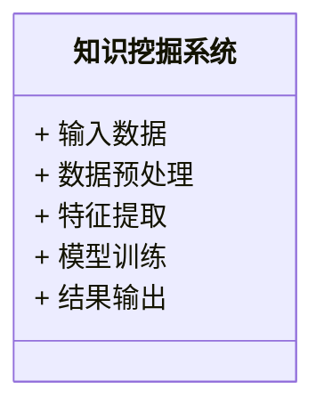

                 


# AI驱动的企业知识挖掘：从非结构化数据中提取价值

> 关键词：企业知识挖掘，非结构化数据，人工智能，数据价值，文本挖掘，知识图谱

> 摘要：本文深入探讨了如何利用人工智能技术从企业中的非结构化数据中提取有价值的信息，通过背景分析、核心概念讲解、算法原理、系统架构设计、项目实战和最佳实践，全面阐述了企业知识挖掘的重要性及其在实际应用中的价值。

---

## 第一部分: 企业知识挖掘的背景与概念

### 第1章: 企业知识挖掘概述

#### 1.1 企业知识挖掘的基本概念

企业知识挖掘（Enterprise Knowledge Discovery）是一种通过人工智能技术从企业内外部的非结构化数据中提取、分析和利用有价值信息的过程。其目标是将隐含在数据中的知识显式化，从而帮助企业做出更明智的决策。

- **非结构化数据**：与结构化数据（如表格数据）不同，非结构化数据包括文本、图像、音频和视频等，这些数据通常没有固定的模式，难以直接用于分析。

#### 1.2 非结构化数据的特点

非结构化数据的特点使得其处理具有挑战性：

- **多样性**：文本数据可能来自多种来源，如客户反馈、社交媒体、内部文档等。
- **复杂性**：图像和视频数据需要复杂的算法进行处理和分析。
- **模糊性**：文本数据可能存在歧义，需要自然语言处理技术来理解上下文。

### 第2章: 企业知识挖掘的核心概念

#### 2.1 问题背景与描述

- **数据现状分析**：企业通常拥有大量未被充分利用的非结构化数据，这些数据可能包含重要的商业洞察。
- **处理挑战**：非结构化数据的多样性和复杂性使得提取有价值的信息变得困难。
- **解决问题的必要性**：通过知识挖掘，企业可以更好地理解数据中的潜在价值，从而提升决策效率。

#### 2.2 核心概念与联系

- **概念模型**：展示数据之间的关系，帮助理解数据结构。
- **ER实体关系图**：通过图形化的方式展示实体及其关系。
- **算法流程图**：展示数据处理的步骤，从数据预处理到模型训练。

---

## 第二部分: 知识挖掘的核心算法与数学模型

### 第3章: 文本预处理与特征提取

#### 3.1 文本预处理流程

- **分词与词干提取**：将文本分解成词语或词干，例如将“running”分解为“run”。
- **停用词过滤**：去除常见的无意义词汇，如“and”、“the”等。
- **向量空间模型构建**：将文本表示为向量，常用TF-IDF方法计算词的重要性。

#### 3.2 特征提取方法

- **TF-IDF特征提取**：通过计算每个词在文档中的重要性，选择关键特征。

$$ \text{TF-IDF}(t, d) = \text{TF}(t, d) \times \text{IDF}(t) $$

其中，TF是词频，IDF是逆文档频率。

---

## 第三部分: 系统分析与架构设计

### 第4章: 系统架构设计

#### 4.1 功能设计

- **领域模型**：展示系统的主要功能模块及其关系。



#### 4.2 架构设计

- **分层架构**：将系统划分为数据层、业务逻辑层和表现层，便于模块化开发。


---

## 第四部分: 项目实战

### 第5章: 项目实战

#### 5.1 环境安装

- **工具安装**：安装Python、TensorFlow、NLTK等库。

#### 5.2 核心代码实现

- **TF-IDF实现代码**

```python
from sklearn.feature_extraction.text import TfidfVectorizer

texts = ["This is an example sentence.", "Another example sentence."]
vectorizer = TfidfVectorizer()
tfidf_matrix = vectorizer.fit_transform(texts)
print(tfidf_matrix)
```

---

## 第五部分: 最佳实践

### 第6章: 最佳实践

- **总结**：企业知识挖掘通过AI技术提取非结构化数据中的价值，提升决策效率。
- **注意事项**：选择合适的算法，确保数据质量，保护数据隐私。
- **拓展阅读**：建议阅读相关书籍和文献，深入理解知识挖掘的技术细节。

---

# 小结

通过本文的详细讲解，读者可以全面了解AI驱动的企业知识挖掘，从非结构化数据中提取价值的方法和实际应用。企业可以通过这些技术提升数据分析能力，更好地应对市场竞争。

---

# 作者：AI天才研究院 & 禅与计算机程序设计艺术

---

这篇文章系统地介绍了企业知识挖掘的背景、核心概念、算法原理、系统架构设计和项目实战，帮助读者深入理解如何利用AI技术从非结构化数据中提取价值。通过具体的代码示例和图表展示，文章内容详实，结构清晰，适合技术人员和企业决策者阅读。

