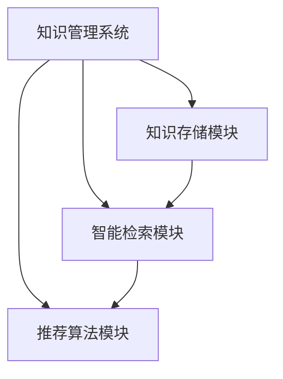

                 


# AI驱动的企业知识管理：智能检索与推荐系统

---

## 关键词：
- 人工智能
- 知识管理
- 智能检索
- 推荐系统
- 企业应用
- 算法实现
- 系统架构

---

## 摘要：
在企业知识管理领域，AI技术的应用正在 revolutionize 如何组织、检索和推荐知识。本文将深入探讨 AI 驱动的知识管理的核心概念，包括智能检索与推荐系统的原理、算法实现、系统架构设计以及实际项目案例。通过结合理论与实践，本文将为读者提供一个全面的视角，帮助他们在企业知识管理中有效应用 AI 技术。

---

## 第一部分: AI驱动的知识管理背景与重要性

### 第1章: 知识管理的定义与核心概念

#### 1.1 知识管理的基本概念
知识管理（KM，Knowledge Management）是指通过系统化的方法，对企业内外部知识进行采集、整理、存储、检索和应用的过程。其核心目标是最大化知识的价值，提升企业的决策能力和竞争力。

#### 1.2 企业知识管理的必要性
- **知识的分散性**：企业在不同部门和员工中积累了大量的隐性知识，如何有效整合这些知识是企业面临的重要挑战。
- **知识的动态性**：市场环境和技术的快速变化要求企业能够快速适应，知识管理是实现这一目标的关键。
- **知识的共享性**：通过知识管理，企业可以打破部门壁垒，实现知识的共享与复用，提升整体效率。

#### 1.3 AI在知识管理中的作用
AI技术（如自然语言处理、机器学习）能够帮助企业实现知识的自动化采集、智能化检索和个性化推荐，显著提升知识管理的效率和效果。

---

### 第2章: 智能检索与推荐系统的核心概念

#### 2.1 智能检索的基本原理
智能检索系统通过分析用户的查询意图，利用先进的算法（如向量空间模型、BM25、Word2Vec）对知识库中的内容进行精准匹配和排序。

#### 2.2 推荐系统的基本原理
推荐系统通过分析用户的兴趣和行为，利用协同过滤、基于内容的推荐、混合推荐等算法，向用户推荐相关的内容或资源。

---

## 第二部分: AI驱动的知识管理技术实现

### 第3章: 知识检索与推荐系统的技术基础

#### 3.1 智能检索算法的实现
- **向量空间模型**：通过将文本表示为向量，计算查询与文档之间的相似度。
- **BM25算法**：基于概率统计的检索算法，能够有效处理长尾查询。
- **深度学习模型**：如BERT，能够理解上下文语义，提升检索精度。

#### 3.2 推荐系统的算法实现
- **协同过滤**：基于用户行为的相似性进行推荐。
- **基于内容的推荐**：通过分析内容特征进行推荐。
- **混合推荐**：结合多种推荐方法，提升推荐效果。

---

### 第4章: 企业知识管理系统的架构设计

#### 4.1 系统功能模块设计
- **知识存储模块**：负责知识的存储和索引。
- **智能检索模块**：实现基于查询的知识检索。
- **推荐算法模块**：根据用户行为和知识特征生成推荐结果。

#### 4.2 系统架构图（使用mermaid）


#### 4.3 接口设计与交互流程
- **接口设计**：定义RESTful API，实现知识存储、检索和推荐功能。
- **交互流程**：用户发起查询，系统返回检索结果和推荐内容。

---

## 第三部分: 项目实战——构建AI驱动的知识管理系统

### 第5章: 项目实战

#### 5.1 项目需求分析
- **目标**：构建一个能够支持智能检索和推荐的企业知识管理系统。
- **功能**：知识存储、检索、推荐、知识共享。

#### 5.2 系统实现
- **环境安装**：安装Python、TensorFlow、Flask等工具。
- **代码实现**：实现知识存储、检索和推荐功能。

#### 5.3 代码示例
```python
import numpy as np
from sklearn.feature_extraction.text import TfidfVectorizer
from sklearn.metrics.pairwise import cosine_similarity

# 示例知识库
knowledge_base = [
    "如何提高编程效率",
    "软件架构设计的原则",
    "AI在企业中的应用"
]

# 创建向量模型
vectorizer = TfidfVectorizer()
vectors = vectorizer.fit_transform(knowledge_base)

# 计算余弦相似度
def search(query):
    query_vec = vectorizer.transform([query])
    similarity = cosine_similarity(query_vec.toarray(), vectors.toarray())
    return similarity.argsort()[0][::-1]

# 检索示例
query = "如何提升企业效率"
results = search(query)
print("检索结果：")
for i in range(len(results)):
    print(f"{i+1}. {knowledge_base[results[i]]}")
```

---

### 第6章: 总结与展望

#### 6.1 最佳实践
- 数据质量是关键：确保知识库的数据准确性和完整性。
- 算法选择要结合场景：根据实际需求选择合适的算法。
- 系统可扩展性设计：确保系统能够适应未来的变化。

#### 6.2 小结
AI驱动的知识管理正在成为企业提升竞争力的重要手段。通过智能检索与推荐系统，企业能够更好地管理和利用知识资源，推动业务创新。

---

## 作者：
AI天才研究院 & 禅与计算机程序设计艺术

---

### 结语：
本文通过理论与实践相结合的方式，详细介绍了AI驱动的企业知识管理的核心技术与实现方法。希望读者能够通过本文，深入了解如何利用AI技术提升企业的知识管理水平，并在实际应用中取得成功。

