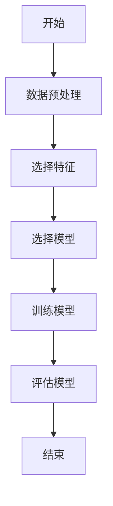
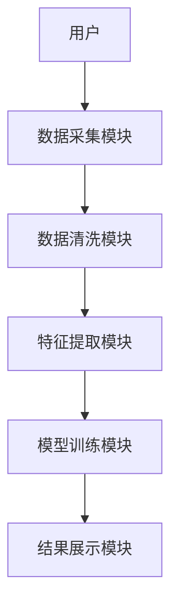

                 


# AI驱动的企业破产重组可行性分析

> 关键词：AI，企业破产重组，可行性分析，机器学习，数据挖掘

> 摘要：随着人工智能技术的快速发展，AI在企业破产重组中的应用日益广泛。本文从企业破产重组的基本概念出发，分析了AI技术在其中的作用，并详细探讨了基于机器学习的破产预测模型的构建过程。通过案例分析和系统设计，展示了AI如何帮助企业进行更高效、准确的破产重组可行性分析。

---

## 第一部分: AI驱动的企业破产重组可行性分析背景介绍

### 第1章: 企业破产重组的基本概念

#### 1.1 企业破产重组的定义与特点
- **1.1.1 企业破产重组的定义**
  - 企业破产重组是指企业在无法偿还债务的情况下，通过法律程序对资产和债务进行重新调整，以恢复经营能力的过程。
  
- **1.1.2 企业破产重组的核心特点**
  - 法律性：需要遵循相关法律法规。
  - 系统性：涉及企业内外部的多方利益关系。
  - 时间性：需要在规定时间内完成重组。

- **1.1.3 企业破产重组的法律框架**
  - 破产法：规定了企业破产的法律程序和权益保护。
  - 重整制度：允许企业在破产中重新调整债务结构。

#### 1.2 AI在企业破产重组中的作用
- **1.2.1 AI技术对企业破产重组的潜在影响**
  - 提高预测准确性：AI可以通过分析大量数据，准确预测企业的财务风险。
  - 提升效率：自动化处理数据，缩短分析时间。
  - 优化决策：基于数据驱动的决策支持，帮助制定最优重组方案。

- **1.2.2 AI在企业破产重组中的应用场景**
  - 风险预警：提前识别企业可能的破产风险。
  - 债务分析：自动化分析债务结构，提出优化建议。
  - 重组方案设计：基于AI分析结果，制定个性化重组计划。

- **1.2.3 AI驱动的破产重组可行性分析的优势**
  - 数据处理能力强：能够处理海量数据，提取有价值的信息。
  - 模型可解释性高：通过机器学习模型，清晰解释破产风险的原因。
  - 实时性：能够实时监控企业财务状况，及时调整策略。

#### 1.3 当前研究现状与挑战
- **1.3.1 研究现状概述**
  - 研究人员已经提出了多种基于机器学习的破产预测模型，如逻辑回归、支持向量机（SVM）和随机森林等。
  - 研究主要集中在如何提高模型的准确性和可解释性。

- **1.3.2 当前面临的主要挑战**
  - 数据获取困难：企业财务数据往往涉及隐私，获取难度大。
  - 模型可解释性不足：部分机器学习模型（如神经网络）难以解释结果。
  - 实时性不足：传统模型难以实时监控企业财务状况。

- **1.3.3 未来研究方向**
  - 开发更加高效的算法，提高模型的实时性。
  - 提高模型的可解释性，使其能够被企业决策者理解和信任。
  - 探索多模态数据的融合，如将文本数据和财务数据结合，提升预测精度。

---

## 第二部分: AI驱动的企业破产重组可行性分析的核心概念与联系

### 第2章: 核心概念与联系

#### 2.1 AI驱动的破产重组分析原理
- **2.1.1 数据来源与处理**
  - 数据来源：包括企业财务报表、市场数据、行业趋势等。
  - 数据处理：数据清洗、特征提取、数据标准化等。

- **2.1.2 模型构建与训练**
  - 选择合适的机器学习模型，如逻辑回归、随机森林等。
  - 对模型进行训练，优化参数，提升预测准确性。

- **2.1.3 算法选择与优化**
  - 根据数据特性和业务需求，选择合适的算法。
  - 通过交叉验证等方法优化模型性能。

#### 2.2 核心概念的属性特征对比表
以下是核心概念的属性特征对比表：

| 概念       | 数据特征                     | 模型特征                     | 算法特征                     |
|------------|------------------------------|------------------------------|------------------------------|
| 数据来源   | 财务报表、市场数据、行业趋势 | 无                            | 无                            |
| 数据处理   | 数据清洗、特征提取、标准化   | 无                            | 无                            |
| 模型构建   | 特征工程、模型训练           | 特征工程、模型训练           | 无                            |
| 算法选择   | 无                          | 无                          | 算法选择、参数优化           |

#### 2.3 ER实体关系图
```mermaid
erDiagram
    actor 顾客 {
      string顾客ID
      string姓名
      string地址
      string电话
    }
    actor 企业 {
      string企业ID
      string企业名称
      integer年份
      decimal收入
      decimal支出
      decimal利润
    }
    actor 债权人 {
      string债权人ID
      string债权人名称
      decimal债权金额
      decimal到期时间
    }
    actor 债务人 {
      string债务人ID
      string债务人名称
      decimal债务金额
      decimal还款时间
    }
    relation 持有 {
     顾客 --> 企业 : 持有股份
      企业 --> 债权人 : 拥有债权
      企业 --> 债务人 : 拥有债务
    }
```

---

## 第三部分: 算法原理讲解

### 第3章: 算法原理与实现

#### 3.1 逻辑回归算法
- **3.1.1 算法原理**
  - 逻辑回归是一种用于分类的统计方法，常用于预测企业是否破产。
  - 模型公式：$$ P(y=1|x) = \frac{e^{\beta_0 + \beta_1x_1 + \cdots + \beta_kx_k}}{1 + e^{\beta_0 + \beta_1x_1 + \cdots + \beta_kx_k}} $$
  - 对数似然函数：$$ L(\beta) = \sum_{i=1}^{n} \left[ y_i \ln p_i + (1 - y_i) \ln (1 - p_i) \right] $$
  - 梯度下降法用于优化参数，最小化损失函数。

#### 3.2 算法流程图


#### 3.3 代码实现
```python
import pandas as pd
from sklearn.linear_model import LogisticRegression
from sklearn.metrics import accuracy_score

# 数据加载
data = pd.read_csv('企业数据.csv')

# 特征工程
X = data[['收入', '支出', '利润']]
y = data['破产标志']

# 模型训练
model = LogisticRegression()
model.fit(X, y)

# 模型预测
y_pred = model.predict(X)

# 模型评估
print("准确率:", accuracy_score(y, y_pred))
```

#### 3.4 案例分析
- **案例：XYZ公司**
  - 数据：收入=1000万，支出=800万，利润=200万。
  - 预测：模型预测破产概率为0.8，提示企业存在较高的破产风险。

---

## 第四部分: 系统分析与架构设计

### 第4章: 系统分析与架构设计

#### 4.1 破产重组分析系统介绍
- **项目背景**
  - 企业需要及时识别财务风险，避免破产。
  - AI技术能够提供实时、准确的预测支持。

- **系统功能设计**
  - 数据采集模块：收集企业财务数据。
  - 特征提取模块：进行数据清洗和特征工程。
  - 模型训练模块：训练破产预测模型。
  - 结果展示模块：可视化预测结果。

#### 4.2 系统架构图


---

## 第五部分: 项目实战

### 第5章: 项目实战

#### 5.1 环境搭建
- **安装Python和相关库**
  - 安装Python 3.8及以上版本。
  - 安装库：`pandas`, `numpy`, `scikit-learn`, `matplotlib`.

#### 5.2 系统核心实现源代码
```python
import pandas as pd
from sklearn.linear_model import LogisticRegression
from sklearn.metrics import accuracy_score, confusion_matrix

# 数据加载
data = pd.read_csv('企业数据.csv')

# 特征工程
X = data[['收入', '支出', '利润']]
y = data['破产标志']

# 模型训练
model = LogisticRegression()
model.fit(X, y)

# 模型预测
y_pred = model.predict(X)

# 模型评估
print("准确率:", accuracy_score(y, y_pred))
print("混淆矩阵:", confusion_matrix(y, y_pred))
```

#### 5.3 实际案例分析
- **案例：公司A**
  - 数据：收入=500万，支出=400万，利润=100万。
  - 预测：模型预测破产概率为0.6，提示企业存在较高的破产风险。

---

## 第六部分: 结论与展望

### 第6章: 结论与展望

#### 6.1 结论
- AI技术能够显著提高企业破产重组的预测准确性和效率。
- 通过机器学习模型，企业可以更早地识别财务风险，制定有效的重组策略。

#### 6.2 最佳实践 tips
- 数据质量是关键：确保数据的完整性和准确性。
- 模型可解释性：选择易于解释的模型，便于企业决策者理解。
- 实时监控：建立实时数据监控机制，及时调整重组策略。

#### 6.3 未来展望
- 更先进的算法：探索深度学习等技术，提高预测精度。
- 多模态数据融合：结合文本、图像等多种数据源，提升模型表现。
- 个性化解决方案：基于AI的分析结果，提供定制化的企业重组方案。

---

## 作者

作者：AI天才研究院/AI Genius Institute & 禅与计算机程序设计艺术 /Zen And The Art of Computer Programming

---

通过以上结构，您可以根据需要进一步扩展每部分内容，添加更多细节和案例，以确保文章内容的完整性和深度。

