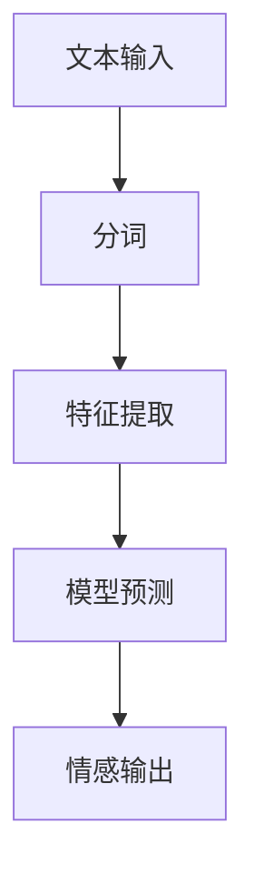
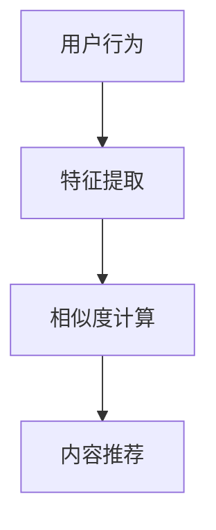
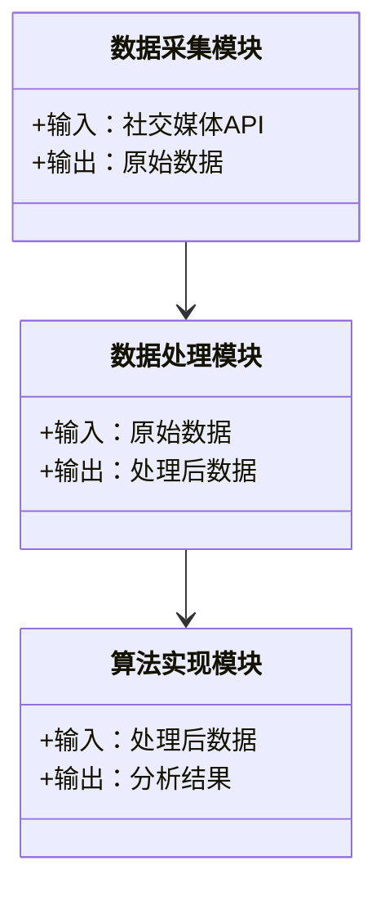

                 


# AI驱动的企业社交媒体管理：策略与实践

---

## 关键词：AI, 社会媒体管理, 情感分析, 内容推荐, 机器学习, 系统架构

---

## 摘要

随着社交媒体在企业中的广泛应用，如何高效管理社交媒体内容、优化用户体验、提升品牌影响力成为企业面临的重要挑战。AI技术的引入为社交媒体管理带来了新的可能性，通过智能化的算法和模型，企业能够实现内容自动推荐、情感分析、用户行为预测等功能，从而显著提高管理效率和决策能力。本文将从AI驱动社交媒体管理的背景、核心概念、算法原理、系统架构到实际项目实现进行全面解析，为企业提供切实可行的策略和实践方法。

---

## 第一部分: AI驱动的企业社交媒体管理概述

### 第1章: AI驱动的社交媒体管理背景与挑战

#### 1.1 社会媒体管理的现状与趋势

##### 1.1.1 社会媒体管理的核心概念

社交媒体管理是指通过系统化的手段对企业在社交媒体平台上的内容进行发布、监控、分析和优化的过程。传统的社交媒体管理依赖人工操作，效率低、成本高且难以应对海量数据的实时处理需求。

##### 1.1.2 AI在社会媒体管理中的作用

AI技术的引入，使得社交媒体管理从人工化向智能化转变。AI能够实时处理海量数据，快速生成洞察，并自动化执行决策，显著提升了管理效率和精准度。

##### 1.1.3 当前社会媒体管理的主要挑战

- **数据量大**：社交媒体平台每天产生的数据量巨大，人工处理能力有限。
- **实时性要求高**：突发事件或危机需要快速响应，传统方法难以满足。
- **管理复杂性**：社交媒体涉及多个平台、不同用户群体和多样化内容，管理复杂度高。

#### 1.2 企业社交媒体管理的痛点

##### 1.2.1 传统社交媒体管理的局限性

- 精力投入大，效率低。
- 内容发布和互动响应不够及时。
- 数据分析能力有限，难以从海量信息中提取有效洞察。

##### 1.2.2 数据量大、实时性高的管理需求

企业需要实时监控社交媒体上的品牌声誉、用户反馈和市场趋势，这对数据处理能力和实时响应能力提出了更高要求。

##### 1.2.3 企业社交媒体管理的复杂性

社交媒体管理涉及多个平台、用户行为分析、内容优化等多个方面，传统方法难以实现全面覆盖。

#### 1.3 AI驱动的解决方案

##### 1.3.1 AI在社交媒体管理中的优势

- 高效处理海量数据。
- 实时监控和响应。
- 智能分析和预测。

##### 1.3.2 AI驱动的社交媒体管理的核心要素

- 数据采集与处理。
- 情感分析与用户行为分析。
- 内容推荐与优化。
- 自动化响应与决策。

##### 1.3.3 AI驱动管理的实施路径

1. **数据采集**：从社交媒体平台获取相关数据。
2. **数据处理**：清洗、标注和建模。
3. **算法实现**：情感分析、内容推荐等算法的实现。
4. **系统集成**：将AI算法集成到企业社交媒体管理系统中。
5. **持续优化**：根据反馈不断优化算法和系统。

---

### 第2章: AI驱动社交媒体管理的核心概念

#### 2.1 AI驱动社交媒体管理的定义与特点

##### 2.1.1 定义

AI驱动的社交媒体管理是指利用人工智能技术，通过数据采集、分析和处理，实现对社交媒体内容的自动化管理、优化和决策。

##### 2.1.2 核心特点对比

| 特性         | 传统社交媒体管理         | AI驱动社交媒体管理         |
|--------------|--------------------------|-----------------------------|
| 数据处理能力 | 依赖人工处理             | 自动化处理，高效准确       |
| 实时性       | 响应较慢                | 实时监控和快速响应         |
| 决策能力     | 依赖人工经验判断         | 数据驱动的智能决策         |
| 规模化能力   | 适用于小规模数据         | 适用于大规模数据           |

##### 2.1.3 与传统社交媒体管理的区分

AI驱动社交媒体管理的核心在于数据的智能化处理和决策的自动化，而传统管理依赖人工经验和判断。

#### 2.2 核心概念的ER实体关系图

```mermaid
er
    actor: 用户
    content: 内容
    interaction: 互动
    sentiment: 情感
    topic: 主题
    rule: 规则
    user: 用户
    action: 行动
    feedback: 反馈
    actor --> content: 发布
    content --> interaction: 引发
    interaction --> sentiment: 产生
    content --> topic: 归属
    rule --> action: 触发
    action --> feedback: 生成
```

---

#### 2.3 核心概念的数学模型与公式

##### 2.3.1 情感分析模型

情感分析是通过算法判断文本中的情感倾向，常用的方法包括基于词典的方法和机器学习方法。

- **基于词典的方法**：通过预定义的情感词汇对文本进行情感评分。
- **机器学习方法**：训练情感分类器，如支持向量机（SVM）或深度学习模型（如LSTM）。

公式示例：

$$
\text{情感得分} = \sum (\text{词典中词语的权重} \times \text{词语出现次数})
$$

##### 2.3.2 内容推荐模型

内容推荐是基于用户行为和内容特征，预测用户对内容的偏好。

- **协同过滤**：基于用户相似性推荐内容。
- **基于内容的推荐**：基于内容特征相似性推荐内容。

公式示例：

$$
\text{推荐概率} = \frac{\text{用户偏好} \times \text{内容相关性}}{\text{总互动数}}
$$

---

## 第三部分: AI驱动社交媒体管理的算法原理

### 第3章: AI驱动社交媒体管理的算法实现

#### 3.1 情感分析算法

##### 3.1.1 算法流程



##### 3.1.2 Python实现

```python
import nltk
from nltk.sentiment import SentimentIntensityAnalyzer

sia = SentimentIntensityAnalyzer()
text = "客户对我们的服务非常满意"
scores = sia.polarity_scores(text)
print(scores['compound'])  # 输出情感得分
```

#### 3.2 内容推荐算法

##### 3.2.1 算法流程



##### 3.2.2 Python实现

```python
import numpy as np
from sklearn.metrics.pairwise import cosine_similarity

def content_recommendation(user_profile, content_features):
    similarity = cosine_similarity(user_profile, content_features)
    recommended_content = np.argmax(similarity)
    return recommended_content
```

---

## 第四部分: AI驱动社交媒体管理的系统架构设计

### 第4章: 系统分析与架构设计方案

#### 4.1 问题场景介绍

企业需要实时监控社交媒体上的品牌声誉、用户反馈和市场趋势，对海量数据进行处理和分析。

#### 4.2 系统功能设计

##### 4.2.1 功能模块

- 数据采集模块：从社交媒体平台获取数据。
- 数据处理模块：清洗、标注和建模。
- 算法实现模块：情感分析、内容推荐。
- 系统集成模块：将算法结果集成到企业管理系统中。

##### 4.2.2 领域模型图



---

## 第五部分: 项目实战

### 第5章: 项目实现与案例分析

#### 5.1 项目实战环境安装

```bash
pip install nltk
pip install scikit-learn
pip install matplotlib
```

#### 5.2 系统核心实现源代码

##### 5.2.1 情感分析核心代码

```python
from nltk.sentiment import SentimentIntensityAnalyzer

def analyze_sentiment(text):
    sia = SentimentIntensityAnalyzer()
    scores = sia.polarity_scores(text)
    return scores['compound']

# 示例
text = "客户对我们的服务非常满意"
print(analyze_sentiment(text))  # 输出情感得分
```

##### 5.2.2 内容推荐核心代码

```python
from sklearn.feature_extraction.text import TfidfVectorizer

def content_recommendation(corpus, new_content):
    vectorizer = TfidfVectorizer()
    tfidf_matrix = vectorizer.fit_transform(corpus)
    new_tfidf = vectorizer.transform([new_content])
    similarity = cosine_similarity(new_tfidf, tfidf_matrix)
    recommended_index = similarity.argmax()
    return corpus[recommended_index]

# 示例
corpus = ["产品很好，推荐给大家", "服务一般，有待改进"]
new_content = "客户满意度高，产品优质"
print(content_recommendation(corpus, new_content))  # 输出推荐内容
```

---

### 第6章: 总结与展望

#### 6.1 本章小结

AI驱动的社交媒体管理通过智能化算法和系统架构设计，显著提高了企业的管理效率和决策能力。情感分析和内容推荐等技术的应用，为企业提供了实时、精准的社交媒体管理解决方案。

#### 6.2 未来展望

随着AI技术的不断发展，社交媒体管理将更加智能化和自动化。未来，可以期待更多基于深度学习的创新算法和更高效的系统架构，为企业和社会媒体管理带来更大的价值。

---

## 作者：AI天才研究院/AI Genius Institute & 禅与计算机程序设计艺术 /Zen And The Art of Computer Programming

---

通过以上结构和内容的详细解析，希望这篇文章能够为读者提供清晰的思路和实用的技术指导，帮助企业更好地利用AI技术优化社交媒体管理。

