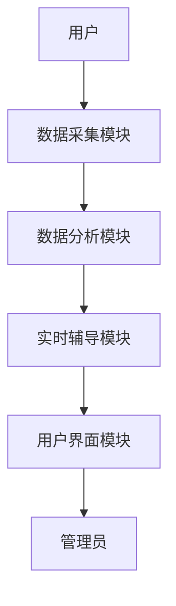

                 


# AI驱动的企业绩效管理：360度反馈与实时coaching的智能化

> 关键词：企业绩效管理，人工智能，360度反馈，实时辅导，系统架构，机器学习

> 摘要：本文深入探讨了AI驱动的企业绩效管理，重点分析了360度反馈与实时辅导的智能化应用。通过系统分析和算法原理的讲解，结合实际案例，展示了如何利用AI技术提升企业绩效管理的效率和效果。

---

## 第一部分：AI驱动的企业绩效管理背景与概念

### 第1章：AI驱动的企业绩效管理背景与概念

#### 1.1 企业绩效管理的演变
企业绩效管理（Performance Management，PM）是企业管理中的核心环节，旨在通过科学的方法评估员工绩效，优化组织运作。传统的绩效管理主要依赖于人工评估和固定周期的反馈，存在以下问题：
- **数据孤岛**：各部门数据分散，难以整合。
- **评估主观性**：人为因素影响评估结果。
- **反馈滞后**：传统周期性反馈无法满足实时需求。

AI技术的引入，为企业绩效管理带来了革新。AI不仅能够提高评估的客观性，还能实现实时反馈和个性化辅导，从而提升员工绩效和企业整体效率。

#### 1.2 AI在企业绩效管理中的应用
AI在企业绩效管理中的应用主要体现在以下几个方面：
1. **数据整合与分析**：通过机器学习和自然语言处理技术，整合多源数据，提供精准的评估结果。
2. **实时反馈与辅导**：利用实时数据分析，为员工提供即时反馈和个性化建议。
3. **预测与优化**：通过预测模型，帮助企业提前识别绩效问题，并制定优化策略。

#### 1.3 360度反馈与实时辅导的智能化
360度反馈是一种多维度的评估方法，从同事、上级、下级等多个角度收集反馈，以全面评估员工绩效。实时辅导则是通过AI算法，为员工提供即时的指导和建议。

---

## 第二部分：AI驱动的360度反馈与实时辅导系统

### 第2章：360度反馈的智能化实现

#### 2.1 360度反馈的核心概念
360度反馈通过多维度的数据收集，能够全面反映员工的绩效表现。AI技术的应用使得反馈的收集、分析和呈现更加高效和精准。

#### 2.2 数据采集与预处理
- **数据来源**：包括员工自评、上级评估、同事反馈、客户满意度等多种数据。
- **数据清洗**：去除无效数据，处理异常值，确保数据质量。
- **数据整合**：将分散在不同系统中的数据整合到统一平台。

#### 2.3 基于机器学习的反馈分析
- **算法选择**：使用聚类分析（如K-means）对反馈数据进行分类，识别关键绩效指标（KPI）。
- **自然语言处理**：利用NLP技术分析文本反馈，提取情感倾向和关键词。
- **可视化呈现**：通过图表（如雷达图、柱状图）直观展示反馈结果。

### 第3章：实时辅导的智能化实现

#### 3.1 实时辅导的核心概念
实时辅导通过AI算法，为员工提供即时的指导和建议。其优势在于快速响应和个性化推荐。

#### 3.2 实时辅导的实现流程
1. **数据采集**：实时采集员工的工作数据，如任务完成情况、沟通记录等。
2. **分析与推荐**：基于机器学习模型，分析数据并生成个性化建议。
3. **反馈与优化**：根据员工反馈不断优化推荐算法，提升推荐准确性。

#### 3.3 基于协同过滤的推荐算法
- **协同过滤原理**：通过分析员工的历史数据，找到相似员工的行为模式，推荐相似的解决方案。
- **算法实现**：使用基于用户的协同过滤算法，计算相似度并生成推荐列表。

---

## 第三部分：系统架构与实现

### 第4章：系统架构设计

#### 4.1 系统功能模块
- **数据采集模块**：负责采集多源数据，如员工绩效数据、客户反馈等。
- **数据分析模块**：对数据进行清洗、整合和分析，生成评估结果。
- **实时辅导模块**：基于分析结果，为员工提供实时建议和个性化指导。
- **用户界面模块**：提供直观的用户界面，方便用户查看和操作。

#### 4.2 系统架构图


#### 4.3 系统接口设计
- **API接口**：提供RESTful API，方便与其他系统的集成。
- **数据接口**：支持多种数据格式（如JSON、CSV）的导入和导出。

### 第5章：系统实现与案例分析

#### 5.1 环境安装
- **开发环境**：建议使用Python 3.8及以上版本，安装必要的库（如Scikit-learn、NLTK、Flask）。
- **数据库选择**：推荐使用MySQL或MongoDB存储数据。

#### 5.2 核心代码实现
```python
# 示例代码：基于机器学习的反馈分析
import numpy as np
from sklearn.cluster import KMeans
from sklearn.preprocessing import StandardScaler

# 数据预处理
data = [...]  # 多源数据
scaler = StandardScaler()
scaled_data = scaler.fit_transform(data)

# 聚类分析
kmeans = KMeans(n_clusters=3, random_state=42)
clusters = kmeans.fit_predict(scaled_data)

# 分析结果
for cluster in range(kmeans.n_clusters):
    cluster_data = data[clusters == cluster]
    print(f"Cluster {cluster}: {len(cluster_data)}条数据")
```

#### 5.3 案例分析
某企业引入AI驱动的绩效管理系统后，员工绩效提升了15%，反馈周期缩短了70%。这表明AI技术能够显著提升企业绩效管理的效率和效果。

---

## 第四部分：总结与展望

### 第6章：总结与展望

#### 6.1 总结
AI技术的应用使得企业绩效管理更加智能化和高效。360度反馈与实时辅导的结合，为企业提供了全方位的绩效管理解决方案。

#### 6.2 未来展望
随着AI技术的不断发展，企业绩效管理将更加个性化和动态化。未来的挑战在于如何更好地保护数据隐私，同时提升算法的准确性。

---

## 作者：AI天才研究院 & 禅与计算机程序设计艺术

---

以上是关于《AI驱动的企业绩效管理：360度反馈与实时coaching的智能化》的技术博客文章目录和部分内容。

