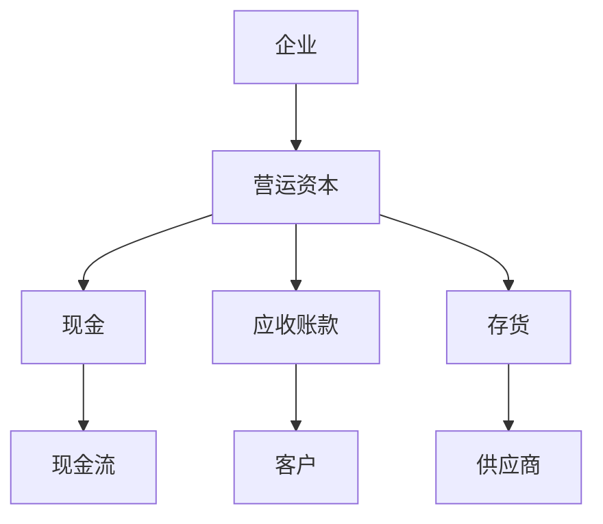
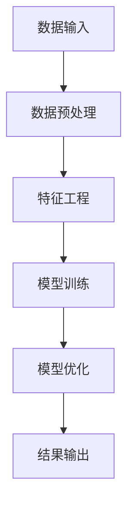
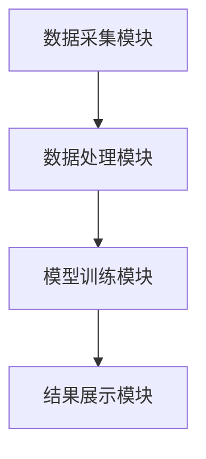

                 


# AI驱动的企业营运资本优化模型

## 关键词：
AI技术、企业营运资本、优化模型、算法原理、系统架构

## 摘要：
本文系统地介绍了AI驱动的企业营运资本优化模型，从背景到核心概念，从算法原理到系统架构，再到项目实战，全面剖析了如何利用AI技术优化企业的营运资本管理。通过具体案例分析，展示了模型的实际应用效果，并提出了未来的优化方向。

---

## 第1章: 背景介绍与问题背景

### 1.1 企业营运资本管理的背景

#### 1.1.1 营运资本的定义与组成
营运资本是企业在日常经营活动中所需的流动资金，包括现金、应收账款、存货和应付账款等。它直接关系到企业的运营效率和资金流动性。

#### 1.1.2 企业营运资本管理的重要性
良好的营运资本管理可以提高资金使用效率，降低企业风险，增强市场竞争力。传统方法在数据处理和预测准确性上有局限性，而AI技术的应用可以显著提升优化效果。

#### 1.1.3 AI技术对企业营运资本管理的影响
AI技术通过大数据分析和机器学习算法，能够实时优化营运资本配置，预测资金需求，从而提升企业财务表现。

### 1.2 AI驱动优化的必要性

#### 1.2.1 传统营运资本管理的局限性
传统方法依赖经验判断，数据处理能力有限，难以应对复杂多变的市场环境。

#### 1.2.2 AI技术在优化中的优势
AI能够快速处理大量数据，发现隐藏规律，提供精准预测，帮助企业在资金分配上做出最优决策。

#### 1.2.3 当前企业对AI驱动优化的需求
随着市场竞争加剧，企业需要更高效的资金管理工具，AI驱动的优化模型成为必然选择。

---

## 第2章: 核心概念与模型框架

### 2.1 核心概念与定义

#### 2.1.1 营运资本优化模型的定义
通过AI技术构建的数学模型，旨在最小化营运资本成本，同时满足企业运营需求。

#### 2.1.2 AI驱动优化的核心要素
包括数据输入、特征工程、模型训练、结果输出等关键环节。

#### 2.1.3 模型的边界与外延
模型主要关注流动资产和流动负债，同时考虑外部市场环境和企业内部政策的影响。

### 2.2 核心概念的联系与对比

#### 2.2.1 核心概念的属性特征对比表格

| 比较维度 | 现金 | 应收账款 | 存货 | 应付账款 |
|----------|------|----------|------|----------|
| 数值大小 | 较低 | 较高     | 中等 | 较低     |
| 变动性   | 高   | 中       | 高   | 低       |
| 影响因素 | 现金流 | 客户信用 | 供应链 | 供应商谈判 |

#### 2.2.2 ER实体关系图架构的 Mermaid 流程图


---

## 第3章: 算法原理与数学模型

### 3.1 算法原理讲解

#### 3.1.1 算法流程图


### 3.2 数学模型与公式

#### 3.2.1 营运资本优化的数学模型
$$ \text{目标函数: } \min_{x} \sum_{i=1}^{n} c_i x_i $$

#### 3.2.2 约束条件
$$ \text{约束: } \sum_{i=1}^{n} a_i x_i \geq b $$

#### 3.2.3 示例说明
通过具体案例，解释如何利用上述模型优化企业营运资本。

---

## 第4章: 系统分析与架构设计

### 4.1 问题场景介绍

#### 4.1.1 项目背景
企业希望通过优化营运资本管理，提升资金使用效率，降低财务风险。

#### 4.1.2 项目目标
构建AI驱动的优化模型，实现对现金、应收账款和存货的有效管理。

#### 4.1.3 项目范围
涵盖数据采集、模型训练、结果应用等模块。

### 4.2 系统架构设计

#### 4.2.1 系统功能设计
系统分为数据采集、模型训练、结果展示三个主要模块。

#### 4.2.2 系统架构设计的 Mermaid 图


#### 4.2.3 系统接口设计
各模块之间的接口设计，确保数据流畅传输。

---

## 第5章: 项目实战

### 5.1 环境安装与数据准备

#### 5.1.1 环境安装
安装Python、机器学习库（如scikit-learn）和数据处理工具（如Pandas）。

#### 5.1.2 数据准备
收集企业的历史财务数据，清洗和预处理。

### 5.2 核心代码实现

#### 5.2.1 数据预处理代码
```python
import pandas as pd

# 读取数据
data = pd.read_csv('operating_capital.csv')

# 数据清洗
data.dropna(inplace=True)
data = data[~data['收入'].isnull()]
```

#### 5.2.2 特征工程代码
```python
from sklearn.preprocessing import StandardScaler

# 标准化处理
scaler = StandardScaler()
X_scaled = scaler.fit_transform(data[['现金', '应收账款', '存货']])
```

#### 5.2.3 模型训练代码
```python
from sklearn.linear_model import LinearRegression

# 训练模型
model = LinearRegression()
model.fit(X_scaled, data['营运资本'])
```

#### 5.2.4 模型预测代码
```python
# 预测结果
predicted = model.predict(X_scaled)
```

### 5.3 案例分析与解读

#### 5.3.1 数据分析结果展示
通过图表展示优化前后的营运资本变化。

#### 5.3.2 模型优化与结果解读
解释模型如何优化企业的资金配置，降低营运资本成本。

---

## 第6章: 总结与展望

### 6.1 总结
本文详细介绍了AI驱动的企业营运资本优化模型，从理论到实践，展示了其在提升企业财务效率中的应用价值。

### 6.2 展望
未来，随着AI技术的不断发展，模型将更加智能化，优化效果也将更显著。企业应积极拥抱技术变革，充分利用AI工具提升竞争力。

---

## 附录

### 附录A: 数据集
详细说明数据集的来源和结构。

### 附录B: 工具安装与配置
指导读者安装必要的工具和库。

---

## 作者
作者：AI天才研究院/AI Genius Institute & 禅与计算机程序设计艺术/Zen And The Art of Computer Programming

