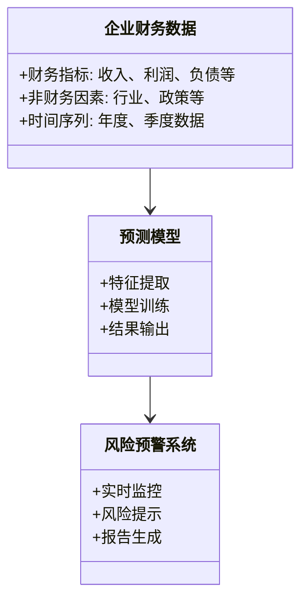
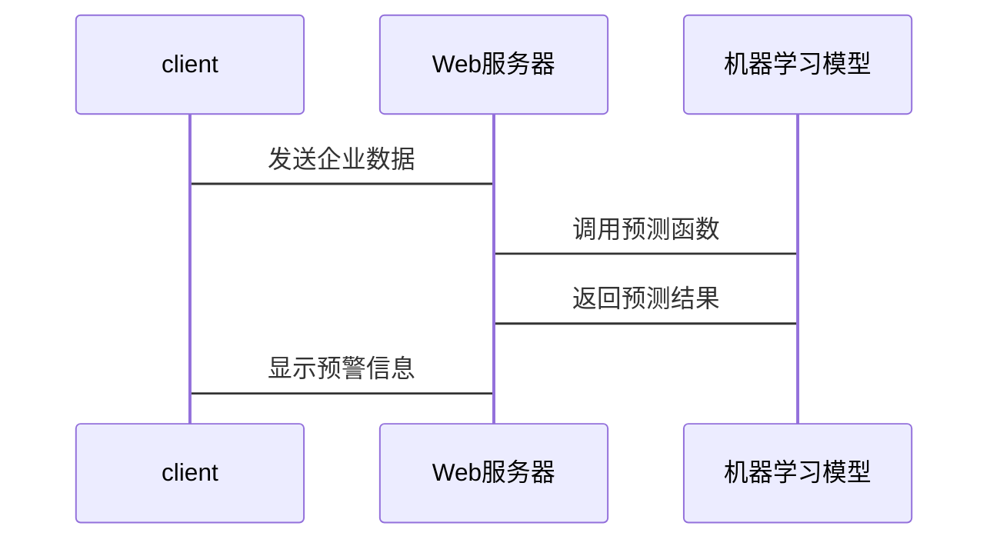

                 


# AI驱动的企业财务困境预测与诊断

> 关键词：企业财务困境、人工智能、机器学习、预测模型、数据分析、财务健康评估

> 摘要：本文详细探讨了如何利用人工智能技术，特别是机器学习和深度学习算法，来预测和诊断企业财务困境。文章从企业财务困境的背景与意义出发，分析了AI技术在财务预测中的应用价值，详细讲解了相关的数学模型与算法原理，并结合实际案例展示了系统设计与项目实现的过程。通过本文，读者可以全面了解AI驱动的企业财务困境预测与诊断的核心技术与实践方法。

---

# 第一部分: AI驱动的企业财务困境预测与诊断概述

## 第1章: 企业财务困境预测的背景与意义

### 1.1 企业财务困境的定义与特征

#### 1.1.1 企业财务困境的定义
企业财务困境（Corporate Financial Distress）是指企业在经营过程中由于多种因素的影响，导致其无法按时偿还债务、持续经营能力下降或面临破产的情况。财务困境通常表现为盈利能力下降、现金流紧张、资产负债率高等问题。

#### 1.1.2 财务困境的特征与表现
财务困境的表现多种多样，主要包括以下几个方面：
- **盈利能力下降**：企业净利润率持续下滑，无法覆盖运营成本。
- **现金流问题**：经营活动现金流为负，难以维持日常运营。
- **债务负担加重**：资产负债率过高，短期债务难以偿还。
- **信用评级下降**：评级机构下调企业信用评级，影响融资能力。

#### 1.1.3 财务困境对企业的影响
企业财务困境不仅影响企业的生存与发展，还会对相关利益方（如股东、债权人、员工等）造成负面影响。例如：
- 股东可能面临资产减值或投资损失。
- 债权人可能面临债务回收风险。
- 企业员工可能面临裁员或工作不稳定的风险。

### 1.2 AI技术在财务预测中的应用价值

#### 1.2.1 AI技术的优势与特点
AI技术在企业财务困境预测中的优势主要体现在以下几个方面：
- **数据处理能力**：AI能够处理海量的非结构化数据，提取隐藏的特征。
- **预测准确性**：通过机器学习算法，AI可以发现传统方法难以捕捉的复杂模式。
- **实时性**：AI系统可以实时监控企业财务数据，及时发现潜在风险。

#### 1.2.2 AI在财务数据分析中的应用
AI技术在财务数据分析中的应用包括：
- **数据清洗与特征工程**：利用自然语言处理（NLP）技术提取财务报告中的隐含信息。
- **预测模型构建**：基于机器学习算法构建财务困境预测模型。
- **风险预警系统**：通过实时数据分析，提前预警企业财务风险。

#### 1.2.3 企业财务困境预测的痛点与难点
尽管AI技术在财务预测中具有诸多优势，但实际应用中仍面临以下痛点与难点：
- **数据质量问题**：企业财务数据可能存在缺失、错误或不一致的问题。
- **模型解释性**：复杂的深度学习模型往往缺乏可解释性，难以满足企业的实际需求。
- **动态变化**：企业的财务状况可能受到外部经济环境的动态影响，模型需要不断更新。

### 1.3 本章小结
本章从企业财务困境的定义与特征出发，分析了AI技术在财务预测中的应用价值，并总结了当前技术应用中的痛点与难点。下一章将详细介绍AI驱动的财务困境预测的核心概念与技术原理。

---

## 第2章: AI驱动的财务困境预测核心概念

### 2.1 财务困境预测的关键要素

#### 2.1.1 财务指标分析
财务指标是预测企业财务困境的重要依据，主要包括以下几个方面：
- **流动性指标**：如速动比率、流动比率等，用于衡量企业的短期偿债能力。
- **盈利能力指标**：如净利润率、毛利率等，用于衡量企业的盈利能力。
- **杠杆比率**：如资产负债率、产权比率等，用于衡量企业的财务杠杆风险。

#### 2.1.2 非财务因素的影响
除了财务指标，企业外部环境（如行业竞争、政策变化）和内部管理（如战略决策、团队能力）也会影响企业的财务状况。

#### 2.1.3 数据特征与模型选择
数据特征的选择直接影响模型的预测效果。例如，逻辑回归模型适合处理线性可分问题，而随机森林模型适合处理高维非线性数据。

### 2.2 AI模型在财务预测中的作用

#### 2.2.1 数据处理与特征提取
AI模型需要对原始数据进行清洗、转换和特征提取。例如，利用主成分分析（PCA）减少数据维度。

#### 2.2.2 模型训练与优化
通过交叉验证和网格搜索等方法优化模型参数，提升预测准确率。

#### 2.2.3 结果解释与可解释性
模型的可解释性是企业财务预测的重要需求。例如，线性回归模型可以通过系数大小解释各个特征对预测结果的影响。

### 2.3 本章小结
本章详细介绍了财务困境预测的关键要素，分析了AI模型在财务预测中的作用，并总结了数据特征与模型选择的关系。下一章将深入讲解AI驱动的财务困境预测算法原理。

---

## 第3章: AI驱动的财务困境预测算法原理

### 3.1 传统机器学习算法

#### 3.1.1 逻辑回归模型
逻辑回归是一种经典的分类算法，适用于二分类问题。其数学表达式为：
$$ P(y=1|x) = \frac{1}{1 + e^{-\beta x}} $$
其中，$\beta$ 是模型参数，$x$ 是输入特征。

#### 3.1.2 支持向量机（SVM）
SVM通过构建超平面将数据分为两类，适用于小样本数据。其优化目标为：
$$ \min_{w,b} \frac{1}{2}||w||^2 $$
约束条件为：
$$ y_i(w \cdot x_i + b) \geq 1 $$

#### 3.1.3 随机森林与梯度提升树
随机森林通过集成多个决策树提升模型的泛化能力，而梯度提升树（如XGBoost）则通过逐层优化损失函数提升模型性能。

### 3.2 深度学习算法

#### 3.2.1 神经网络模型
神经网络通过多层非线性变换提取数据特征，适用于复杂的非线性关系。

#### 3.2.2 长短期记忆网络（LSTM）
LSTM通过记忆单元捕捉时间序列数据中的长距离依赖关系，适用于财务时间序列预测。

#### 3.2.3 图神经网络（GNN）
GNN通过图结构数据建模企业之间的关联关系，适用于预测企业上下游链条中的财务风险。

### 3.3 混合模型与集成学习

#### 3.3.1 混合模型的优势
混合模型结合了传统机器学习与深度学习的优势，能够更好地处理复杂数据。

#### 3.3.2 集成学习的原理与应用
通过投票、加权等方式集成多个模型的预测结果，提升整体预测准确率。

#### 3.3.3 模型融合与优化
模型融合需要考虑各个模型的优缺点，通过实验验证选择最优的融合策略。

### 3.4 本章小结
本章详细介绍了传统机器学习和深度学习算法在财务困境预测中的应用，并分析了混合模型与集成学习的优势。下一章将结合实际案例展示系统设计与实现过程。

---

## 第4章: 财务困境预测的数学模型与公式

### 4.1 逻辑回归模型

#### 4.1.1 逻辑函数的数学表达式
$$ P(y=1|x) = \frac{1}{1 + e^{-\beta x}} $$

#### 4.1.2 模型的损失函数
$$ L = -\sum_{i=1}^{n} [y_i \ln p_i + (1 - y_i)\ln(1 - p_i)] $$

### 4.2 支持向量机模型

#### 4.2.1 线性可分情况下的优化目标
$$ \min_{w,b} \frac{1}{2}||w||^2 $$

#### 4.2.2 软边界的处理
$$ \sum_{i=1}^{n} \xi_i + \frac{1}{2}||w||^2 $$

### 4.3 随机森林模型

#### 4.3.1 树模型的构建
随机森林通过随机选择特征和样本构建多个决策树。

#### 4.3.2 集成学习的投票机制
通过多数投票的方式确定最终的分类结果。

#### 4.3.3 模型的特征重要性
通过特征贡献度分析确定各个特征对预测结果的影响程度。

### 4.4 本章小结
本章通过公式和图表的形式，详细讲解了逻辑回归、支持向量机和随机森林等算法的数学模型与实现原理。下一章将结合系统设计与实际案例展示AI驱动的财务困境预测的完整流程。

---

## 第5章: 系统分析与架构设计方案

### 5.1 问题场景介绍

#### 5.1.1 企业财务数据的获取与处理
通过API接口获取企业财务数据，进行数据清洗和特征工程。

#### 5.1.2 数据清洗与特征工程
利用Python的pandas库进行数据清洗，提取关键特征。

#### 5.1.3 模型训练与部署
通过机器学习框架（如scikit-learn）训练模型，并部署为API服务。

### 5.2 系统功能设计

#### 5.2.1 领域模型类图


#### 5.2.2 系统架构图


#### 5.2.3 系统接口设计
- **输入接口**：接收企业财务数据和非财务因素。
- **输出接口**：提供财务困境预测结果和风险预警信息。

#### 5.2.4 系统交互序列图


### 5.3 本章小结
本章通过系统设计与架构图，详细展示了AI驱动的财务困境预测系统的实现方案。下一章将通过实际案例展示系统实现的具体过程。

---

## 第6章: 项目实战——AI驱动的财务困境预测系统实现

### 6.1 环境安装与配置

#### 6.1.1 安装Python环境
使用Anaconda安装Python 3.8及以上版本。

#### 6.1.2 安装机器学习库
安装scikit-learn、xgboost、keras等机器学习库。

### 6.2 系统核心实现源代码

#### 6.2.1 数据清洗与特征工程
```python
import pandas as pd
from sklearn.impute import SimpleImputer
from sklearn.preprocessing import StandardScaler

# 读取数据
data = pd.read_csv('financial_data.csv')

# 数据清洗
imputer = SimpleImputer(strategy='mean')
data_imputed = imputer.fit_transform(data)

# 特征工程
scaler = StandardScaler()
data_scaled = scaler.fit_transform(data_imputed)
```

#### 6.2.2 模型训练与优化
```python
from sklearn.model

