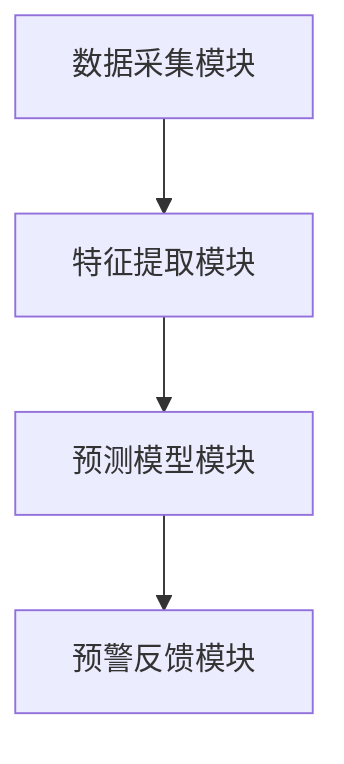

                 


# AI驱动的企业财务困境预测系统

> 关键词：AI，企业财务困境，预测系统，机器学习，深度学习，财务数据分析

> 摘要：本文详细介绍了AI驱动的企业财务困境预测系统的构建与实现。从企业财务困境的定义与特征出发，结合AI技术的优势，分析了传统财务预测方法的局限性。基于机器学习与深度学习算法，提出了系统的整体架构设计，包括数据采集、特征提取、预测模型构建与预警反馈等模块。通过具体案例分析，展示了系统的实际应用场景与预测效果。最后，本文总结了系统的优缺点，并对未来的发展方向提出了展望。

---

## 第一部分: AI驱动的企业财务困境预测系统概述

### 第1章: 企业财务困境预测的背景与挑战

#### 1.1 企业财务困境的定义与特征
企业财务困境是指企业在经营过程中由于财务状况恶化，无法偿还债务或继续经营的状况。其主要特征包括：
- 财务报表数据异常（如高负债率、低利润率）；
- 经营现金流枯竭；
- 信用评级下降。

#### 1.2 传统财务困境预测方法的局限性
传统财务预测方法主要依赖财务指标分析和统计模型，存在以下问题：
- 数据维度有限，难以捕捉企业经营的全貌；
- 预测精度低，难以应对复杂多变的市场环境；
- 计算复杂，难以实时监控。

#### 1.3 AI驱动的财务困境预测的优势
AI技术的应用为企业财务困境预测带来了革命性的变化：
- 数据处理能力强，能够整合多维度数据；
- 预测精度高，能够捕捉非线性关系；
- 实时性好，支持动态监控与预警。

---

### 第2章: AI驱动的企业财务困境预测系统的核心概念

#### 2.1 数据特征与处理
企业财务数据包括财务报表数据、市场数据、文本数据等多种类型。特征提取的关键步骤包括：
- 数据清洗：处理缺失值、异常值；
- 数据标准化：统一数据格式；
- 特征选择：筛选重要特征。

#### 2.2 预测模型与算法
常用的机器学习算法包括逻辑回归、随机森林、XGBoost等，深度学习算法包括LSTM、Transformer等。选择合适的算法需要考虑数据特征、预测目标和计算资源。

#### 2.3 系统架构与模块划分
系统主要模块包括：
- 数据采集模块：负责数据的获取与存储；
- 特征提取模块：对数据进行特征提取与处理；
- 预测模型模块：基于特征数据构建预测模型；
- 预警与反馈模块：根据预测结果触发预警。

---

## 第二部分: 算法原理

### 第3章: 基于XGBoost的财务困境预测算法

#### 3.1 算法原理
XGBoost是一种基于树的集成算法，通过多次迭代优化预测结果。其核心思想是通过不断添加决策树来减少预测误差。

#### 3.2 算法流程
1. 初始化数据集；
2. 计算梯度提升；
3. 构建决策树；
4. 预测并更新权重。

#### 3.3 Python实现
```python
import xgboost as xgb
from sklearn.model_selection import train_test_split
from sklearn.metrics import accuracy_score

# 数据准备
X_train, X_test, y_train, y_test = train_test_split(X, y, test_size=0.2)

# 模型训练
model = xgb.XGBClassifier()
model.fit(X_train, y_train)

# 预测与评估
y_pred = model.predict(X_test)
print("Accuracy:", accuracy_score(y_test, y_pred))
```

---

### 第4章: 基于LSTM的财务时间序列预测

#### 4.1 算法原理
LSTM（长短期记忆网络）适用于时间序列数据的预测。其核心是通过记忆单元捕捉长期依赖关系。

#### 4.2 算法流程
1. 数据预处理：归一化、滑动窗口分割；
2. 模型构建：定义LSTM结构；
3. 模型训练：最小化预测误差；
4. 模型预测：生成预测结果。

#### 4.3 Python实现
```python
import tensorflow as tf
from tensorflow.keras.layers import LSTM, Dense

# 数据准备
X_train, X_test, y_train, y_test = train_test_split(X, y, test_size=0.2)

# 模型构建
model = tf.keras.Sequential([
    LSTM(64, input_shape=(timesteps, features)),
    Dense(1, activation='sigmoid')
])

# 模型训练
model.compile(loss='binary_crossentropy', optimizer='adam', metrics=['accuracy'])
model.fit(X_train, y_train, epochs=10, batch_size=32)

# 预测与评估
y_pred = model.predict(X_test)
print("Accuracy:", accuracy_score(y_test, y_pred.round()))
```

---

## 第三部分: 系统分析与架构设计

### 第5章: 系统架构设计

#### 5.1 系统整体架构
系统采用分层架构，包括数据层、服务层、应用层和用户层。模块化设计便于功能扩展与维护。

#### 5.2 系统功能设计
- 数据采集：支持多种数据源的接入；
- 特征提取：自动提取关键特征；
- 预测模型：支持多种算法的配置与部署；
- 预警反馈：提供实时预警与决策建议。

#### 5.3 系统架构图


---

### 第6章: 系统接口设计

#### 6.1 数据接口
- 数据输入接口：接收企业财务数据；
- 数据输出接口：返回预测结果。

#### 6.2 API设计
```python
from flask import Flask, request, jsonify

app = Flask(__name__)

@app.route('/predict', methods=['POST'])
def predict():
    data = request.json
    # 数据处理与预测
    result = model.predict(data)
    return jsonify({'result': result})

if __name__ == '__main__':
    app.run()
```

---

## 第四部分: 项目实战

### 第7章: 环境安装与配置

#### 7.1 环境要求
- Python 3.8+
- TensorFlow 2.5+
- scikit-learn 1.0+

#### 7.2 安装依赖
```bash
pip install numpy pandas scikit-learn xgboost tensorflow
```

---

### 第8章: 核心代码实现

#### 8.1 数据处理代码
```python
import pandas as pd
import numpy as np

# 数据加载
data = pd.read_csv('financial_data.csv')

# 数据清洗
data.dropna(inplace=True)
data['label'] = data['profit'].apply(lambda x: 1 if x < 0 else 0)
```

#### 8.2 模型训练代码
```python
from sklearn.model_selection import train_test_split
from xgboost import XGBClassifier

# 数据分割
X = data.drop('label', axis=1)
y = data['label']

X_train, X_test, y_train, y_test = train_test_split(X, y, test_size=0.2)

# 模型训练
model = XGBClassifier()
model.fit(X_train, y_train)

# 预测与评估
y_pred = model.predict(X_test)
print("Accuracy:", accuracy_score(y_test, y_pred))
```

---

## 第五部分: 总结与展望

### 第9章: 总结与展望

#### 9.1 系统总结
本文提出了基于AI的企业财务困境预测系统，结合了多种算法和系统设计，实现了高精度的预测与实时预警。

#### 9.2 系统优缺点
- 优点：预测精度高、实时性强；
- 缺点：计算资源消耗大、模型解释性差。

#### 9.3 未来展望
未来可以进一步优化模型性能，探索多模态数据的应用，提升系统的智能化水平。

---

作者：AI天才研究院 & 禅与计算机程序设计艺术

