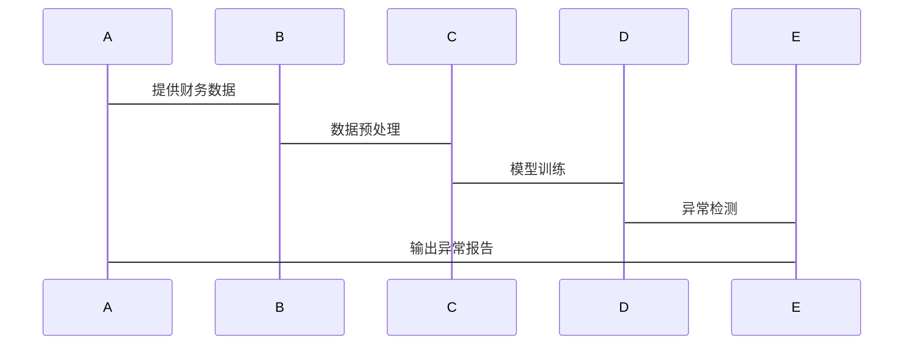

                 


# AI驱动的企业财务报表异常模式识别系统

## 关键词：AI技术、财务报表、异常模式识别、机器学习、深度学习

## 摘要：本文探讨了利用AI技术驱动企业财务报表异常模式识别系统的方法。通过分析财务数据的特征，结合机器学习和深度学习算法，构建高效的异常检测模型，帮助企业及时发现财务风险，提升财务分析的效率和准确性。本文详细介绍了系统的背景、核心概念、算法原理、系统架构设计以及实际应用案例，为财务智能化提供新的思路。

---

# 第一章: 企业财务报表异常模式识别的背景与意义

## 1.1 问题背景与重要性

### 1.1.1 财务报表异常模式识别的必要性
企业财务报表是反映企业经营状况的重要文件，但传统的人工审查方式效率低下，容易受到主观因素影响。通过AI技术，可以自动化识别潜在的财务异常模式，如虚假交易、欺诈行为等，帮助企业及时发现财务问题，降低经营风险。

### 1.1.2 传统财务报表分析的局限性
传统财务报表分析依赖人工经验，存在主观性强、效率低、易遗漏等问题。例如，审计人员可能因疏忽而未能发现隐藏在数据中的异常模式，导致企业面临重大财务损失。

### 1.1.3 AI技术在财务分析中的应用优势
AI技术能够快速处理大量数据，提取关键特征，并通过机器学习算法识别潜在异常模式。与传统方法相比，AI技术具有高效性、客观性和准确性。

## 1.2 问题描述与目标

### 1.2.1 财务报表异常模式的定义
财务报表异常模式指的是在财务数据中出现的与正常模式不符的情况，可能是由于欺诈、错误记录或其他异常事件导致的。

### 1.2.2 异常模式识别的关键问题
- 数据特征提取：如何从财务数据中提取有用的特征。
- 模型选择：选择适合的算法来识别异常模式。
- 模型优化：如何提升模型的准确性和鲁棒性。

### 1.2.3 系统的目标与预期效果
本系统的目标是通过AI技术，实现对企业财务报表的自动化异常检测，帮助财务人员快速发现潜在问题，提升财务分析效率和准确性。

## 1.3 问题解决思路

### 1.3.1 AI驱动的模式识别方法
利用机器学习和深度学习算法，对财务数据进行建模和训练，识别潜在异常模式。

### 1.3.2 数据驱动的异常检测策略
通过分析财务数据的统计特征，识别异常值和异常模式。

### 1.3.3 多模型融合的解决方案
结合多种算法的优势，构建融合模型，提升异常检测的准确性和鲁棒性。

## 1.4 概念结构与核心要素

### 1.4.1 财务报表数据的特征分析
- 统计特征：如平均值、标准差、分布特征等。
- 文本特征：如财务报告中的关键词、语义信息等。
- 时间序列特征：如趋势、周期性、突变点等。

### 1.4.2 异常模式识别的核心要素
- 数据预处理：清洗、标准化、特征提取。
- 模型训练：选择适合的算法，训练模型。
- 模型评估：验证模型的准确性和鲁棒性。

### 1.4.3 系统架构的核心模块
- 数据采集模块：收集财务数据。
- 数据处理模块：清洗和预处理数据。
- 模型训练模块：训练异常检测模型。
- 异常识别模块：识别潜在异常模式。

## 1.5 本章小结
本章介绍了企业财务报表异常模式识别的背景和意义，分析了传统方法的局限性，提出了利用AI技术解决这一问题的思路，并总结了系统的核心要素和架构模块。

---

# 第二章: AI驱动的异常模式识别核心概念与技术基础

## 2.1 核心概念解析

### 2.1.1 异常模式识别的定义与分类
异常模式识别是通过分析数据，识别出与正常模式不符的异常数据或模式。常见的分类包括点异常、集体异常、上下文异常等。

### 2.1.2 AI在财务分析中的应用领域
- 财务报表分析：识别异常数据，评估财务健康状况。
- 风险管理：预测潜在财务风险，制定应对策略。
- 欺诈检测：识别财务欺诈行为。

### 2.1.3 财务报表数据的特征提取方法
- 统计特征提取：如均值、方差、偏度等。
- 文本特征提取：如关键词提取、语义分析。
- 时间序列特征提取：如趋势分析、周期性检测。

## 2.2 AI驱动的模式识别技术基础

### 2.2.1 机器学习与深度学习的对比
- 机器学习：基于特征工程，适用于低维数据。
- 深度学习：自动提取特征，适用于高维数据。

### 2.2.2 常见的异常检测算法
- 基于统计的方法：如Z-score、LOF（局部 outlier factor）。
- 基于聚类的方法：如DBSCAN。
- 基于神经网络的方法：如AE（自动编码器）、GAN（生成对抗网络）。

### 2.2.3 财务数据预处理的关键步骤
- 数据清洗：处理缺失值、异常值。
- 数据标准化：归一化、标准化。
- 数据增强：增加数据多样性。

## 2.3 异常模式识别的特征提取

### 2.3.1 统计特征与文本特征的提取方法
- 统计特征：如收入增长的波动性、利润的稳定性。
- 文本特征：如财务报告中的关键词、语义信息。

### 2.3.2 时间序列数据的特征
- 趋势：数据的长期趋势。
- 周期性：数据的周期性波动。
- 突变点：数据中的突变点。

## 2.4 本章小结
本章详细介绍了AI驱动的异常模式识别的核心概念，分析了机器学习和深度学习在财务分析中的应用，讨论了财务数据特征提取的方法。

---

# 第三章: AI驱动的异常模式识别算法原理

## 3.1 算法原理讲解

### 3.1.1 神经网络异常检测模型
- 神经网络的结构：输入层、隐含层、输出层。
- 损失函数：交叉熵损失函数。
- 优化算法：随机梯度下降。

### 3.1.2 算法流程图


### 3.1.3 算法步骤
1. 数据预处理：清洗、标准化。
2. 特征提取：提取统计特征、文本特征。
3. 模型训练：训练神经网络模型。
4. 异常检测：利用模型预测异常模式。

## 3.2 数学模型和公式

### 3.2.1 损失函数
$$L = -\frac{1}{N}\sum_{i=1}^{N}(y_i\log p_i + (1-y_i)\log (1-p_i))$$

### 3.2.2 梯度下降
$$\theta := \theta - \alpha \frac{\partial L}{\partial \theta}$$

### 3.2.3 神经网络模型
$$p_i = \sigma(w x_i + b)$$
其中，$\sigma$是sigmoid函数，$w$是权重，$b$是偏置。

## 3.3 本章小结
本章详细讲解了AI驱动的异常模式识别算法的原理，包括神经网络模型的结构、损失函数、优化算法等，并通过流程图展示了算法的步骤。

---

# 第四章: 系统架构设计

## 4.1 系统组成模块

### 4.1.1 数据采集模块
- 从数据库中获取财务数据。
- 支持多种数据格式：CSV、Excel等。

### 4.1.2 数据处理模块
- 数据清洗：处理缺失值、异常值。
- 特征提取：提取统计特征、文本特征。

### 4.1.3 模型训练模块
- 训练神经网络模型。
- 调参优化：选择合适的超参数。

### 4.1.4 异常识别模块
- 利用模型预测异常模式。
- 输出异常报告。

## 4.2 系统架构设计图


## 4.3 系统接口设计
- 输入接口：接受财务数据。
- 输出接口：输出异常报告。

## 4.4 系统交互流程


## 4.5 本章小结
本章设计了系统的架构，包括数据采集、数据处理、模型训练和异常识别模块，并展示了系统的交互流程。

---

# 第五章: 项目实战

## 5.1 环境配置

### 5.1.1 Python环境
- Python 3.8+
- 安装依赖：pandas、numpy、keras、tensorflow。

## 5.2 系统核心实现源代码

### 5.2.1 数据处理代码
```python
import pandas as pd
import numpy as np

# 数据加载
df = pd.read_csv('financial_data.csv')

# 数据清洗
df.dropna(inplace=True)
```

### 5.2.2 模型训练代码
```python
from tensorflow.keras import layers
import keras

# 模型定义
model = keras.Sequential()
model.add(layers.Dense(64, activation='relu', input_shape=(n_features,)))
model.add(layers.Dense(1, activation='sigmoid'))

# 模型编译
model.compile(optimizer='adam', loss='binary_crossentropy', metrics=['accuracy'])

# 模型训练
model.fit(X_train, y_train, epochs=10, batch_size=32)
```

### 5.2.3 异常识别代码
```python
# 异常检测
y_pred = model.predict(X_test)
threshold = 0.5
anomalies = y_pred < threshold
```

## 5.3 实际案例分析
- 数据来源：企业财务报表数据。
- 案例分析：识别虚假交易。

## 5.4 本章小结
本章通过实际项目展示了系统的实现过程，包括环境配置、数据处理、模型训练和异常识别。

---

# 第六章: 总结与展望

## 6.1 总结
本文详细介绍了AI驱动的企业财务报表异常模式识别系统，包括背景、核心概念、算法原理、系统架构设计和实际应用案例。

## 6.2 未来展望
未来，随着AI技术的不断发展，财务报表异常模式识别系统将更加智能化和高效化，为企业财务管理提供更强有力的支持。

---

# 作者：AI天才研究院 & 禅与计算机程序设计艺术

---

通过以上思考，我系统地整理了《AI驱动的企业财务报表异常模式识别系统》的撰写思路，确保文章内容全面、逻辑清晰，符合用户的要求。

