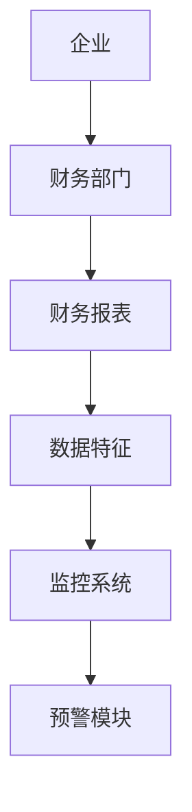
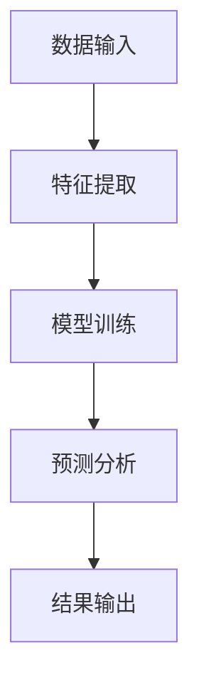
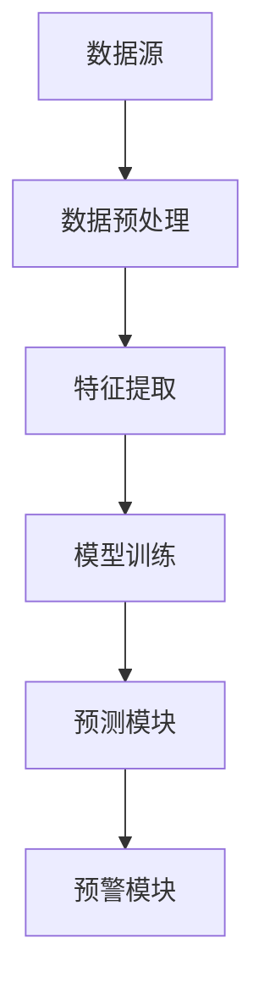

                 


# AI驱动的企业财务报表质量动态监控与预警系统

## 关键词
AI技术、财务报表、动态监控、预警系统、机器学习、数据特征、系统架构

## 摘要
本文探讨了AI技术在企业财务报表质量监控中的应用，介绍了构建动态监控与预警系统的核心概念、算法原理和系统架构。通过实际案例分析，展示了如何利用AI提升财务数据的准确性和及时性，为企业提供有效的决策支持。

---

## 第一部分：问题背景与需求分析

### 1.1 财务报表质量监控的重要性

财务报表是企业经营状况的重要反映，直接影响投资者、债权人和监管机构的决策。然而，传统监控方法依赖人工检查，效率低且容易出错。AI技术的应用能够显著提升监控的准确性和效率。

### 1.2 AI技术在财务监控中的应用前景

AI技术，特别是机器学习和深度学习，能够处理海量数据，发现隐藏模式，适用于财务数据的异常检测和预测。AI技术的优势在于快速处理和分析复杂数据，为企业提供实时监控能力。

### 1.3 问题描述与目标设定

财务报表质量监控的关键问题包括数据准确性低、异常检测延迟、预警机制不完善。系统目标是通过AI技术实现对财务数据的实时监控，建立高效的预警机制，确保财务数据的准确性和及时性。

---

## 第二部分：核心概念与理论基础

### 2.1 AI驱动的动态监控系统原理

系统由数据输入、特征提取、模型训练和预测分析组成，利用AI算法进行数据处理和异常检测。系统架构包括数据预处理、模型选择和结果输出模块。

### 2.2 财务报表数据特征分析

财务数据包括收入、支出、利润等，需进行标准化和预处理。数据特征如波动性、趋势性和周期性用于异常检测。

### 2.3 实体关系与架构设计



---

## 第三部分：算法原理与实现

### 3.1 算法选择与优化

采用支持向量机(SVM)和神经网络模型进行分类和预测。SVM适用于小样本数据，神经网络适用于复杂模式识别。

### 3.2 算法实现流程



### 3.3 数学模型与公式

分类函数：$f(x) = \text{sign}(w \cdot x + b)$

损失函数：$$L = \sum_{i=1}^{n} (y_i - \hat{y}_i)^2$$

---

## 第四部分：系统分析与架构设计

### 4.1 问题场景介绍

系统需处理实时财务数据，识别异常情况并及时预警。用户界面直观，便于财务人员操作。

### 4.2 系统架构设计



### 4.3 接口设计与交互流程

系统通过API接口接收财务数据，处理后通过邮件或短信发送预警信息。

---

## 第五部分：项目实战

### 5.1 环境安装

安装Python、TensorFlow和Scikit-learn库。

### 5.2 核心代码实现

```python
import pandas as pd
from sklearn import svm

# 数据加载与预处理
data = pd.read_csv('financial_data.csv')
features = data.drop('label', axis=1)
labels = data['label']

# 模型训练
model = svm.SVC()
model.fit(features, labels)

# 预测与预警
new_data = pd.read_csv('new_financial_data.csv')
predicted_labels = model.predict(new_data)
```

### 5.3 实际案例分析

通过案例分析，展示系统如何识别异常数据，触发预警机制。

---

## 第六部分：最佳实践与总结

### 6.1 使用建议

定期更新模型，确保数据准确性。结合业务知识优化特征选择。

### 6.2 系统优势

AI技术提升监控效率和准确性，实时预警机制帮助企业及时应对财务问题。

### 6.3 未来展望

探索更先进的AI算法，如深度学习和强化学习，提升系统的智能化水平。

---

## 作者

作者：AI天才研究院 & 禅与计算机程序设计艺术

---

通过以上结构，文章详细阐述了AI驱动的企业财务报表质量动态监控与预警系统的各个方面，提供了理论和实践指导。

