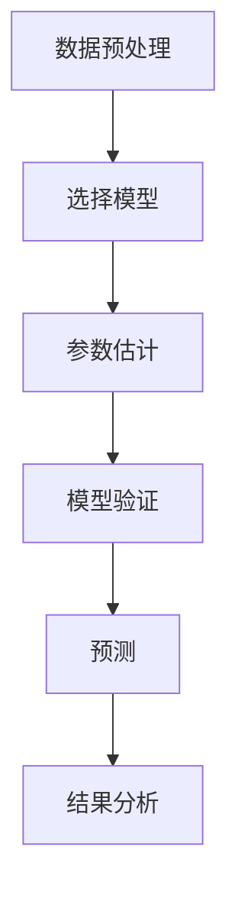
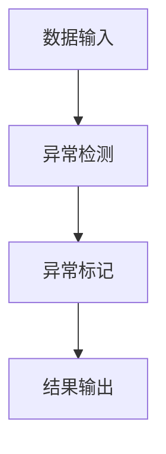
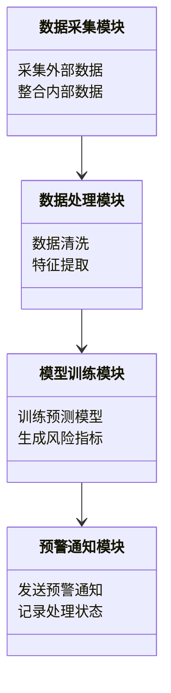

                 


# AI驱动的企业资金流动性风险管理系统

> 关键词：AI驱动，企业资金流动性风险，风险管理，机器学习，大数据分析

> 摘要：本文探讨了如何利用人工智能技术构建企业资金流动性风险管理系统。通过分析资金流动数据，运用机器学习算法进行风险预测和预警，帮助企业实现智能化的财务管理。文章详细介绍了系统的架构设计、算法原理、项目实战以及最佳实践，为企业的资金风险管理提供了新的思路和解决方案。

---

## 第一部分: 背景介绍

### 第1章: 背景介绍

#### 1.1 问题背景

企业资金流动性风险是指企业在一定时期内无法及时获得足够资金来偿还债务或满足业务需求的风险。随着全球经济的不确定性和市场竞争的加剧，企业面临的风险日益复杂。传统的资金流动性风险管理方法主要依赖于人工分析和静态模型，存在效率低、精度差的问题。引入AI技术，特别是机器学习和大数据分析，可以帮助企业更精准地预测资金流动情况，识别潜在风险，并制定应对策略。

#### 1.2 问题描述

企业资金流动性风险的主要来源包括市场需求波动、供应链中断、融资环境变化等因素。传统方法通常基于历史数据和经验判断，难以及时捕捉复杂市场环境中的细微变化。此外，企业内部数据分散在不同部门，缺乏统一的数据源和分析工具，导致风险识别和预警能力有限。

#### 1.3 问题解决思路

AI驱动的资金流动性风险管理系统通过整合企业内外部数据，利用机器学习算法进行实时分析和预测，提供智能化的决策支持。系统可以自动识别潜在风险，生成预警信号，并提出应对策略，帮助企业在资金链断裂前采取有效措施。

#### 1.4 系统的边界与外延

系统的功能边界包括数据采集、风险评估、预警通知和决策支持。适用范围涵盖企业内部资金管理、供应链金融、融资决策等领域。系统与其他企业管理系统的接口主要集中在数据共享和决策支持方面。

---

## 第二部分: 核心概念与联系

### 第2章: 核心概念与联系

#### 2.1 核心概念原理

资金流动性风险管理涉及多个关键概念，包括现金流预测、风险指标计算、预警机制等。机器学习算法（如时间序列分析和异常检测）是实现这些功能的核心工具。

#### 2.2 概念属性特征对比

以下是传统方法与AI驱动方法在资金流动性风险管理中的对比：

| **属性**         | **传统方法**                   | **AI驱动方法**                  |
|------------------|-------------------------------|-------------------------------|
| 数据处理          | 手动收集和分析                 | 自动化数据采集和清洗             |
| 预测准确性        | 依赖经验判断                   | 基于历史数据的模型预测           |
| 实时性            | 低                           | 高                           |
| 可扩展性          | 有限                         | 强大                         |

#### 2.3 ER实体关系图

以下是系统的核心实体关系图：

```mermaid
er
    %%{init: 'Entity'}%%
    entity 资金流动数据 {
        id: int
        交易日期: date
        资金流入: float
        资金流出: float
        余额: float
        交易类型: string
    }

    entity 风险指标 {
        id: int
        风险等级: int
        预测现金流: float
        异常交易标记: boolean
        生成时间: datetime
    }

    entity 预警通知 {
        id: int
        通知类型: string
        通知时间: datetime
        处理状态: string
        关联风险指标: int
    }
```

---

## 第三部分: 算法原理讲解

### 第3章: 算法原理讲解

#### 3.1 时间序列分析模型

时间序列分析是预测资金流动的重要工具。以下是ARIMA模型的工作流程：



以下是ARIMA模型的数学公式：

$$ ARIMA(p, d, q) = (1 - B)^d \cdot \frac{1}{(1 - B)^p} \cdot \frac{1}{(1 - θ B^q)} $$

其中，$p$ 是自回归阶数，$d$ 是差分阶数，$q$ 是移动平均阶数。

#### 3.2 异常检测算法

Isolation Forest算法适用于检测异常交易：



以下是Isolation Forest的核心思想：通过构建随机树，将数据点隔离到叶子节点，判断是否为异常点。

---

## 第四部分: 系统分析与架构设计方案

### 第4章: 系统分析与架构设计方案

#### 4.1 系统功能设计

以下是系统功能模块的类图：



#### 4.2 系统架构设计

以下是系统的分层架构图：

```mermaid
archi
    分层架构 {
        外部数据源 --> 数据采集层 --> 数据处理层 --> 模型训练层 --> 预警通知层
    }
```

---

## 第五部分: 项目实战

### 第5章: 项目实战

#### 5.1 环境安装

安装必要的Python库：

```bash
pip install pandas numpy scikit-learn
```

#### 5.2 核心代码实现

以下是时间序列预测的代码示例：

```python
from sklearn.preprocessing import MinMaxScaler
from keras.models import Sequential
from keras.layers import LSTM, Dense

# 数据预处理
data = ...  # 输入数据
scaler = MinMaxScaler()
data_scaled = scaler.fit_transform(data)

# 模型训练
model = Sequential()
model.add(LSTM(128, input_shape=(timesteps, features)))
model.add(Dense(1))
model.compile(optimizer='adam', loss='mean_squared_error')

model.fit(X_train, y_train, epochs=100, batch_size=32)
```

#### 5.3 案例分析

通过实际案例分析，展示系统如何预测资金流动风险并生成预警通知。

---

## 第六部分: 最佳实践

### 第6章: 最佳实践

#### 6.1 小结

AI驱动的资金流动性风险管理系统通过实时数据分析和智能预测，显著提高了风险管理的效率和准确性。

#### 6.2 注意事项

- 数据隐私保护
- 模型的可解释性
- 系统的可扩展性

#### 6.3 拓展阅读

建议阅读相关领域的最新研究成果，如《时间序列分析与机器学习》。

---

## 结语

AI驱动的资金流动性风险管理系统结合了大数据分析和机器学习技术，为企业提供了智能化的财务管理工具。通过实时监控和智能预测，企业可以更好地应对资金流动风险，确保业务的稳定运行。

---

**作者：AI天才研究院 & 禅与计算机程序设计艺术**

