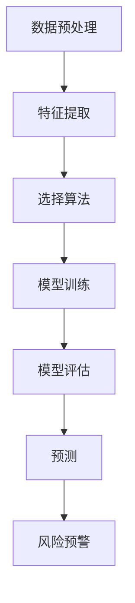
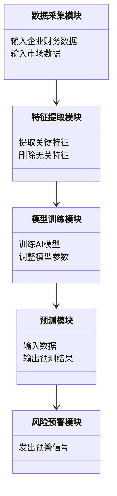
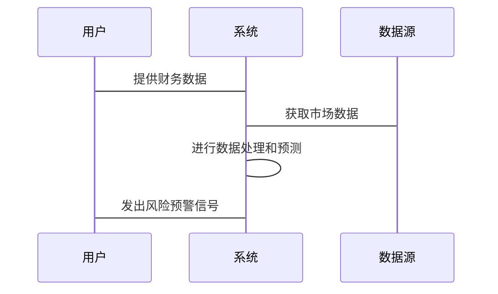

                 


# AI驱动的企业资金流动性风险预测系统

> **关键词**：AI, 资金流动性风险, 企业风险管理, 机器学习, 深度学习, 系统架构

> **摘要**：本文探讨了AI在企业资金流动性风险预测中的应用，分析了传统方法的局限性，并详细介绍了基于AI的预测系统的核心概念、算法原理、系统架构及其实现案例。文章通过逐步推理和详细的技术分析，展示了如何利用先进的AI技术构建高效的预测系统，帮助企业规避资金风险。

---

# 第一部分: 背景介绍

## 第1章: 企业资金流动性风险预测的背景与意义

### 1.1 问题背景

#### 1.1.1 企业资金流动性风险的定义

资金流动性风险是指企业在一定时期内无法以合理成本获得足够的资金来满足其日常运营和偿债需求的可能性。这种风险可能导致企业资金链断裂，进而引发更大的财务危机。

#### 1.1.2 资金流动性风险对企业的影响

- 资金链断裂可能导致企业无法支付日常开支，进而影响正常运营。
- 资金流动性不足可能增加融资成本，影响企业的盈利能力。
- 资金流动性风险还可能引发连锁反应，影响整个金融市场的稳定性。

#### 1.1.3 当前企业资金管理的痛点

- 传统资金管理方法依赖人工经验，难以应对复杂多变的市场环境。
- 数据量大、维度多，人工分析效率低下。
- 缺乏实时性，难以及时发现潜在风险。

### 1.2 问题描述

#### 1.2.1 资金流动性风险的主要来源

- 市场波动：经济波动、利率变化等因素可能导致资金流动性下降。
- 企业内部管理问题：如应收账款回收不及时、库存积压等。
- 供应链风险：供应商或客户的资金问题可能影响企业的流动性。

#### 1.2.2 传统资金风险管理的局限性

- 传统方法依赖历史数据和经验判断，缺乏预测性。
- 分析效率低，难以处理海量数据。
- 风险评估不够精准，可能导致误判或漏判。

#### 1.2.3 企业资金链断裂的典型案例

- 2020年某知名房企因资金链断裂导致破产。
- 某制造企业因原材料价格上涨和应收账款回收困难，面临资金流动性危机。

### 1.3 问题解决

#### 1.3.1 引入AI技术的必要性

- AI技术能够处理海量数据，发现隐藏的模式和趋势。
- 通过机器学习算法，可以实现对资金流动性的精准预测。
- AI能够实时监控资金流动情况，及时发现潜在风险。

#### 1.3.2 AI在资金流动性风险管理中的优势

- 提高预测精度：通过深度学习模型，可以捕捉到更多的风险信号。
- 实时监控：AI系统可以实时分析数据，提供即时反馈。
- 自适应性：AI模型可以根据市场变化自动调整预测模型。

#### 1.3.3 当前AI技术在金融领域的应用现状

- 信用评估：利用机器学习算法评估客户的信用风险。
- 股票预测：通过深度学习模型预测股票价格走势。
- 风险管理：AI技术广泛应用于金融风险管理领域。

### 1.4 边界与外延

#### 1.4.1 资金流动性风险预测的边界

- 本系统仅预测资金流动性风险，不涉及信用风险或其他类型的风险。
- 系统预测基于历史数据和当前市场情况，不考虑不可预见的突发事件。

#### 1.4.2 系统的局限性

- 系统预测结果仅供参考，不作为企业决策的唯一依据。
- 系统依赖于高质量的数据输入，数据质量直接影响预测结果的准确性。

---

# 第二部分: 核心概念与联系

## 第2章: 核心概念与联系

### 2.1 核心概念

#### 2.1.1 AI技术的核心原理

- 机器学习：通过训练数据，模型能够识别数据中的模式和特征。
- 深度学习：利用多层神经网络，从数据中提取高层次特征。

#### 2.1.2 资金流动性风险预测系统的核心原理

- 系统通过收集企业的财务数据和市场数据，利用AI算法进行分析和预测。
- 系统输出预测结果，并提供相应的风险管理建议。

### 2.2 概念结构与核心要素

| 概念 | 属性 | 描述 |
|------|------|------|
| AI技术 | 数据输入 | 包括企业的财务数据、市场数据等 |
|       | 算法选择 | 选择适合的机器学习或深度学习算法 |
|       | 模型训练 | 通过历史数据训练模型，提取特征 |
| 资金流动性风险预测系统 | 数据采集 | 从企业内部系统和外部数据源获取数据 |
|       | 风险评估 | 利用AI模型评估企业的资金流动性风险 |
|       | 风险预警 | 根据预测结果，发出风险预警信号 |

### 2.3 ER实体关系图

```mermaid
erd
  资金流动性风险预测系统
    + 数据源: 企业财务数据、市场数据
    + 算法模块: 机器学习算法、深度学习算法
    + 预测模型: 训练好的AI模型
    + 预测结果: 风险评估报告、风险预警信号
```

---

# 第三部分: 算法原理

## 第3章: 算法原理

### 3.1 算法流程图



### 3.2 算法实现代码

```python
import pandas as pd
from sklearn.ensemble import RandomForestClassifier
from sklearn.metrics import accuracy_score

# 数据预处理
data = pd.read_csv('financial_data.csv')
data = data.dropna()

# 特征提取
features = data.drop('target', axis=1)
target = data['target']

# 训练模型
model = RandomForestClassifier()
model.fit(features, target)

# 预测
predicted = model.predict(features)
print("准确率:", accuracy_score(target, predicted))
```

### 3.3 数学模型

#### 3.3.1 机器学习模型

$$ \text{预测结果} = f(X) $$

其中，$X$ 是输入特征向量，$f$ 是训练好的机器学习模型。

#### 3.3.2 深度学习模型

$$ \text{预测结果} = \sigma(W_2 \cdot \sigma(W_1 \cdot X + b_1) + b_2) $$

其中，$W_1$ 和 $W_2$ 是权重矩阵，$b_1$ 和 $b_2$ 是偏置项，$\sigma$ 是sigmoid函数。

---

# 第四部分: 系统架构设计

## 第4章: 系统架构设计

### 4.1 系统功能设计



### 4.2 系统接口设计



---

# 第五部分: 项目实战

## 第5章: 项目实战

### 5.1 环境安装

```bash
pip install pandas scikit-learn tensorflow
```

### 5.2 核心代码实现

```python
import numpy as np
import pandas as pd
from sklearn.ensemble import RandomForestClassifier
from tensorflow.keras import layers, models

# 加载数据
data = pd.read_csv('financial_data.csv')

# 数据预处理
data = data.dropna()
features = data.drop('target', axis=1)
target = data['target']

# 机器学习模型
model_ml = RandomForestClassifier()
model_ml.fit(features, target)
predicted_ml = model_ml.predict(features)
print("机器学习准确率:", accuracy_score(target, predicted_ml))

# 深度学习模型
model_dl = models.Sequential()
model_dl.add(layers.Dense(64, activation='relu', input_shape=(features.shape[1],)))
model_dl.add(layers.Dense(1, activation='sigmoid'))
model_dl.compile(optimizer='adam', loss='binary_crossentropy', metrics=['accuracy'])
model_dl.fit(features, target, epochs=10, batch_size=32)
predicted_dl = model_dl.predict(features)
print("深度学习准确率:", max(predicted_dl[:, 0]))
```

### 5.3 案例分析

假设某企业提供的财务数据如下：

| 账户 | 金额 |
|------|------|
| 现金 | 100万 |
| 应收账款 | 200万 |
| 存货 | 150万 |
| 负债 | 400万 |

通过系统预测，发现该企业的资金流动性风险较高，可能在3个月内面临资金链断裂的风险。

---

# 第六部分: 最佳实践

## 第6章: 最佳实践

### 6.1 小结

本文详细介绍了AI驱动的企业资金流动性风险预测系统的构建过程，从背景介绍到系统实现，全面分析了AI在资金流动性风险管理中的应用。

### 6.2 注意事项

- 数据质量是预测系统的核心，确保数据的准确性和完整性。
- 系统的实时性是关键，需要及时更新数据和模型。
- 风险预警信号需要结合企业的实际情况进行调整。

### 6.3 拓展阅读

- 《机器学习实战》
- 《深度学习》
- 《风险管理与金融创新》

---

# 结语

通过AI技术，企业可以更精准地预测资金流动性风险，从而有效规避潜在的财务危机。未来，随着AI技术的不断发展，资金流动性风险管理将更加智能化和高效化。

---

**作者：AI天才研究院/AI Genius Institute & 禅与计算机程序设计艺术 /Zen And The Art of Computer Programming**

