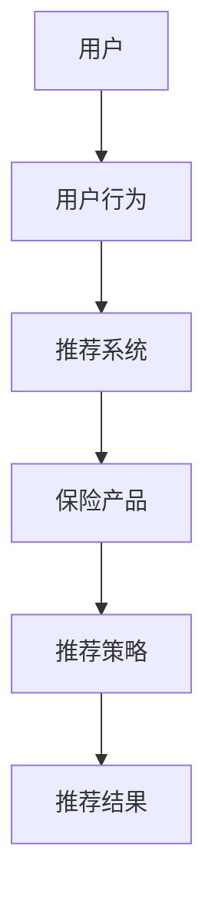

                 


# AI驱动的保险产品推荐

> 关键词：AI，保险产品推荐，推荐系统，协同过滤，深度学习，保险行业

> 摘要：本文深入探讨了AI技术在保险产品推荐领域的应用，分析了保险推荐的核心问题、算法原理和系统设计，结合实际案例展示了如何通过AI技术提升保险产品的推荐效果。

---

## 第一章：AI驱动的保险产品推荐背景

### 1.1 保险行业的数字化转型

#### 1.1.1 保险行业的现状与挑战
保险行业正面临数字化转型的浪潮，传统的保险销售模式逐渐被数据驱动的个性化推荐所取代。保险产品的种类繁多，用户需求多样化，如何高效匹配用户与保险产品成为行业的痛点。

#### 1.1.2 AI技术在保险行业的应用前景
AI技术的快速发展为保险行业带来了新的机遇。通过AI技术，保险公司可以更精准地理解用户需求，优化产品设计，提升用户体验。

#### 1.1.3 保险产品推荐的必要性与价值
保险产品推荐是保险数字化转型的重要组成部分。通过AI驱动的推荐系统，保险公司可以提高销售效率，降低用户流失率，同时为用户提供更个性化的保险方案。

---

### 1.2 保险产品推荐的核心问题

#### 1.2.1 保险产品的多样性与复杂性
保险产品种类繁多，不同产品适用于不同的用户群体。如何通过AI技术对产品进行分类和特征提取是推荐系统的关键。

#### 1.2.2 用户需求的动态变化
用户的保险需求受多种因素影响，如年龄、职业、健康状况等。推荐系统需要实时捕捉用户需求的变化，并动态调整推荐策略。

#### 1.2.3 数据的多维度与关联性
保险推荐涉及多维度数据，如用户行为、产品特征、市场环境等。如何有效整合这些数据并建立关联关系是推荐系统的核心挑战。

---

## 第二章：AI驱动的保险产品推荐算法原理

### 2.1 协同过滤算法

#### 2.1.1 基于用户的协同过滤
基于用户的协同过滤算法通过分析用户的历史行为和偏好，找到相似的用户群体，并推荐相似的产品。

#### 2.1.2 基于物品的协同过滤
基于物品的协同过滤算法通过分析产品的特征和关联性，找到与目标产品相似的保险产品进行推荐。

#### 2.1.3 深度协同过滤的改进方法
传统的协同过滤算法存在冷启动和稀疏性问题。通过引入深度学习技术，可以更精准地捕捉用户和产品的特征。

---

### 2.2 基于内容的推荐算法

#### 2.2.1 保险产品特征提取
通过对保险产品的属性进行特征提取，如保费、保障范围、保险公司声誉等，建立产品特征向量。

#### 2.2.2 用户偏好分析
通过分析用户的购买记录、浏览行为、咨询记录等，构建用户画像，提取用户偏好特征。

#### 2.2.3 基于内容的推荐模型
通过计算产品特征和用户偏好的相似度，进行个性化推荐。

---

### 2.3 基于深度学习的推荐算法

#### 2.3.1 基于神经网络的推荐模型
利用神经网络对用户行为和产品特征进行非线性建模，捕捉复杂的特征交互关系。

#### 2.3.2 基于Transformer的推荐系统
Transformer模型在自然语言处理领域的成功应用启发了其在推荐系统中的应用。通过自注意力机制，模型可以更好地捕捉用户和产品的关联性。

#### 2.3.3 图神经网络在保险推荐中的应用
通过构建用户-产品图，利用图神经网络对复杂的关联关系进行建模，提升推荐的准确性和多样性。

---

## 第三章：保险产品推荐的系统设计

### 3.1 系统架构设计



### 3.2 功能设计

#### 3.2.1 用户画像构建
通过收集用户的基本信息、行为数据和偏好数据，构建用户画像，为推荐提供基础。

#### 3.2.2 产品特征提取
对保险产品进行多维度特征提取，包括产品类型、保费、保障范围等。

#### 3.2.3 推荐算法实现
实现多种推荐算法，如协同过滤、内容推荐和深度学习模型，根据实际需求选择最优算法。

#### 3.2.4 推荐结果输出
将推荐结果以用户友好的形式呈现，如列表、评分、个性化描述等。

---

## 第四章：AI驱动的保险产品推荐实战

### 4.1 环境搭建

#### 4.1.1 安装Python和相关库
```bash
pip install numpy pandas scikit-learn tensorflow
```

#### 4.1.2 数据准备
数据包括用户信息、产品信息和用户行为数据。

### 4.2 算法实现

#### 4.2.1 协同过滤算法实现
```python
from sklearn.metrics.pairwise import cosine_similarity

def collaborative_filtering(user_data, product_data):
    # 构建用户-产品评分矩阵
    # 计算余弦相似度
    similarity = cosine_similarity(user_data)
    return similarity
```

#### 4.2.2 基于内容的推荐实现
```python
from sklearn.feature_extraction.text import TfidfVectorizer

def content_based_recommendation(products, user_profile):
    vectorizer = TfidfVectorizer()
    product_features = vectorizer.fit_transform(products)
    user_features = vectorizer.transform([user_profile])
    similarity = (user_features.T.dot(product_features)).A[0]
    return similarity
```

---

## 第五章：总结与展望

### 5.1 总结
本文详细探讨了AI技术在保险产品推荐中的应用，从算法原理到系统设计，再到实战案例，全面展示了如何利用AI技术提升保险推荐的效果。

### 5.2 未来展望
未来，随着AI技术的不断发展，保险推荐系统将更加智能化和个性化。结合区块链、边缘计算等新技术，推荐系统将更加精准和高效。

---

## 作者：AI天才研究院/AI Genius Institute & 禅与计算机程序设计艺术 /Zen And The Art of Computer Programming

---

通过本文的分析和实践，读者可以全面了解AI驱动的保险产品推荐的核心原理和实现方法，为实际应用提供理论和实践指导。

