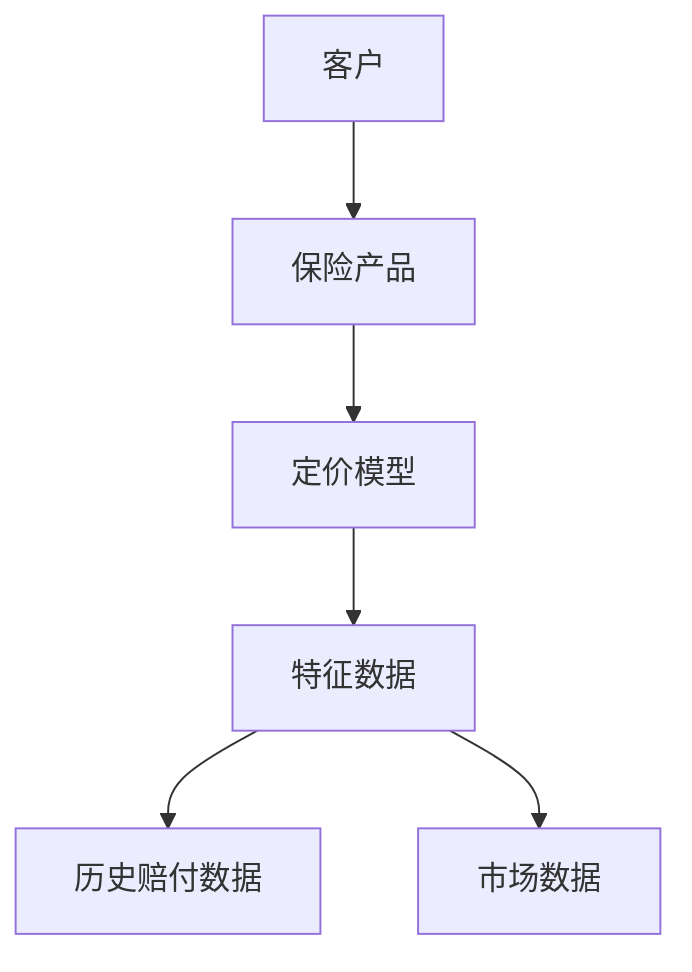
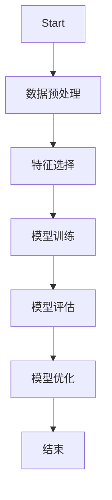
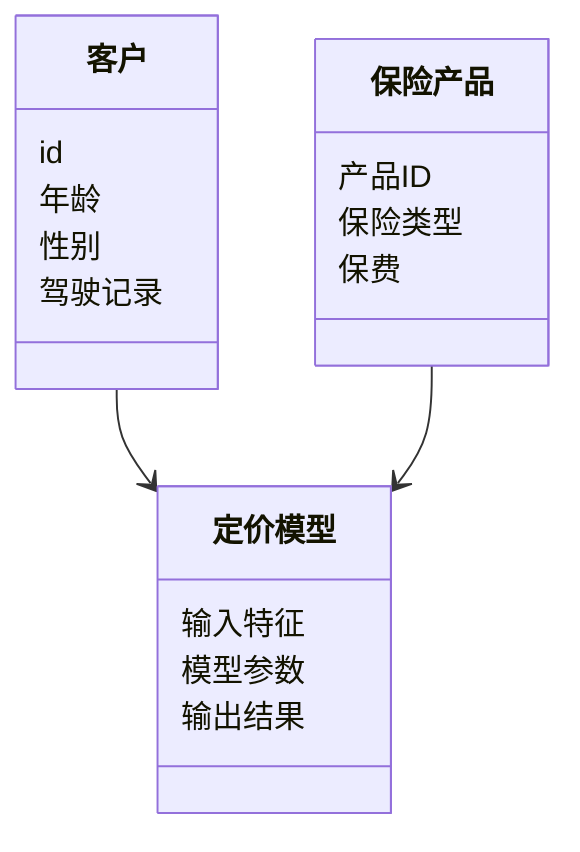

                 


# AI驱动的保险定价优化模型

**关键词**：保险定价、人工智能、机器学习、优化模型、风险管理

**摘要**：本文探讨了AI技术在保险定价中的应用，系统地介绍了AI驱动的保险定价优化模型的核心概念、算法原理、系统架构及实际应用案例。通过分析保险定价的基本概念、挑战与AI技术的结合，展示了如何利用先进的AI算法和优化模型来提升保险定价的准确性和效率，为保险行业提供了一种新的思路和方法。

---

## 第一部分: AI驱动的保险定价优化模型背景与基础

### 第1章: 保险定价概述

#### 1.1 保险定价的基本概念
##### 1.1.1 保险定价的定义与作用
保险定价是指根据保险标的的风险特征、市场环境和客户需求，确定保险产品的价格（保费）的过程。其作用在于确保保险公司能够覆盖风险成本，同时吸引客户，实现可持续发展。

##### 1.1.2 保险定价的核心要素
- **风险因素**：影响保险标的损失概率的因素，如年龄、健康状况、驾驶记录等。
- **成本结构**：包括赔付成本、运营成本和税费等。
- **市场因素**：市场竞争状况、客户需求和行业监管政策。

##### 1.1.3 保险定价的常见方法
- **经验定价法**：基于历史数据和经验，制定保费。
- **精算定价法**：通过精算模型，考虑风险、成本和利润等因素，制定保费。
- **市场导向定价法**：根据市场需求和竞争对手的定价策略，制定保费。

#### 1.2 保险定价的挑战与问题
##### 1.2.1 传统保险定价的局限性
- 数据不足：传统定价方法依赖有限的历史数据，难以捕捉复杂的风险因素。
- 模型复杂性：精算模型需要大量假设，难以准确反映动态变化的市场环境。
- 个性化不足：传统定价方法难以满足客户的个性化需求。

##### 1.2.2 数据不足与模型复杂性问题
- 数据质量：传统保险定价依赖少量结构化数据，缺乏实时、多维度的数据支持。
- 模型局限性：传统模型假设固定，难以适应市场变化和客户行为的多样性。

##### 1.2.3 市场变化与个性化需求的挑战
- 市场竞争加剧：保险公司需要快速响应市场变化，提供更具竞争力的定价策略。
- 客户需求多样化：客户对个性化、精准化的定价需求日益增加。

#### 1.3 AI技术在保险定价中的应用前景
##### 1.3.1 AI技术的基本概念与优势
AI（人工智能）技术通过机器学习、自然语言处理和计算机视觉等技术，能够从大量数据中提取特征、发现规律，并提供决策支持。

##### 1.3.2 AI在保险定价中的潜在应用场景
- 数据清洗与特征提取：利用AI技术处理非结构化数据，提取有价值的信息。
- 风险评估与预测：通过机器学习模型预测保险标的的损失概率和赔付金额。
- 个性化定价：基于客户行为和市场数据，制定个性化保费。

##### 1.3.3 AI驱动保险定价的未来发展趋势
- 数据驱动的精准定价：通过AI技术，实现基于实时数据的动态定价。
- 自适应模型：模型能够根据市场变化和客户反馈，自动调整定价策略。
- 多维度数据融合：结合结构化、半结构化和非结构化数据，提升定价的准确性。

---

### 第2章: AI驱动的保险定价优化模型核心概念

#### 2.1 定价优化模型的定义与特点
##### 2.1.1 定价优化模型的定义
AI驱动的保险定价优化模型是一种基于机器学习算法的定价模型，旨在通过数据驱动的方式，优化保险产品的定价策略。

##### 2.1.2 定价优化模型的核心特点
- 数据驱动：基于大量数据，发现隐藏的规律。
- 实时性：能够根据实时数据动态调整定价策略。
- 可解释性：模型的决策过程可以被理解和解释。

##### 2.1.3 定价优化模型与传统定价模型的对比
| 对比维度 | 传统定价模型 | AI驱动定价优化模型 |
|----------|--------------|----------------------|
| 数据依赖 | 依赖历史数据 | 依赖实时数据和多维度数据 |
| 模型复杂性 | 假设固定，复杂性低 | 模型复杂，高度灵活 |
| 个性化能力 | 个性化能力有限 | 强大的个性化定价能力 |

#### 2.2 AI驱动定价优化模型的关键要素
##### 2.2.1 数据来源与特征分析
- 数据来源：包括客户数据、市场数据、历史赔付数据等。
- 特征分析：通过特征工程，提取关键特征，如客户年龄、驾驶记录、地理位置等。

##### 2.2.2 模型算法的选择与优化
- 算法选择：根据数据类型和业务需求，选择合适的算法，如随机森林、梯度提升树等。
- 模型优化：通过交叉验证和超参数调优，提升模型的性能。

##### 2.2.3 模型评估与优化指标
- 评估指标：包括均方误差（MSE）、R平方值（R²）、准确率等。
- 优化指标：通过优化目标函数，提升模型的预测准确性和稳定性。

#### 2.3 AI驱动定价优化模型的实体关系图


---

## 第二部分: AI驱动的保险定价优化模型的算法原理

### 第3章: 常用算法概述

#### 3.1 线性回归
##### 3.1.1 线性回归的基本公式
$$y = \beta_0 + \beta_1x_1 + \beta_2x_2 + ... + \beta_nx_n + \epsilon$$

##### 3.1.2 梯度下降算法
$$\beta_j := \beta_j - \alpha \frac{\partial}{\partial \beta_j}J(\beta)$$

#### 3.2 随机森林
##### 3.2.1 随机森林的数学表达
$$f(x) = \frac{1}{n} \sum_{i=1}^{n} h_i(x)$$

#### 3.3 梯度提升树
##### 3.3.1 梯度提升树的基本原理
梯度提升树是一种基于树的集成方法，通过不断优化损失函数，提升模型的预测能力。

---

### 第4章: 神经网络在定价模型中的应用

#### 4.1 神经网络的基本原理
##### 4.1.1 神经网络的结构
- 输入层：接收输入数据。
- 隐藏层：进行特征提取和非线性变换。
- 输出层：生成最终的预测结果。

#### 4.2 深度学习模型在保险定价中的应用
##### 4.2.1 卷积神经网络（CNN）
- 应用于图像识别和非结构化数据处理。

##### 4.2.2 循环神经网络（RNN）
- 应用于时间序列数据和客户行为分析。

#### 4.3 基于神经网络的定价优化模型
##### 4.3.1 神经网络模型的数学表达
$$y = f(x; \theta)$$
其中，$f$ 是神经网络的模型，$\theta$ 是模型参数。

##### 4.3.2 模型训练流程


---

## 第三部分: AI驱动的保险定价优化模型的系统分析与架构设计

### 第5章: 系统功能设计

#### 5.1 领域模型设计


#### 5.2 系统架构设计
##### 5.2.1 分层架构
- 数据层：存储原始数据和特征数据。
- 服务层：提供数据处理和模型调用的服务。
- 表示层：展示结果和用户界面。

##### 5.2.2 微服务架构
- 数据服务：负责数据的存储和管理。
- 模型服务：负责模型的训练和预测。
- API网关：负责请求路由和鉴权。

#### 5.3 系统交互设计
##### 5.3.1 客户请求流程
```mermaid
sequenceDiagram
    客户 -> API网关: 发起定价请求
    API网关 -> 数据服务: 获取客户数据
    数据服务 -> 模型服务: 调用定价模型
    模型服务 -> 返回结果
    API网关 -> 客户: 返回定价结果
```

---

## 第四部分: 项目实战

### 第6章: 环境安装与代码实现

#### 6.1 环境安装
- 安装Python和必要的库（如NumPy、Pandas、Scikit-learn、XGBoost等）。
- 安装Jupyter Notebook用于实验和展示。

#### 6.2 核心代码实现
##### 6.2.1 数据预处理
```python
import pandas as pd
import numpy as np

# 加载数据
data = pd.read_csv('insurance_data.csv')

# 数据清洗
data.dropna(inplace=True)
data = pd.get_dummies(data)
```

##### 6.2.2 模型训练
```python
from sklearn.ensemble import GradientBoostingRegressor
from sklearn.model_selection import train_test_split

# 划分训练集和测试集
X_train, X_test, y_train, y_test = train_test_split(data.drop('premium', axis=1), data['premium'], test_size=0.2, random_state=42)

# 训练模型
model = GradientBoostingRegressor(n_estimators=100, learning_rate=0.1, max_depth=3, random_state=42)
model.fit(X_train, y_train)

# 预测结果
y_pred = model.predict(X_test)
```

#### 6.3 案例分析
##### 6.3.1 案例背景
某保险公司希望利用AI技术优化车险定价策略。

##### 6.3.2 数据分析与特征提取
- 数据来源：车险历史赔付数据、客户信息、驾驶记录等。
- 特征提取：提取关键特征，如驾驶年龄、违章记录、车辆类型等。

##### 6.3.3 模型训练与评估
- 训练模型：使用梯度提升树模型。
- 模型评估：计算均方误差（MSE）和R平方值（R²）。

#### 6.4 项目小结
通过项目实战，我们验证了AI驱动定价优化模型的有效性，展示了如何通过数据驱动的方式优化保险定价策略。

---

## 第五部分: 总结与展望

### 第7章: 总结与展望

#### 7.1 总结
本文系统地介绍了AI驱动的保险定价优化模型的核心概念、算法原理、系统架构和实际应用案例。通过分析保险定价的基本概念、挑战与AI技术的结合，展示了如何利用先进的AI算法和优化模型来提升保险定价的准确性和效率。

#### 7.2 未来展望
- 技术发展：随着AI技术的不断进步，保险定价优化模型将更加精准和动态。
- 数据融合：多维度数据的融合将进一步提升定价的准确性和个性化。
- 伦理与合规：AI技术的应用需要符合伦理和法律规范，确保公平性和透明性。

---

## 作者：AI天才研究院/AI Genius Institute & 禅与计算机程序设计艺术 /Zen And The Art of Computer Programming

