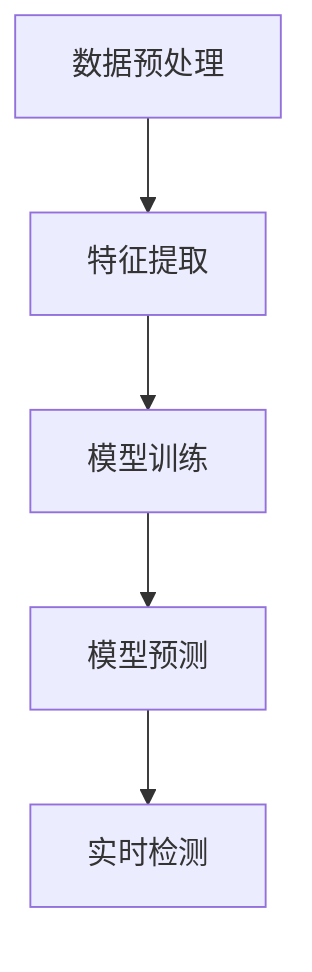
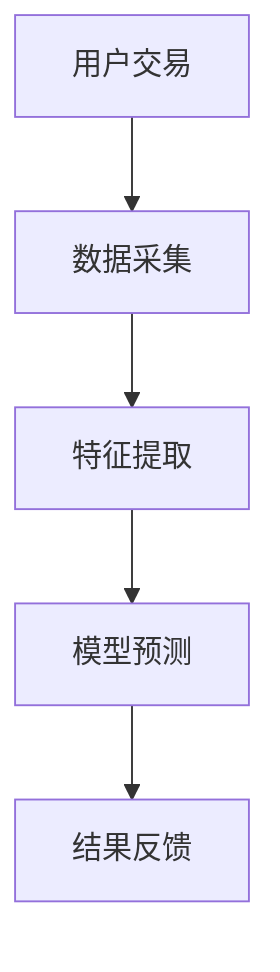

                 


# AI驱动的信用卡异常交易实时检测

## 关键词：AI、信用卡、异常交易、实时检测、机器学习、深度学习

## 摘要：本文系统地探讨了利用人工智能技术实现信用卡异常交易的实时检测。通过分析问题背景、核心概念、算法原理、数学模型、系统架构、项目实战及总结，详细阐述了AI在金融安全中的应用，为实际业务提供了理论支持和实践指导。

## 第一部分：背景介绍

### 第1章：信用卡异常交易检测概述

#### 1.1 问题背景

在当今数字化支付时代，信用卡交易频繁，欺诈手段多样且隐蔽。传统基于规则的检测方法难以应对复杂多变的欺诈模式，亟需引入AI技术提升检测效率和准确性。

#### 1.2 问题描述

- **定义与分类**：异常交易指违背正常交易模式的交易，可分为授权前欺诈、账户盗用等类型。
- **实时性需求**：需在交易发生时立即检测，避免资金损失。
- **技术难点**：数据量大、欺诈模式多样、交易实时性要求高等。

#### 1.3 问题解决

- **AI技术优势**：通过机器学习捕捉复杂模式，实时反馈检测结果。
- **常用方法**：包括基于规则的过滤、统计分析、机器学习和深度学习。

#### 1.4 边界与外延

- **系统边界**：限定于信用卡交易，涵盖线上和线下场景。
- **数据范围**：交易金额、时间、地点等特征。
- **外部依赖**：依赖交易数据和用户行为数据。

#### 1.5 概念结构与核心要素

- **层次结构**：从交易数据到特征提取，再到模型预测。
- **核心要素**：交易数据、模型、实时反馈。
- **关系图**：交易数据输入模型，输出检测结果。

## 第二部分：核心概念与联系

### 第2章：核心概念原理

#### 2.1 异常交易检测的基本原理

- **基于统计的方法**：使用概率模型识别异常值。
- **基于机器学习的方法**：监督学习分类欺诈交易。
- **基于深度学习的方法**：使用神经网络捕捉复杂模式。

#### 2.2 AI模型的工作机制

- **数据预处理**：清洗、标准化、特征工程。
- **模型训练**：选择合适算法，调整参数。
- **实时检测**：部署模型，实时预测。

#### 2.3 核心概念的联系

- **数据流与模型关系**：数据驱动模型，模型处理数据。
- **特征工程影响**：特征选择影响检测效果。
- **模型与需求匹配**：模型选择需结合业务需求。

## 第三部分：算法原理讲解

### 第3章：异常检测算法

#### 3.1 常见算法概述

- **Isolation Forest**：通过随机选择特征构建决策树，隔离异常点。
- **One-Class SVM**：学习正常数据的分布，识别异常点。
- **Autoencoder**：通过自编码器重构数据，异常点重构误差大。

#### 3.2 算法流程图



#### 3.3 Python实现示例

```python
from sklearn.ensemble import IsolationForest
import numpy as np

# 示例数据
X = np.random.randn(100, 5)
# 模型训练
model = IsolationForest(n_estimators=100)
model.fit(X)
# 预测
y_pred = model.predict(X)
# 输出结果
print(y_pred)
```

## 第四部分：数学模型

### 第4章：数学模型

#### 4.1 模型概述

- 异常检测的数学模型通常涉及概率密度估计或距离度量。

#### 4.2 具体模型

- **高斯混合模型（GMM）**：用于概率密度估计，计算数据点的异常概率。
- **K近邻（KNN）**：基于局部密度估计异常点。

#### 4.3 公式推导

- **高斯分布的概率密度函数**：
  $$ f(x) = \frac{1}{\sqrt{2\pi\sigma^2}} e^{-\frac{(x-\mu)^2}{2\sigma^2}} $$
- **马氏距离**：
  $$ d(x, y) = (x - y)^T C^{-1} (x - y) $$
  其中，C为协方差矩阵。

#### 4.4 举例说明

- **欺诈概率计算**：
  使用GMM模型，计算每个交易的异常概率，若概率低于阈值，则标记为异常。

## 第五部分：系统分析与架构设计

### 第5章：系统架构设计

#### 5.1 问题场景介绍

- 需要一个实时系统，处理每笔信用卡交易，判断是否异常。

#### 5.2 项目介绍

- 开发一个实时检测系统，部署在银行后台，处理交易数据。

#### 5.3 系统功能设计

- **领域模型类图**：
  ```mermaid
  classDiagram
      class 交易数据 {
          时间戳
          卡号
          交易金额
      }
      class 特征工程 {
          提取特征
          数据预处理
      }
      class 模型训练 {
          训练数据
          模型参数
      }
      class 实时检测 {
          输入交易
          输出结果
      }
      交易数据 --> 特征工程
      特征工程 --> 模型训练
      模型训练 --> 实时检测
  ```

#### 5.4 系统架构设计

- **系统架构图**：
  ```mermaid
  graph TD
      A[交易发生] --> B[数据采集]
      B --> C[特征提取]
      C --> D[模型预测]
      D --> E[结果反馈]
  ```

#### 5.5 接口设计

- **输入接口**：接收交易数据。
- **输出接口**：返回检测结果。

#### 5.6 交互流程图



## 第六部分：项目实战

### 第6章：项目实战

#### 6.1 环境安装

- 安装Python和相关库：
  ```bash
  pip install numpy scikit-learn
  ```

#### 6.2 核心代码实现

```python
import numpy as np
from sklearn.ensemble import IsolationForest

# 示例数据
X_train = np.random.randn(100, 5)
model = IsolationForest(n_estimators=100)
model.fit(X_train)

# 实时检测
X_test = np.random.randn(10, 5)
y_pred = model.predict(X_test)
print(y_pred)
```

#### 6.3 实际案例分析

- 使用真实数据训练模型，部署到生产环境，实时监控交易，标记异常交易。

#### 6.4 总结

通过项目实战，验证了AI在实时检测中的有效性，展示了如何将理论应用于实际。

## 第七部分：总结

### 第7章：总结

AI技术显著提升了信用卡异常交易的检测能力，实时检测减少了欺诈损失。未来，随着技术进步，检测精度和效率将进一步提升。

### 最佳实践 Tips

- 数据隐私保护至关重要。
- 模型需定期更新，应对新欺诈手段。
- 结合规则和AI模型，提升检测效果。

### 作者

作者：AI天才研究院  
地址：https://github.com/AI-Genius-Institute

