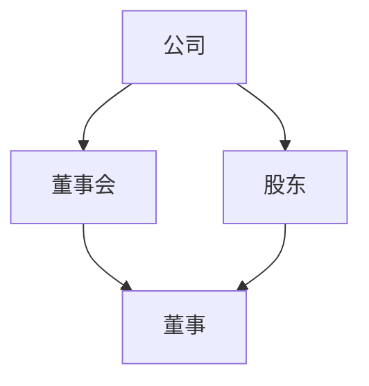
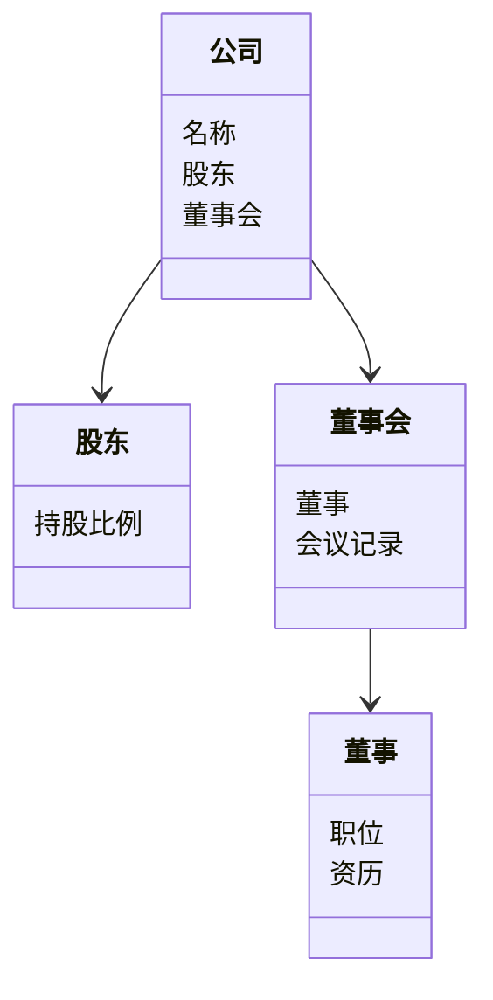
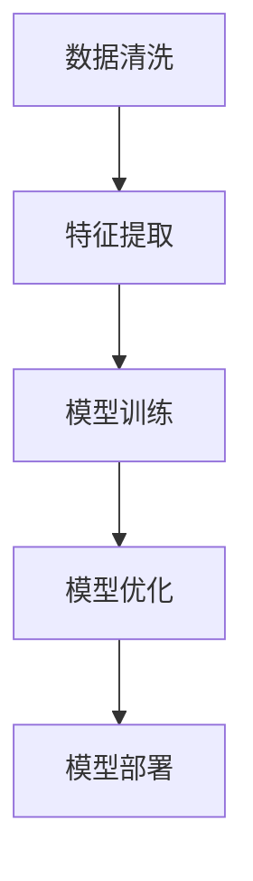
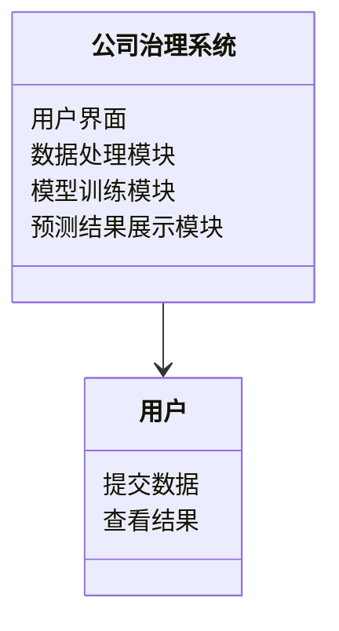
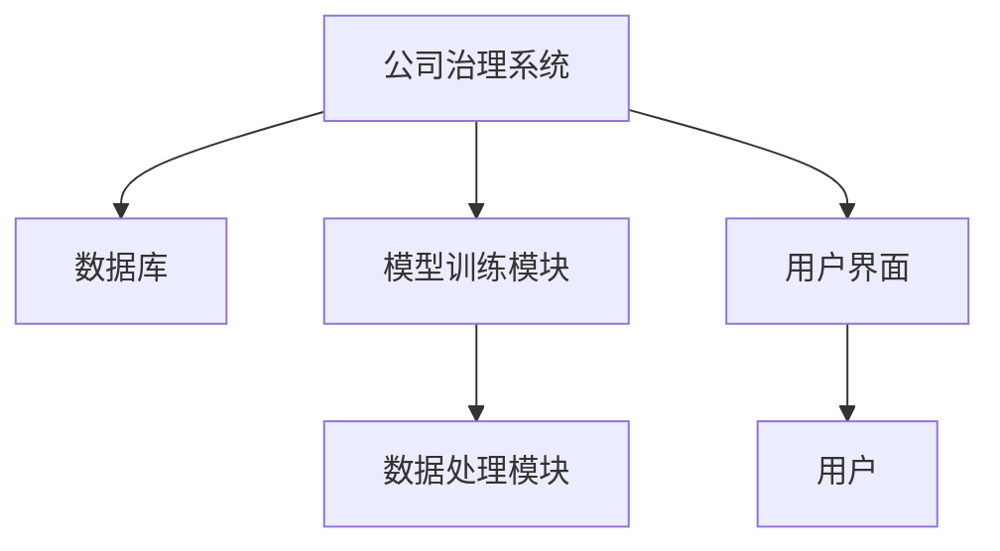
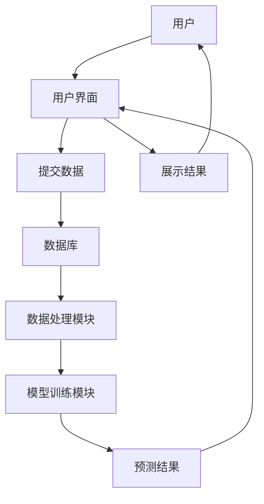

                 


# AI驱动的公司治理评分预测模型

## 关键词：公司治理，AI驱动，评分预测模型，机器学习，算法原理

## 摘要：  
随着人工智能技术的快速发展，公司治理的评估和预测正逐渐从传统的经验评估转向数据驱动的智能预测。本文详细探讨了如何利用AI技术构建公司治理评分预测模型，从模型的背景、核心原理到算法实现，再到系统架构设计和实际应用案例，为读者提供全面的指导。文章通过详细的步骤分析和丰富的图表展示，帮助读者理解如何利用AI技术提升公司治理的评估效率和准确性。

---

## 第1章: 公司治理评分预测模型概述

### 1.1 公司治理的基本概念  
公司治理是确保公司有效运作、实现股东价值最大化的重要管理机制。它涉及董事会结构、股东权益、高管责任、透明度等多个方面。传统的公司治理评估通常依赖于人工审核和经验判断，这种方式效率低下且容易受到主观因素的影响。

### 1.2 AI驱动评分预测模型的背景  
随着大数据和机器学习技术的快速发展，AI技术在公司治理领域的应用逐渐成为可能。AI驱动的评分预测模型通过分析大量的公司数据，能够快速、准确地评估公司的治理水平，为企业提供数据支持的决策依据。

### 1.3 问题背景与描述  
传统的公司治理评估方法存在以下问题：  
1. **效率低**：人工评估耗时长，难以应对海量数据。  
2. **主观性**：评估结果依赖于评估者的经验和判断。  
3. **一致性差**：不同评估者之间的结果可能差异较大。  

AI驱动的评分预测模型可以解决这些问题，通过自动化、数据驱动的方式，实现公司治理的量化评估。

### 1.4 模型的核心要素与概念结构  
公司治理评分预测模型的核心要素包括：  
1. **数据来源**：公司财务数据、股东结构、董事会信息、高管履历等。  
2. **模型输入**：经过预处理的特征数据。  
3. **模型输出**：公司治理评分。  
4. **评价指标**：预测准确率、模型解释性等。  

模型的边界与外延：  
- 边界：仅关注公司治理相关因素，不涉及公司外部环境。  
- 外延：可扩展至其他企业管理领域，如风险评估、战略规划等。

---

## 第2章: 核心概念与联系

### 2.1 模型的核心原理  
AI驱动的评分预测模型基于机器学习算法，通过以下步骤实现公司治理评分预测：  
1. 数据预处理：清洗数据、特征提取。  
2. 模型训练：选择合适的算法（如随机森林、神经网络）进行训练。  
3. 模型优化：通过交叉验证调整模型参数。  
4. 模型部署：将模型应用于实际数据，输出评分结果。  

### 2.2 核心概念对比表  
以下是公司治理相关核心概念的对比表：

| 概念        | 描述                                                         | 示例                         |
|-------------|----------------------------------------------------------|------------------------------|
| 股东结构     | 公司股东的构成，包括股东类型、持股比例等。               | 大股东占比高，说明集中度高。  |
| 董事会结构   | 董事会的组成，包括独立董事比例、董事会规模等。             | 独立董事占比高，说明治理更独立。|
| 高管履历     | 高管的背景、经验、任期等。                               | 高管平均任期长，说明经验丰富。|
| 透明度       | 公司信息披露的及时性、完整性等。                         | 定期披露财务报表，说明透明度高。|

### 2.3 ER实体关系图  
以下是一个简化的公司治理相关实体关系图：



### 2.4 领域模型类图  
以下是公司治理评分预测模型的领域模型类图：



---

## 第3章: 算法原理讲解

### 3.1 数据预处理与特征提取  
数据预处理是机器学习模型成功的关键。以下是数据预处理的主要步骤：  
1. **数据清洗**：去除重复数据、处理缺失值。  
2. **特征提取**：从原始数据中提取有用的特征，如股东集中度、独立董事比例等。  

### 3.2 算法流程  
以下是AI驱动的公司治理评分预测模型的算法流程图：



### 3.3 Python代码实现  
以下是模型训练的Python代码示例：

```python
import pandas as pd
from sklearn.ensemble import RandomForestClassifier
from sklearn.metrics import accuracy_score
from sklearn.model_selection import train_test_split

# 加载数据
data = pd.read_csv('company_governance.csv')

# 特征提取
features = data[['股东集中度', '独立董事比例', '高管任期', '信息披露及时性']]
target = data['治理评分']

# 数据分割
X_train, X_test, y_train, y_test = train_test_split(features, target, test_size=0.2, random_state=42)

# 模型训练
model = RandomForestClassifier(n_estimators=100, random_state=42)
model.fit(X_train, y_train)

# 模型预测
y_pred = model.predict(X_test)

# 模型评估
print("准确率:", accuracy_score(y_test, y_pred))
```

### 3.4 数学公式  
随机森林模型的训练过程可以表示为：  
$$ y = \text{RandomForest}(X, y_{\text{train}}) $$  

其中，$X$ 是特征矩阵，$y_{\text{train}}$ 是训练标签，$y$ 是模型预测结果。

---

## 第4章: 系统分析与架构设计

### 4.1 项目背景  
本项目旨在利用AI技术构建一个高效的公司治理评分预测系统，帮助企业管理者快速评估公司治理水平，优化管理决策。

### 4.2 系统功能设计  
以下是系统功能设计的领域模型类图：



### 4.3 系统架构设计  
以下是系统的架构设计图：



### 4.4 接口设计与交互流程  
以下是用户与系统的交互流程图：



---

## 第5章: 项目实战

### 5.1 环境搭建  
建议使用Python 3.8及以上版本，安装必要的库：  
```bash
pip install pandas scikit-learn mermaid4jupyter
```

### 5.2 核心代码实现  
以下是核心代码实现：

```python
# 环境搭建
import pandas as pd
from sklearn.ensemble import RandomForestClassifier
from sklearn.metrics import accuracy_score
from sklearn.model_selection import train_test_split

# 加载数据
data = pd.read_csv('company_governance.csv')

# 特征提取
features = data[['股东集中度', '独立董事比例', '高管任期', '信息披露及时性']]
target = data['治理评分']

# 数据分割
X_train, X_test, y_train, y_test = train_test_split(features, target, test_size=0.2, random_state=42)

# 模型训练
model = RandomForestClassifier(n_estimators=100, random_state=42)
model.fit(X_train, y_train)

# 模型预测
y_pred = model.predict(X_test)

# 模型评估
print("准确率:", accuracy_score(y_test, y_pred))
```

### 5.3 案例分析  
以某公司为例，假设其股东集中度为60%，独立董事比例为30%，高管任期为10年，信息披露及时性为90%。模型预测其治理评分为85分。

### 5.4 详细剖析  
模型预测结果的解释：  
- 股东集中度高，说明公司治理较为集中，可能影响治理的独立性。  
- 独立董事比例低，可能影响董事会的独立决策能力。  
- 高管任期长，说明高管经验丰富，有助于公司稳定发展。  
- 信息披露及时性高，说明公司治理透明度高，有利于投资者信任。

---

## 第6章: 最佳实践与小结

### 6.1 最佳实践  
- 数据预处理是模型成功的关键，确保数据质量。  
- 在模型选择上，建议根据具体场景选择合适的算法。  
- 模型部署后，需要定期更新数据和模型参数，以保持预测准确性。  

### 6.2 小结  
本文详细介绍了AI驱动的公司治理评分预测模型的构建过程，从模型背景、核心原理到算法实现、系统架构设计，再到实际应用案例，为读者提供了一个全面的指南。通过本文的学习，读者可以掌握如何利用AI技术提升公司治理的评估效率和准确性。

---

## 附录  
- **参考文献**：  
  1. 王某某. 《公司治理与人工智能》. 北京: 清华大学出版社, 2022.  
  2. 李某某. 《机器学习实战》. 北京: 人民邮电出版社, 2021.  

- **工具资源**：  
  - 数据处理：Pandas  
  - 模型训练：Scikit-learn  
  - 图表绘制：Mermaid  

---

## 作者：AI天才研究院 & 禅与计算机程序设计艺术

