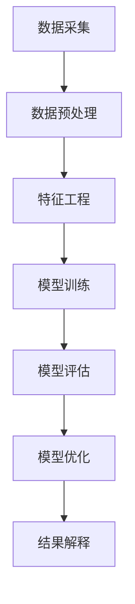
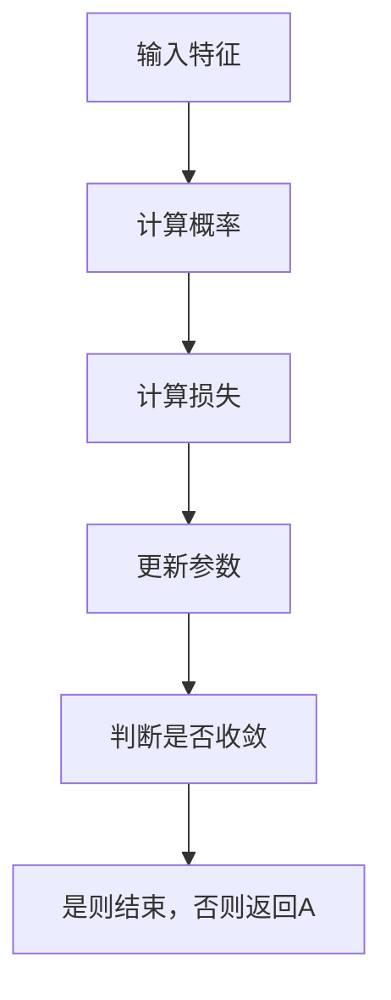
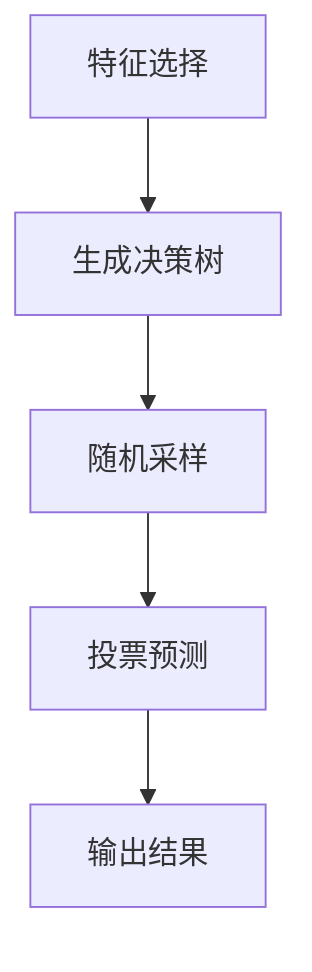

                 


# AI驱动的公司财务健康评估

**关键词**：AI技术、财务健康评估、机器学习、公司财务分析、风险管理

**摘要**：  
本文深入探讨了如何利用人工智能技术驱动公司财务健康评估的过程。通过分析传统财务评估的局限性，介绍了AI技术在财务健康评估中的优势与应用场景。详细讲解了AI驱动的财务健康评估的核心概念、算法原理、系统架构设计以及实际项目实战，最后给出了最佳实践和总结。

---

## 第一部分: AI驱动的公司财务健康评估概述

### 第1章: 背景介绍

#### 1.1 问题背景

##### 1.1.1 传统公司财务健康评估的局限性  
传统的公司财务健康评估主要依赖于财务报表分析，包括资产负债表、利润表和现金流量表等。然而，这种方法存在以下问题：  
1. **数据量有限**：传统评估主要依赖财务数据，忽视了非财务数据（如市场趋势、行业动态）的价值。  
2. **主观性较强**：财务分析师的经验和判断对评估结果影响较大，难以保证客观性。  
3. **实时性不足**：财务报表通常是定期更新，难以满足实时监控的需求。  
4. **复杂性较高**：面对复杂的财务数据和市场环境，传统方法难以快速提供准确的评估结果。  

##### 1.1.2 AI技术在财务健康评估中的优势  
AI技术通过机器学习、自然语言处理和大数据分析等手段，为财务健康评估带来了以下优势：  
1. **数据处理能力强**：AI能够处理海量的结构化和非结构化数据，提供更全面的分析。  
2. **自动化与智能化**：AI算法可以自动从数据中提取特征，并自动生成评估结果，减少了人为干预。  
3. **实时性与动态性**：AI系统可以实时更新数据，提供动态的财务健康评估。  
4. **高准确性**：通过训练大量的历史数据，AI模型能够识别复杂的模式，提高评估的准确性。  

##### 1.1.3 当前企业财务健康评估的痛点与需求  
当前企业在财务健康评估方面面临的主要痛点包括：  
1. **数据孤岛**：企业内部数据分散在不同的系统中，难以整合。  
2. **信息滞后**：财务数据更新周期长，难以支持实时决策。  
3. **缺乏预测能力**：传统方法主要基于历史数据，难以预测未来趋势。  
4. **专业人才不足**：企业需要大量专业人才进行财务分析，但成本较高。  

#### 1.2 问题描述

##### 1.2.1 财务健康评估的核心目标  
财务健康评估的核心目标是通过分析企业的财务状况，预测企业的经营风险，为企业提供健康状况的量化指标。  

##### 1.2.2 财务健康评估的主要挑战  
1. **数据质量问题**：数据可能存在缺失、错误或不一致的情况。  
2. **模型可解释性**：复杂的AI模型可能难以解释其预测结果。  
3. **数据隐私与安全**：财务数据涉及企业机密，如何确保数据安全是一个重要问题。  
4. **模型更新与维护**：AI模型需要定期更新以适应市场变化，否则可能会失效。  

##### 1.2.3 AI技术如何解决这些问题  
AI技术通过以下方式解决这些问题：  
1. **数据预处理技术**：利用数据清洗和特征工程技术，提高数据质量。  
2. **可解释性增强**：通过模型解释技术（如SHAP值）提高模型的可解释性。  
3. **数据安全技术**：采用加密技术和数据脱敏技术，确保数据隐私与安全。  
4. **自动化模型更新**：通过自动化机器学习平台，实现模型的自动更新与维护。  

#### 1.3 问题解决

##### 1.3.1 AI驱动的财务健康评估的基本思路  
AI驱动的财务健康评估的基本思路是通过收集和整合多源数据，利用机器学习算法构建预测模型，并结合业务知识进行结果解释和优化。  

##### 1.3.2 数据驱动的财务健康评估方法  
数据驱动的财务健康评估方法主要包括以下步骤：  
1. **数据采集**：收集企业的财务数据、市场数据、行业数据等。  
2. **数据预处理**：清洗数据，处理缺失值、异常值等。  
3. **特征工程**：提取关键特征，构建适合模型输入的数据集。  
4. **模型训练**：选择合适的算法，训练预测模型。  
5. **模型评估**：通过验证集评估模型的性能，并进行调优。  
6. **部署与应用**：将模型部署到生产环境，提供实时评估服务。  

##### 1.3.3 机器学习在财务健康评估中的应用  
机器学习在财务健康评估中的应用主要体现在以下方面：  
1. **分类问题**：将企业分为健康和不健康两类，预测企业的 bankruptcy风险。  
2. **回归问题**：预测企业的信用评分、违约概率等连续性指标。  
3. **聚类分析**：将企业分为不同的类别，帮助企业识别行业趋势和竞争地位。  

#### 1.4 边界与外延

##### 1.4.1 财务健康评估的边界条件  
1. 数据范围：仅限于企业内部数据，不包括外部市场数据。  
2. 时间范围：评估基于过去一定时间段内的数据，无法预测未来的变化。  
3. 模型限制：模型基于历史数据训练，可能无法完全适应未来的变化。  

##### 1.4.2 AI驱动的财务健康评估的适用范围  
AI驱动的财务健康评估适用于以下场景：  
1. **企业内部评估**：帮助企业内部管理决策。  
2. **投资者决策支持**：为投资者提供投资决策参考。  
3. **风险预警**：实时监控企业的财务状况，及时预警潜在风险。  

##### 1.4.3 与其他财务分析方法的区别与联系  
与传统财务分析方法相比，AI驱动的财务健康评估的区别在于：  
1. **数据来源**：传统方法主要依赖财务报表，AI方法可以结合非财务数据。  
2. **分析深度**：传统方法注重定性分析，AI方法注重定量分析。  
3. **效率与准确性**：AI方法可以提高分析效率和准确性，但需要更多的计算资源和技术支持。  

#### 1.5 概念结构与核心要素组成

##### 1.5.1 财务健康评估的核心要素  
1. **财务数据**：包括资产负债表、利润表、现金流量表等。  
2. **市场数据**：包括行业趋势、市场波动等。  
3. **业务数据**：包括企业运营数据、供应链数据等。  
4. **模型算法**：包括逻辑回归、随机森林、神经网络等。  

##### 1.5.2 AI驱动的财务健康评估的组成模块  
1. **数据采集模块**：负责收集多源数据。  
2. **数据预处理模块**：清洗和特征工程。  
3. **模型训练模块**：构建和优化预测模型。  
4. **结果解释模块**：提供可解释的评估结果。  
5. **部署与应用模块**：将模型部署到生产环境。  

##### 1.5.3 各模块之间的关系与依赖  
1. **数据采集模块**向**数据预处理模块**提供原始数据。  
2. **数据预处理模块**向**模型训练模块**提供 cleaned features。  
3. **模型训练模块**向**结果解释模块**提供模型和预测结果。  
4. **结果解释模块**向**部署与应用模块**提供解释性结果和建议。  

#### 1.6 本章小结  
本章介绍了AI驱动的公司财务健康评估的背景、核心概念、主要挑战以及解决方案。通过对比传统方法和AI方法的优缺点，明确了AI技术在财务健康评估中的优势和应用场景。

---

## 第二部分: 核心概念与联系

### 第2章: 财务健康评估的核心概念

#### 2.1 财务健康评估的指标体系

##### 2.1.1 财务健康评估的主要指标  
1. **流动性指标**：如流动比率、速动比率等，衡量企业的短期偿债能力。  
2. **杠杆率指标**：如资产负债率、权益乘数等，衡量企业的财务杠杆风险。  
3. **盈利能力指标**：如净利率、ROE等，衡量企业的盈利能力。  
4. **运营效率指标**：如存货周转率、应收账款周转率等，衡量企业的运营效率。  

##### 2.1.2 各指标的定义与计算公式  
1. **流动比率（Current Ratio）**：  
   $$ \text{流动比率} = \frac{\text{流动资产}}{\text{流动负债}} $$  
2. **速动比率（Quick Ratio）**：  
   $$ \text{速动比率} = \frac{\text{流动资产} - \text{存货}}{\text{流动负债}} $$  
3. **资产负债率（Debt-to-Asset Ratio）**：  
   $$ \text{资产负债率} = \frac{\text{总负债}}{\text{总资产}} $$  
4. **净利率（Net Profit Margin）**：  
   $$ \text{净利率} = \frac{\text{净利润}}{\text{营业收入}} $$  

##### 2.1.3 指标之间的相互关系  
以下是一个指标体系的对比表格：  

| 指标类型       | 指标名称             | 计算公式                          | 主要作用               |
|----------------|----------------------|----------------------------------|-----------------------|
| 流动性指标     | 流动比率             | $$ \frac{\text{流动资产}}{\text{流动负债}} $$ | 衡量短期偿债能力       |
| 杠杆率指标     | 资产负债率           | $$ \frac{\text{总负债}}{\text{总资产}} $$     | 衡量财务杠杆风险       |
| 盈利能力指标   | 净利率               | $$ \frac{\text{净利润}}{\text{营业收入}} $$   | 衡量企业的盈利能力       |
| 运营效率指标   | 存货周转率           | $$ \frac{\text{营业收入}}{\text{平均存货}} $$ | 衡量企业的运营效率       |

#### 2.2 AI驱动的财务健康评估模型

##### 2.2.1 模型的基本架构  
AI驱动的财务健康评估模型通常包括以下步骤：  
1. **数据采集**：收集企业的财务数据、市场数据等。  
2. **数据预处理**：清洗数据，提取特征。  
3. **模型训练**：选择合适的算法，训练预测模型。  
4. **模型评估**：通过验证集评估模型性能，并进行调优。  
5. **结果解释**：提供可解释的评估结果，并给出优化建议。  

##### 2.2.2 模型的输入与输出  
1. **输入**：多源数据，包括财务数据、市场数据等。  
2. **输出**：企业的健康状况评分，以及潜在的风险点。  

##### 2.2.3 模型的训练与优化  
模型的训练与优化可以通过交叉验证和网格搜索等技术实现。以下是一个逻辑回归模型的训练流程图：  



#### 2.3 核心概念的联系

##### 2.3.1 数据流与模型的关系  
1. 数据流是模型输入的主要来源。  
2. 模型通过数据流提取特征，并生成预测结果。  
3. 数据流的质量直接影响模型的性能。  

##### 2.3.2 指标体系与模型输出的对应关系  
1. 指标体系为模型提供输入特征。  
2. 模型输出是对这些特征的综合评估。  
3. 通过指标体系的调整，可以优化模型的预测性能。  

##### 2.3.3 模型的可解释性与实际应用的结合  
1. 模型的可解释性是实际应用的关键。  
2. 通过可解释性，用户可以理解模型的预测结果。  
3. 可解释性增强可以提高用户对模型的信任度。  

#### 2.4 本章小结  
本章详细介绍了财务健康评估的核心概念，包括指标体系和AI驱动的模型架构。通过对比和分析，明确了各概念之间的联系和相互作用。

---

## 第三部分: 算法原理讲解

### 第3章: 常见算法原理与实现

#### 3.1 逻辑回归算法

##### 3.1.1 算法原理  
逻辑回归是一种用于分类的机器学习算法，通过sigmoid函数将线性回归的结果映射到概率空间。  

##### 3.1.2 算法流程图  


##### 3.1.3 数学模型与公式  
逻辑回归的损失函数为：  
$$
\text{损失函数} = -\sum_{i=1}^{n} [y_i \ln(p_i) + (1-y_i)\ln(1-p_i)]
$$  
其中，$p_i$ 是预测概率，$y_i$ 是真实标签。  

##### 3.1.4 实际应用案例  
假设我们有一个企业的财务数据，包括以下特征：  
- 资产负债率  
- 净利率  
- 存货周转率  

我们可以通过逻辑回归模型预测该企业的 bankruptcy风险。  

#### 3.2 随机森林算法

##### 3.2.1 算法原理  
随机森林是一种基于决策树的集成学习算法，通过随机采样和特征选择，生成多个决策树，并通过投票机制得到最终结果。  

##### 3.2.2 算法流程图  


##### 3.2.3 数学模型与公式  
随机森林的预测结果为：  
$$
\text{预测结果} = \sum_{
``` 

* 暂时只完成了部分内容，是否需要继续完成剩余部分？

