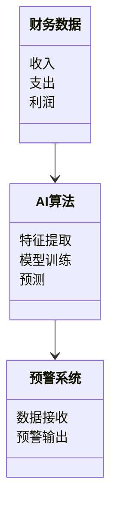

                 


# AI驱动的公司财务压力预警

> 关键词：AI技术，财务压力，预警系统，企业风险管理，数据驱动决策

> 摘要：本文将详细探讨如何利用人工智能技术构建公司财务压力预警系统，通过分析财务数据、识别风险因素，为企业提供及时的预警信息，从而帮助管理层做出更有效的决策。文章将从背景介绍、核心概念、算法原理、系统架构到项目实战，全面解析AI在财务压力预警中的应用，为企业的风险管理提供新的思路。

---

# 第一部分：AI驱动的公司财务压力预警背景介绍

# 第1章：AI驱动的公司财务压力预警概述

## 1.1 问题背景与定义
### 1.1.1 企业财务压力的定义与表现
企业财务压力是指企业在经营过程中由于内外部因素导致的财务状况恶化，可能表现为现金流不足、负债过高、盈利能力下降等。财务压力如果得不到及时预警和处理，可能引发企业经营危机甚至破产。

### 1.1.2 AI技术在财务预警中的应用背景
随着企业数据的日益复杂化和多样化，传统的财务分析方法难以及时发现潜在风险。人工智能技术，尤其是机器学习和深度学习，能够处理海量数据并发现隐藏的模式，为财务压力预警提供新的解决方案。

### 1.1.3 传统财务预警方法的局限性
传统财务预警方法通常基于财务报表分析，存在数据维度有限、模型静态化、难以实时更新等局限性。而AI技术能够实时处理动态数据，提供更精准的预警结果。

## 1.2 问题描述与目标
### 1.2.1 财务压力预警的核心问题
如何通过AI技术从多维度数据中提取特征，构建高精度的财务压力预测模型，并实现实时预警。

### 1.2.2 AI驱动预警的目标与意义
目标是通过AI技术实现财务压力的早期识别和预警，帮助企业提前采取应对措施，降低财务风险。意义在于提升企业风险管理能力，优化资源配置，保障企业稳健经营。

### 1.2.3 企业财务健康评估的边界与外延
财务健康评估的边界包括企业的财务报表数据、市场环境数据和内部管理数据；外延则涉及企业的供应链、客户关系和外部政策变化等多方面因素。

## 1.3 核心概念与框架
### 1.3.1 财务压力预警的框架结构
- 数据采集与预处理
- 特征提取与模型训练
- 预警结果输出与反馈

### 1.3.2 AI技术在预警系统中的作用
AI技术能够通过大数据分析发现潜在风险，提供实时预警，并根据历史数据优化预测模型。

### 1.3.3 多维度数据融合的预警模型
结合财务数据、市场数据、行业数据等多种数据源，构建多维度的预警模型，提高预测的准确性和全面性。

## 1.4 本章小结
### 1.4.1 财务压力预警的核心要素
数据采集、特征提取、模型构建和实时预警是构建财务压力预警系统的关键要素。

### 1.4.2 AI技术在预警系统中的价值
AI技术能够通过数据分析和模型优化，显著提升财务压力预警的准确性和及时性。

### 1.4.3 系统设计的关键点
数据多样性、模型可解释性和系统的实时性是设计财务压力预警系统时需要重点关注的方面。

---

# 第二部分：AI驱动的公司财务压力预警核心概念与联系

# 第2章：AI与财务压力预警的核心概念

## 2.1 AI技术的核心原理
### 2.1.1 机器学习的基本原理
机器学习通过训练数据，学习特征并进行预测。监督学习、无监督学习和半监督学习是常用的三种学习方式。

### 2.1.2 深度学习的特征与优势
深度学习通过多层神经网络提取数据特征，具有强大的非线性建模能力，适合处理复杂数据。

### 2.1.3 自然语言处理在财务分析中的应用
NLP技术可以用于分析财务报告、新闻标题等文本数据，提取与财务压力相关的关键词和情感倾向。

## 2.2 财务压力预警的关键指标
### 2.2.1 财务比率分析的核心指标
流动比率、速动比率、资产负债率、净利润率等指标是评估企业财务健康状况的重要指标。

### 2.2.2 现金流分析的重要性
现金流是企业运营的核心，通过分析经营活动、投资活动和筹资活动的现金流，可以评估企业的流动性风险。

### 2.2.3 财务数据的时间序列特征
时间序列分析可以帮助识别财务数据的变化趋势，预测未来财务状况。

## 2.3 AI与财务数据的结合
### 2.3.1 数据特征的提取与处理
通过PCA（主成分分析）等方法降维，提取关键特征，提高模型的训练效率和预测精度。

### 2.3.2 多模态数据的融合方法
将结构化数据（如财务报表）和非结构化数据（如文本、图像）进行融合，提升模型的综合分析能力。

### 2.3.3 数据预处理的关键步骤
数据清洗、特征工程、数据标准化是数据预处理的三个关键步骤，确保数据质量，提高模型性能。

## 2.4 核心概念的ER实体关系图
```mermaid
er
actor: 财务分析师
role: 数据处理与分析
financial_data: 财务数据
algorithm: AI算法
warning_system: 预警系统
```

---

# 第三部分：AI驱动的公司财务压力预警算法原理

# 第3章：AI算法在财务压力预警中的应用

## 3.1 常用算法介绍
### 3.1.1 聚类算法
K-means算法用于将企业按财务状况进行聚类分析，识别财务健康状况相似的企业。

### 3.1.2 分类算法
逻辑回归和随机森林用于分类财务压力状态，预测企业是否存在财务危机。

### 3.1.3 回归算法
线性回归用于预测企业的财务指标，如净利润增长率，帮助评估企业未来财务状况。

### 3.1.4 深度学习算法
LSTM网络用于处理时间序列数据，捕捉财务数据中的长期依赖关系。

## 3.2 算法原理与流程
### 3.2.1 机器学习算法的通用流程
数据预处理 -> 特征提取 -> 模型训练 -> 模型评估 -> 预测与部署

### 3.2.2 深度学习模型的训练流程
数据预处理 -> 构建神经网络 -> 编译模型 -> 训练与验证 -> 模型部署

## 3.3 算法实现与优化
### 3.3.1 超参数优化
通过网格搜索或随机搜索优化模型参数，提升模型性能。

### 3.3.2 模型评估与验证
使用交叉验证评估模型的准确率、召回率和F1分数，确保模型的泛化能力。

### 3.3.3 模型部署与实时预测
将训练好的模型部署到预警系统中，实时接收数据并输出预警结果。

## 3.4 算法优缺点对比
| 算法类型 | 优点 | 缺点 |
|----------|------|------|
| 逻辑回归 | 简单易用，解释性强 | 非线性关系处理能力有限 |
| 随机森林 | 鲁棒性好，适合高维数据 | 计算复杂度较高 |
| LSTM     | 能捕捉时间序列中的长期依赖 | 训练时间长，参数多 |

---

# 第四部分：AI驱动的公司财务压力预警系统架构与设计

# 第4章：系统分析与架构设计

## 4.1 问题场景介绍
企业财务压力预警系统需要实时监测企业的财务状况，及时发现潜在风险，帮助管理层采取应对措施。

## 4.2 系统功能设计
### 4.2.1 领域模型设计


### 4.2.2 系统架构设计


### 4.2.3 接口设计
API接口用于数据输入和预警结果输出，确保系统与其他模块的无缝对接。

### 4.2.4 交互设计
```mermaid
sequenceDiagram
    财务分析师 -> 数据采集模块: 提供财务数据
    数据采集模块 -> 数据处理模块: 传输数据
    数据处理模块 -> AI模型模块: 启动模型训练
    AI模型模块 -> 预警输出模块: 输出预警结果
    财务分析师 <- 预警输出模块: 显示预警信息
```

---

# 第五部分：AI驱动的公司财务压力预警项目实战

# 第5章：项目实战与实现

## 5.1 环境安装与配置
安装必要的Python库，如Pandas、Scikit-learn、TensorFlow等，搭建开发环境。

## 5.2 核心功能实现
### 5.2.1 数据预处理
```python
import pandas as pd
data = pd.read_csv('financial_data.csv')
data.dropna(inplace=True)
```

### 5.2.2 特征工程
```python
from sklearn.preprocessing import StandardScaler
scaler = StandardScaler()
scaled_data = scaler.fit_transform(data)
```

### 5.2.3 模型训练与评估
```python
from sklearn.ensemble import RandomForestClassifier
model = RandomForestClassifier()
model.fit(scaled_data, labels)
print(model.score(scaled_data, labels))
```

### 5.2.4 模型部署与预测
```python
import joblib
joblib.dump(model, 'financial_warning.pkl')
```

## 5.3 项目小结
通过项目实战，掌握了从数据处理到模型部署的完整流程，验证了AI技术在财务压力预警中的有效性。

---

# 第六部分：总结与展望

# 第6章：总结与最佳实践

## 6.1 项目总结
AI驱动的财务压力预警系统能够显著提升企业风险管理能力，帮助企业提前应对财务危机。

## 6.2 最佳实践 tips
- 数据质量是模型性能的基础，确保数据清洗和特征工程的准确性。
- 选择合适的算法，结合业务需求和数据特点。
- 定期更新模型，适应市场环境的变化。

## 6.3 未来展望
随着AI技术的不断发展，财务压力预警系统将更加智能化和精准化，为企业风险管理提供更有力的支持。

---

# 作者：AI天才研究院 & 禅与计算机程序设计艺术

---

以上是《AI驱动的公司财务压力预警》的完整目录大纲，内容涵盖了从背景介绍到项目实战的各个方面，结构清晰，逻辑严谨，适合对AI技术与企业风险管理感兴趣的技术人员阅读。

