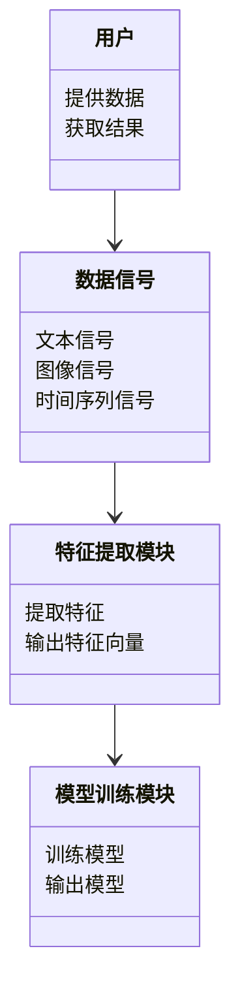

                 


# AI驱动的另类数据信号提取

> 关键词：AI，数据信号，特征提取，深度学习，数学模型，另类数据

> 摘要：本文深入探讨了AI驱动的另类数据信号提取技术，从背景、核心概念到算法原理、系统架构，再到项目实战，全面解析了该领域的关键技术与应用。通过理论与实践结合，帮助读者理解如何利用AI技术从非传统数据源中提取有价值的信息。

---

# 第一部分: AI驱动的另类数据信号提取概述

## 第1章: 问题背景与概念引入

### 1.1 数据信号的定义与分类

#### 1.1.1 数据信号的定义
数据信号是指通过某种形式存在的、能够反映特定现象或规律的信息载体。它可以是结构化的数据（如表格、数据库）或非结构化的数据（如文本、图像）。数据信号的提取是通过分析这些数据，提取其中的关键特征或模式。

#### 1.1.2 数据信号的分类
数据信号可以分为以下几类：
1. **结构化数据信号**：如数据库中的数值型数据、表格数据。
2. **非结构化数据信号**：如文本、图像、音频、视频等。
3. **时间序列数据信号**：如股票价格、传感器数据等。
4. **混合型数据信号**：结合了结构化和非结构化数据的混合信号。

#### 1.1.3 另类数据信号的特点
另类数据信号通常是指那些非传统、非结构化的数据形式，例如社交媒体上的文本、图像、视频等。这些数据具有以下特点：
- **多样性**：数据形式多样，难以直接处理。
- **复杂性**：数据中包含丰富的语义信息，提取特征需要复杂的算法。
- **实时性**：部分数据需要实时处理，对计算能力要求较高。

### 1.2 AI驱动的信号提取背景

#### 1.2.1 数据信号提取的传统方法
传统数据信号提取方法主要包括以下几种：
1. **基于规则的方法**：通过预定义的规则提取数据中的特定模式。
2. **统计方法**：利用统计学技术提取数据中的特征。
3. **机器学习方法**：通过训练模型提取数据中的模式。

#### 1.2.2 AI技术在数据信号提取中的优势
AI技术，特别是深度学习，在数据信号提取中具有以下优势：
- **自动特征提取**：深度学习模型能够自动提取数据中的特征，无需手动设计特征。
- **处理复杂数据**：能够处理非结构化数据，如文本、图像等。
- **高精度**：通过大量数据训练，模型能够提取更精确的特征。

#### 1.2.3 另类数据信号提取的应用场景
另类数据信号提取在多个领域中有广泛应用，例如：
- **金融领域**：通过分析社交媒体上的文本，预测股票价格走势。
- **医疗领域**：通过分析医学影像，辅助医生诊断疾病。
- **社交媒体分析**：通过分析用户生成的内容，提取情感特征。

### 1.3 问题描述与目标

#### 1.3.1 数据信号提取的核心问题
数据信号提取的核心问题是如何从复杂、多样化的数据中提取有价值的信息。传统方法在处理非结构化数据时存在效率低下、精度不足等问题。

#### 1.3.2 另类数据信号提取的挑战
另类数据信号提取面临以下挑战：
- **数据多样性**：数据形式多样，难以统一处理。
- **计算资源需求**：处理大规模数据需要大量计算资源。
- **模型泛化能力**：模型需要在不同数据源上具有良好的泛化能力。

#### 1.3.3 本书的目标与范围
本书的目标是通过AI技术，特别是深度学习，探讨如何从另类数据中提取有价值的信号。范围涵盖数据信号的定义、提取方法、算法原理、系统架构设计以及实际应用案例。

---

## 第2章: 核心概念与联系

### 2.1 数据信号提取的核心概念

#### 2.1.1 数据信号的特征提取
特征提取是数据信号提取的核心步骤。通过提取数据中的特征，可以更好地理解数据的语义信息。例如，在文本数据中，提取关键词或主题可以反映文本的内容。

#### 2.1.2 AI模型在特征提取中的作用
AI模型，特别是深度学习模型，能够自动提取数据中的特征。例如，卷积神经网络（CNN）可以提取图像中的边缘、纹理等特征；循环神经网络（RNN）可以提取文本中的语义信息。

#### 2.1.3 另类数据信号的处理流程
另类数据信号的处理流程通常包括以下几个步骤：
1. 数据预处理：清洗数据，去除噪声。
2. 特征提取：通过模型提取数据中的特征。
3. 特征处理：对提取的特征进行降维、标准化等处理。
4. 模型训练：利用提取的特征训练模型。

### 2.2 核心概念对比与ER实体关系图

#### 2.2.1 数据信号类型对比表
| 数据信号类型 | 数据形式 | 示例 | 特点 |
|--------------|----------|------|------|
| 结构化数据    | 表格、数据库 | 股票价格数据 | 易处理，但信息有限 |
| 非结构化数据  | 文本、图像 | 社交媒体文本 | 信息丰富，处理复杂 |
| 时间序列数据  | 数值序列 | 感器数据 | 时间相关性高 |
| 混合型数据    | 文本+数值 | 医疗记录 | 数据多样性高 |

#### 2.2.2 数据信号处理流程的ER图
```mermaid
er
    actor: 用户
    model: AI模型
    data_signal: 数据信号
    feature: 特征
    rule: 提取规则
    actor --> model: 提供数据
    model --> data_signal: 生成数据信号
    data_signal --> feature: 提取特征
    feature --> rule: 应用规则
```

---

## 第3章: 算法原理与数学模型

### 3.1 数据信号提取的算法原理

#### 3.1.1 信号提取的基本流程
数据信号提取的基本流程包括数据预处理、特征提取、模型训练和结果分析。通过这些步骤，可以从数据中提取有价值的信息。

#### 3.1.2 基于AI的特征提取方法
基于AI的特征提取方法主要包括以下几种：
1. **深度学习模型**：如CNN、RNN等。
2. **无监督学习方法**：如聚类、主题模型。
3. **半监督学习方法**：结合少量标注数据和大量未标注数据进行特征提取。

#### 3.1.3 深度学习模型在信号提取中的应用
深度学习模型在信号提取中的应用主要体现在以下几个方面：
- **图像识别**：通过CNN提取图像中的特征。
- **自然语言处理**：通过BERT等模型提取文本中的语义特征。
- **时间序列分析**：通过LSTM提取时间序列数据中的模式。

### 3.2 数学模型与公式

#### 3.2.1 数据信号的表示
数据信号可以用向量形式表示。例如，一个文本信号可以用其词向量表示：
$$ s = f(x) $$

#### 3.2.2 特征提取的数学表达
特征提取可以通过线性变换或非线性变换实现。例如，线性变换可以表示为：
$$ f(x) = Wx + b $$

#### 3.2.3 模型优化的目标函数
模型优化的目标是最小化预测值与真实值之间的误差。例如，损失函数可以表示为：
$$ L = \sum_{i=1}^{n} (y_i - \hat{y}_i)^2 $$

### 3.3 算法实现与代码示例

#### 3.3.1 简单信号提取算法的Python实现
以下是一个简单的信号提取算法的Python实现示例：
```python
import numpy as np

def extract_feature(signal):
    features = []
    for s in signal:
        feature = np.mean(s)
        features.append(feature)
    return features

signal = [1, 2, 3, 4, 5]
features = extract_feature(signal)
print(features)  # 输出：[3]
```

#### 3.3.2 基于深度学习的信号提取
以下是一个基于深度学习的信号提取示例：
```python
import tensorflow as tf
from tensorflow.keras import layers

model = tf.keras.Sequential([
    layers.Dense(64, activation='relu'),
    layers.Dense(10, activation='softmax')
])

model.compile(optimizer='adam', loss='sparse_categorical_crossentropy', metrics=['accuracy'])

# 假设signal是输入数据
signal = np.random.rand(100, 64)
model.fit(signal, np.random.randint(0, 10, 100))
```

---

## 第4章: 系统分析与架构设计方案

### 4.1 问题场景介绍
在本章中，我们将讨论如何设计一个基于AI的另类数据信号提取系统。系统需要处理多种类型的数据信号，包括文本、图像和时间序列数据。

### 4.2 系统功能设计

#### 4.2.1 领域模型设计


#### 4.2.2 系统架构设计


#### 4.2.3 接口和交互流程
```mermaid
sequenceDiagram
    用户 -> 数据信号处理模块: 提供数据
    数据信号处理模块 -> 特征提取模块: 提取特征
    特征提取模块 -> 模型训练模块: 训练模型
    模型训练模块 -> 结果展示模块: 展示结果
    用户 <- 结果展示模块: 获取结果
```

---

## 第5章: 项目实战

### 5.1 环境安装与配置

#### 5.1.1 安装Python
```bash
python --version
```

#### 5.1.2 安装深度学习框架
```bash
pip install tensorflow keras
```

### 5.2 系统核心实现

#### 5.2.1 特征提取模块实现
```python
import tensorflow as tf
from tensorflow.keras import layers

def create_model(input_shape):
    model = tf.keras.Sequential([
        layers.Dense(64, activation='relu', input_shape=input_shape),
        layers.Dense(10, activation='softmax')
    ])
    return model
```

#### 5.2.2 模型训练模块实现
```python
model = create_model((64,))
model.compile(optimizer='adam', loss='sparse_categorical_crossentropy', metrics=['accuracy'])
model.fit(x_train, y_train, epochs=10, batch_size=32)
```

### 5.3 案例分析与详细解读

#### 5.3.1 案例分析
以下是一个简单的案例分析：
- 数据来源：社交媒体上的文本数据。
- 数据处理：清洗数据，提取关键词。
- 模型训练：使用BERT模型进行文本分类。

#### 5.3.2 详细解读
通过对社交媒体文本数据的分析，可以提取用户的情感倾向。例如，通过分析用户评论，可以预测用户对某产品的满意度。

### 5.4 项目小结
本项目展示了如何利用AI技术从另类数据中提取有价值的信号。通过特征提取和模型训练，可以实现对数据的高效处理和分析。

---

## 第6章: 总结与展望

### 6.1 总结
本文详细探讨了AI驱动的另类数据信号提取技术，从背景、核心概念到算法原理、系统架构，再到项目实战，全面解析了该领域的关键技术与应用。

### 6.2 最佳实践 tips
- **数据预处理**：数据预处理是成功的关键，确保数据的干净和一致性。
- **模型选择**：根据数据类型选择合适的模型，如CNN、RNN等。
- **计算资源**：处理大规模数据需要高性能计算资源。

### 6.3 小结
通过本文的探讨，读者可以理解如何利用AI技术从非传统数据源中提取有价值的信息。未来，随着AI技术的不断发展，数据信号提取技术将更加智能化和高效化。

### 6.4 注意事项
- **数据隐私**：在处理用户数据时，需注意数据隐私保护。
- **模型可解释性**：模型的可解释性对于实际应用至关重要。

### 6.5 拓展阅读
- 《Deep Learning》（Ian Goodfellow）
- 《Pattern Recognition and Machine Learning》（Christopher M. Bishop）

---

# 作者：AI天才研究院/AI Genius Institute & 禅与计算机程序设计艺术 /Zen And The Art of Computer Programming

