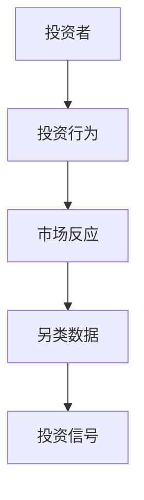
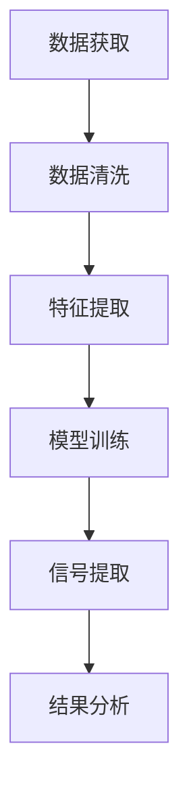
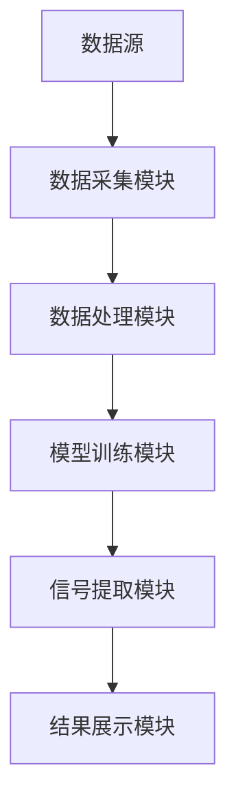
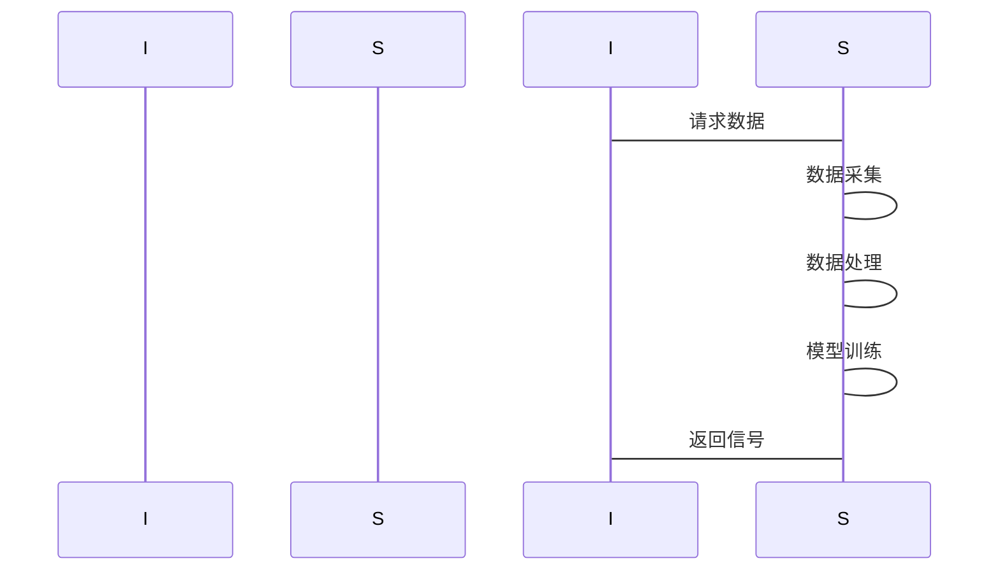

                 


# AI驱动的另类数据投资信号提取

## 关键词：
AI, 另类数据, 投资信号提取, 机器学习, 数据分析, 股票投资, 财务分析

## 摘要：
本文深入探讨了如何利用人工智能技术从另类数据中提取投资信号，帮助投资者做出更明智的决策。文章首先介绍了问题背景，分析了另类数据在投资中的重要性，然后详细讲解了核心概念、算法原理、数学模型、系统架构设计和项目实战。通过实际案例和代码示例，展示了如何利用AI技术提取投资信号，并提供了最佳实践和注意事项。

---

# 第一部分：AI驱动的另类数据投资信号提取背景介绍

## 第1章：问题背景与描述

### 1.1 问题背景
#### 1.1.1 投资领域中的数据挑战
投资领域传统依赖于财务数据和市场指标，但这些数据的局限性日益显现。另类数据（如社交媒体情绪、卫星图像、专利数据等）为投资者提供了新的视角。

#### 1.1.2 另类数据的定义与特点
- **定义**：另类数据指传统金融数据之外的结构化或非结构化数据。
- **特点**：实时性、多样性、复杂性、潜在价值高。

#### 1.1.3 AI技术在投资领域的应用潜力
AI能够从海量数据中提取有价值的信息，帮助投资者识别潜在机会和风险。

### 1.2 问题描述
#### 1.2.1 另类数据的获取与处理难点
数据清洗、特征提取和数据质量控制是主要挑战。

#### 1.2.2 投资信号提取的复杂性
需要结合多种数据源，处理非线性关系和噪声数据。

#### 1.2.3 当前投资信号提取的主要痛点
传统方法效率低、覆盖面有限，难以捕捉实时市场变化。

### 1.3 问题解决思路
#### 1.3.1 利用AI技术提取投资信号的优势
AI能够处理复杂数据，发现隐藏模式。

#### 1.3.2 另类数据在投资决策中的价值
提供新的数据源，增强决策的全面性。

#### 1.3.3 结合AI与另类数据的解决方案
构建AI驱动的分析框架，整合多源数据，提取投资信号。

### 1.4 问题的边界与外延
#### 1.4.1 投资信号提取的边界条件
数据质量和模型假设影响结果。

#### 1.4.2 另类数据的适用范围
适用于新兴行业和实时监控。

#### 1.4.3 AI技术在投资领域的应用边界
AI无法完全替代人类判断，需结合市场经验。

### 1.5 核心概念组成
#### 1.5.1 另类数据的分类与特征
- **文本数据**：社交媒体、新闻。
- **图像数据**：卫星图像、图表。
- **网络数据**：点击流、浏览行为。

#### 1.5.2 AI模型在投资中的作用
模型用于特征提取、预测和信号识别。

#### 1.5.3 投资信号提取的流程与关键环节
数据获取、清洗、特征提取、模型训练、信号识别。

---

# 第二部分：核心概念与联系

## 第2章：核心概念原理

### 2.1 另类数据的特征对比
#### 2.1.1 结构化数据与非结构化数据的对比
| 特征 | 结构化数据 | 非结构化数据 |
|------|------------|--------------|
| 格式 | 结构化（表格） | 非结构化（文本、图像） |
| 处理难度 | 易 | 难 |

#### 2.1.2 文本数据、图像数据、网络数据的特征分析
- **文本数据**：情绪分析、关键词提取。
- **图像数据**：模式识别、物体检测。
- **网络数据**：流量分析、用户行为建模。

#### 2.1.3 数据量、数据质量与数据相关性的对比表格
| 特征 | 数据量 | 数据质量 | 数据相关性 |
|------|--------|----------|------------|
| 重要性 | 中 | 高 | 高 |

### 2.2 AI模型的核心原理
#### 2.2.1 机器学习模型的输入输出关系
$$ 输入 \rightarrow 加工 \rightarrow 输出 $$

#### 2.2.2 深度学习模型的特征提取机制
- **卷积神经网络（CNN）**：提取图像特征。
- **循环神经网络（RNN）**：处理序列数据。

#### 2.2.3 NLP模型在文本数据中的应用
- **词嵌入**：Word2Vec、GloVe。
- **文本分类**：情感分析、主题分类。

### 2.3 ER实体关系图


---

# 第三部分：算法原理讲解

## 第3章：算法原理与流程

### 3.1 算法流程图


### 3.2 特征工程
#### 3.2.1 数据预处理步骤
- 数据清洗：去除噪声、填充缺失值。
- 数据转换：标准化、分词（文本数据）。

#### 3.2.2 特征选择方法
- **过滤法**：统计检验（如卡方检验）。
- **包装法**：递归特征消除（RFE）。
- **嵌入法**：自动编码器、PCA。

#### 3.2.3 特征工程的Python代码示例
```python
import pandas as pd
from sklearn.preprocessing import StandardScaler

# 数据预处理
df = pd.read_csv('data.csv')
df.dropna(inplace=True)  # 去除缺失值
scaler = StandardScaler()
df_scaled = scaler.fit_transform(df)

# 特征选择
from sklearn.feature_selection import SelectKBest
selector = SelectKBest(k=10)
selected_features = selector.fit_transform(df_scaled, target)
```

### 3.3 模型训练与调优
#### 3.3.1 机器学习模型训练
- **随机森林**：特征重要性分析。
- **支持向量机**：分类任务。
- **XGBoost**：回归任务。

#### 3.3.2 深度学习模型训练
- **神经网络结构**：输入层、隐藏层、输出层。
- **超参数调优**：网格搜索、随机搜索。

#### 3.3.3 模型评估与优化
- **评估指标**：准确率、召回率、F1分数。
- **交叉验证**：K折交叉验证。

### 3.4 信号提取与优化
#### 3.4.1 信号提取方法
- **阈值法**：基于模型预测结果。
- **聚类法**：识别数据中的簇。
- **时间序列分析**：ARIMA、LSTM。

#### 3.4.2 优化策略
- **动态调整**：实时更新模型。
- **多模型融合**：集成学习。

---

## 第4章：数学模型和公式

### 4.1 线性回归模型
$$ y = \beta_0 + \beta_1 x_1 + \beta_2 x_2 + ... + \beta_n x_n + \epsilon $$

### 4.2 随机森林模型
$$ y = \sum_{i=1}^{n} \text{Tree}(x_i) $$

### 4.3 LSTM模型
$$ h_t = \text{tanh}(W_h h_{t-1} + U_x x_t + b_h) $$
$$ o_t = \sigma(W_o h_t + b_o) $$

---

## 第5章：系统分析与架构设计

### 5.1 问题场景介绍
投资者需要实时监控市场动态，利用另类数据做出决策。

### 5.2 系统功能设计
- **数据采集模块**：获取多种数据源。
- **数据处理模块**：清洗和转换数据。
- **模型训练模块**：构建和优化模型。
- **信号提取模块**：识别投资信号。
- **结果展示模块**：可视化分析结果。

### 5.3 系统架构设计


### 5.4 系统接口设计
- **数据接口**：API接口。
- **模型接口**：调用模型进行预测。

### 5.5 系统交互流程


---

## 第6章：项目实战

### 6.1 环境安装
- **Python**：安装Anaconda或miniconda。
- **库安装**：pandas、numpy、scikit-learn、keras、tensorflow。

### 6.2 核心实现
```python
from sklearn.ensemble import RandomForestClassifier
from sklearn.metrics import accuracy_score

# 数据加载
data = pd.read_csv('data.csv')

# 特征选择
selected_features = data.drop('label', axis=1)
target = data['label']

# 模型训练
model = RandomForestClassifier()
model.fit(selected_features, target)

# 信号提取
predictions = model.predict(selected_features)
accuracy = accuracy_score(target, predictions)
print(f'准确率：{accuracy}')
```

### 6.3 案例分析
- **案例1**：利用社交媒体情绪分析预测股票价格。
- **案例2**：通过卫星图像分析零售业销售情况。

### 6.4 项目总结
项目展示了AI在另类数据中的应用潜力，但也存在数据质量和模型解释性等挑战。

---

## 第7章：最佳实践、小结与注意事项

### 7.1 最佳实践
- **数据质量**：确保数据准确、完整。
- **模型解释性**：选择可解释的模型。
- **实时性**：优化数据处理和模型推理速度。

### 7.2 小结
AI驱动的另类数据投资信号提取为投资者提供了新的工具，但需要结合市场经验和数据质量控制。

### 7.3 注意事项
- **数据隐私**：遵守数据保护法规。
- **模型局限性**：AI无法完全替代人类判断。
- **持续优化**：定期更新模型和数据源。

### 7.4 拓展阅读
- 《机器学习实战》
- 《深度学习》
- 《Python数据分析》

---

# 作者：AI天才研究院/AI Genius Institute & 禅与计算机程序设计艺术 /Zen And The Art of Computer Programming

