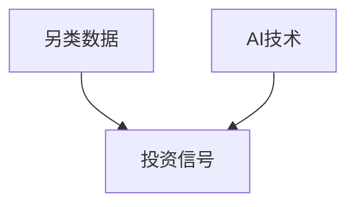
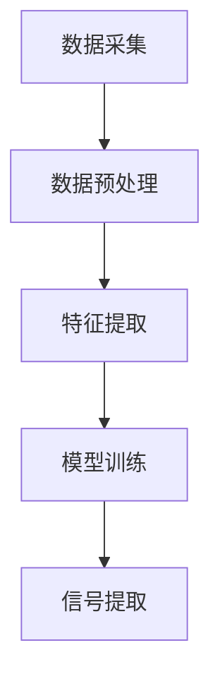
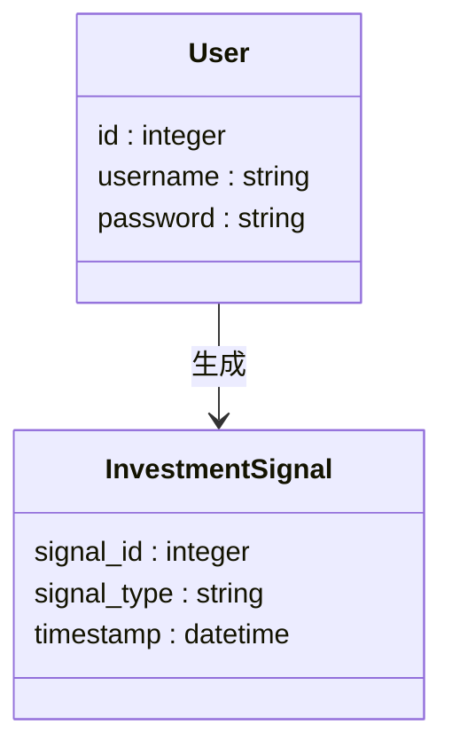
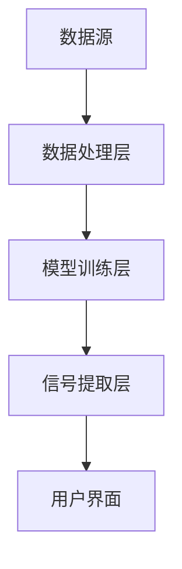
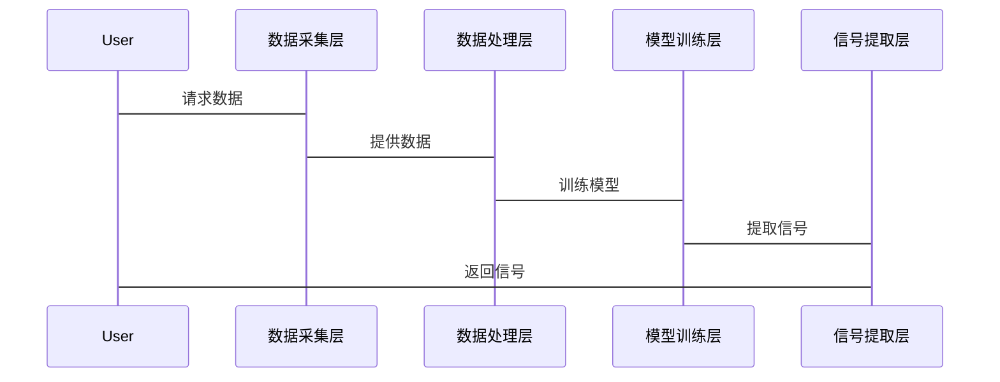

                 


```markdown
# AI驱动的另类数据投资信号提取

> 关键词：AI技术、另类数据、投资信号、信号提取、机器学习、深度学习

> 摘要：本文详细探讨了利用人工智能技术从另类数据中提取投资信号的方法，涵盖了从数据预处理到模型训练的完整流程。通过分析另类数据的特点、构建数据关联模型、选择合适的机器学习算法以及设计高效的系统架构，本文为投资领域提供了新的思路和解决方案。结合实际案例分析，本文还提供了详细的代码实现和系统设计，帮助读者快速上手并深入理解AI驱动的投资信号提取技术。

---

## 第一章: 背景与问题背景

### 1.1 问题背景

#### 1.1.1 投资信号提取的传统方法
传统的投资信号提取方法依赖于市场数据、财务报表等传统金融数据。然而，这些数据往往具有局限性，无法捕捉市场中的细微变化。

#### 1.1.2 传统方法的局限性与挑战
传统方法依赖于有限的数据源，难以应对复杂多变的市场环境。此外，传统方法通常需要手动调整参数，效率低下且难以大规模应用。

#### 1.1.3 AI技术在投资信号提取中的优势
AI技术能够处理海量的非结构化数据，如社交媒体情绪、新闻标题等，提取潜在的投资信号。通过深度学习模型，可以自动发现数据中的隐藏模式。

### 1.2 问题描述

#### 1.2.1 另类数据的定义与特点
另类数据是指传统金融数据之外的其他数据源，包括社交媒体、卫星图像、物联网数据等。这些数据具有实时性、多样性和复杂性。

#### 1.2.2 另类数据在投资中的应用场景
另类数据可以用于预测市场趋势、发现新兴行业、评估公司风险等。例如，社交媒体上的负面情绪可能预示着某公司的股价下跌。

#### 1.2.3 利用AI技术提取投资信号的核心问题
如何从海量的另类数据中提取有价值的信息，并将其转化为可操作的投资信号，是当前研究的核心问题。

### 1.3 问题解决

#### 1.3.1 AI驱动的另类数据处理流程
1. 数据采集：从多种数据源获取另类数据。
2. 数据预处理：清洗、转换和标准化数据。
3. 特征提取：提取与投资相关的特征。
4. 模型训练：训练机器学习模型。
5. 信号提取：生成投资信号。

#### 1.3.2 数据预处理与特征提取
数据预处理包括去除噪声、填补缺失值等。特征提取则需要选择与投资信号相关的特征，如情感强度、关键词频率等。

#### 1.3.3 模型训练与信号提取
通过训练机器学习模型，生成投资信号。例如，使用LSTM模型预测股票价格走势。

### 1.4 边界与外延

#### 1.4.1 投资信号提取的边界条件
投资信号提取需要考虑数据的质量、模型的准确性以及市场的波动性等因素。

#### 1.4.2 相关领域的外延与区别
与传统金融分析、大数据分析等领域的区别在于，另类数据的使用和AI技术的应用是其核心特征。

#### 1.4.3 与其他投资技术的对比分析
对比传统技术，AI驱动的投资信号提取技术具有更高的效率和准确性，但同时也面临更高的技术门槛和数据获取成本。

### 1.5 概念结构与核心要素

#### 1.5.1 核心概念的组成
核心概念包括另类数据、投资信号、AI技术等。

#### 1.5.2 核心要素的对比分析
| 核心要素 | 描述 |
|----------|------|
| 另类数据 | 社交媒体、新闻、卫星图像等 |
| 投资信号 | 预测股票价格、发现市场趋势等 |
| AI技术 | 深度学习、自然语言处理等 |

#### 1.5.3 概念结构图展示


---

## 第二章: 核心概念与联系

### 2.1 核心概念原理

#### 2.1.1 另类数据的分类与特征
另类数据可以分为文本数据、图像数据、语音数据等。每种数据类型都有其独特的特征和应用场景。

#### 2.1.2 AI技术在投资信号提取中的作用
AI技术通过自然语言处理、计算机视觉等技术，从另类数据中提取有用的信息。

#### 2.1.3 数据关联性与投资信号的关系
数据之间的关联性是投资信号提取的关键。例如，社交媒体上的负面情绪与股票价格下跌可能存在相关性。

### 2.2 核心概念属性特征对比

#### 2.2.1 数据类型与特征对比表格
| 数据类型 | 特征 |
|----------|------|
| 文本数据 | 情感分析、关键词提取 |
| 图像数据 | 颜色识别、图像分割 |
| 语音数据 | 音调分析、语音识别 |

#### 2.2.2 不同AI模型的性能对比
| 模型类型 | 优点 | 缺点 |
|----------|------|------|
| LSTM | 长时间依赖关系 | �易遗忘短期信息 |
| 随机森林 | 抗过拟合 | 需要特征工程 |

#### 2.2.3 投资信号的特征分析
投资信号通常具有时间依赖性、相关性和可预测性。

### 2.3 ER实体关系图架构

```mermaid
erDiagram
    user {
        <属性>
        id : integer
        username : string
        password : string
    }
    investment_signal {
        <属性>
        signal_id : integer
        signal_type : string
        timestamp : datetime
    }
    user --> investment_signal : 生成
```

---

## 第三章: 算法原理与实现

### 3.1 算法原理

#### 3.1.1 基于深度学习的信号提取模型
使用LSTM模型处理时间序列数据，提取投资信号。

#### 3.1.2 时间序列分析与预测
通过ARIMA模型进行时间序列预测。

#### 3.1.3 聚类分析与异常检测
使用K-means算法进行聚类分析，发现异常数据点。

### 3.2 算法流程图



### 3.3 Python源代码实现

#### 3.3.1 数据预处理代码
```python
import pandas as pd

# 读取数据
data = pd.read_csv('alternative_data.csv')

# 去除缺失值
data.dropna(inplace=True)

# 标准化处理
from sklearn.preprocessing import StandardScaler
scaler = StandardScaler()
data_scaled = scaler.fit_transform(data)
```

#### 3.3.2 模型训练代码
```python
from tensorflow.keras.models import Sequential
from tensorflow.keras.layers import LSTM, Dense

# 构建LSTM模型
model = Sequential()
model.add(LSTM(64, input_shape=(timesteps, features)))
model.add(Dense(1))
model.compile(optimizer='adam', loss='mean_squared_error')

# 训练模型
model.fit(X_train, y_train, epochs=100, batch_size=32)
```

#### 3.3.3 信号提取代码
```python
# 生成投资信号
predictions = model.predict(X_test)
# 确定信号阈值
threshold = 0.5
signals = [1 if pred > threshold else 0 for pred in predictions]
```

---

## 第四章: 数学模型与公式

### 4.1 时间序列模型

#### 4.1.1 ARIMA模型公式
$$ ARIMA(p, d, q) $$

#### 4.1.2 LSTM网络结构公式
$$
f(x_t) = \sigma(W_f \cdot [h_{t-1}, x_t] + b_f)
$$

---

## 第五章: 系统分析与架构设计

### 5.1 问题场景介绍
投资机构需要从社交媒体、新闻等另类数据中提取投资信号，以辅助投资决策。

### 5.2 系统功能设计

#### 5.2.1 领域模型类图


#### 5.2.2 系统架构图


### 5.3 系统接口设计

#### 5.3.1 接口定义
1. 数据采集接口：从多种数据源获取数据。
2. 数据处理接口：清洗和转换数据。
3. 模型训练接口：训练投资信号提取模型。

#### 5.3.2 交互流程图


---

## 第六章: 项目实战

### 6.1 环境安装

#### 6.1.1 安装Python环境
使用Anaconda安装Python 3.8及以上版本。

#### 6.1.2 安装依赖库
安装TensorFlow、Keras、Pandas等库。

### 6.2 系统核心实现源代码

#### 6.2.1 数据预处理代码
```python
import pandas as pd
import numpy as np

data = pd.read_csv('alternative_data.csv')
data = data.dropna()
```

#### 6.2.2 模型实现代码
```python
from tensorflow.keras.models import Sequential
from tensorflow.keras.layers import LSTM, Dense

model = Sequential()
model.add(LSTM(64, input_shape=(timesteps, features)))
model.add(Dense(1))
model.compile(optimizer='adam', loss='mean_squared_error')
```

### 6.3 代码应用解读与分析
通过代码实现从数据预处理到模型训练的完整流程，生成投资信号。

### 6.4 实际案例分析
以某公司为例，分析社交媒体数据，生成投资信号。

### 6.5 项目小结
总结项目实现的关键点和注意事项。

---

## 第七章: 最佳实践

### 7.1 小结
AI驱动的另类数据投资信号提取技术具有广阔的应用前景。

### 7.2 注意事项
1. 数据质量是关键。
2. 模型需要不断优化。
3. 注意数据隐私和合规性。

### 7.3 拓展阅读
推荐相关书籍和论文，供读者进一步学习。

---

## 作者：AI天才研究院/AI Genius Institute & 禅与计算机程序设计艺术 /Zen And The Art of Computer Programming
```

