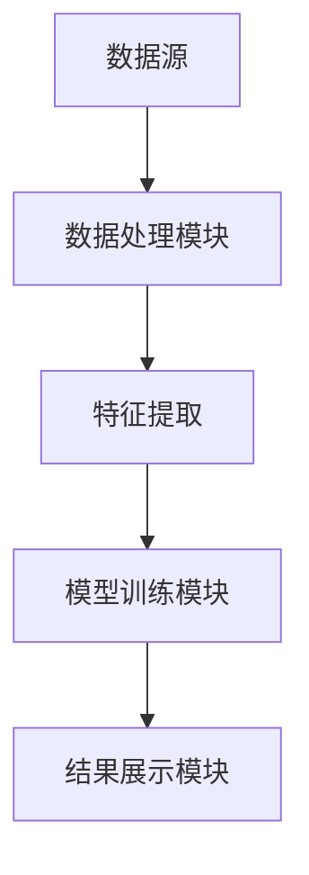

                 


# AI驱动的客户终身价值分析：深入理解公司的收入质量

> 关键词：客户终身价值（CLV）、人工智能（AI）、收入质量、客户行为分析、数据科学、机器学习

> 摘要：本文深入探讨了AI驱动的客户终身价值分析方法，通过详细分析客户行为、生命周期和价值评估，展示了如何利用AI技术提升公司的收入质量。文章从基本概念、算法原理、系统设计到实际案例，全面解析了AI在客户价值分析中的应用，帮助读者更好地理解和实现客户价值最大化。

---

# 第一部分: 客户终身价值（CLV）概述

## 第1章: 客户终身价值的核心概念

### 1.1 什么是客户终身价值（CLV）
客户终身价值（Customer Lifetime Value，简称CLV或CLTV）是指一个客户在其整个生命周期内为公司带来的总收入，减去获取和维护该客户所花费的成本。CLV是企业制定客户管理策略的重要依据。

**CLV的核心公式**：
$$ CLV = \text{客户平均收入} \times \text{客户生命周期长度} - \text{客户获取成本} $$

CLV分析能够帮助企业识别高价值客户，优化资源分配，提升客户满意度和忠诚度，从而实现收入质量的提升。

---

### 1.2 CLV与收入质量的关系
收入质量是企业收入管理的重要指标，它不仅关注收入的总量，更关注收入的可持续性和利润贡献能力。通过分析CLV，企业可以识别哪些客户能够长期为公司创造价值，从而优化收入结构，提升收入质量。

**CLV对收入质量的影响**：
- **客户筛选**：通过CLV分析，企业可以筛选出高价值客户，降低低价值客户的获取成本。
- **精准营销**：基于CLV，企业可以制定个性化的营销策略，提升高价值客户的转化率和忠诚度。
- **收入预测**：CLV预测可以帮助企业提前规划收入目标，优化资源分配。

---

### 1.3 AI在CLV分析中的作用
AI技术的引入，使得CLV分析更加精准和高效。通过机器学习算法，企业可以预测客户的生命周期、消费行为和价值贡献，从而实现客户的精准管理和价值最大化。

**AI驱动的CLV分析优势**：
- **数据驱动**：AI能够处理海量数据，提取客户行为特征，构建精准的CLV模型。
- **实时分析**：通过实时数据处理，企业可以快速响应客户需求，优化客户体验。
- **动态调整**：AI模型可以根据市场变化和客户需求，动态调整CLV预测和客户管理策略。

---

## 第2章: 客户行为分析与CLV预测

### 2.1 客户行为分析的基本原理
客户行为分析是CLV预测的基础。通过分析客户的购买频率、消费金额、购买时间等行为特征，企业可以识别客户的生命周期阶段和价值潜力。

**客户行为分析的关键指标**：
- **购买频率（Frequency）**：客户在一定时间内的购买次数。
- **购买金额（Monetary）**：每次购买的平均金额。
- **客户生命周期（Tenure）**：客户从首次购买到流失的时间长度。

**客户行为分析的流程**：
1. 数据采集：收集客户的交易数据、行为数据和属性数据。
2. 数据清洗：处理缺失值、异常值和重复数据。
3. 数据建模：使用机器学习算法（如回归、聚类、时间序列分析）构建客户行为模型。
4. 结果分析：根据模型预测结果，识别高价值客户和潜在流失客户。

---

### 2.2 基于机器学习的CLV预测
机器学习算法在CLV预测中发挥着重要作用。通过训练模型，企业可以预测客户的未来价值和生命周期阶段。

**常用的机器学习算法**：
- **线性回归**：用于预测客户的未来消费金额。
- **决策树**：用于分类客户生命周期阶段。
- **随机森林**：用于特征重要性分析和客户分群。
- **神经网络**：用于复杂的非线性关系建模。

**CLV预测的步骤**：
1. 数据预处理：特征选择、标准化和归一化。
2. 模型训练：使用训练数据训练机器学习模型。
3. 模型评估：通过交叉验证评估模型的准确性和稳定性。
4. 模型部署：将模型应用于实时数据，预测客户价值。

---

### 2.3 客户行为分析的实践案例
以电商行业为例，分析客户的购买行为和生命周期阶段。

**案例分析：电商行业的CLV预测**
- **数据来源**：客户购买记录、浏览行为、用户评价。
- **特征提取**：购买频率、购买金额、客户留存率。
- **模型选择**：使用随机森林进行客户分群，使用时间序列分析预测客户生命周期。
- **结果应用**：识别高价值客户，制定精准营销策略。

---

## 第3章: 客户生命周期与价值评估

### 3.1 客户生命周期的阶段划分
客户生命周期分为以下几个阶段：
1. **新客户**：刚接触企业的客户。
2. **活跃客户**：频繁购买，贡献价值的客户。
3. **沉睡客户**：长时间未购买的客户。
4. **流失客户**：不再与企业互动的客户。

**客户生命周期的特征**：
- **新客户**：购买频率低，消费金额小。
- **活跃客户**：购买频率高，消费金额大。
- **沉睡客户**：购买频率下降，消费金额降低。
- **流失客户**：不再进行任何交易。

---

### 3.2 基于AI的客户生命周期预测
通过AI技术，企业可以预测客户所处的生命周期阶段，并制定相应的管理策略。

**AI驱动的生命周期预测方法**：
- **时间序列分析**：预测客户的购买间隔和消费金额。
- **聚类分析**：根据客户行为特征，自动划分生命周期阶段。
- **监督学习**：使用客户标签数据训练分类模型。

**生命周期预测的流程**：
1. 数据采集：收集客户的交易数据和行为数据。
2. 数据建模：使用聚类或分类算法预测客户生命周期阶段。
3. 结果分析：识别高风险客户，制定针对性的挽留策略。

---

### 3.3 客户价值评估的实践案例
以金融行业为例，分析客户的生命周期和价值贡献。

**案例分析：金融行业的客户价值评估**
- **数据来源**：客户交易记录、资产配置、风险偏好。
- **特征提取**：客户资产规模、投资活跃度、风险承受能力。
- **模型选择**：使用决策树进行客户分群，使用回归模型预测客户价值。
- **结果应用**：优化客户服务策略，提升高价值客户满意度。

---

## 第4章: AI驱动的客户价值优化

### 4.1 客户价值优化的核心策略
通过AI技术，企业可以优化客户价值，提升收入质量。具体策略包括：
1. **精准营销**：根据客户特征和行为，制定个性化的营销策略。
2. **客户分层管理**：根据CLV和生命周期阶段，对客户进行分层管理。
3. **客户 retention**：通过预测客户流失风险，制定针对性的挽留策略。

---

### 4.2 基于AI的客户分层管理
通过客户分层管理，企业可以将资源集中在高价值客户身上，提升收入质量。

**客户分层管理的步骤**：
1. **客户分群**：使用聚类算法将客户分为不同的群体。
2. **价值评估**：根据CLV和生命周期阶段，对客户进行分层。
3. **精准营销**：针对不同客户群体，制定个性化的营销策略。

---

### 4.3 客户 retention 的 AI 实现
通过预测客户流失风险，企业可以提前采取措施，减少客户流失，提升客户价值。

**客户 retention 的实现方法**：
1. **流失预测**：使用机器学习算法预测客户流失概率。
2. **风险评估**：根据流失概率，识别高风险客户。
3. **挽留策略**：针对高风险客户，制定个性化的挽留方案。

---

## 第5章: 系统设计与实现

### 5.1 系统架构设计
为了实现AI驱动的客户价值分析，需要构建一个完整的系统架构。系统架构包括以下几个部分：
1. **数据采集模块**：收集客户的交易数据、行为数据和属性数据。
2. **数据处理模块**：对数据进行清洗、转换和特征提取。
3. **模型训练模块**：使用机器学习算法训练CLV预测模型。
4. **结果展示模块**：将模型结果以可视化的方式展示给用户。

**系统架构图**：


---

### 5.2 系统实现步骤
1. **环境搭建**：安装必要的工具和库，如Python、Pandas、Scikit-learn等。
2. **数据处理**：对数据进行清洗和特征提取。
3. **模型训练**：选择合适的算法，训练CLV预测模型。
4. **结果展示**：将模型结果以可视化的方式展示给用户。

---

### 5.3 代码实现
以下是一个简单的CLV预测代码示例：
```python
import pandas as pd
from sklearn.ensemble import RandomForestRegressor
from sklearn.model_selection import train_test_split
from sklearn.metrics import mean_squared_error

# 数据加载
data = pd.read_csv('customer_data.csv')

# 特征选择
features = ['frequency', 'monetary', 'tenure']
target = 'clv'

# 数据分割
X_train, X_test, y_train, y_test = train_test_split(data[features], data[target], test_size=0.2, random_state=42)

# 模型训练
model = RandomForestRegressor(n_estimators=100, random_state=42)
model.fit(X_train, y_train)

# 模型评估
y_pred = model.predict(X_test)
print('均方误差:', mean_squared_error(y_test, y_pred))
```

---

## 第6章: 结论与展望

### 6.1 研究结论
通过本文的分析，我们可以得出以下结论：
1. AI技术在CLV预测中具有重要作用，能够帮助企业提升收入质量。
2. 客户行为分析和生命周期预测是CLV分析的核心内容。
3. 通过客户分层管理和精准营销，企业可以实现客户价值的最大化。

---

### 6.2 未来展望
随着AI技术的不断发展，客户终身价值分析将更加精准和高效。未来的研究方向包括：
1. **实时分析**：利用流数据处理技术，实现实时CLV预测。
2. **动态调整**：根据市场变化和客户需求，动态调整CLV模型。
3. **多模态数据融合**：结合文本、图像等多模态数据，提升CLV预测的准确性。

---

## 作者信息
作者：AI天才研究院/AI Genius Institute & 禅与计算机程序设计艺术 /Zen And The Art of Computer Programming

