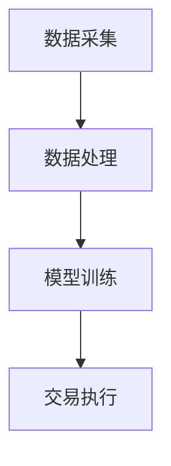

                 


# AI驱动的对冲基金策略分析

---

## 关键词：AI，对冲基金，金融，策略，机器学习，深度学习

---

## 摘要：本文将探讨AI技术如何驱动对冲基金策略的优化与创新。通过对AI算法、数据驱动方法和金融市场的深度分析，揭示AI在对冲基金中的应用潜力。文章将从基础概念、算法原理、系统架构到实战案例，全面解析AI驱动的对冲基金策略分析的核心思想与实现路径。

---

# 第1章: 对冲基金与AI技术概述

## 1.1 对冲基金的基本概念

### 1.1.1 对冲基金的定义与特点
对冲基金是一种通过投资多种金融工具，利用市场波动进行套利和对冲风险的金融投资工具。其核心目标是通过多元化的投资策略，在不同市场环境下实现稳健收益。对冲基金的特点包括：
- **多元化投资**：通过同时投资于多空头寸降低市场风险。
- **杠杆效应**：允许使用杠杆放大收益或亏损。
- **策略多样性**：包括股票多空、商品期货、套利等多种策略。

### 1.1.2 对冲基金的主要策略类型
对冲基金的策略可以分为以下几类：
- **股票多空策略**：通过买入低估股票并卖出高估股票获利。
- **商品期货套利**：利用商品价格差异在不同市场间套利。
- **量化策略**：基于数学模型和算法进行交易。

### 1.1.3 对冲基金在金融市场的地位与作用
对冲基金在金融市场中扮演着重要的角色，既是重要的市场参与者，也是金融创新的推动者。它们通过灵活的投资策略和高效的资金运作，为投资者提供了多样化的投资选择，同时也对市场价格发现和流动性提供起到了积极作用。

---

## 1.2 AI技术在金融领域的应用背景

### 1.2.1 AI技术的基本概念与发展趋势
人工智能（AI）是一种模拟人类智能的技术，涵盖机器学习、自然语言处理、计算机视觉等领域。近年来，AI技术在金融领域的应用逐渐成熟，尤其是在数据分析、风险控制和交易策略优化方面表现突出。

### 1.2.2 AI在金融领域的典型应用案例
AI技术在金融领域的应用案例包括：
- **智能投顾**：基于AI算法为投资者提供个性化的投资建议。
- **风险管理**：利用AI模型预测市场风险并制定应对策略。
- **高频交易**：通过AI算法实现毫秒级交易决策。

### 1.2.3 对冲基金与AI技术的结合潜力
对冲基金的核心是策略创新，而AI技术为策略优化提供了强大的工具。通过AI算法，对冲基金可以更高效地分析市场数据、识别投资机会，并实现自动化交易。

---

## 1.3 本章小结
本章介绍了对冲基金的基本概念及其在金融市场中的地位，同时分析了AI技术在金融领域的应用背景和潜力。通过对冲基金与AI技术的结合，我们可以看到AI在对冲基金策略优化中的巨大潜力。

---

# 第2章: AI驱动的对冲基金策略分析核心概念

## 2.1 数据驱动的对冲基金策略

### 2.1.1 数据在对冲基金策略中的重要性
数据是AI驱动对冲基金策略的核心。通过对海量数据的分析，AI模型可以发现市场中的规律和机会。数据的来源包括市场数据、公司财务数据、新闻文本等。

### 2.1.2 数据的类型与特征分析
数据可以分为以下几类：
- **市场数据**：包括股票价格、期货价格、指数等。
- **公司数据**：包括财务报表、公司新闻、管理层变动等。
- **外部数据**：包括经济指标、政策变化、自然灾害等。

### 2.1.3 数据预处理与特征工程
数据预处理包括清洗、标准化和特征提取。特征工程的目标是将数据转化为对模型友好的形式，例如通过主成分分析（PCA）提取关键特征。

---

## 2.2 AI算法在对冲基金策略中的应用

### 2.2.1 机器学习算法在金融中的应用
机器学习算法广泛应用于金融领域的分类、回归和聚类问题。例如，使用支持向量机（SVM）进行股票分类，使用随机森林进行预测。

### 2.2.2 深度学习算法在金融中的应用
深度学习算法在金融领域的应用包括时间序列预测和自然语言处理。例如，使用长短期记忆网络（LSTM）预测股票价格，使用自然语言处理技术分析公司新闻。

### 2.2.3 算法选择与优化策略
算法选择的关键在于数据类型和问题性质。例如，对于时间序列预测，可能更适合使用LSTM；对于分类问题，可能更适合使用SVM或随机森林。

---

## 2.3 对冲基金策略的AI模型构建

### 2.3.1 模型构建的基本流程
模型构建流程包括数据收集、特征工程、模型训练、模型验证和模型部署。每个阶段都需要仔细设计和优化。

### 2.3.2 模型训练与验证
模型训练需要使用训练数据，并通过交叉验证评估模型的性能。模型验证的目标是确保模型的泛化能力。

### 2.3.3 模型的实时监控与优化
模型部署后需要实时监控其表现，并根据市场变化进行优化。例如，当市场环境发生变化时，需要重新训练模型。

---

## 2.4 本章小结
本章详细介绍了AI驱动的对冲基金策略的核心概念，包括数据驱动的策略、AI算法的应用以及模型构建的流程。通过对这些内容的分析，我们可以更好地理解AI如何驱动对冲基金策略的优化。

---

# 第3章: 对冲基金策略分析的数学模型与算法原理

## 3.1 线性回归模型

### 3.1.1 线性回归的基本原理
线性回归是一种统计学习方法，用于建立因变量与自变量之间的线性关系。其数学公式为：
$$ y = \beta_0 + \beta_1x + \epsilon $$

### 3.1.2 线性回归的实现流程
线性回归的实现流程包括数据收集、数据预处理、模型训练和模型评估。

---

## 3.2 支持向量机（SVM）

### 3.2.1 SVM的基本原理
支持向量机是一种监督学习算法，用于分类和回归问题。其数学公式为：
$$ \text{min} \frac{1}{2}\|w\|^2 + C\sum_{i=1}^n \xi_i $$
$$ y_i(w \cdot x_i + b) \geq 1 - \xi_i $$
$$ \xi_i \geq 0 $$

### 3.2.2 SVM的实现流程
SVM的实现流程包括数据收集、数据预处理、模型训练和模型评估。

---

## 3.3 随机森林

### 3.3.1 随机森林的基本原理
随机森林是一种基于决策树的集成学习算法，通过投票或加权的方式进行预测。其数学公式为：
$$ y = \text{mode}(f(x_1), f(x_2), ..., f(x_n)) $$

### 3.3.2 随机森林的实现流程
随机森林的实现流程包括数据收集、数据预处理、模型训练和模型评估。

---

## 3.4 神经网络与深度学习

### 3.4.1 神经网络的基本结构
神经网络由输入层、隐藏层和输出层组成。其数学公式为：
$$ y = \sigma(w x + b) $$

### 3.4.2 深度学习模型（如RNN、LSTM）的数学公式
长短期记忆网络（LSTM）的数学公式为：
$$ \text{LSTM}(x_t) = \text{tanh}(f_t \cdot x_t + g_t \cdot h_{t-1}) $$

---

## 3.5 本章小结
本章详细介绍了对冲基金策略分析中常用的数学模型与算法原理，包括线性回归、支持向量机、随机森林和神经网络。通过对这些模型的分析，我们可以更好地理解AI技术在对冲基金策略中的应用。

---

# 第4章: 对冲基金策略分析的系统架构与实现

## 4.1 系统架构设计

### 4.1.1 系统功能模块划分
对冲基金策略分析系统包括数据采集模块、数据处理模块、模型训练模块和交易执行模块。

### 4.1.2 系统架构图
以下是对冲基金策略分析系统的架构图：


### 4.1.3 系统交互流程
系统交互流程包括数据采集、数据处理、模型训练和交易执行四个阶段。

---

## 4.2 系统实现细节

### 4.2.1 数据采集模块
数据采集模块负责从金融市场中获取实时数据，包括股票价格、期货价格等。

### 4.2.2 数据处理模块
数据处理模块负责对采集到的数据进行清洗、标准化和特征提取。

### 4.2.3 模型训练模块
模型训练模块负责使用机器学习算法对数据进行建模和训练。

### 4.2.4 交易执行模块
交易执行模块负责根据模型的预测结果执行实际交易。

---

## 4.3 本章小结
本章详细介绍了对冲基金策略分析系统的架构设计与实现细节，包括功能模块划分、系统架构图和系统交互流程。

---

# 第5章: 对冲基金策略分析的实战案例

## 5.1 实战案例介绍

### 5.1.1 案例背景
本案例旨在通过AI技术实现股票价格预测，帮助对冲基金制定交易策略。

### 5.1.2 数据来源
数据来源于公开的股票市场数据，包括历史价格、成交量等。

---

## 5.2 系统实现

### 5.2.1 环境安装
需要安装Python、TensorFlow、Pandas等工具。

### 5.2.2 核心代码实现
以下是股票价格预测的Python代码示例：
```python
import pandas as pd
import numpy as np
from sklearn.model_selection import train_test_split
from tensorflow.keras.models import Sequential
from tensorflow.keras.layers import LSTM, Dense

# 数据加载与预处理
data = pd.read_csv('stock_prices.csv')
X = data.iloc[:, :-1].values
y = data.iloc[:, -1].values

X_train, X_test, y_train, y_test = train_test_split(X, y, test_size=0.2)

# 模型构建
model = Sequential()
model.add(LSTM(50, input_shape=(X_train.shape[1], 1)))
model.add(Dense(1))
model.compile(loss='mean_squared_error', optimizer='adam')

# 模型训练
model.fit(X_train, y_train, epochs=100, batch_size=32)

# 模型预测
y_pred = model.predict(X_test)
```

### 5.2.3 代码解读与分析
上述代码实现了股票价格的LSTM预测模型，包括数据加载、模型构建、模型训练和模型预测四个步骤。

---

## 5.3 案例分析与结果解读

### 5.3.1 模型训练结果
模型在训练集上的表现可以通过损失函数的下降趋势来评估。

### 5.3.2 模型预测结果
模型预测结果可以通过与实际数据的对比来评估其准确性。

---

## 5.4 本章小结
本章通过一个实战案例详细介绍了AI驱动的对冲基金策略分析的实现过程，包括环境安装、代码实现和案例分析。

---

# 第6章: 对冲基金策略分析的总结与展望

## 6.1 本章总结
本文详细介绍了AI驱动的对冲基金策略分析的核心概念、算法原理和系统实现。通过对冲基金与AI技术的结合，我们可以实现更高效、更精准的投资策略。

---

## 6.2 未来展望
未来，随着AI技术的不断发展，对冲基金策略分析将更加智能化和自动化。例如，通过强化学习实现动态交易策略优化，通过自然语言处理技术分析非结构化数据。

---

## 6.3 注意事项
在实际应用中，需要注意模型的泛化能力、数据质量和交易成本等问题。

---

## 6.4 最佳实践 Tips
- **数据质量**：确保数据的准确性和完整性。
- **模型优化**：定期重新训练模型以适应市场变化。
- **风险管理**：建立有效的风险控制机制。

---

## 6.5 本章小结
本章总结了全文内容，并展望了未来的研究方向和应用前景。

---

# 附录

## 附录A: 工具安装与配置

### 附录A.1 Python安装指南
提供Python的安装步骤和环境配置建议。

### 附录A.2 TensorFlow安装指南
提供TensorFlow的安装步骤和使用示例。

---

## 附录B: 数据来源与处理

### 附录B.1 数据获取方法
提供股票数据的获取方法，例如通过API接口或爬虫技术。

### 附录B.2 数据预处理代码
提供数据清洗和特征提取的Python代码示例。

---

## 附录C: 算法优化技巧

### 附录C.1 超参数优化方法
提供机器学习模型的超参数优化方法，例如网格搜索和随机搜索。

### 附录C.2 模型部署技巧
提供模型部署的最佳实践，例如使用Docker容器化部署。

---

## 作者：AI天才研究院/AI Genius Institute & 禅与计算机程序设计艺术 /Zen And The Art of Computer Programming

