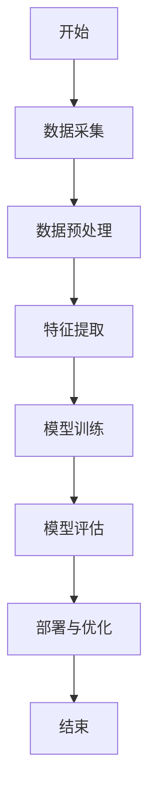

                 


# AI驱动的市场微观结构变化影响分析

**关键词**：AI、市场微观结构、算法、金融、订单簿

**摘要**：本文系统地探讨了人工智能（AI）技术如何驱动金融市场微观结构的变化，分析了这些变化对市场参与者、价格发现机制以及整体市场运行效率的影响。通过理论分析、算法设计和案例研究，本文揭示了AI在市场微观结构变化中的核心作用，并提出了未来研究和实践的方向。

---

## 第3章: AI驱动的市场微观结构变化算法

### 3.1 算法原理概述

#### 3.1.1 基于AI的市场预测模型

AI在金融市场中的应用主要依赖于机器学习算法，这些算法能够从历史数据中学习市场行为模式，并预测未来的价格走势。常用的算法包括：

- **线性回归**：用于预测价格的变化趋势。
- **支持向量机（SVM）**：用于分类和回归分析，常用于识别市场状态的变化。
- **随机森林**：用于特征重要性分析和非线性关系建模。
- **神经网络**：用于复杂模式识别，如深度学习模型（LSTM）用于时间序列分析。

#### 3.1.2 微观结构变化的算法框架

AI驱动的市场微观结构变化算法通常包括以下步骤：

1. **数据采集**：收集订单簿数据、交易数据和市场参与者行为数据。
2. **特征提取**：从订单簿中提取有用的特征，如订单深度、买卖价差和订单撤销率。
3. **模型训练**：使用机器学习算法训练模型，识别市场微观结构的变化模式。
4. **预测与干预**：根据模型预测结果，调整交易策略或干预市场行为。

#### 3.1.3 算法的核心思想与步骤

AI算法的核心思想是通过学习历史数据，发现市场微观结构中的潜在模式，并利用这些模式预测未来的市场行为。具体步骤如下：

1. 数据预处理：清洗和标准化数据，去除噪声。
2. 特征工程：选择与市场微观结构变化相关的特征。
3. 模型训练：使用训练数据训练AI模型。
4. 模型评估：通过回测和交叉验证评估模型的性能。
5. 部署与优化：将模型部署到实际交易系统中，并根据实际情况进行优化。

---

### 3.2 算法流程图

以下是AI驱动的市场微观结构变化算法的流程图：



---

### 3.3 算法实现代码

以下是基于Python的简单AI算法实现，用于预测市场价格变化：

```python
import numpy as np
import pandas as pd
from sklearn.model_selection import train_test_split
from sklearn.linear_model import LinearRegression

# 示例数据集
data = pd.DataFrame({
    'price': np.random.rand(100),
    'volume': np.random.randint(1, 100, 100),
    'order_book_depth': np.random.rand(100),
    'bid_ask_spread': np.random.rand(100)
})

# 数据预处理
X = data[['order_book_depth', 'bid_ask_spread']]
y = data['price']

# 数据分割
X_train, X_test, y_train, y_test = train_test_split(X, y, test_size=0.2)

# 模型训练
model = LinearRegression()
model.fit(X_train, y_train)

# 模型预测
y_pred = model.predict(X_test)

# 模型评估
print('预测结果:', y_pred)
print('真实结果:', y_test.values)
print('模型系数:', model.coef_)
```

---

### 3.4 算法的数学模型与公式

AI算法的核心是通过数学模型发现数据中的潜在关系。例如，线性回归模型可以表示为：

$$ y = \beta_0 + \beta_1 x_1 + \beta_2 x_2 + \ldots + \beta_n x_n + \epsilon $$

其中：
- $y$ 是目标变量（如价格）。
- $x_i$ 是输入特征。
- $\beta_i$ 是回归系数。
- $\epsilon$ 是误差项。

在机器学习中，我们通常使用最小二乘法来估计回归系数：

$$ \hat{\beta} = (X^T X)^{-1} X^T y $$

其中，$X$ 是特征矩阵，$y$ 是目标向量。

---

### 3.5 本章小结

#### 3.5.1 核心概念总结

本章详细讲解了AI驱动的市场微观结构变化算法的基本原理，包括数据采集、特征提取、模型训练和预测等步骤。通过具体的代码示例和数学公式，我们展示了如何利用AI技术预测市场价格变化。

#### 3.5.2 算法实现的关键点

- 数据预处理是模型训练的基础，特征工程在算法性能中起着关键作用。
- 线性回归是一种简单的预测模型，适用于线性关系的分析，但在实际应用中可能需要更复杂的模型（如神经网络）来处理非线性关系。

#### 3.5.3 未来研究方向

未来的研究可以集中在以下几个方面：
- 开发更复杂的AI模型，如深度学习模型，以捕捉市场微观结构中的非线性关系。
- 研究如何结合多种数据源（如新闻、社交媒体数据）来提高模型的预测能力。
- 探讨AI算法在不同市场环境下的表现，优化模型的鲁棒性。

---

通过以上内容，我们详细分析了AI技术在金融市场微观结构变化中的应用，并通过具体案例展示了算法的实现过程。希望这些内容能够为读者提供有价值的见解，并激发进一步的研究和实践。

