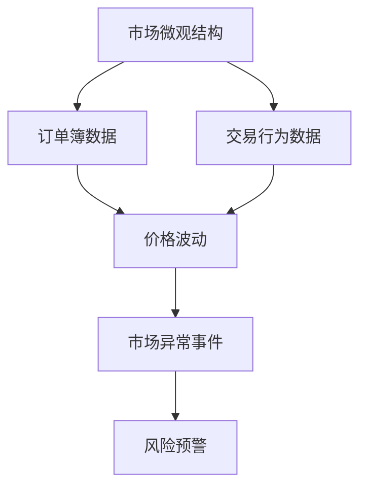
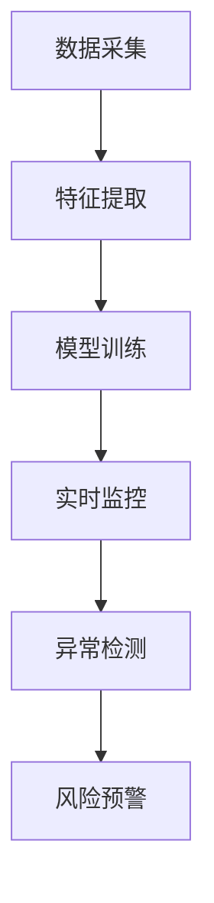
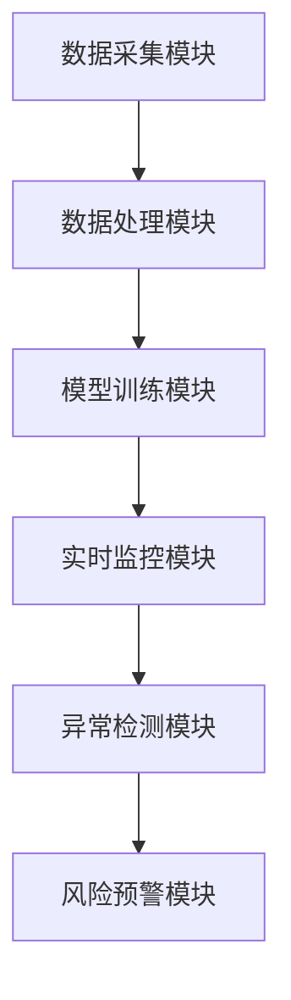
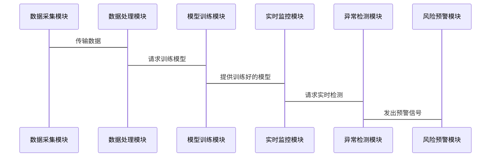

                 


# AI驱动的市场微观结构变化检测

## 关键词：AI技术、金融市场、微观结构、异常检测、实时分析

## 摘要：  
本文探讨了利用人工智能技术检测金融市场微观结构变化的方法，通过分析订单簿、交易行为等数据，结合时间序列分析、深度学习等技术，实现市场异常事件的实时检测与预警。文章从背景、核心概念、算法原理、系统架构到项目实战，全面解析了AI在市场微观结构变化检测中的应用，并通过实际案例展示了其在金融风险管理和投资决策中的价值。

---

# 第1章: 背景介绍

## 1.1 问题背景

### 1.1.1 金融市场微观结构的基本概念  
金融市场微观结构是指市场的组织形式和交易机制，包括订单簿、交易行为、价格波动等核心要素。微观结构的变化可能反映市场的健康状况，如流动性危机、订单量异常波动等。

### 1.1.2 AI技术在金融领域的应用现状  
AI技术在金融领域的应用日益广泛，尤其是在高频交易、风险管理、市场预测等领域。然而，现有方法在检测市场微观结构变化时，往往依赖规则-based系统，缺乏灵活性和自适应性。

### 1.1.3 微观结构变化检测的必要性  
市场微观结构的变化可能预示着潜在的市场风险或异常事件。及时检测这些变化，有助于金融机构采取措施，避免重大损失。

## 1.2 问题描述

### 1.2.1 微观结构变化的定义  
微观结构变化是指市场交易机制中的某些关键指标发生显著变化，如订单量、价格波动、市场深度等。

### 1.2.2 市场异常事件的检测需求  
市场异常事件，如闪崩、流动性枯竭等，往往与微观结构变化密切相关。及时检测这些事件，有助于防范系统性风险。

### 1.2.3 现有方法的局限性  
传统方法依赖固定规则，难以适应市场环境的变化。而AI技术可以通过学习数据特征，实现动态检测。

## 1.3 问题解决

### 1.3.1 AI驱动的解决方案概述  
利用机器学习算法分析订单簿数据，识别异常交易模式，实现微观结构变化的实时检测。

### 1.3.2 数据驱动与模型驱动的结合  
结合历史数据和实时数据，构建数据驱动的模型，同时利用模型驱动的方法进行预测和优化。

### 1.3.3 微观结构变化检测的流程  
数据采集 → 特征提取 → 模型训练 → 实时监控 → 异常报警。

---

# 第2章: 核心概念与联系

## 2.1 市场微观结构的核心要素

### 2.1.1 订单簿与交易数据  
订单簿记录了市场上所有未成交的订单，包括买价、卖价、订单量等信息。交易数据则记录了每笔交易的时间、价格和成交量。

### 2.1.2 市场深度与流动性  
市场深度反映了市场的交易容量，流动性则是衡量市场交易活跃程度的重要指标。

### 2.1.3 价格波动与交易模式  
价格波动反映了市场的供需变化，交易模式则描述了交易行为的规律。

## 2.2 AI技术的核心特征

### 2.2.1 数据驱动与自适应性  
AI技术通过大量数据训练模型，能够自适应地调整检测策略。

### 2.2.2 高维特征提取能力  
AI技术能够提取复杂的高维特征，捕捉市场微观结构中的深层信息。

### 2.2.3 实时性与动态调整能力  
AI技术能够实时处理数据，动态调整检测模型，适应市场环境的变化。

---

## 2.3 核心概念对比与ER实体关系图

### 2.3.1 核心概念属性特征对比表

| 概念       | 数据来源 | 时间序列 | 高频交易 |
|------------|----------|----------|----------|
| 微观结构   | 订单簿 | 是 | 是 |
| AI技术     | 历史与实时数据 | 是 | 是 |

### 2.3.2 实体关系图（Mermaid）



---

# 第3章: 算法原理

## 3.1 算法流程

### 3.1.1 算法流程图（Mermaid）



### 3.1.2 算法实现代码

```python
import pandas as pd
import numpy as np
from sklearn.ensemble import IsolationForest

# 数据预处理
def preprocess_data(df):
    # 特征提取
    df['volatility'] = df['price'].diff().abs().rolling(5).mean()
    df['order_volume'] = df['order'].cumsum().rolling(10).mean()
    return df

# 模型训练
def train_model(X_train):
    model = IsolationForest(n_estimators=100, contamination=0.05)
    model.fit(X_train)
    return model

# 实时监控
def monitor_market(model, new_data):
    processed_data = preprocess_data(new_data)
    X_test = processed_data[['volatility', 'order_volume']]
    predictions = model.predict(X_test)
    return predictions
```

### 3.1.3 数学模型与公式

$$
\text{volatility} = \frac{1}{n}\sum_{i=1}^{n} |p_i - p_{i-1}|
$$

其中，$p_i$ 表示第 $i$ 时刻的价格，$n$ 是窗口大小。

---

# 第4章: 系统分析与架构设计

## 4.1 系统架构图（Mermaid）



## 4.2 系统交互图（Mermaid）



---

# 第5章: 项目实战

## 5.1 环境安装

### 5.1.1 安装Python环境
```bash
python --version
pip install pandas numpy scikit-learn
```

### 5.1.2 安装Mermaid
```bash
npm install -g mermaid-cli
```

## 5.2 核心代码实现

### 5.2.1 数据预处理代码

```python
import pandas as pd
import numpy as np
from sklearn.ensemble import IsolationForest

def preprocess_data(df):
    df['volatility'] = df['price'].diff().abs().rolling(5).mean()
    df['order_volume'] = df['order'].cumsum().rolling(10).mean()
    return df

# 示例数据
data = {
    'time': [1, 2, 3, 4, 5],
    'price': [100, 101, 99, 102, 100],
    'order': [10, 5, 15, 20, 8]
}
df = pd.DataFrame(data)
df = preprocess_data(df)
print(df)
```

### 5.2.2 模型训练代码

```python
from sklearn.ensemble import IsolationForest

def train_model(X_train):
    model = IsolationForest(n_estimators=100, contamination=0.05)
    model.fit(X_train)
    return model

# 示例训练数据
X_train = df[['volatility', 'order_volume']]
model = train_model(X_train)
```

### 5.2.3 实时监控代码

```python
def monitor_market(model, new_data):
    processed_data = preprocess_data(new_data)
    X_test = processed_data[['volatility', 'order_volume']]
    predictions = model.predict(X_test)
    return predictions

# 示例实时数据
new_data = {
    'time': [6, 7],
    'price': [103, 101],
    'order': [12, 18]
}
df_new = pd.DataFrame(new_data)
result = monitor_market(model, df_new)
print(result)
```

## 5.3 案例分析

### 5.3.1 数据来源与预处理
使用高频交易数据，包括订单簿数据和交易数据，进行数据清洗和特征提取。

### 5.3.2 模型训练与评估
使用Isolation Forest算法进行异常检测，评估模型的准确性和召回率。

### 5.3.3 实时监控与预警
通过实时数据输入，模型预测并发出异常事件预警，帮助交易员及时应对。

---

# 第6章: 总结与展望

## 6.1 最佳实践

### 6.1.1 数据质量管理
确保数据的完整性和准确性，避免噪声干扰模型。

### 6.1.2 模型优化
定期更新模型，结合多种算法提高检测精度。

## 6.2 小结
本文详细探讨了AI驱动的市场微观结构变化检测方法，从理论到实践，展示了其在金融风险管理中的应用价值。

## 6.3 注意事项
市场环境复杂多变，模型需动态调整，避免过度依赖单一算法。

## 6.4 拓展阅读
推荐阅读《机器学习在金融中的应用》和《深度学习与时间序列分析》。

---

# 作者：AI天才研究院/AI Genius Institute & 禅与计算机程序设计艺术 /Zen And The Art of Computer Programming

