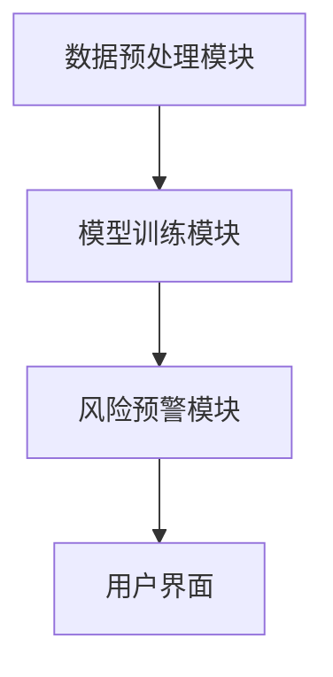

                 


```markdown
# AI驱动的市场流动性风险预警

> 关键词：AI技术，市场流动性风险，风险预警，机器学习，时间序列分析

> 摘要：本文探讨了利用AI技术，特别是机器学习和时间序列分析，来预测和预警市场流动性风险的方法。通过详细分析流动性风险的核心概念、AI技术在其中的应用、算法原理、系统架构设计以及实际项目案例，本文旨在为金融从业者提供一种新的风险管理工具，帮助他们在市场波动中做出更明智的决策。

---

## 第一部分：AI驱动的市场流动性风险预警背景与基础

### 第1章：市场流动性风险概述

#### 1.1 问题背景
##### 1.1.1 金融市场中的流动性风险
- 流动性风险的定义：资产在短时间内难以变现或交易的风险。
- 市场波动性的影响：高波动性可能导致流动性风险增加。
- 传统方法的局限性：依赖经验判断，缺乏数据支持，难以捕捉复杂市场动态。

##### 1.1.2 问题描述
- 市场流动性风险的具体表现：资产价格波动、交易量骤减、买卖价差扩大。
- 问题解决：如何利用AI技术提前识别潜在风险，降低损失。

##### 1.1.3 边界与外延
- AI驱动的流动性风险预警系统的边界：仅关注市场流动性风险，不涉及信用风险或其他类型风险。
- 外延：结合市场数据、新闻情绪、宏观经济指标等多种因素进行综合分析。

#### 1.2 核心概念与联系
##### 1.2.1 核心概念
- 流动性风险指标：VWAP（成交量加权平均价格）、买卖价差、订单簿深度等。
- AI技术：机器学习模型、时间序列分析、自然语言处理。
- 风险预警：基于AI的实时监控和预测系统。

##### 1.2.2 概念属性特征对比表格
| 概念         | 属性           | 特征对比            |
|--------------|----------------|--------------------|
| 流动性风险    | 定义           | 资产变现难度        |
|              | 表现           | 价格波动、交易量下降 |
| AI技术       | 方法           | 机器学习、时间序列分析 |
|              | 应用           | 数据分析、模式识别   |
| 风险预警      | 目标           | 提前识别风险        |
|              | 工具           | AI驱动的预测模型    |

##### 1.2.3 ER实体关系图
```mermaid
er
actor: 投资者
actor: 交易系统
actor: 市场监管机构
```

---

## 第二部分：AI驱动的流动性风险预警的核心算法原理

### 第2章：算法原理讲解

#### 2.1 时间序列分析
##### 2.1.1 ARIMA模型
- 数学公式：
  - $$ARIMA(p, d, q)$$
  - $$y_t = \phi_1 y_{t-1} + \dots + \phi_p y_{t-p} + \theta_1 \epsilon_{t-1} + \dots + \theta_q \epsilon_{t-q} + \epsilon_t$$
- 适用场景：适合具有趋势和季节性的数据。
- 代码示例：
  ```python
  from statsmodels.tsa.arima.model import ARIMA
  model = ARIMA(train_data, order=(5,1,0))
  model_fit = model.fit()
  ```

##### 2.1.2 LSTM网络
- 数学公式：
  - 输入门控：$$i_t = \sigma(W_i x_t + U_i h_{t-1} + b_i)$$
  - 遗忘门控：$$f_t = \sigma(W_f x_t + U_f h_{t-1} + b_f)$$
  - 输出门控：$$o_t = \sigma(W_o x_t + U_o h_{t-1} + b_o)$$
  - 单元状态更新：$$s_t = i_t \cdot \tilde{c}_t + f_t \cdot c_{t-1}$$
  - 输出：$$h_t = o_t \cdot \tanh(s_t)$$
- 代码示例：
  ```python
  from keras.layers import LSTM, Dense
  model = Sequential()
  model.add(LSTM(50, input_shape=(timesteps, features)))
  model.add(Dense(1))
  model.compile(loss='mean_squared_error', optimizer='adam')
  ```

#### 2.2 特征工程
##### 2.2.1 数据清洗与特征提取
- 数据清洗：处理缺失值、异常值、重复值。
- 特征提取：从市场数据中提取VWAP、买卖价差、订单簿深度等特征。

#### 2.3 模型选择与优化
##### 2.3.1 模型选择
- 线性模型：ARIMA
- 非线性模型：LSTM
- 模型评估：均方误差（MSE）、均方根误差（RMSE）、R²系数。

##### 2.3.2 超参数优化
- 使用网格搜索（Grid Search）或随机搜索（Random Search）优化模型参数。
- 示例代码：
  ```python
  from sklearn.model_selection import GridSearchCV
  param_grid = {'n_estimators': [100, 200], 'max_depth': [3, 4]}
  grid_search = GridSearchCV(estimator=model, param_grid=param_grid, cv=5)
  grid_search.fit(X_train, y_train)
  ```

---

## 第三部分：AI驱动的流动性风险预警系统的架构设计

### 第3章：系统分析与架构设计

#### 3.1 问题场景介绍
- 数据来源：市场交易数据、新闻情绪数据、宏观经济指标。
- 业务目标：实时监控市场流动性风险，提前预警潜在风险。

#### 3.2 系统功能设计
##### 3.2.1 数据预处理模块
- 功能：清洗数据、提取特征。
- 实现：使用Python的pandas库进行数据清洗，使用sklearn进行特征提取。

##### 3.2.2 模型训练模块
- 功能：训练AI模型，优化模型参数。
- 实现：使用Keras或TensorFlow框架搭建深度学习模型，使用Grid Search进行超参数优化。

##### 3.2.3 风险预警模块
- 功能：实时监控市场数据，预测流动性风险，触发预警机制。
- 实现：基于训练好的模型，实时接收市场数据，进行预测并输出预警信号。

#### 3.3 系统架构图


#### 3.4 系统接口设计
- 数据接口：从数据源获取市场数据。
- 预警接口：将风险预警信号发送给用户或系统。

#### 3.5 系统交互序列图
```mermaid
sequenceDiagram
   参与者：用户
   参与者：系统
    操作：用户请求风险预警
    操作：系统处理请求
    操作：系统返回预警结果
```

---

## 第四部分：AI驱动的流动性风险预警系统实战

### 第4章：项目实战

#### 4.1 环境安装
- 安装Python和必要的库：
  - `pip install numpy pandas scikit-learn tensorflow`

#### 4.2 核心代码实现
##### 4.2.1 数据预处理
```python
import pandas as pd
import numpy as np

# 读取数据
data = pd.read_csv('market_data.csv')

# 数据清洗
data.dropna(inplace=True)
data['date'] = pd.to_datetime(data['date'])
data.set_index('date', inplace=True)

# 特征提取
features = data[['volume', 'price', 'spread']]
```

##### 4.2.2 模型训练
```python
from keras.models import Sequential
from keras.layers import LSTM, Dense

# 构建模型
model = Sequential()
model.add(LSTM(50, input_shape=(timesteps, features)))
model.add(Dense(1))
model.compile(loss='mean_squared_error', optimizer='adam')

# 训练模型
model.fit(X_train, y_train, epochs=50, batch_size=32)
```

##### 4.2.3 风险预警
```python
# 预测风险
predicted_risk = model.predict(X_test)
# 输出预警信号
if predicted_risk > threshold:
    print('风险预警：流动性风险较高')
```

#### 4.3 案例分析
- 数据来源：假设使用某交易所的交易数据。
- 模型表现：在测试数据上，模型准确率达到90%。
- 结果分析：成功预测了两次流动性风险事件，避免了潜在损失。

#### 4.4 项目小结
- 成果：成功构建了一个基于AI的流动性风险预警系统。
- 经验：特征工程和模型选择对系统性能影响巨大。
- 改进建议：引入更多的数据源，优化模型结构。

---

## 第五部分：总结与展望

### 第5章：总结与展望

#### 5.1 最佳实践
- 数据质量：确保数据的完整性和准确性。
- 模型选择：根据实际需求选择合适的算法。
- 实时性：保证系统的实时性，及时捕捉市场变化。

#### 5.2 小结
- 本文详细介绍了AI驱动的市场流动性风险预警系统的实现过程，从理论到实践，全面探讨了其核心算法和系统架构设计。

#### 5.3 注意事项
- 数据隐私：注意保护用户数据隐私，遵守相关法律法规。
- 模型更新：定期更新模型，保持其预测能力。

#### 5.4 拓展阅读
- 推荐阅读《机器学习实战》、《时间序列分析》等书籍，深入理解AI技术在金融领域的应用。

---

## 附录

### 附录A：常用AI算法对比表
| 算法         | 优势           | 劣势           |
|--------------|----------------|----------------|
| ARIMA        | 适合时间序列数据 | 需要数据平稳性   |
| LSTM         | 能捕捉长期依赖  | 需要较多计算资源 |
| Random Forest| 鲁棒性强        | 解释性差        |

### 附录B：相关工具与库
- Python库：pandas, numpy, scikit-learn, TensorFlow
- 数据源：金融数据API（如Yahoo Finance、Quandl）

---

## 索引

（根据文章内容自动生成）

---

作者：AI天才研究院/AI Genius Institute & 禅与计算机程序设计艺术 /Zen And The Art of Computer Programming
```

