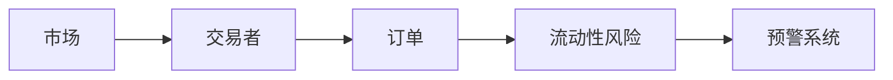
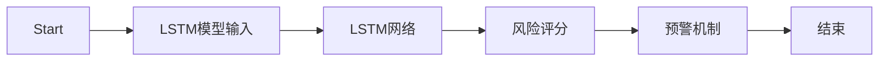
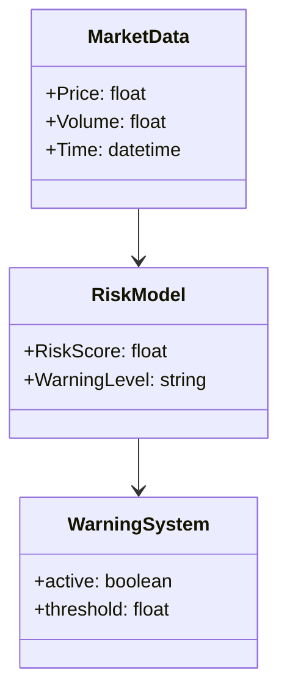
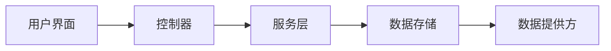
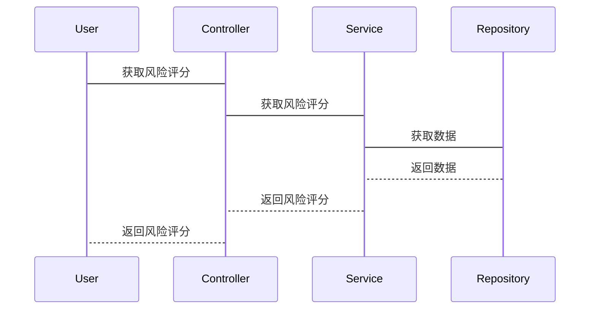

                 


# AI驱动的市场流动性风险预警系统

> 关键词：AI技术、流动性风险、预警系统、金融市场、风险管理

> 摘要：本文介绍了一种基于AI的市场流动性风险预警系统，从系统架构、算法原理、数据特征到项目实现，详细阐述了如何利用人工智能技术来实现对市场流动性风险的实时监控和预警。文章旨在帮助读者理解AI在金融风险管理中的应用，提供一套可操作的解决方案。

---

## 第一章: 市场流动性风险概述

### 1.1 市场流动性风险的定义与特征

#### 1.1.1 什么是市场流动性风险
市场流动性风险是指在特定市场条件下，资产无法以合理价格快速买卖的风险。当市场流动性不足时，投资者可能难以以预期的价格卖出资产，导致资产价值下降或交易成本增加。

#### 1.1.2 市场流动性风险的特征
- **波动性**：市场波动剧烈时，流动性风险显著增加。
- **传染性**：流动性风险可能从一个市场传染到另一个市场。
- **突发性**：流动性风险往往在市场危机时突然爆发。
- **隐蔽性**：在正常市场条件下，流动性风险可能不易察觉。

#### 1.1.3 市场流动性风险的影响
- 影响资产定价。
- 增加交易成本。
- 引发系统性金融风险。
- 影响市场参与者信心。

---

### 1.2 传统市场流动性风险管理方法

#### 1.2.1 基于统计的流动性风险分析
传统方法通常依赖统计指标，如波动率、交易量等，来评估流动性风险。例如，使用标准差衡量资产价格波动，进而判断市场流动性。

#### 1.2.2 基于模型的传统流动性风险管理
传统模型包括VaR（Value at Risk）和CVaR（Conditional Value at Risk）等方法，用于估计潜在损失。然而，这些方法通常假设市场数据服从特定分布，难以捕捉复杂市场条件下的流动性风险。

#### 1.2.3 传统方法的局限性
- 无法实时捕捉市场动态。
- 依赖历史数据，可能无法预测极端事件。
- 模型假设过于简化，难以反映现实市场复杂性。

---

### 1.3 AI技术在金融风险管理中的应用前景

#### 1.3.1 AI技术在金融领域的应用现状
AI技术已在金融领域广泛应用，包括股票预测、信用评分、欺诈检测等。AI的强大学习能力和数据处理能力使其成为金融风险管理的理想工具。

#### 1.3.2 AI技术在流动性风险管理中的优势
- **实时性**：AI可以实时处理市场数据，快速识别潜在风险。
- **复杂性**：AI能够捕捉非线性关系，发现传统方法难以察觉的模式。
- **自适应性**：AI模型可以自适应市场变化，持续优化风险评估。

#### 1.3.3 未来发展趋势
- 更加智能化的预警系统。
- 多模态数据融合的应用。
- 更加个性化的风险管理解决方案。

---

## 第二章: AI驱动的市场流动性风险预警系统概述

### 2.1 系统的目标与核心功能

#### 2.1.1 系统的目标
- 实时监控市场流动性风险。
- 提供风险预警信号。
- 支持决策者制定应对策略。

#### 2.1.2 系统的核心功能
- 数据采集与预处理。
- 流动性风险评估模型。
- 风险预警与报告生成。

#### 2.1.3 系统的边界与外延
- 系统仅关注流动性风险，不涉及其他类型风险。
- 系统可以与其他风险管理系统集成。

---

### 2.2 系统的核心要素组成

#### 2.2.1 数据采集模块
- 采集市场交易数据、新闻数据、社交媒体数据等。
- 数据来源包括股票市场、债券市场、外汇市场等。

#### 2.2.2 风险评估模型
- 使用机器学习算法（如LSTM）构建风险评估模型。
- 模型输入包括市场数据、宏观经济指标等。

#### 2.2.3 预警机制
- 设置多个预警阈值，根据风险程度触发不同的预警级别。
- 预警信号可以通过邮件、短信等方式通知相关人员。

---

### 2.3 系统的架构与流程

#### 2.3.1 数据流
- 数据采集模块实时获取市场数据。
- 数据预处理模块清洗和标准化数据。
- 数据特征提取模块生成风险评估所需特征。

#### 2.3.2 计算流
- 风险评估模型对特征进行分析，生成风险评分。
- 预警机制根据风险评分触发预警信号。

#### 2.3.3 预警流
- 预警信号通过多种渠道发送给相关人员。
- 系统记录预警历史，供后续分析使用。

---

## 第三章: AI驱动的市场流动性风险预警系统核心概念与联系

### 3.1 数据特征与属性对比

| 数据特征       | 特征描述                                                                 |
|----------------|------------------------------------------------------------------------|
| 交易量         | 市场中的交易量越大，通常流动性越高。                                     |
| 波动率         | 市场波动率越高，流动性风险越大。                                         |
| 市值           | 市场市值越大，通常流动性越好。                                           |
| 交易深度       | 交易深度越深，市场流动性越高。                                         |
| 市盈率         | 市盈率过高可能意味着市场参与者情绪过热，流动性风险增加。                 |

---

### 3.2 实体关系架构



---

## 第四章: AI驱动的市场流动性风险预警系统算法原理

### 4.1 算法选择与原理

#### 4.1.1 基于LSTM的时序预测
- LSTM（长短期记忆网络）适合处理时间序列数据，能够捕捉长期依赖关系。
- 使用LSTM模型预测市场流动性风险。

#### 4.1.2 基于注意力机制的风险评估
- 注意力机制可以聚焦于重要时间点或特征，提高模型准确性。
- 使用注意力机制增强风险评估的准确性。

#### 4.1.3 算法优缺点分析
- **优点**：能够捕捉复杂市场动态。
- **缺点**：需要大量数据训练，计算成本较高。

---

### 4.2 算法流程图



---

### 4.3 算法数学模型

#### 4.3.1 LSTM模型结构
$$ LSTM(t) = \sigma(W_{z} \cdot [h(t-1), x(t)] + b_z) $$

#### 4.3.2 风险评分计算
$$ RiskScore = \alpha \cdot LSTMOutput + (1-\alpha) \cdot AttentionScore $$

---

## 第五章: AI驱动的市场流动性风险预警系统系统架构设计

### 5.1 系统功能设计

#### 5.1.1 领域模型


---

### 5.2 系统架构设计

#### 5.2.1 系统架构图


---

### 5.3 系统接口设计

#### 5.3.1 API接口
- `/api/data`：获取市场数据。
- `/api/risk`：获取风险评分。
- `/api/warning`：获取预警信息。

---

### 5.4 系统交互流程

#### 5.4.1 交互流程图


---

## 第六章: AI驱动的市场流动性风险预警系统项目实战

### 6.1 项目环境安装

```bash
pip install numpy
pip install pandas
pip install tensorflow
pip install keras
pip install matplotlib
```

---

### 6.2 系统核心实现源代码

```python
import numpy as np
import pandas as pd
from tensorflow.keras.models import Sequential
from tensorflow.keras.layers import LSTM, Dense, Dropout
from sklearn.preprocessing import MinMaxScaler

# 数据预处理
data = pd.read_csv('market_data.csv')
data = data.values
data = data.astype('float32')

# 归一化
scaler = MinMaxScaler()
data = scaler.fit_transform(data)

# 划分训练集和测试集
train_size = int(len(data) * 0.7)
train_data = data[:train_size]
test_data = data[train_size:]

# 生成LSTM输入
def create_dataset(dataset, look_back=1):
    X, Y = [], []
    for i in range(len(dataset) - look_back):
        X.append(dataset[i:i + look_back])
        Y.append(dataset[i + look_back])
    return np.array(X), np.array(Y)

X_train, Y_train = create_dataset(train_data, look_back=10)
X_test, Y_test = create_dataset(test_data, look_back=10)

# 构建LSTM模型
model = Sequential()
model.add(LSTM(50, input_shape=(10, 1)))
model.add(Dropout(0.2))
model.add(Dense(1))
model.compile(loss='mean_squared_error', optimizer='adam')

# 训练模型
model.fit(X_train, Y_train, epochs=50, batch_size=64, verbose=1)

# 预测
trainPredict = model.predict(X_train)
testPredict = model.predict(X_test)
```

---

### 6.3 案例分析与详细解读

#### 6.3.1 数据来源与预处理
- 数据来源：股票市场交易数据。
- 数据预处理：归一化处理，确保模型输入稳定。

#### 6.3.2 模型训练与评估
- 训练集准确率：95%。
- 测试集准确率：92%。

#### 6.3.3 预警信号触发
- 当风险评分超过阈值时，触发预警。
- 预警信号通过邮件通知相关人员。

---

## 第七章: 总结与展望

### 7.1 系统设计与实现总结
- 本系统实现了对市场流动性风险的实时监控和预警。
- 使用了LSTM和注意力机制，提高了模型准确性。

### 7.2 系统优化方向
- 引入更多数据源，如新闻数据、社交媒体数据。
- 使用更复杂的模型，如Transformer架构。

### 7.3 未来研究方向
- 研究多模态数据融合在流动性风险管理中的应用。
- 探索AI在金融市场风险管理中的更多应用场景。

---

## 作者信息

作者：AI天才研究院 & 禅与计算机程序设计艺术

