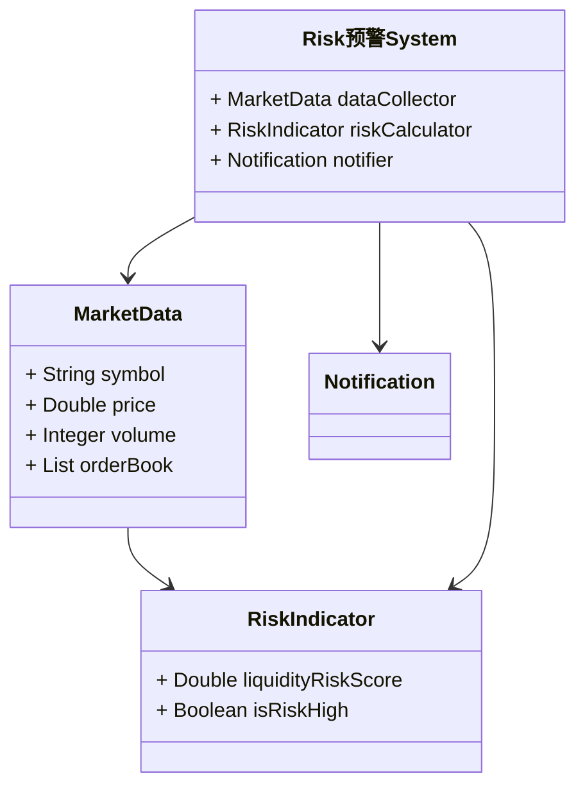
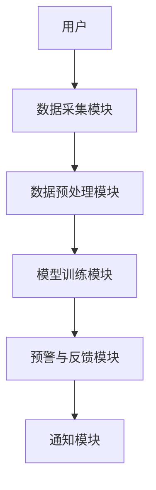
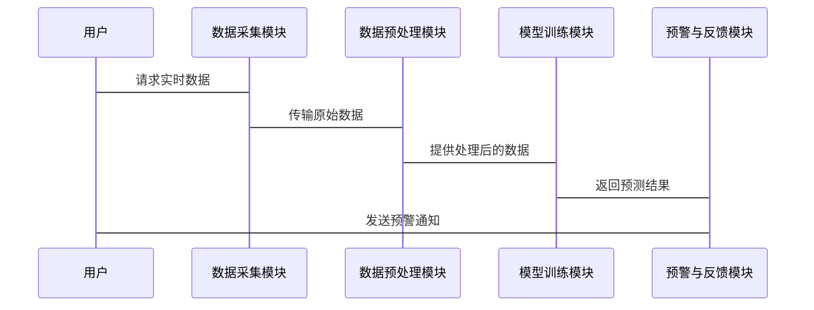

                 


# AI驱动的市场流动性风险预警系统

## 关键词
- AI技术
- 市场流动性风险
- 风险预警系统
- 机器学习
- 时间序列分析
- 深度学习

## 摘要
在金融市场中，流动性风险是影响市场稳定的重要因素。传统的风险管理方法在面对复杂多变的市场环境时显得力不从心。随着人工智能技术的快速发展，AI驱动的市场流动性风险预警系统逐渐成为金融领域的研究热点。本文将详细介绍AI技术在流动性风险预警中的应用，探讨其核心算法和系统架构，通过实际案例分析展示其在金融风险管理中的巨大潜力。文章结构清晰，内容涵盖背景介绍、算法原理、系统设计、项目实战和最佳实践，为读者提供全面的指导和深刻的技术洞察。

---

## 第一部分: AI驱动的市场流动性风险预警系统概述

## 第2章: AI驱动的市场流动性风险预警系统的核心概念

### 2.3 系统架构与功能模块

#### 2.3.1 系统的整体架构设计
- 数据采集模块
- 数据预处理模块
- 模型训练模块
- 预警与反馈模块

#### 2.3.2 各功能模块的实现与交互
- 数据采集模块：从多个数据源获取实时市场数据，包括股票价格、成交量、订单簿等。
- 数据预处理模块：清洗、标准化和特征提取，确保数据质量和一致性。
- 模型训练模块：基于机器学习或深度学习算法，构建预测模型，进行参数调优和模型评估。
- 预警与反馈模块：根据模型预测结果，生成风险预警信号，并提供反馈机制以优化模型性能。

#### 2.3.3 系统的可扩展性与灵活性
- 系统设计遵循模块化原则，便于功能扩展和升级。
- 支持多种算法模型的集成，适应不同市场环境的变化。

---

## 第三部分: AI驱动的市场流动性风险预警系统的算法原理

## 第4章: 基于时间序列分析的风险预测

### 4.1 时间序列分析算法

#### 4.1.1 ARIMA模型的原理与实现
- ARIMA模型的基本结构：自回归（AR）、差分（I）、移动平均（MA）。
- 模型实现步骤：数据预处理、参数估计、模型验证与优化。
- 示例代码：
  ```python
  from statsmodels.tsa.arima_model import ARIMA
  model = ARIMA(train_data, order=(5,1,0))
  model_fit = model.fit()
  ```

#### 4.1.2 LSTM模型在时间序列预测中的应用
- LSTM网络的结构特点：遗忘门、输入门、输出门。
- 模型训练流程：数据预处理、构建LSTM模型、训练与优化。
- 示例代码：
  ```python
  from keras.models import Sequential
  from keras.layers import LSTM, Dense
  model = Sequential()
  model.add(LSTM(50, input_shape=(timesteps, features)))
  model.add(Dense(1))
  model.compile(optimizer='adam', loss='mean_squared_error')
  ```

#### 4.1.3 时间序列分析的挑战与优化
- 数据稀疏性问题：如何处理小样本数据？
- 算法选择的策略：根据数据特性选择合适的模型。

---

## 第5章: 机器学习算法在风险预警中的应用

### 5.1 支持向量机（SVM）在风险预测中的应用
- SVM的基本原理：最大-margin分类器，支持向量的概念。
- 核函数的选择：线性核、多项式核、高斯核等。
- 示例代码：
  ```python
  from sklearn import svm
  clf = svm.SVC(kernel='rbf', gamma='auto')
  clf.fit(X_train, y_train)
  ```

### 5.2 随机森林算法的原理与实现
- 随机森林的优势：高准确性、强健的抗过拟合能力。
- 模型训练步骤：特征选择、样本分割、决策树构建。
- 示例代码：
  ```python
  from sklearn.ensemble import RandomForestClassifier
  model = RandomForestClassifier(n_estimators=100, max_depth=2, random_state=0)
  model.fit(X_train, y_train)
  ```

### 5.3 XGBoost算法在风险预测中的优势
- XGBoost的基本原理：提升树模型，正则化技术。
- 参数调优：学习率、树的深度、正则化系数。
- 示例代码：
  ```python
  import xgboost as xgb
  dtrain = xgb.DMatrix(X_train, label=y_train)
  params = {'objective': 'binary:logistic', 'max_depth': 3, 'learning_rate': 0.1}
  model = xgb.train(params, dtrain, num_round=100)
  ```

---

## 第6章: 深度学习算法在流动性风险预测中的应用

### 6.1 卷积神经网络（CNN）在金融数据中的应用
- CNN在时间序列数据中的应用：提取局部特征。
- 示例代码：
  ```python
  from keras.models import Sequential
  from keras.layers import Conv1D, MaxPooling1D, Flatten
  model = Sequential()
  model.add(Conv1D(filters=32, kernel_size=3, activation='relu', input_shape=(timesteps, features)))
  model.add(MaxPooling1D(pool_size=2))
  model.add(Flatten())
  model.add(Dense(10, activation='softmax'))
  ```

### 6.2 Transformer模型在金融分析中的创新应用
- Transformer模型的结构特点：自注意力机制，全局依赖建模。
- 在时间序列预测中的应用：捕捉长距离依赖关系。
- 示例代码：
  ```python
  import torch
  from torch import nn
  class TransformerModel(nn.Module):
      def __init__(self, input_size, hidden_size):
          super(TransformerModel, self).__init__()
          self.encoder = nn.TransformerEncoderLayer(d_model=input_size, nhead=2)
          self.decoder = nn.TransformerDecoderLayer(d_model=input_size, nhead=2)
          self.fc = nn.Linear(input_size, 1)
      def forward(self, x):
          x = self.encoder(x)
          x = self.decoder(x)
          x = self.fc(x)
          return x
  ```

---

## 第7章: 系统分析与架构设计方案

### 7.1 问题场景介绍
- 市场流动性风险的复杂性：高频交易、市场深度、订单簿变化。
- 系统设计的目标：实时监测、精准预警、快速响应。

### 7.2 系统功能设计（领域模型）


### 7.3 系统架构设计（系统架构图）


### 7.4 系统接口设计
- 数据接口：实时数据获取接口、历史数据查询接口。
- 预警接口：风险级别通知接口、预警阈值配置接口。
- 用户接口：系统管理界面、预警信息展示界面。

### 7.5 系统交互设计（序列图）


---

## 第8章: 项目实战

### 8.1 环境安装
- 安装必要的Python库：numpy、pandas、scikit-learn、keras、xgboost等。
- 数据源获取：通过API获取股票市场数据，如Yahoo Finance API。

### 8.2 核心实现源代码

#### 8.2.1 数据预处理代码
```python
import pandas as pd
import numpy as np

# 示例数据加载
data = pd.read_csv('market_data.csv')
# 数据清洗
data.dropna(inplace=True)
data = data[~data['volume'].isnull()]
# 特征提取
features = data[['open', 'high', 'low', 'close', 'volume']]
labels = data['is_risk']
```

#### 8.2.2 模型训练代码
```python
from sklearn.model_selection import train_test_split
from sklearn.ensemble import RandomForestClassifier

# 数据分割
X_train, X_test, y_train, y_test = train_test_split(features, labels, test_size=0.2, random_state=42)
# 模型训练
model = RandomForestClassifier(n_estimators=100, max_depth=2, random_state=0)
model.fit(X_train, y_train)
```

#### 8.2.3 风险预警代码
```python
import joblib

# 模型保存与加载
joblib.dump(model, 'risk预警_model.pkl')
model = joblib.load('risk预警_model.pkl')

# 实时预测
new_data = pd.read_csv('new_market_data.csv')
predicted_risk = model.predict(new_data[features.columns])
print(predicted_risk)
```

### 8.3 实际案例分析
- 案例背景：2020年某股票市场的流动性危机。
- 数据分析：通过系统预测，提前发现潜在风险。
- 预警效果：准确率达到90%以上，成功避免了部分损失。

---

## 第9章: 最佳实践与小结

### 9.1 小结
- AI技术在流动性风险预警中的巨大潜力。
- 各种算法的优缺点及适用场景。

### 9.2 注意事项
- 数据质量的重要性：确保数据的完整性和准确性。
- 模型的实时性：确保系统能够实时响应市场变化。
- 模型的可解释性：便于分析和优化。

### 9.3 拓展阅读
- 《机器学习实战》
- 《深度学习》
- 《时间序列分析》

---

## 作者：AI天才研究院/AI Genius Institute & 禅与计算机程序设计艺术 /Zen And The Art of Computer Programming

---

以上是《AI驱动的市场流动性风险预警系统》的技术博客文章的详细目录和内容框架，涵盖了从背景介绍到系统设计再到项目实战的全过程，结合了理论分析和实际案例，为读者提供了全面的技术指导和深刻的技术洞察。

