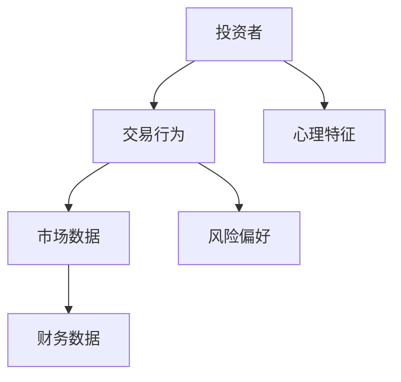
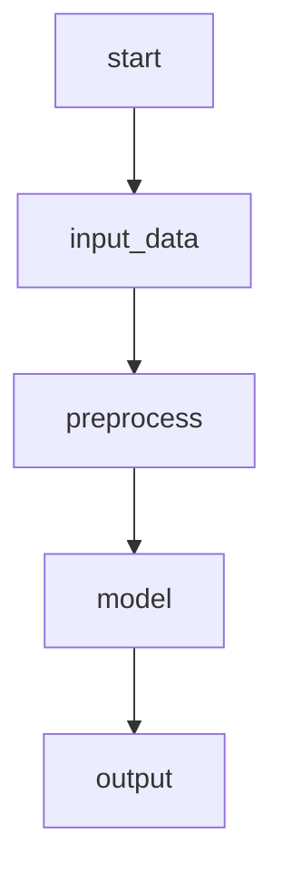
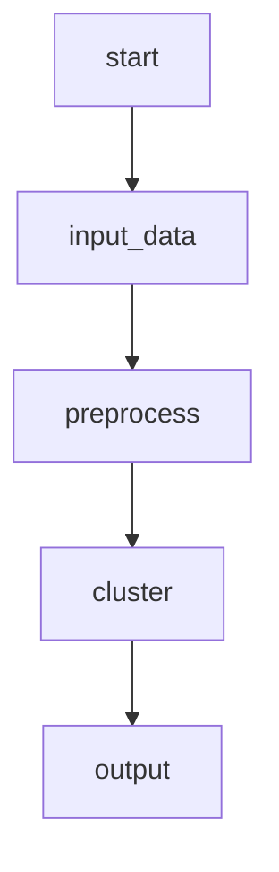
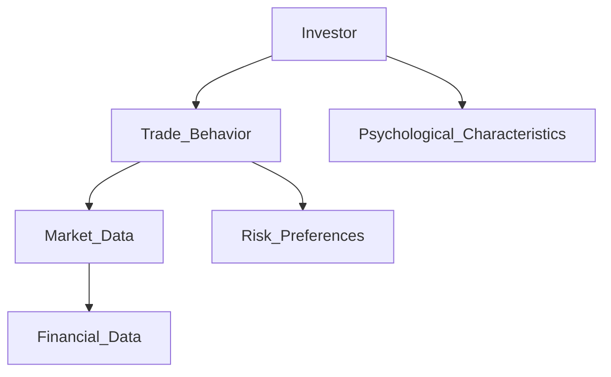
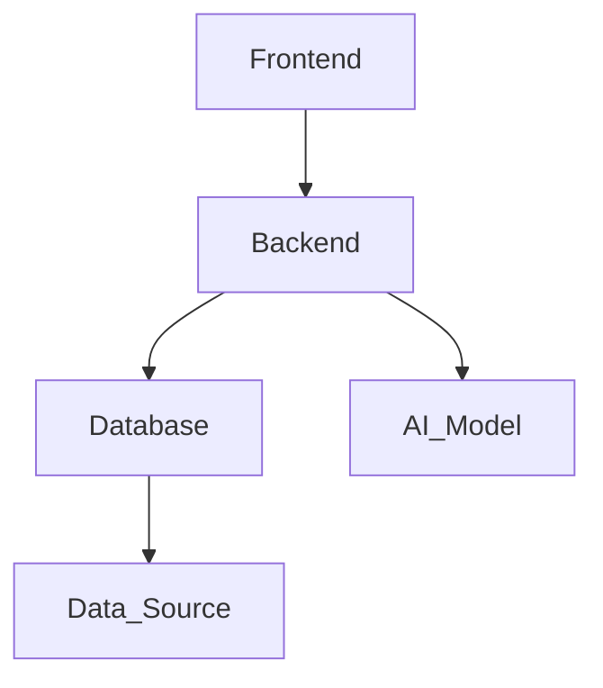
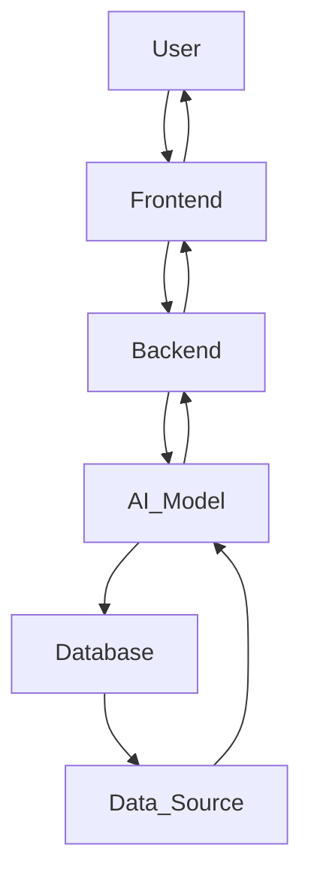

                 


# AI驱动的投资者行为分析

> 关键词：AI, 投资者行为分析, 机器学习, 数据挖掘, 系统架构, 项目实战

> 摘要：本文将详细探讨AI技术在投资者行为分析中的应用，从背景、核心概念、算法原理到系统架构和项目实战，全面解析AI如何驱动投资者行为分析的创新与进步。文章结合实际案例和最佳实践，帮助读者深入了解如何利用AI技术提升投资决策的科学性和准确性。

---

# 第一部分: AI驱动的投资者行为分析背景与基础

## 第1章: AI驱动的投资者行为分析概述

### 1.1 投资者行为分析的背景与意义

#### 1.1.1 传统投资者行为分析的局限性
传统的投资者行为分析依赖于人工分析和经验判断，存在以下问题：
- 数据量有限，难以捕捉复杂市场行为。
- 分析耗时长，难以实时响应市场变化。
- 主观因素影响较大，结果缺乏客观性。

#### 1.1.2 AI技术在投资者行为分析中的优势
AI技术通过以下方式解决了传统分析的局限性：
- 高效数据处理能力，支持实时分析。
- 精准特征提取，捕捉复杂行为模式。
- 自动生成投资策略，提高决策效率。

#### 1.1.3 投资者行为分析的现实需求与应用场景
投资者行为分析在以下场景中具有重要应用：
- 个性化投资策略制定。
- 风险评估与管理。
- 市场情绪预测。
- 投资者教育与服务优化。

### 1.2 AI驱动的投资者行为分析的核心概念

#### 1.2.1 投资者行为分析的基本定义
投资者行为分析是通过分析投资者在市场中的决策、交易行为和情绪，揭示其行为特征和规律的过程。

#### 1.2.2 AI在投资者行为分析中的核心作用
AI技术通过数据挖掘、机器学习和自然语言处理等手段，帮助分析投资者行为的复杂性。

#### 1.2.3 投资者行为分析的边界与外延
投资者行为分析的边界包括：
- 数据范围：投资者交易数据、市场数据、社交媒体数据。
- 时间范围：实时分析与历史分析结合。
- 对象范围：个人投资者、机构投资者。

### 1.3 投资者行为分析的框架与流程

#### 1.3.1 数据采集与处理流程
- 数据源：交易数据、市场数据、社交媒体数据。
- 数据清洗：去重、缺失值处理、异常值剔除。
- 数据转换：特征提取、标准化、格式化。

#### 1.3.2 行为特征提取与建模
- 特征提取：交易频率、持仓时间、交易金额。
- 模型构建：分类模型、聚类模型、回归模型。

#### 1.3.3 模型训练与优化
- 参数调整：学习率、正则化参数。
- 模型评估：准确率、召回率、F1值。
- 模型部署：实时预测、策略生成。

### 1.4 本章小结
本章介绍了AI驱动的投资者行为分析的背景、核心概念和基本流程，为后续章节奠定了基础。

---

## 第2章: 投资者行为分析的核心概念与联系

### 2.1 投资者行为分析的核心概念

#### 2.1.1 投资者行为的特征与属性
投资者行为的特征包括：
- 理性特征：基于市场信息的理性决策。
- 情感特征：投资者情绪对决策的影响。
- 风险偏好：投资者对风险的态度。

#### 2.1.2 AI模型在投资者行为分析中的角色
AI模型通过以下方式影响投资者行为分析：
- 数据处理：清洗、转换和特征提取。
- 模型训练：分类、聚类和回归分析。
- 预测与优化：生成投资策略和风险评估。

#### 2.1.3 核心概念的结构与组成
投资者行为分析的结构包括：
- 数据层：原始数据、清洗后数据。
- 特征层：行为特征、市场特征。
- 模型层：机器学习模型、深度学习模型。
- 应用层：投资策略、风险预警。

### 2.2 投资者行为分析的关键属性对比

#### 2.2.1 不同投资者行为特征的对比分析
| 行为特征 | 理性决策 | 情感决策 | 风险偏好 |
|----------|----------|----------|----------|
| 描述     | 基于逻辑 | 受情绪影响 | 风险承受度 |
| 示例     | 技术分析 | 市场情绪 | 风险投资 |

#### 2.2.2 AI模型的性能与适用性对比
| 模型类型 | 监督学习 | 无监督学习 | 强化学习 |
|----------|----------|----------|----------|
| 适用场景 | 分类预测 | 聚类分析 | 策略优化 |
| 优势     | 高精度 | 发现模式 | 实时调整 |

#### 2.2.3 数据特征与模型效果的关系
- 数据质量：数据清洗和特征提取直接影响模型性能。
- 数据量：大数据支持更精准的预测。
- 数据多样性：多源数据提高模型鲁棒性。

### 2.3 投资者行为分析的ER实体关系图



### 2.4 本章小结
本章通过对比分析和ER图，详细阐述了投资者行为分析的核心概念及其相互关系。

---

## 第3章: AI驱动的投资者行为分析算法原理

### 3.1 监督学习算法在投资者行为分析中的应用

#### 3.1.1 线性回归模型



- 数学模型：
  $$ y = \beta_0 + \beta_1x + \epsilon $$
  其中，$y$ 是目标变量，$x$ 是自变量，$\beta$ 是系数，$\epsilon$ 是误差项。

- 应用场景：预测投资者的交易金额。

#### 3.1.2 支持向量机模型

- 原理：通过寻找超平面将数据点分类。
- 优点：适用于高维数据，分类精度高。

#### 3.1.3 随机森林模型

- 原理：通过构建多棵决策树进行投票或平均。
- 优点：抗过拟合，适合复杂数据。

### 3.2 无监督学习算法在投资者行为分析中的应用

#### 3.2.1 K-means聚类算法



- 原理：将数据分成若干簇，簇内相似度高，簇间相似度低。
- 应用：投资者群体划分。

#### 3.2.2 DBSCAN聚类算法

- 原理：基于密度的聚类，适用于高密度区域。
- 优点：处理噪声数据能力强。

#### 3.2.3 主成分分析（PCA）

- 原理：降维技术，保留数据主要特征。
- 应用：简化数据维度，提高模型效率。

### 3.3 强化学习算法在投资者行为分析中的应用

#### 3.3.1 Q-Learning算法

- 原理：通过状态-动作-奖励机制优化决策。
- 应用：动态投资策略优化。

#### 3.3.2 DQN算法

- 原理：结合深度神经网络和Q-Learning，适用于复杂环境。
- 应用：实时市场应对策略。

### 3.4 本章小结
本章详细介绍了监督学习、无监督学习和强化学习在投资者行为分析中的应用，为后续系统设计奠定了算法基础。

---

## 第4章: 投资者行为分析的数学模型与公式

### 4.1 监督学习模型的数学公式

#### 4.1.1 线性回归模型

$$ y = \theta^T x + b $$

其中，$\theta$ 是参数向量，$x$ 是输入特征，$b$ 是截距。

#### 4.1.2 支持向量机模型

$$ \text{最大化} \quad \frac{1}{2} \|\theta\|^2 $$
$$ \text{约束} \quad y_i (\theta^T x_i + b) \geq 1 $$

### 4.2 无监督学习模型的数学公式

#### 4.2.1 K-means聚类

目标函数：
$$ \min \sum_{i=1}^k \sum_{j=1}^n d(c_i, x_j)^2 $$

其中，$c_i$ 是第$i$个簇的中心，$x_j$ 是数据点。

#### 4.2.2 PCA降维

目标函数：
$$ \max \sum_{i=1}^n (\text{特征向量} v_i)^2 $$

### 4.3 强化学习模型的数学公式

#### 4.3.1 Q-Learning算法

更新公式：
$$ Q(s, a) = Q(s, a) + \alpha [r + \max_{a'} Q(s', a') - Q(s, a)] $$

其中，$\alpha$ 是学习率。

### 4.4 本章小结
本章通过数学公式详细解析了常用算法的原理，为实际应用提供了理论基础。

---

## 第5章: 系统分析与架构设计

### 5.1 问题场景介绍

- 投资者行为分析系统需要处理海量数据，实时响应用户需求。

### 5.2 系统功能设计

#### 5.2.1 领域模型



#### 5.2.2 系统架构设计



### 5.3 系统接口设计

- 数据接口：数据获取与存储。
- 模型接口：特征提取与预测。
- 用户接口：结果展示与交互。

### 5.4 系统交互流程



### 5.5 本章小结
本章通过系统设计图详细描述了投资者行为分析系统的架构与功能，为后续开发提供了指导。

---

## 第6章: 项目实战与案例分析

### 6.1 项目背景与目标

- 项目目标：构建一个基于AI的投资者行为分析系统，实现投资者行为预测与策略优化。

### 6.2 环境安装与配置

- 环境要求：Python 3.8+, TensorFlow, Scikit-learn, Pandas。

### 6.3 核心代码实现

#### 6.3.1 数据预处理

```python
import pandas as pd

# 读取数据
data = pd.read_csv('investor_data.csv')

# 数据清洗
data.dropna(inplace=True)
data['date'] = pd.to_datetime(data['date'])
```

#### 6.3.2 模型训练

```python
from sklearn.ensemble import RandomForestClassifier

# 特征选择
features = data[['feature1', 'feature2']]
labels = data['label']

# 模型训练
model = RandomForestClassifier()
model.fit(features, labels)
```

### 6.4 案例分析与结果解读

- 案例：股票价格预测
  - 数据来源：历史交易数据、市场新闻、社交媒体情绪。
  - 模型选择：随机森林。
  - 结果：预测股票价格波动，指导投资决策。

### 6.5 项目小结
本章通过实际案例详细讲解了投资者行为分析系统的开发过程，为读者提供了实践指导。

---

## 第7章: 最佳实践与注意事项

### 7.1 最佳实践

- 数据质量：确保数据清洗和特征提取的准确性。
- 模型选择：根据场景选择合适的算法。
- 系统优化：定期更新模型和优化系统性能。

### 7.2 小结

- 本文系统地介绍了AI驱动的投资者行为分析的核心概念、算法原理和系统架构。
- 强调了数据质量和模型选择的重要性。

### 7.3 注意事项

- 风险提示：AI模型可能存在过拟合风险。
- 道德合规：确保数据使用符合相关法律法规。

### 7.4 拓展阅读

- 推荐书籍：《机器学习实战》、《深度学习入门》。
- 推荐博客：[AI与投资](https://www.aiandinvestment.com)

---

## 作者：AI天才研究院/AI Genius Institute & 禅与计算机程序设计艺术 /Zen And The Art of Computer Programming

