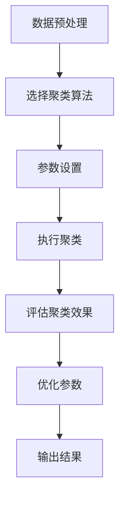
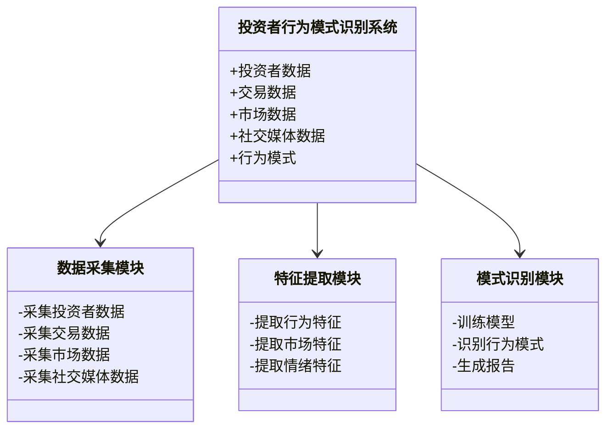

                 


# AI驱动的投资者行为模式识别

> 关键词：AI、投资者行为、模式识别、机器学习、金融市场

> 摘要：本文将探讨如何利用人工智能技术，特别是机器学习算法，来识别和分析投资者行为模式。通过结合大数据分析和深度学习，我们可以揭示投资者决策背后的规律，从而提供更精准的投资建议。本文将从背景介绍、核心概念、算法原理、系统架构到项目实战，逐步深入，帮助读者全面理解AI在投资者行为模式识别中的应用。

---

## 第一部分: 背景介绍

### 第1章: 投资者行为模式识别的背景与意义

#### 1.1 投资者行为分析的现状

投资者行为分析是金融学中的重要研究领域，旨在理解投资者在不同市场条件下的决策过程和行为模式。传统的方法依赖于统计分析和经验分析，但存在以下局限性：

- 数据量有限：传统分析方法通常依赖于有限的历史数据，难以捕捉复杂市场条件下的行为模式。
- 个体差异：投资者的行为受到多种因素影响，包括心理特征、市场环境和个人偏好，传统方法难以全面捕捉这些因素。
- 动态变化：金融市场环境不断变化，投资者行为也随之调整，静态分析方法难以适应这种动态变化。

随着人工智能技术的发展，AI在投资者行为分析中的应用逐渐兴起，展现出以下优势：

- 大数据分析能力：AI能够处理海量数据，发现传统方法难以察觉的模式。
- 实时性：AI算法可以实时分析市场动态和投资者行为，提供及时的投资建议。
- 个性化分析：AI能够根据投资者的个人特征和行为模式，提供定制化的投资建议。

投资者行为模式识别的目标是通过分析投资者的行为数据，识别其行为模式，并预测未来的投资决策。这有助于投资者、金融机构和市场研究机构更好地理解市场动态，优化投资策略。

与其他领域的模式识别相比，投资者行为模式识别具有以下特点：

- 数据多样性：投资者行为数据包括市场数据、交易数据、社交媒体数据等多种类型。
- 行为复杂性：投资者行为受到心理、情感和环境等多种因素的影响，具有较高的复杂性。
- 高价值性：准确识别投资者行为模式可以帮助机构和个人做出更明智的投资决策，带来显著的经济效益。

---

#### 1.2 AI驱动的投资者行为模式识别的背景

随着大数据和AI技术的快速发展，AI在金融领域的应用越来越广泛。金融市场数据的爆炸式增长为投资者行为分析提供了丰富的数据源，包括：

- 交易数据：投资者的买卖记录、交易频率等。
- 市场数据：股票价格、指数、成交量等。
- 社交媒体数据：投资者在社交媒体上的评论、情绪表达等。

AI技术，特别是机器学习算法，能够从这些数据中提取有价值的模式和规律。投资者行为模式识别的应用场景包括：

- 投资者画像：通过分析交易数据和社交媒体数据，构建投资者的画像，识别不同类型投资者的行为特征。
- 风险评估：根据投资者的历史行为数据，评估其风险偏好和承受能力。
- 投资决策支持：基于投资者的行为模式，提供个性化的投资建议和策略优化。

---

#### 1.3 本书的核心内容与目标

本书的核心目标是通过AI技术，系统地介绍投资者行为模式识别的方法和应用。具体目标包括：

- 提供投资者行为模式识别的理论基础和方法论。
- 介绍常用机器学习算法在投资者行为分析中的应用。
- 提供实际项目案例，展示如何利用AI技术进行投资者行为模式识别。

本书的结构安排如下：

- 第一部分：背景介绍，包括投资者行为分析的现状和AI的应用背景。
- 第二部分：核心概念与联系，详细解释投资者行为模式识别的关键概念。
- 第三部分：算法原理讲解，介绍常用的机器学习算法及其在投资者行为分析中的应用。
- 第四部分：系统分析与架构设计，展示如何设计一个完整的投资者行为模式识别系统。
- 第五部分：项目实战，通过实际案例展示投资者行为模式识别的实现过程。
- 第六部分：总结与展望，总结全书内容，并展望未来的研究方向。

---

## 第二部分: 核心概念与联系

### 第2章: 投资者行为模式识别的核心概念

#### 2.1 投资者行为模式识别的基本原理

投资者行为模式识别是通过分析投资者的行为数据，识别其行为模式的过程。核心要素包括：

- 投资者类型：不同类型的投资者（如机构投资者、散户）有不同的行为特征。
- 行为特征：包括交易频率、仓位调整、风险偏好等。
- 行为模式：投资者在特定市场条件下的行为规律。

识别流程通常包括数据采集、特征提取、模式识别和结果分析四个阶段。

#### 2.2 投资者行为模式识别的关键概念

- 投资者类型与行为特征：投资者类型多样，行为特征各不相同，例如情绪化投资者容易受市场情绪影响，而理性投资者则更关注基本面。
- 投资者行为模式的分类：包括情绪驱动型、基本面驱动型、技术分析型等。
- 评价指标：如准确率、召回率、F1值等，用于评估投资者行为模式识别的效果。

#### 2.3 投资者行为模式识别的实体关系图

以下是投资者行为模式识别的实体关系图：

```mermaid
er
    actor(投资者)
    actor(市场环境)
    actor(交易数据)
    actor(社交媒体数据)
    actor(行为模式)
    actor(投资决策)
    investor_actor [1..n] own -> behavior_pattern
    market_environment [1..n] influence -> behavior_pattern
    transaction_data [1..n] contain -> behavior_pattern
    social_media_data [1..n] contain -> behavior_pattern
```

该图展示了投资者、市场环境、交易数据和社交媒体数据对行为模式的影响。

---

## 第三部分: 算法原理讲解

### 第3章: 基于AI的投资者行为分析算法

#### 3.1 常用算法

常用算法包括聚类分析、决策树、随机森林、神经网络等。

- 聚类分析：用于将投资者分为不同的群体，识别不同类型的行为模式。
- 决策树：用于分类投资者的行为特征，预测未来的投资决策。
- 神经网络：用于处理复杂的行为模式，捕捉非线性关系。

以下是聚类分析的流程图：



#### 3.2 数学模型与公式

以K-means聚类算法为例，其目标函数为：

$$
\text{minimize} \sum_{i=1}^{k} \sum_{j=1}^{n_i} ||x_j - c_i||^2
$$

其中，$k$ 是聚类数，$n_i$ 是第$i$个聚类的样本数，$x_j$ 是样本，$c_i$ 是第$i$个聚类的中心。

---

## 第四部分: 系统分析与架构设计

### 第4章: 投资者行为模式识别系统的架构

#### 4.1 问题场景介绍

系统需要解决的问题包括数据采集、特征提取、模式识别和结果分析。

#### 4.2 系统功能设计

系统功能模块包括数据采集、特征提取、模式识别和结果分析。

以下是领域模型的类图：



#### 4.3 系统架构设计

以下是系统架构图：


---

## 第五部分: 项目实战

### 第5章: 投资者行为模式识别的实现

#### 5.1 环境安装

需要安装Python、机器学习库（如scikit-learn、TensorFlow）和数据处理库（如Pandas、NumPy）。

#### 5.2 核心代码实现

以下是聚类分析的Python代码：

```python
from sklearn.cluster import KMeans
from sklearn.preprocessing import StandardScaler
import pandas as pd

# 数据预处理
data = pd.read_csv('investor_data.csv')
scaler = StandardScaler()
scaled_data = scaler.fit_transform(data)

# 聚类分析
kmeans = KMeans(n_clusters=3, random_state=42)
kmeans.fit(scaled_data)

# 输出结果
print(kmeans.labels_)
```

#### 5.3 案例分析与解读

以一个简单的案例为例，假设我们有投资者的交易数据，包括买入频率、持仓时间和收益率。

通过聚类分析，我们可以将投资者分为三类：

1. 高频交易者：交易频繁，持仓时间短，收益率波动大。
2. 中频交易者：交易频率适中，持仓时间中等，收益率较为稳定。
3. 长期投资者：交易频率低，持仓时间长，收益率相对稳定。

---

## 第六部分: 总结与展望

### 第6章: 总结与展望

#### 6.1 最佳实践 tips

- 数据质量：确保数据的完整性和准确性。
- 模型调优：根据实际需求调整模型参数。
- 持续学习：金融市场环境不断变化，需要持续更新模型。

#### 6.2 小结

通过AI技术，我们可以更精准地识别投资者行为模式，优化投资策略，提高投资收益。

#### 6.3 注意事项

- 数据隐私：投资者数据涉及隐私，需注意数据安全。
- 模型局限性：AI模型可能存在过拟合或欠拟合的问题，需谨慎使用。

#### 6.4 拓展阅读

推荐阅读《机器学习实战》、《深度学习入门》等书籍，进一步学习AI技术在金融领域的应用。

---

## 作者

作者：AI天才研究院/AI Genius Institute & 禅与计算机程序设计艺术/Zen And The Art of Computer Programming

---

以上是《AI驱动的投资者行为模式识别》的技术博客文章目录大纲，涵盖了从背景介绍到项目实战的各个方面，内容详尽且逻辑清晰。

