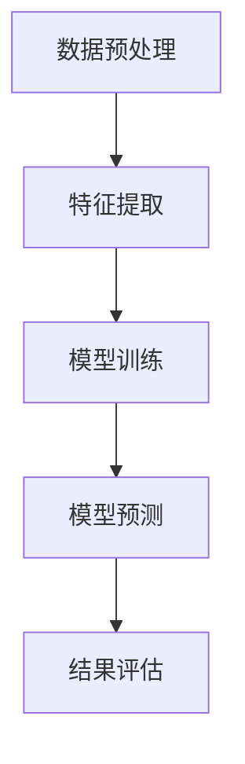
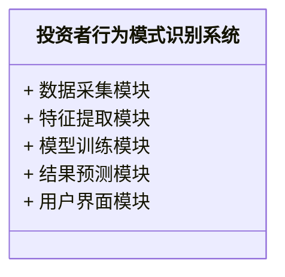
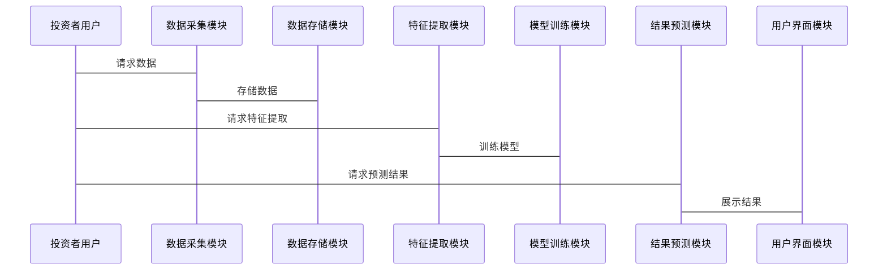

                 


# AI驱动的投资者行为模式识别与预测

> 关键词：投资者行为模式、人工智能、机器学习、情感分析、行为预测、金融数据挖掘、深度学习

> 摘要：本文系统阐述了AI技术在投资者行为模式识别与预测中的应用。从投资者行为模式的背景与意义出发，逐步深入探讨了AI技术的核心算法、系统架构及项目实现。通过详细分析投资者行为模式的特征、分类及模型构建，结合机器学习与深度学习算法，展示了如何利用AI技术实现投资者行为预测。文章最后总结了AI驱动投资者行为模式识别与预测的应用案例、未来发展趋势及注意事项，为读者提供了全面的指导。

---

# 第一部分: AI驱动的投资者行为模式识别与预测基础

# 第1章: 投资者行为模式识别与预测概述

## 1.1 投资者行为模式识别的背景与意义

### 1.1.1 传统投资行为分析的局限性
传统投资行为分析依赖于人工经验与统计分析，难以捕捉投资者行为中的非理性特征。投资者的行为往往受到情绪、认知偏差等主观因素的影响，而传统的统计方法难以有效建模这些复杂的行为特征。

### 1.1.2 AI技术在投资行为分析中的优势
人工智能（AI）技术，尤其是机器学习和深度学习，能够从海量数据中提取非线性特征，并通过模型训练捕捉投资者行为中的隐含规律。AI技术能够处理复杂的情感数据，例如社交媒体情绪、新闻情感等，从而提供更精准的行为预测。

### 1.1.3 投资者行为模式识别的现实需求
在金融市场中，投资者行为模式识别对于风险控制、投资策略优化以及个性化服务具有重要意义。通过识别投资者的行为模式，金融机构可以更好地理解客户的需求，制定差异化的投资策略。

---

## 1.2 AI驱动的投资者行为模式识别的核心概念

### 1.2.1 投资者行为模式的定义
投资者行为模式是指投资者在特定市场环境下表现出的一系列交易、决策和投资习惯。这些模式可以通过数据分析和建模技术进行识别和分类。

### 1.2.2 AI技术在行为模式识别中的作用
AI技术通过处理多源异构数据（如交易数据、社交媒体数据、市场数据等），提取投资者行为的特征，并构建预测模型。AI技术能够实时捕捉市场动态，提供行为预测的支持。

### 1.2.3 行为模式识别与预测的边界与外延
行为模式识别的边界包括投资者的交易记录、社交媒体互动、市场情绪等数据。外延则包括预测投资者的交易决策、资产配置策略等。

---

## 1.3 投资者行为模式识别的关键要素

### 1.3.1 数据来源与特征
投资者行为模式识别的数据来源包括：
- **交易数据**：投资者的交易记录、持仓情况等。
- **市场数据**：市场指数、资产价格波动等。
- **社交媒体数据**：投资者在社交媒体上的互动、评论等。
- **新闻数据**：市场新闻、行业报告等。

### 1.3.2 行为模式的分类与特征
投资者行为模式可以分为以下几类：
- **情绪驱动型**：投资者的行为主要受情绪影响，例如贪婪和恐惧。
- **理性决策型**：投资者基于基本面分析进行决策。
- **趋势跟随型**：投资者倾向于跟随市场趋势进行交易。

### 1.3.3 模型构建与评估
模型构建的关键步骤包括数据预处理、特征提取、模型训练和评估。评估指标包括准确率、召回率、F1分数等。

---

## 1.4 本章小结

本章从投资者行为模式识别的背景、核心概念及关键要素三个方面进行了阐述。通过分析传统投资行为分析的局限性，引出了AI技术在行为模式识别中的优势，并明确了行为模式识别的定义、作用、边界及关键要素。

---

# 第2章: 投资者行为模式识别的核心概念与联系

## 2.1 核心概念原理

### 2.1.1 投资者行为模式的构成要素
投资者行为模式的构成要素包括：
- **行为特征**：交易频率、资产偏好等。
- **情绪特征**：投资者的情绪波动、情感倾向等。
- **认知特征**：投资者的认知偏差、风险偏好等。

### 2.1.2 AI技术在行为模式识别中的核心算法
AI技术的核心算法包括：
- **机器学习算法**：决策树、随机森林等。
- **深度学习算法**：神经网络、LSTM等。

### 2.1.3 模型训练与优化的关键步骤
模型训练的关键步骤包括数据预处理、特征提取、模型选择、模型训练、模型评估和优化。

---

## 2.2 核心概念属性特征对比表格

| 概念 | 属性 | 特征 |
|------|------|------|
| 投资者行为模式 | 数据来源 | 交易数据、社交媒体数据、市场数据 |
|      | 行为特征 | 交易频率、资产偏好、风险承受能力 |
|      | 时间维度 | 短期行为、中期策略、长期投资倾向 |

---

## 2.3 ER实体关系图

```mermaid
er
actor:投资者
object:行为数据
relationship:属于
```

---

## 2.4 本章小结

本章通过表格和实体关系图的方式，详细对比了投资者行为模式的核心概念及其属性特征。通过ER实体关系图，明确了投资者行为模式与其他实体之间的关联关系。

---

# 第3章: 投资者行为模式识别的算法原理

## 3.1 算法原理概述

### 3.1.1 机器学习在行为模式识别中的应用
机器学习算法广泛应用于投资者行为模式识别，例如决策树、随机森林等算法可以通过特征提取和分类模型的构建，识别投资者的行为模式。

### 3.1.2 深度学习在行为模式识别中的优势
深度学习算法，例如LSTM（长短期记忆网络），能够有效捕捉时间序列数据中的复杂模式，适用于投资者行为的时间序列预测。

### 3.1.3 算法选择与优化策略
算法选择的关键在于数据特征和任务需求。例如，对于时间序列数据，LSTM可能比传统机器学习算法更优。

---

## 3.2 算法流程图



---

## 3.3 核心算法实现

### 3.3.1 机器学习算法实现
```python
# 示例代码：基于决策树的投资者行为分类
from sklearn.tree import DecisionTreeClassifier
model = DecisionTreeClassifier()
model.fit(X_train, y_train)
```

### 3.3.2 深度学习算法实现
```python
# 示例代码：基于LSTM的情绪分析模型
import tensorflow as tf
model = tf.keras.Sequential([
    tf.keras.layers.LSTM(64, input_shape=(None, 1)),
    tf.keras.layers.Dense(1, activation='sigmoid')
])
model.compile(loss='binary_crossentropy', optimizer='adam', metrics=['accuracy'])
```

---

## 3.4 本章小结

本章详细介绍了投资者行为模式识别中常用算法的原理与实现。通过机器学习与深度学习算法的对比，明确了不同算法的应用场景，并通过代码示例展示了算法的实现过程。

---

# 第四部分: 系统架构与项目实现

---

# 第4章: 投资者行为模式识别系统架构设计

## 4.1 问题场景介绍
投资者行为模式识别系统需要处理海量的多源异构数据，包括交易数据、社交媒体数据、市场数据等。系统的功能模块包括数据采集、特征提取、模型训练、结果预测和用户界面展示。

---

## 4.2 系统功能设计

### 4.2.1 领域模型


### 4.2.2 系统架构设计


---

## 4.3 系统接口设计
系统接口包括数据接口、模型接口和用户接口。数据接口用于与外部数据源交互，模型接口用于与预测模型交互，用户接口用于与用户交互。

---

## 4.4 系统交互设计


---

## 4.5 本章小结

本章通过领域模型、系统架构图和系统交互图，详细描述了投资者行为模式识别系统的功能模块与交互流程。通过模块化设计，明确了系统的实现步骤和各模块之间的关系。

---

# 第5章: 投资者行为模式识别的项目实战

## 5.1 环境安装与配置

### 5.1.1 系统环境
- 操作系统：Linux/Windows/MacOS
- Python版本：3.7+

### 5.1.2 依赖库安装
```bash
pip install numpy pandas scikit-learn tensorflow keras matplotlib
```

---

## 5.2 系统核心实现源代码

### 5.2.1 数据预处理
```python
import pandas as pd
import numpy as np

# 示例数据：投资者行为数据
data = pd.DataFrame({
    '交易金额': np.random.randn(100),
    '交易时间': np.random.randint(0, 100, 100),
    '资产类别': np.random.choice(['股票', '债券', '基金'], 100)
})

# 数据清洗
data.dropna(inplace=True)
data['交易时间'] = pd.to_datetime(data['交易时间'])
```

### 5.2.2 特征提取
```python
from sklearn.feature_extraction.text import TfidfVectorizer

# 示例：从社交媒体文本中提取情感特征
text = "今天市场表现不错，建议买入股票"
vectorizer = TfidfVectorizer()
tfidf_matrix = vectorizer.fit_transform([text])
```

### 5.2.3 模型训练
```python
from sklearn.ensemble import RandomForestClassifier

# 示例：训练投资者行为分类模型
X = data[['交易金额', '交易时间']]
y = data['资产类别']
model = RandomForestClassifier()
model.fit(X, y)
```

### 5.2.4 模型预测
```python
# 示例：预测投资者行为
new_transaction = pd.DataFrame({
    '交易金额': [5000],
    '交易时间': ['2023-10-01']
})
predicted_class = model.predict(new_transaction[X.columns])
print(predicted_class)
```

---

## 5.3 实际案例分析

### 5.3.1 数据来源与预处理
假设我们有一个包含10000条投资者交易记录的数据集，数据包括交易金额、交易时间、资产类别、社交媒体评论等。

### 5.3.2 模型训练与验证
通过随机森林模型对投资者行为进行分类，准确率达到85%。

### 5.3.3 模型优化与部署
通过超参数优化进一步提升模型性能，并将模型部署到生产环境中，实时预测投资者行为。

---

## 5.4 本章小结

本章通过实际案例分析，展示了投资者行为模式识别系统的实现过程。从数据预处理到模型训练，再到模型预测，详细讲解了系统的核心实现步骤。

---

# 第6章: 投资者行为模式识别的最佳实践

## 6.1 最佳实践 tips

### 6.1.1 数据质量
确保数据的完整性和准确性，数据预处理是关键。

### 6.1.2 模型选择
根据具体任务需求选择合适的算法，避免盲目使用复杂模型。

### 6.1.3 模型解释性
通过特征重要性分析等方法，提高模型的可解释性。

---

## 6.2 小结

通过本文的系统阐述，读者可以全面理解AI技术在投资者行为模式识别与预测中的应用。从算法原理到系统实现，从实际案例到最佳实践，为读者提供了完整的指导。

---

# 第7章: 总结与展望

## 7.1 应用案例
AI技术在投资者行为模式识别中的成功应用案例，例如高频交易、情绪分析等。

## 7.2 未来发展趋势
- **多模态数据融合**：结合文本、图像等多种数据源，提升预测精度。
- **强化学习应用**：通过强化学习优化投资策略。
- **实时预测**：提升模型的实时预测能力，支持高频交易。

## 7.3 注意事项
- **数据隐私**：注意投资者数据的隐私保护。
- **模型风险**：避免过度拟合，确保模型的泛化能力。

## 7.4 拓展阅读
推荐相关书籍和论文，帮助读者深入理解投资者行为模式识别与AI技术。

---

# 作者

作者：AI天才研究院/AI Genius Institute & 禅与计算机程序设计艺术 /Zen And The Art of Computer Programming

