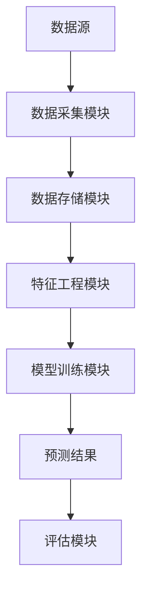
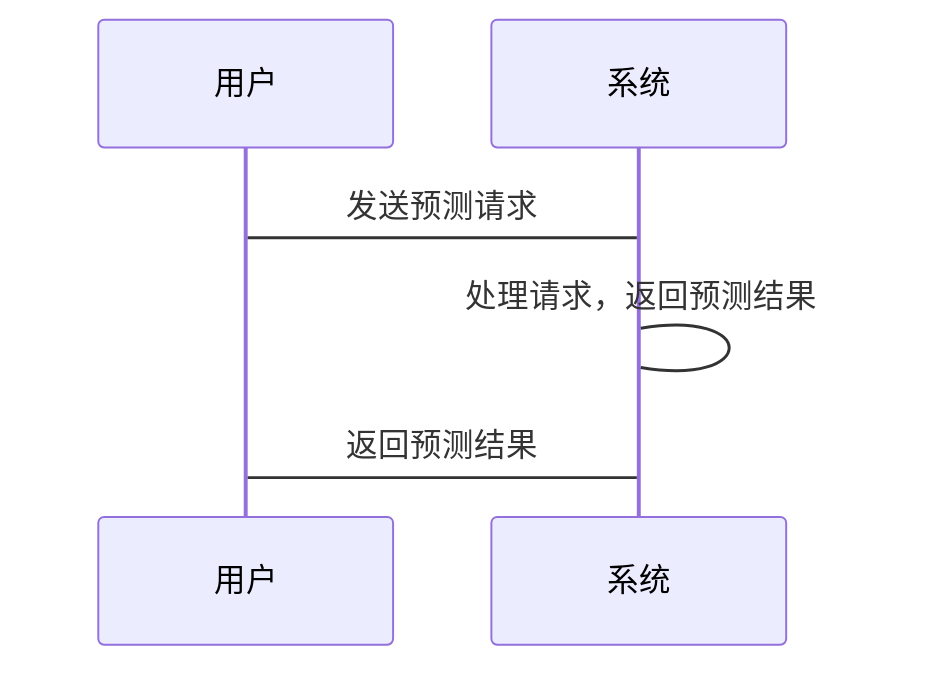

                 


# AI驱动的私募股权投资退出时机预测

> 关键词：AI，私募股权，退出时机预测，机器学习，深度学习

> 摘要：本文探讨了如何利用人工智能技术，特别是机器学习和深度学习算法，来预测私募股权投资的退出时机。通过对市场数据、公司基本面和行业趋势的分析，结合实际案例，本文详细阐述了AI驱动的退出时机预测的理论基础、算法实现、系统架构设计以及项目实战。本文旨在为私募股权投资者和相关技术从业者提供一种新的视角和工具，以优化投资决策和风险管理。

---

# 第一部分: 背景介绍

## 第1章: 私募股权投资退出时机预测概述

### 1.1 股权投资退出的定义与特点
股权投资退出是指投资者将所持有的股权出售或转让，以实现资本收益的过程。其特点包括高风险、高回报、周期长以及退出方式多样（如IPO、并购、股权转让等）。

### 1.2 私募股权投资的定义与特点
私募股权投资（Private Equity, PE）是指通过私募基金等渠道，向非公开交易市场中的企业进行投资，以获取资本增值的一种投资方式。其特点包括高门槛、高收益、低流动性以及退出方式多样化。

### 1.3 退出时机预测的定义与意义
退出时机预测是指通过分析市场、行业和公司层面的多种因素，预测私募股权投资的最佳退出时间，以最大化收益或最小化损失。其意义在于帮助投资者在复杂的市场环境中做出更明智的决策，优化投资回报。

### 1.4 退出时机预测的挑战与机遇
#### 1.4.1 挑战
- 数据稀缺性：私募股权投资数据通常不公开，获取难度大。
- 市场波动性：金融市场波动剧烈，影响退出时机预测的准确性。
- 多因素影响：退出时机受宏观经济、行业趋势和公司基本面等多种因素影响，模型构建复杂。

#### 1.4.2 机遇
- 技术进步：AI技术的发展为退出时机预测提供了新的工具和方法。
- 数据量增加：随着数字化转型，私募股权投资数据的可获得性逐渐提高。
- 市场需求：投资者对更精准的投资决策工具的需求日益增长。

### 1.5 本章小结
本章介绍了私募股权投资退出的定义、特点以及退出时机预测的重要性和挑战。通过分析当前市场环境和技术发展趋势，为后续的AI驱动预测方法奠定了基础。

---

# 第二部分: AI驱动的私募股权投资退出时机预测核心概念

## 第2章: AI驱动的退出时机预测核心概念

### 2.1 退出时机预测的核心要素
#### 2.1.1 数据特征
- 市场数据：包括宏观经济指标（GDP、利率、通货膨胀率等）和行业趋势。
- 公司基本面：包括财务数据（收入、利润、资产负债率等）和管理团队稳定性。
- 交易数据：包括历史交易价格、成交量和市场情绪。

#### 2.1.2 模型特征
- 特征选择：通过特征工程筛选对退出时机预测影响较大的因素。
- 模型可解释性：确保模型结果能够被投资者理解和信任。
- 模型鲁棒性：模型在不同市场环境下的稳定性和适应性。

### 2.2 AI技术在退出时机预测中的应用
#### 2.2.1 机器学习的应用
- 监督学习：用于根据历史数据预测未来退出时机。
- 非监督学习：用于发现数据中的潜在模式和群组。
- 加强学习：用于动态市场环境下的实时决策。

#### 2.2.2 深度学习的应用
- 循环神经网络（RNN）：用于处理时间序列数据，捕捉市场波动趋势。
- 卷积神经网络（CNN）：用于分析复杂的市场和公司数据模式。
- Transformer模型：用于处理长序列数据，捕捉市场变化的全局信息。

### 2.3 退出时机预测的流程与步骤
#### 2.3.1 数据收集与清洗
- 数据来源：包括金融数据库、新闻媒体和公司财报。
- 数据清洗：处理缺失值、异常值和重复数据。

#### 2.3.2 特征工程与模型训练
- 特征选择：通过统计分析和机器学习方法筛选重要特征。
- 模型训练：使用训练数据拟合模型参数。

#### 2.3.3 模型评估与优化
- 评估指标：包括准确率、召回率、F1分数和AUC值。
- 模型优化：通过交叉验证和超参数调优提升模型性能。

### 2.4 本章小结
本章详细介绍了AI驱动的退出时机预测的核心概念，包括数据特征、模型特征、AI技术的应用以及预测流程与步骤。这些内容为后续的算法实现和系统设计提供了理论基础。

---

# 第三部分: AI驱动的私募股权投资退出时机预测算法原理

## 第3章: 退出时机预测的机器学习算法

### 3.1 机器学习算法概述
#### 3.1.1 监督学习
- 线性回归：用于预测连续型目标变量。
- 支持向量机（SVM）：用于分类和回归问题。
- 随机森林：用于分类和回归问题，具有较强的鲁棒性。

#### 3.1.2 非监督学习
- K-means：用于聚类分析。
- 层次聚类：用于发现数据中的层次结构。

#### 3.1.3 加强学习
- Q-Learning：用于动态环境下的决策问题。

### 3.2 常见机器学习算法实现
#### 3.2.1 线性回归模型
- 算法流程：通过最小二乘法拟合回归系数。
- 代码示例：
  ```python
  import numpy as np
  from sklearn.linear_model import LinearRegression

  # 假设X为输入特征，y为目标变量
  model = LinearRegression()
  model.fit(X, y)
  ```

- 数学模型：
  $$ y = \beta_0 + \beta_1 x_1 + \beta_2 x_2 + \ldots + \beta_n x_n $$

#### 3.2.2 支持向量机（SVM）
- 算法流程：通过最大边距分离数据点。
- 代码示例：
  ```python
  from sklearn import svm

  model = svm.SVC()
  model.fit(X, y)
  ```

- 数学模型：
  $$ y = sign(w \cdot x + b) $$

### 3.3 深度学习算法原理
#### 3.3.1 循环神经网络（RNN）
- 算法流程：处理时间序列数据，捕捉序列依赖性。
- 代码示例：
  ```python
  import tensorflow as tf
  from tensorflow.keras import layers

  model = tf.keras.Sequential([
      layers.SimpleRNN(units=64, input_shape=(None, input_dim)),
      layers.Dense(1, activation='sigmoid')
  ])
  model.compile(optimizer='adam', loss='binary_crossentropy', metrics=['accuracy'])
  ```

- 数学模型：
  $$ h_t = \tanh(W_{hh} h_{t-1} + W_{xh} x_t + b_h) $$

### 3.4 本章小结
本章详细介绍了机器学习和深度学习算法在退出时机预测中的应用，包括线性回归、支持向量机和循环神经网络的实现。通过数学公式和代码示例，帮助读者理解这些算法的工作原理和实现细节。

---

# 第四部分: AI驱动的私募股权投资退出时机预测系统架构设计

## 第4章: 退出时机预测系统架构设计

### 4.1 问题场景介绍
私募股权投资退出时机预测系统需要处理以下问题：
- 数据来源多样且复杂。
- 市场环境动态变化。
- 需要实时预测和决策支持。

### 4.2 系统功能设计
#### 4.2.1 数据采集模块
- 功能：从多种数据源获取市场、行业和公司数据。
- 实现：使用API接口或数据爬取工具。

#### 4.2.2 特征工程模块
- 功能：对数据进行清洗、特征提取和转换。
- 实现：使用Python的Pandas库和机器学习工具。

#### 4.2.3 模型训练模块
- 功能：训练机器学习和深度学习模型。
- 实现：使用Scikit-learn和Keras框架。

#### 4.2.4 预测与评估模块
- 功能：对模型进行预测和性能评估。
- 实现：使用交叉验证和指标评估。

### 4.3 系统架构设计
#### 4.3.1 系统架构图


#### 4.3.2 接口设计
- 数据接口：提供RESTful API供其他系统调用。
- 模型接口：提供预测接口供实时查询。

#### 4.3.3 交互设计


### 4.4 本章小结
本章通过系统架构设计，详细描述了AI驱动的退出时机预测系统的功能模块和交互流程。通过Mermaid图展示了系统的整体架构和各模块之间的关系，为后续的项目实现提供了指导。

---

# 第五部分: AI驱动的私募股权投资退出时机预测项目实战

## 第5章: 退出时机预测项目实战

### 5.1 环境安装与数据准备
#### 5.1.1 环境安装
- 安装Python和必要的库（如NumPy、Pandas、Scikit-learn、Keras等）。
- 安装IDE（如Jupyter Notebook或PyCharm）。

#### 5.1.2 数据准备
- 数据来源：从金融数据库或公开数据集获取私募股权投资数据。
- 数据清洗：处理缺失值和异常值。

### 5.2 系统核心实现
#### 5.2.1 特征工程
```python
import pandas as pd
import numpy as np

# 假设df为数据框，包含多个特征和目标变量
# 删除缺失值
df.dropna(inplace=True)
# 标准化处理
from sklearn.preprocessing import StandardScaler
scaler = StandardScaler()
df[numeric_features] = scaler.fit_transform(df[numeric_features])
```

#### 5.2.2 模型训练
```python
from sklearn.ensemble import RandomForestClassifier
from sklearn.metrics import accuracy_score

model = RandomForestClassifier(n_estimators=100, max_depth=4, random_state=42)
model.fit(X_train, y_train)
y_pred = model.predict(X_test)
print("Accuracy:", accuracy_score(y_test, y_pred))
```

### 5.3 实际案例分析
#### 5.3.1 案例背景
假设某私募基金投资于一家科技公司，目标预测其最佳退出时机。

#### 5.3.2 模型应用
```python
# 假设new_data为新数据
y_pred = model.predict(new_data)
print("预测退出时机:", y_pred)
```

### 5.4 项目小结
本章通过实际案例展示了如何利用AI技术实现私募股权投资退出时机预测。从环境安装到数据准备，再到模型训练和预测，详细讲解了项目的实现过程。

---

# 第六部分: AI驱动的私募股权投资退出时机预测最佳实践与总结

## 第6章: 最佳实践与总结

### 6.1 项目总结
AI驱动的退出时机预测系统通过机器学习和深度学习算法，能够有效提高私募股权投资的决策效率和准确性。

### 6.2 最佳实践
#### 6.2.1 数据质量管理
- 确保数据的准确性和完整性。
- 定期更新数据。

#### 6.2.2 模型优化
- 定期重新训练模型。
- 结合多种算法进行模型融合。

#### 6.2.3 与实际投资策略结合
- 考虑市场环境和投资目标。
- 结合专家经验进行决策。

### 6.3 未来发展方向
#### 6.3.1 更复杂的数据分析
- 利用自然语言处理（NLP）技术分析新闻和报告。
- 利用图神经网络分析行业和公司之间的关系。

#### 6.3.2 实时预测与动态调整
- 实现实时数据流处理。
- 构建动态预测模型，适应市场变化。

### 6.4 本章小结
本章总结了AI驱动的退出时机预测项目的实施经验和最佳实践，并展望了未来的发展方向。通过结合技术创新和实际投资需求，进一步优化退出时机预测系统。

---

# 附录

## 附录A: 数据集说明
详细说明数据集的来源、格式和预处理方法。

## 附录B: 工具包安装
列出项目所需的Python库和安装命令。

## 附录C: 参考文献
列出文章中引用的文献和资料。

---

# 作者

作者：AI天才研究院/AI Genius Institute & 禅与计算机程序设计艺术 /Zen And The Art of Computer Programming

---

以上是《AI驱动的私募股权投资退出时机预测》的完整目录大纲和内容框架，按照要求分为六大部分，每部分详细展开，并提供了背景、核心概念、算法原理、系统架构设计、项目实战和最佳实践等内容。

