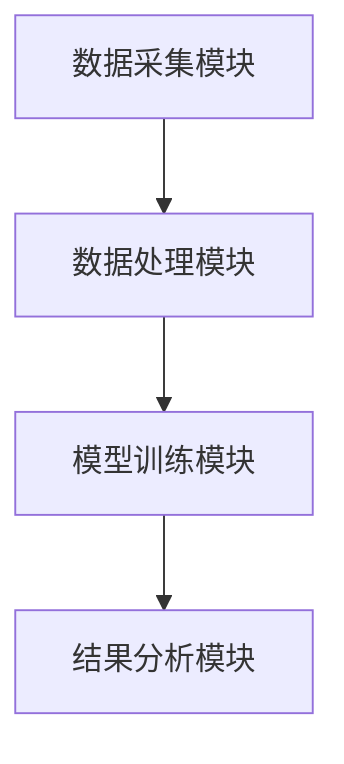

                 


# AI驱动的私募股权投资退出策略优化

## 关键词：私募股权，人工智能，退出策略，数据驱动，多目标优化

## 摘要：本文系统阐述了如何利用人工智能技术优化私募股权投资的退出策略。通过分析传统退出策略的局限性，提出了基于数据驱动和机器学习的优化方法，构建了多目标优化模型，并结合实际案例展示了AI技术在私募股权退出策略中的应用价值和实现路径。

---

# 第一章：AI驱动的私募股权投资退出策略概述

## 1.1 私募股权投资退出策略的基本概念

### 1.1.1 退出的定义与分类

退出是指私募股权投资者将其投资组合中的部分或全部股权出售，以实现投资收益的行为。主要分类包括：

- **公开市场退出**：通过IPO等方式退出。
- **私下转让退出**：将股权出售给其他投资者或公司。
- **清算退出**：公司解散或破产时的退出方式。

### 1.1.2 退出策略的核心目标

私募股权退出的核心目标是最大化投资回报，同时降低风险。退出策略需要考虑以下因素：

- **退出时机**：选择最佳的退出时间。
- **退出方式**：选择合适的退出渠道。
- **退出价格**：最大化退出收益。

### 1.1.3 退出策略与投资回报的关系

退出策略直接影响投资回报。合理的退出策略可以显著提升收益，而不当的退出策略可能导致投资损失。

---

## 1.2 AI驱动的退出策略优化

### 1.2.1 传统退出策略的局限性

传统退出策略依赖于人工分析和经验判断，存在以下问题：

- **信息处理能力有限**：人工难以处理海量数据。
- **主观性较强**：依赖个人经验和判断。
- **计算能力不足**：难以优化复杂的多目标问题。

### 1.2.2 AI技术在退出策略中的应用潜力

AI技术可以通过以下方式优化退出策略：

- **数据驱动决策**：利用大数据分析市场趋势和企业基本面。
- **机器学习预测**：通过算法预测退出时机和价格。
- **多目标优化**：在多个目标之间找到最优平衡。

### 1.2.3 数据驱动的退出策略优化价值

数据驱动的退出策略优化可以帮助投资者：

- **提高决策效率**：快速分析大量数据。
- **降低决策风险**：通过模型预测潜在风险。
- **提升收益**：优化退出时机和价格。

---

## 1.3 私募股权投资退出的复杂性与挑战

### 1.3.1 市场波动对退出的影响

市场波动会导致退出价格波动，增加退出风险。AI技术可以通过预测市场趋势，降低市场波动对退出的影响。

### 1.3.2 退出时机的选择难度

退出时机的选择需要综合考虑市场环境、企业基本面等多种因素。AI技术可以通过多因素分析模型，帮助投资者找到最佳退出时机。

### 1.3.3 多目标优化的复杂性

退出策略优化需要在多个目标（如收益、风险、流动性等）之间找到平衡。AI技术可以通过多目标优化算法，解决传统方法难以处理的复杂问题。

---

## 1.4 本章小结

本章介绍了私募股权投资退出策略的基本概念、AI驱动的退出策略优化的必要性以及退出策略优化面临的复杂性与挑战。通过分析传统退出策略的局限性，提出了利用AI技术优化退出策略的思路。

---

# 第二章：AI驱动的退出策略优化核心概念与联系

## 2.1 数据驱动的退出策略分析

### 2.1.1 数据来源与特征

数据来源包括：

- **市场数据**：市场指数、行业趋势等。
- **企业数据**：财务数据、管理团队等。
- **交易数据**：历史交易数据、市场流动性等。

数据特征包括：

- **时效性**：数据需要及时更新。
- **多样性**：数据来源多样化。
- **关联性**：数据之间存在相关性。

### 2.1.2 数据预处理与特征工程

数据预处理包括：

- **清洗数据**：去除无效数据。
- **标准化**：统一数据格式。
- **特征选择**：筛选重要特征。

### 2.1.3 数据驱动的决策支持

通过数据驱动的方法，可以为退出策略提供以下支持：

- **市场趋势预测**：预测市场波动趋势。
- **企业价值评估**：评估目标企业的价值。
- **退出时机优化**：优化退出时机。

---

## 2.2 机器学习模型在退出策略中的应用

### 2.2.1 监督学习与无监督学习的对比

监督学习适用于有标签的数据，如预测退出价格；无监督学习适用于无标签的数据，如聚类分析市场趋势。

### 2.2.2 算法选择与模型性能

常用的算法包括：

- **线性回归**：预测退出价格。
- **随机森林**：分类和回归任务。
- **神经网络**：深度学习模型。

### 2.2.3 模型解释性与可解释性要求

模型的可解释性对于退出策略至关重要。需要选择能够解释模型决策的算法，如决策树和线性回归。

---

## 2.3 多目标优化与退出策略

### 2.3.1 多目标优化的定义与特点

多目标优化是指在多个目标之间找到最优解。退出策略优化需要在收益、风险、流动性等目标之间找到平衡。

### 2.3.2 退出策略中的多目标优化问题

退出策略中的多目标优化问题包括：

- **最大化收益**：提高退出回报。
- **最小化风险**：降低退出风险。
- **提高流动性**：优化退出时机。

### 2.3.3 多目标优化的数学模型

多目标优化的数学模型可以表示为：

$$
\text{maximize } f(x) \\
\text{subject to } g(x) \leq 0
$$

其中，$f(x)$ 是目标函数，$g(x)$ 是约束条件。

---

## 2.4 本章小结

本章分析了数据驱动的退出策略分析、机器学习模型在退出策略中的应用以及多目标优化与退出策略的关系。通过对比监督学习和无监督学习，选择了适合退出策略优化的算法，并构建了多目标优化的数学模型。

---

# 第三章：AI驱动的退出策略优化算法实现

## 3.1 算法选择与实现

### 3.1.1 强化学习算法

强化学习适用于动态环境下的决策问题。通过状态-动作-奖励机制，优化退出策略。

### 3.1.2 遗传算法

遗传算法适用于多目标优化问题。通过模拟自然选择过程，找到最优解。

---

## 3.2 算法实现步骤

### 3.2.1 数据预处理

1. 清洗数据。
2. 标准化数据。
3. 特征选择。

### 3.2.2 模型训练

1. 选择算法。
2. 设定参数。
3. 训练模型。

### 3.2.3 结果分析

1. 评估模型性能。
2. 调整参数。
3. 优化模型。

---

## 3.3 算法实现的Python代码示例

```python
import numpy as np
import pandas as pd
from sklearn.ensemble import RandomForestRegressor
from sklearn.metrics import mean_squared_error

# 数据预处理
data = pd.read_csv('data.csv')
X = data.drop('target', axis=1)
y = data['target']

# 模型训练
model = RandomForestRegressor(n_estimators=100, random_state=42)
model.fit(X, y)

# 模型预测
y_pred = model.predict(X)

# 模型评估
 mse = mean_squared_error(y, y_pred)
 print(f'MSE: {mse}')
```

---

## 3.4 本章小结

本章详细介绍了AI驱动的退出策略优化算法实现，包括算法选择、实现步骤和Python代码示例。通过具体的代码实现，展示了如何利用AI技术优化退出策略。

---

# 第四章：AI驱动的退出策略优化系统架构设计

## 4.1 系统功能设计

### 4.1.1 系统功能模块

- **数据采集模块**：采集市场数据和企业数据。
- **数据处理模块**：进行数据清洗和特征工程。
- **模型训练模块**：训练机器学习模型。
- **结果分析模块**：分析模型输出结果。

### 4.1.2 系统功能流程

1. 数据采集模块采集数据。
2. 数据处理模块进行预处理。
3. 模型训练模块训练模型。
4. 结果分析模块分析结果并输出优化策略。

---

## 4.2 系统架构设计

### 4.2.1 系统架构图



### 4.2.2 系统交互流程

1. 用户输入数据需求。
2. 数据采集模块采集数据。
3. 数据处理模块进行预处理。
4. 模型训练模块训练模型。
5. 结果分析模块输出优化策略。

---

## 4.3 本章小结

本章设计了AI驱动的退出策略优化系统的功能模块和系统架构，展示了系统的整体结构和交互流程。

---

# 第五章：AI驱动的退出策略优化项目实战

## 5.1 项目背景与目标

### 5.1.1 项目背景

假设我们有一个私募股权基金，需要优化其退出策略。

### 5.1.2 项目目标

通过AI技术优化退出策略，提高投资回报。

---

## 5.2 项目实施步骤

### 5.2.1 数据准备

1. 收集市场数据和企业数据。
2. 数据清洗和特征工程。

### 5.2.2 模型训练

1. 选择合适的机器学习算法。
2. 训练模型并评估性能。

### 5.2.3 结果分析

1. 分析模型输出结果。
2. 优化退出策略。

---

## 5.3 项目实战代码

```python
import pandas as pd
from sklearn.model_selection import train_test_split
from sklearn.ensemble import RandomForestRegressor
from sklearn.metrics import r2_score

# 数据准备
data = pd.read_csv('data.csv')
X = data.drop('target', axis=1)
y = data['target']

# 数据分割
X_train, X_test, y_train, y_test = train_test_split(X, y, test_size=0.2, random_state=42)

# 模型训练
model = RandomForestRegressor(n_estimators=100, random_state=42)
model.fit(X_train, y_train)

# 模型预测
y_pred = model.predict(X_test)

# 模型评估
r2 = r2_score(y_test, y_pred)
print(f'R² Score: {r2}')
```

---

## 5.4 项目结果分析

### 5.4.1 模型性能评估

- R² Score：模型预测的准确性。
- MSE：模型预测的误差。

### 5.4.2 退出策略优化

通过模型输出，优化退出时机和价格，提高投资回报。

---

## 5.5 本章小结

本章通过实际项目展示了AI驱动的退出策略优化的实施过程，包括数据准备、模型训练和结果分析。通过代码实现，验证了AI技术在退出策略优化中的应用价值。

---

# 第六章：AI驱动的退出策略优化的最佳实践与注意事项

## 6.1 最佳实践

### 6.1.1 数据质量管理

- 确保数据的准确性和完整性。
- 定期更新数据。

### 6.1.2 模型选择与调优

- 根据具体问题选择合适的算法。
- 进行参数调优和模型优化。

### 6.1.3 风险管理

- 设定风险控制指标。
- 定期评估模型性能。

---

## 6.2 注意事项

### 6.2.1 数据隐私与合规性

- 遵守数据隐私法规。
- 确保数据使用的合法性。

### 6.2.2 模型解释性

- 选择可解释的模型。
- 确保模型的透明性。

### 6.2.3 模型更新与维护

- 定期更新模型。
- 随时监控模型性能。

---

## 6.3 本章小结

本章总结了AI驱动的退出策略优化的最佳实践和注意事项，包括数据质量管理、模型选择与调优以及风险管理等方面。

---

# 第七章：结论与展望

## 7.1 研究总结

本文系统阐述了AI驱动的私募股权投资退出策略优化的方法和实现路径。通过分析传统退出策略的局限性，提出了基于数据驱动和机器学习的优化方法，构建了多目标优化模型，并结合实际案例展示了AI技术在私募股权退出策略中的应用价值和实现路径。

## 7.2 未来展望

未来，随着AI技术的不断发展，私募股权投资退出策略优化将更加智能化和个性化。可以通过以下方式进一步优化：

- **更复杂算法的应用**：如深度学习和强化学习。
- **多模态数据的利用**：结合文本、图像等多种数据源。
- **实时优化**：实现动态调整退出策略。

---

# 参考文献

（此处列出相关文献和参考书籍）

---

# 作者简介

作者：AI天才研究院（AI Genius Institute） & 禅与计算机程序设计艺术（Zen And The Art of Computer Programming）

---

**说明：以上为完整的技术博客文章目录结构示例，实际写作时需要根据具体需求和内容进一步调整和丰富每个章节的内容。**

