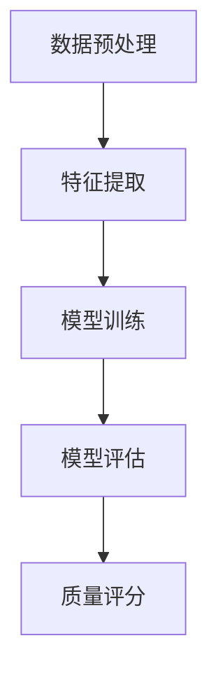
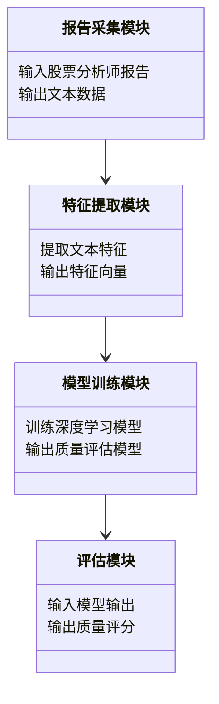
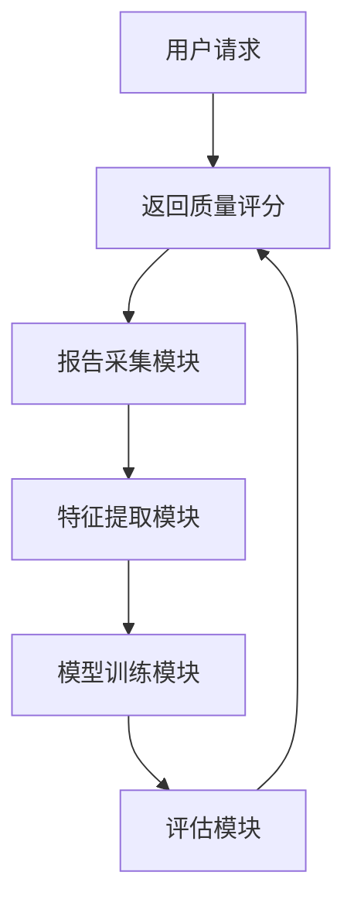
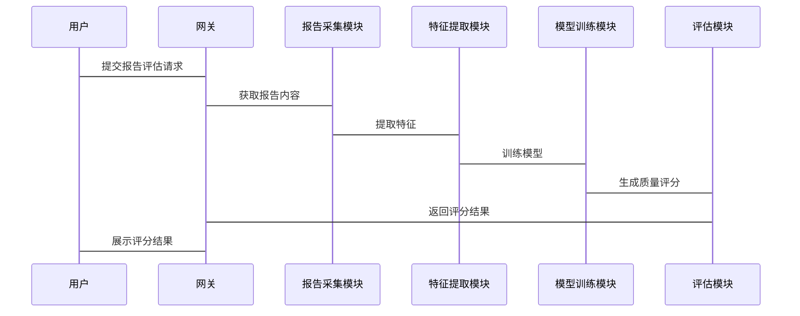

                 


# AI驱动的股票分析师报告质量评估

## 关键词：AI，股票分析，报告质量评估，自然语言处理，深度学习

## 摘要：本文探讨了如何利用人工智能技术，特别是自然语言处理和深度学习，来评估股票分析师报告的质量。文章详细分析了报告质量评估的核心问题，介绍了AI驱动解决方案的算法原理、系统架构，并通过实际案例展示了如何将这些技术应用于金融领域，帮助投资者和机构提高决策效率和准确性。

---

# 第1章: 股票分析师报告质量评估的背景与挑战

## 1.1 问题背景

### 1.1.1 股票分析师报告的核心作用
股票分析师报告是金融市场中重要的决策工具，用于评估公司财务状况、市场趋势和投资机会。高质量的报告能够为投资者提供准确的市场洞察，帮助其做出明智的投资决策。

### 1.1.2 传统报告评估方法的局限性
传统上，报告质量的评估依赖于人工阅读和主观判断，这种方法效率低、耗时长且容易受到个人偏见的影响。此外，面对海量的报告，人工评估难以快速、准确地完成。

### 1.1.3 AI技术在金融领域的应用潜力
人工智能技术，尤其是自然语言处理（NLP）和深度学习，为自动化报告评估提供了新的可能性。通过AI技术，可以快速分析大量文本数据，提取关键信息，并生成客观的质量评估结果。

## 1.2 问题描述

### 1.2.1 报告质量评估的关键维度
报告质量可以从多个维度进行评估，包括信息的准确性、分析的深度、逻辑的连贯性、语言的清晰度等。这些维度需要被量化和标准化，以便AI模型能够进行有效评估。

### 1.2.2 数据来源与特征分析
股票分析师报告的数据来源包括公司财务报表、行业报告、市场新闻等。通过对这些数据的特征分析，可以提取出与报告质量相关的文本特征，如关键词频率、句式复杂度、情感倾向等。

### 1.2.3 评估标准的多样性与复杂性
不同类型的报告可能有不同的评估标准。例如，行业分析报告可能更关注市场趋势的准确性，而公司财报分析可能更关注财务数据的准确性和逻辑性。这种多样性增加了评估的复杂性。

## 1.3 问题解决与边界

### 1.3.1 AI驱动的解决方案概述
通过构建基于NLP的AI模型，可以自动分析报告内容，提取关键信息，并根据预设的评估标准生成质量评分。这种方法能够显著提高评估效率，并减少人为偏见的影响。

### 1.3.2 解决方案的边界与适用场景
AI驱动的解决方案适用于大量结构化和非结构化数据的分析，尤其适合需要快速处理大量报告的金融机构。然而，对于需要高度专业判断的复杂分析，仍需结合人工评估。

### 1.3.3 技术路线与实现框架
AI解决方案的技术路线通常包括数据收集、特征提取、模型训练、结果评估等步骤。实现框架可能涉及自然语言处理库（如spaCy、NLTK）、深度学习框架（如TensorFlow、PyTorch）等。

## 1.4 概念结构与核心要素

### 1.4.1 核心概念与定义
- **自然语言处理（NLP）**：用于处理和分析人类语言的技术，包括文本分类、实体识别、情感分析等。
- **深度学习**：一种机器学习技术，通过多层神经网络模型学习数据的特征表示。
- **报告质量评估**：通过对报告内容的分析，评估其信息的准确性、逻辑性、清晰度等。

### 1.4.2 概念之间的关系与依赖
- NLP技术依赖于语言学知识和大规模文本数据。
- 深度学习模型依赖于高质量的训练数据和计算资源。
- 报告质量评估依赖于多维度的特征分析和模型的准确评估。

### 1.4.3 系统架构与核心模块
- **数据采集模块**：负责收集股票分析师报告和其他相关数据。
- **特征提取模块**：提取文本特征，如关键词、句式复杂度、情感倾向等。
- **模型训练模块**：基于提取的特征训练深度学习模型。
- **评估与反馈模块**：根据模型输出结果生成质量评分，并提供反馈以优化模型。

## 1.5 本章小结
本章介绍了股票分析师报告质量评估的背景与挑战，分析了传统评估方法的局限性，并提出了基于AI技术的解决方案。通过定义核心概念和系统架构，为后续的算法设计和系统实现奠定了基础。

---

# 第2章: AI与NLP在股票分析中的应用

## 2.1 AI与NLP的基本原理

### 2.1.1 人工智能的基本概念
人工智能（AI）是模拟人类智能的计算机系统，涵盖机器学习、自然语言处理、计算机视觉等领域。

### 2.1.2 自然语言处理的核心原理
NLP的目标是使计算机能够理解和生成人类语言。核心任务包括文本分类、实体识别、情感分析等。

### 2.1.3 深度学习在NLP中的应用
深度学习通过多层神经网络模型学习数据的特征表示，常用于文本生成、翻译、情感分析等任务。

## 2.2 股票分析师报告的特征分析

### 2.2.1 文本特征提取
通过NLP技术提取报告中的关键词、句式复杂度、情感倾向等特征，用于评估报告的质量。

### 2.2.2 语义理解与情感分析
利用深度学习模型（如BERT）进行语义理解，分析报告中的情感倾向，判断报告的客观性和中立性。

### 2.2.3 领域知识的融合
结合股票分析的领域知识，如财务指标、行业术语等，提升模型的准确性和专业性。

## 2.3 核心概念与联系

### 2.3.1 模型与数据的关系
模型的性能依赖于训练数据的质量和多样性。高质量的数据能够显著提升模型的准确性和泛化能力。

### 2.3.2 算法与任务的对应关系
不同的NLP任务需要选择合适的算法。例如，文本分类任务适合使用循环神经网络（RNN）或变换器（Transformer）模型。

### 2.3.3 系统架构的模块化设计
系统架构应模块化设计，便于功能扩展和维护。例如，数据采集模块、特征提取模块、模型训练模块等。

## 2.4 本章小结
本章介绍了AI和NLP的基本原理，并分析了其在股票分析师报告中的应用。通过特征提取和语义理解，能够有效提升报告质量评估的准确性和效率。

---

# 第3章: 算法原理与实现流程

## 3.1 数据预处理与特征提取

### 3.1.1 文本清洗与标准化
去除停用词、标点符号，统一文本格式，提高特征提取的准确性。

### 3.1.2 词袋模型与词嵌入
使用词袋模型表示文本，或通过词嵌入技术（如Word2Vec）生成词向量。

### 3.1.3 领域知识的特征提取
提取与股票分析相关的领域特征，如财务指标、行业术语等。

## 3.2 模型训练与优化

### 3.2.1 神经网络模型的选择
选择适合任务的模型，如LSTM、Transformer等。

### 3.2.2 模型训练的优化策略
使用交叉验证、早停等技术优化模型性能。

### 3.2.3 超参数调优与评估指标
通过网格搜索等方法调优模型参数，选择合适的评估指标（如准确率、F1分数）。

## 3.3 算法流程图



## 3.4 本章小结
本章详细介绍了数据预处理、特征提取和模型训练的流程，展示了如何通过AI技术实现报告质量评估。

---

# 第4章: 数学模型与公式推导

## 4.1 深度学习模型的数学基础

### 4.1.1 神经网络的结构
神经网络由输入层、隐藏层和输出层组成，各层通过权重矩阵和激活函数进行信息传递。

### 4.1.2 损失函数与优化器
常用的损失函数包括交叉熵损失，优化器包括随机梯度下降（SGD）、Adam等。

## 4.2 Transformer模型的公式推导

### 4.2.1 自注意力机制
自注意力机制通过计算输入序列中每个位置的注意力权重，生成上下文向量。

$$
\text{Attention}(Q, K, V) = \text{softmax}\left(\frac{QK^T}{\sqrt{d_k}}\right)V
$$

### 4.2.2 前向网络
Transformer的前向网络由多层感知机（MLP）组成，对输入进行非线性变换。

$$
\text{FFN}(x) = \text{max}(0, x W_1 + b_1) W_2 + b_2
$$

## 4.3 模型训练的数学细节

### 4.3.1 梯度下降
通过计算损失函数的梯度，更新模型参数以最小化损失。

$$
\theta_{new} = \theta_{old} - \eta \frac{\partial L}{\partial \theta}
$$

### 4.3.2 模型评估
通过准确率、召回率、F1分数等指标评估模型的性能。

## 4.4 本章小结
本章从数学角度详细推导了深度学习模型的核心公式，为读者理解模型的工作原理提供了理论基础。

---

# 第5章: 系统分析与架构设计

## 5.1 系统功能设计

### 5.1.1 领域模型设计
通过Mermaid类图展示系统的功能模块和交互关系。



### 5.1.2 系统架构设计
通过Mermaid架构图展示系统的整体架构。



### 5.1.3 接口与交互设计
通过Mermaid序列图展示系统的接口交互流程。



## 5.2 本章小结
本章通过系统功能设计、架构设计和接口设计，展示了如何构建一个高效的股票分析师报告质量评估系统。

---

# 第6章: 项目实战与案例分析

## 6.1 项目环境安装

### 6.1.1 安装Python环境
使用Anaconda安装Python 3.8及以上版本。

### 6.1.2 安装依赖库
安装NLP库（如spaCy、NLTK）、深度学习框架（如TensorFlow、Keras）。

## 6.2 系统核心实现源代码

### 6.2.1 数据预处理代码
```python
import spacy

nlp = spacy.load("en_core_web_sm")

def preprocess(text):
    doc = nlp(text)
    tokens = [token.text for token in doc]
    return " ".join(tokens)
```

### 6.2.2 模型训练代码
```python
from tensorflow.keras.models import Sequential
from tensorflow.keras.layers import Dense, LSTM

model = Sequential()
model.add(LSTM(128, input_shape=(None, 1)))
model.add(Dense(1, activation='sigmoid'))
model.compile(loss='binary_crossentropy', optimizer='adam', metrics=['accuracy'])
model.fit(X_train, y_train, epochs=10, batch_size=32)
```

## 6.3 代码解读与分析

### 6.3.1 数据预处理
使用spaCy进行文本清洗和分词，确保输入数据的标准化。

### 6.3.2 模型训练
使用LSTM网络进行文本分类任务，训练模型以预测报告的质量评分。

## 6.4 实际案例分析

### 6.4.1 案例背景
某股票分析师报告的质量评估案例，包含多份报告及其质量标签。

### 6.4.2 模型评估结果
通过混淆矩阵和分类报告展示模型的性能。

## 6.5 项目小结
本章通过实际案例展示了如何将AI技术应用于股票分析师报告质量评估，提供了从环境安装到模型训练的完整流程。

---

# 第7章: 总结与展望

## 7.1 总结
本文详细探讨了AI驱动的股票分析师报告质量评估的核心问题，介绍了基于NLP和深度学习的解决方案，并通过实际案例展示了其应用效果。

## 7.2 未来展望
未来的研究方向可能包括更复杂模型的开发、多模态数据的整合、实时报告评估系统的构建等。

## 7.3 注意事项
在实际应用中，需注意数据隐私保护、模型的可解释性以及算法的计算效率。

## 7.4 拓展阅读
推荐相关书籍和论文，帮助读者进一步深入学习AI在金融领域的应用。

---

# 作者：AI天才研究院/AI Genius Institute & 禅与计算机程序设计艺术 /Zen And The Art of Computer Programming

