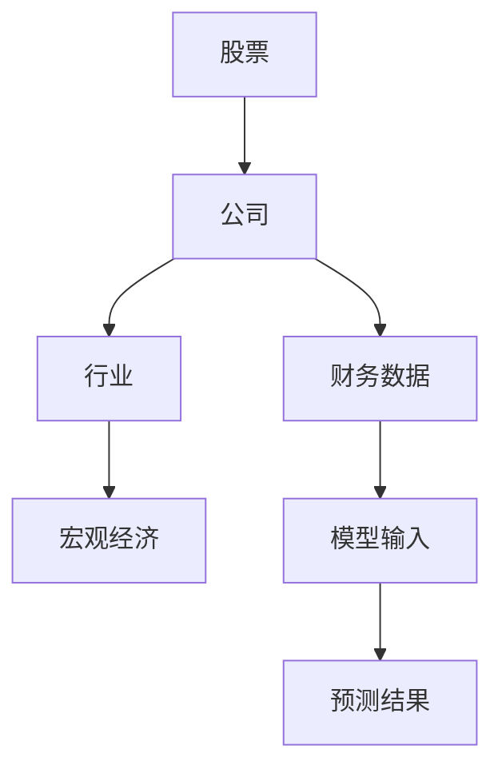
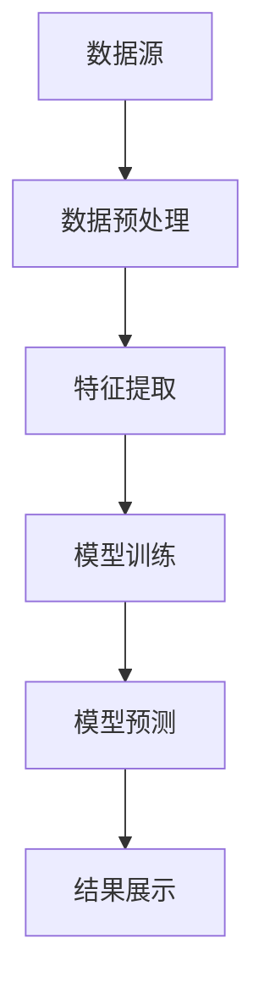

                 


# AI驱动的股票基本面分析工具

> 关键词：AI，股票分析，基本面，机器学习，深度学习，自然语言处理

> 摘要：本文探讨了AI如何驱动股票基本面分析的创新，通过分析数据特征、模型原理和系统架构，展示了如何利用机器学习和深度学习技术提升投资决策的效率和准确性。文章结合实际案例，详细讲解了AI驱动的股票分析工具的实现过程，并展望了未来的发展方向。

---

## 第一部分：AI驱动的股票基本面分析工具背景与基础

### 第1章：股票基本面分析的定义与AI驱动的必要性

#### 1.1 股票基本面分析的定义
股票基本面分析是通过对公司财务报表、行业地位、管理团队和宏观经济环境等信息的分析，评估股票的内在价值。传统的基本面分析依赖分析师的主观判断，存在数据量大、信息复杂和人为情绪干扰等问题。

#### 1.2 AI在金融领域的应用背景
AI技术在金融领域的应用日益广泛，特别是在高频交易和风险管理方面。然而，股票基本面分析仍主要依赖人工经验，难以应对海量数据和复杂模式的挑战。

#### 1.3 AI驱动的股票分析优势
AI具备强大的数据处理能力和模式识别能力，能够从海量数据中提取关键信息，帮助投资者做出更客观、高效的决策。

---

### 第2章：AI驱动股票分析的核心概念与联系

#### 2.1 核心概念原理
AI驱动的股票分析涉及多个核心概念，包括股票数据、模型类型和数据特征。股票数据包括财务数据和市场情绪数据；模型类型包括线性回归、随机森林和LSTM；数据特征则包括收盘价、成交量和市盈率等。

#### 2.2 核心概念属性对比表格

| 概念       | 描述                           |
|------------|--------------------------------|
| 股票数据   | 公司财务报表、股价数据         |
| 模型类型   | 线性回归、随机森林、LSTM       |
| 数据特征   | 收盘价、成交量、市盈率等       |

#### 2.3 实体关系图



---

## 第二部分：AI驱动的股票基本面分析工具的算法原理

### 第3章：AI驱动股票分析的算法原理

#### 3.1 线性回归模型
线性回归是一种简单但强大的回归算法，适用于线性关系的预测。其数学公式如下：

$$ y = \beta_0 + \beta_1 x + \epsilon $$

其中，$\beta_0$是截距，$\beta_1$是回归系数，$\epsilon$是误差项。

#### 3.2 随机森林
随机森林是一种基于树模型的集成方法，能够有效处理非线性关系。其核心思想是通过构建多棵决策树并进行投票或平均来提高模型的准确性和稳定性。

#### 3.3 LSTM
长短期记忆网络（LSTM）适用于时间序列数据的预测，能够捕捉长期依赖关系。其核心结构包括输入门、遗忘门和输出门。

---

### 第4章：AI驱动股票分析的系统架构设计

#### 4.1 问题场景介绍
股票基本面分析系统需要处理海量数据，包括财务数据、市场情绪和行业趋势等。系统需要具备高效的数据处理能力、准确的模型预测能力和友好的用户界面。

#### 4.2 系统功能设计
系统功能包括数据采集、特征提取、模型训练和结果展示。数据采集模块负责获取股票数据；特征提取模块提取关键特征；模型训练模块训练预测模型；结果展示模块输出预测结果。

#### 4.3 系统架构图



---

## 第三部分：AI驱动的股票基本面分析工具的项目实战

### 第5章：项目实战与案例分析

#### 5.1 环境配置
项目需要安装Python、NumPy、Pandas、Scikit-learn和Keras等库。代码示例如下：

```python
import numpy as np
import pandas as pd
from sklearn.linear_model import LinearRegression
```

#### 5.2 代码实现
以下是线性回归模型的实现代码：

```python
# 数据准备
X = df['feature'].values.reshape(-1, 1)
y = df['target'].values

# 模型训练
model = LinearRegression()
model.fit(X, y)

# 预测结果
y_pred = model.predict(X)
```

#### 5.3 案例分析
以某公司股票为例，分析其财务数据和市场趋势，利用模型预测其未来股价走势。

---

## 第四部分：总结与展望

### 第6章：总结与展望

#### 6.1 项目总结
本文详细介绍了AI驱动的股票基本面分析工具的实现过程，包括算法原理、系统架构和项目实战。通过案例分析展示了AI技术在股票分析中的应用价值。

#### 6.2 未来展望
未来，随着AI技术的不断发展，股票分析工具将更加智能化和个性化。深度学习和自然语言处理技术的应用将进一步提升分析的准确性和效率。

---

作者：AI天才研究院/AI Genius Institute & 禅与计算机程序设计艺术 /Zen And The Art of Computer Programming

