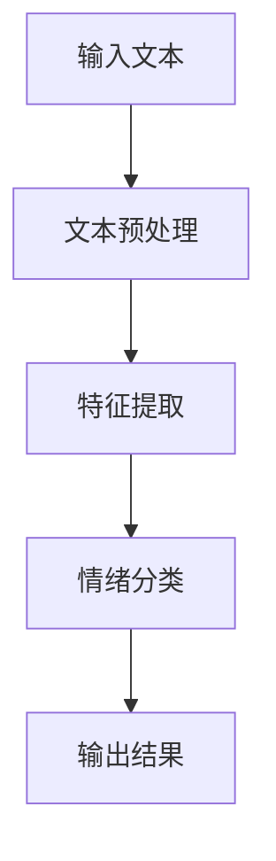
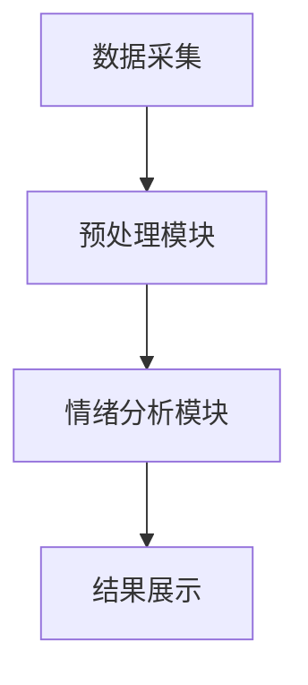
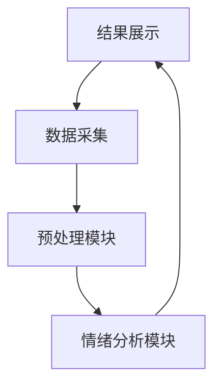

                 

# AI驱动的股票市场情绪分析

> 关键词：AI，股票市场，情绪分析，深度学习，自然语言处理，风险管理

> 摘要：本文将深入探讨如何利用人工智能技术，特别是自然语言处理和深度学习，来分析和预测股票市场的投资者情绪。通过结合传统机器学习和现代深度学习算法，我们能够构建高效的股票市场情绪分析系统，为投资者提供更准确的决策支持。文章将从情绪分析的基本原理、算法实现、系统架构设计到实际项目案例进行详细讲解。

---

## 第一部分: AI驱动的股票市场情绪分析概述

### 第1章: 情绪分析与股票市场的结合

#### 1.1 情绪分析的定义与背景

情绪分析是一种自然语言处理技术，用于识别和分类文本中的情感倾向。在股票市场中，投资者情绪是影响股价波动的重要因素。通过分析新闻、社交媒体、公司财报等文本数据，可以提取市场情绪，从而辅助投资决策。

#### 1.2 AI驱动情绪分析的核心概念

- **情绪分类**：将文本分为正面、负面或中性情绪。
- **情绪强度**：量化情绪的强烈程度，帮助预测股价波动。
- **实时分析**：利用AI技术实时监控市场情绪变化，提供及时反馈。

#### 1.3 本章小结

本章介绍了情绪分析的基本概念及其在股票市场的应用，强调了AI技术在提升情绪分析效率和准确性方面的重要性。

---

## 第二部分: 情绪分析的核心概念与联系

### 第2章: 情绪分析的核心原理

#### 2.1 情绪分析的基本原理

- **文本预处理**：包括分词、去除停用词、词干提取等步骤。
- **特征提取**：通过TF-IDF或Word2Vec提取文本特征。
- **情绪分类**：使用机器学习模型（如SVM、随机森林）或深度学习模型（如LSTM、BERT）进行分类。

#### 2.2 情绪分析与股票市场的关联

- **市场情绪影响股价**：正面情绪通常导致股价上涨，负面情绪导致股价下跌。
- **投资者情绪周期性**：情绪波动往往呈现周期性，与市场波动密切相关。
- **风险管理**：通过情绪分析，投资者可以及时发现市场风险，做出调整。

#### 2.3 核心概念对比分析

- **模型对比**：传统机器学习模型（如SVM）与深度学习模型（如BERT）的优缺点对比。
- **情绪强度与股价相关性**：情绪强度与股价波动的相关性分析。
- **误差控制**：如何通过数据增强、模型调优等方法减少情绪分析的误差。

#### 2.4 本章小结

本章深入探讨了情绪分析的核心原理及其在股票市场的应用，分析了不同模型的优缺点，并强调了情绪强度在投资决策中的重要性。

---

## 第三部分: 情绪分析算法原理与数学模型

### 第3章: 情绪分析算法原理

#### 3.1 基于传统机器学习的情绪分析

- **支持向量机（SVM）**：通过最大化分类间隔，实现高精度分类。
- **随机森林（Random Forest）**：通过集成学习，提升模型鲁棒性。
- **朴素贝叶斯（Naive Bayes）**：基于概率论，简单但效果良好。

#### 3.2 基于深度学习的情绪分析

- **循环神经网络（RNN）**：适合处理序列数据，捕捉上下文信息。
- **Transformer模型**：通过自注意力机制，提升文本理解能力。
- **BERT模型**：预训练语言模型，能够捕捉复杂的语义信息。

#### 3.3 情绪分析的数学模型

- **交叉熵损失函数**：
  $$ \text{损失函数} = -\sum_{i=1}^{n} y_i \log(p_i) + (1-y_i)\log(1-p_i) $$
- **情绪强度预测模型**：
  $$ \text{预测值} = \text{模型权重} \times \text{输入特征} + \text{偏置项} $$

#### 3.4 算法流程图

---

## 第四部分: 情绪分析的系统架构设计

### 第4章: 系统架构设计

#### 4.1 问题场景介绍

- **目标**：构建一个实时股票市场情绪分析系统。
- **用户角色**：投资者、金融分析师、机构投资者。
- **功能需求**：实时监控市场情绪、生成情绪报告、提供投资建议。

#### 4.2 系统功能设计

- **数据采集模块**：从新闻网站、社交媒体等获取文本数据。
- **预处理模块**：清洗数据，提取关键词。
- **情绪分析模块**：使用模型进行情绪分类。
- **结果展示模块**：以可视化形式呈现情绪分析结果。

#### 4.3 系统架构图

#### 4.4 系统接口设计

- **输入接口**：接收文本数据。
- **输出接口**：返回情绪分类结果。
- **API接口**：提供给其他系统调用。

#### 4.5 系统交互流程图

---

## 第五部分: 项目实战

### 第5章: 项目实战

#### 5.1 环境配置

- **Python版本**：3.8以上。
- **依赖库**：安装`numpy`、`pandas`、`tensorflow`、`nltk`等库。

#### 5.2 数据收集

- **数据来源**：从新闻网站、社交媒体等获取相关文本数据。
- **数据清洗**：去除无关信息，提取关键词。

#### 5.3 特征工程

- **文本分词**：使用`nltk`或`spaCy`进行分词。
- **特征提取**：使用TF-IDF提取关键词向量。

#### 5.4 模型实现

- **模型选择**：选择BERT模型进行情绪分类。
- **模型训练**：使用预处理后的数据训练模型。
- **模型调优**：通过超参数调整优化模型性能。

#### 5.5 结果分析

- **准确率**：评估模型的分类性能。
- **混淆矩阵**：分析模型的分类错误情况。
- **实际案例**：通过具体案例展示模型的应用效果。

#### 5.6 项目小结

本章通过实际项目展示了如何利用AI技术构建股票市场情绪分析系统，强调了数据预处理和模型选择的重要性。

---

## 第六部分: 总结与扩展

### 第6章: 总结与扩展

#### 6.1 核心内容总结

- 情绪分析是股票市场预测的重要工具。
- AI技术显著提升了情绪分析的效率和准确性。
- 深度学习模型在复杂场景下表现优异。

#### 6.2 最佳实践 tips

- 数据质量是情绪分析的关键，确保数据来源可靠。
- 模型调优需要结合实际场景，选择合适的参数。
- 结合多种模型和技术，提升系统的鲁棒性。

#### 6.3 小结

本文详细介绍了AI驱动的股票市场情绪分析的理论与实践，为读者提供了从理论到实际应用的全面指导。

---

## 作者：AI天才研究院 & 禅与计算机程序设计艺术

---

以上是《AI驱动的股票市场情绪分析》的完整目录和部分正文内容，涵盖了从基础概念到实际应用的各个方面。

