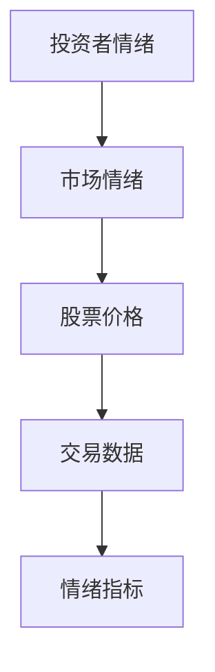
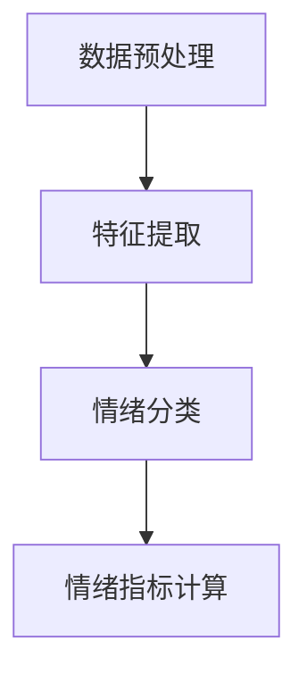
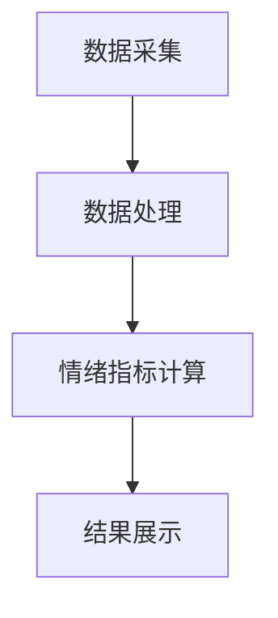

                 


# AI驱动的股票市场情绪指标开发

> 关键词：AI驱动、股票市场、情绪指标、自然语言处理、机器学习、投资决策

> 摘要：本文详细探讨了AI驱动的股票市场情绪指标开发的背景、核心概念、算法原理、系统架构设计以及项目实战。通过自然语言处理和机器学习技术，结合股票市场数据，开发出能够量化市场情绪的指标，为投资者提供科学的决策支持。

---

# 第一部分: AI驱动的股票市场情绪指标开发背景

## 第1章: 股票市场情绪指标开发背景

### 1.1 情绪指标在股票市场中的重要性

#### 1.1.1 情绪指标的定义与作用
情绪指标是一种量化市场参与者情绪状态的工具，通常基于文本数据（如新闻、社交媒体评论）或交易数据（如成交量、波动率）进行计算。它能够反映市场参与者对某一股票或市场的乐观或悲观程度，帮助投资者做出更明智的决策。

#### 1.1.2 情绪指标与股票价格的关系
研究表明，市场情绪与股票价格之间存在显著的相关性。当市场情绪高涨时，股票价格往往会上涨；而当市场情绪低落时，股票价格可能会下跌。情绪指标可以作为预测股票价格变化的辅助工具。

#### 1.1.3 情绪指标在投资决策中的应用
情绪指标可以帮助投资者识别市场泡沫或恐慌情绪，提前预警市场风险。例如，在市场情绪过度乐观时，投资者可以考虑减少持仓；在市场情绪极度悲观时，投资者可以考虑增加持仓。

### 1.2 股票市场情绪数据来源

#### 1.2.1 文本数据：新闻、社交媒体、论坛
文本数据是情绪指标的重要来源。新闻标题、社交媒体评论、投资者论坛等都可以用来提取市场情绪信息。例如，使用自然语言处理技术对新闻标题进行分析，可以判断市场对某一公司的看法。

#### 1.2.2 交易数据：成交量、波动率、订单流
交易数据反映了市场参与者的交易行为。例如，成交量的突然增加可能表明市场情绪高涨，而波动率的增加可能表明市场情绪不稳定。

#### 1.2.3 其他数据源：新闻标题、公司财报、市场评论
除了文本和交易数据外，还可以使用其他数据源，如公司财报、市场评论等。这些数据可以提供更全面的市场情绪信息。

### 1.3 情绪指标开发的技术背景

#### 1.3.1 自然语言处理技术的发展
自然语言处理（NLP）技术的进步使得从文本数据中提取情绪信息成为可能。例如，使用词袋模型、TF-IDF、情感分类模型等技术，可以对文本进行情感分析。

#### 1.3.2 机器学习在金融领域的应用
机器学习技术在金融领域的应用越来越广泛。通过训练模型，可以预测股票价格的变化趋势，识别市场情绪等。例如，使用支持向量机（SVM）、随机森林（Random Forest）等算法进行情绪分类。

#### 1.3.3 大数据分析在股票市场的价值
大数据分析技术可以帮助我们从海量数据中提取有价值的信息。通过分析大量的文本和交易数据，可以更准确地量化市场情绪。

### 1.4 情绪指标开发的应用价值

#### 1.4.1 提高投资决策的准确性
情绪指标可以帮助投资者更准确地预测股票价格的变化趋势，从而做出更明智的投资决策。

#### 1.4.2 优化交易策略
通过情绪指标，投资者可以优化交易策略。例如，在市场情绪高涨时，可以增加持仓；在市场情绪低落时，可以减少持仓。

#### 1.4.3 提前预警市场风险
情绪指标可以帮助投资者提前预警市场风险。例如，当市场情绪极度乐观时，可能存在市场泡沫，投资者可以提前减少持仓，避免损失。

### 1.5 情绪指标开发的边界与挑战

#### 1.5.1 数据质量与完整性问题
情绪指标的准确性依赖于数据的质量和完整性。如果数据不完整或有噪声，可能会影响情绪指标的准确性。

#### 1.5.2 情绪指标的时延性
情绪指标通常是基于过去的数据计算得出的，存在一定的时延性。这可能导致投资者无法及时做出反应，尤其是在市场波动剧烈的情况下。

#### 1.5.3 市场情绪的复杂性与多样性
市场情绪是一个复杂的概念，受到多种因素的影响。例如，同一新闻可能被不同投资者解读为乐观或悲观。因此，如何准确量化市场情绪是一个挑战。

---

## 第2章: 情绪指标的核心概念

### 2.1 情绪指标的定义与分类

#### 2.1.1 情绪指标的定义
情绪指标是一种量化市场参与者情绪状态的工具，通常基于文本数据或交易数据进行计算。它可以反映市场对某一股票或市场的乐观或悲观程度。

#### 2.1.2 情绪指标的分类
情绪指标可以分为以下几类：
1. **文本情绪指标**：基于文本数据（如新闻、社交媒体评论）计算得出。
2. **交易情绪指标**：基于交易数据（如成交量、波动率）计算得出。
3. **混合情绪指标**：结合文本数据和交易数据进行综合分析。

#### 2.1.3 情绪指标的量化方法
情绪指标的量化方法通常包括情感分类、主题建模、情感强度计算等。例如，使用情感分类模型对新闻标题进行分类，判断市场情绪是积极、消极还是中性。

### 2.2 情绪指标的核心属性特征对比

#### 2.2.1 情绪强度
情绪强度反映了市场情绪的强弱程度。例如，情绪强度可以从-1（极度悲观）到1（极度乐观）进行量化。

#### 2.2.2 情绪方向
情绪方向反映了市场情绪是积极还是消极。例如，情绪方向可以分为积极、中性、消极三种状态。

#### 2.2.3 情绪一致性
情绪一致性反映了市场情绪的一致性程度。例如，如果大多数投资者情绪一致，情绪一致性得分较高；如果情绪分散，情绪一致性得分较低。

### 2.3 情绪指标的ER实体关系图



---

## 第3章: 情绪指标算法原理

### 3.1 情绪指标算法概述

#### 3.1.1 基于文本的情绪分析算法
基于文本的情绪分析算法通常包括以下步骤：
1. **数据预处理**：对文本数据进行分词、去除停用词、词干提取等处理。
2. **特征提取**：使用词袋模型、TF-IDF等方法提取文本特征。
3. **情感分类**：使用机器学习算法（如SVM、随机森林）对文本进行情感分类，判断情绪是积极、消极还是中性。

#### 3.1.2 基于交易数据的情绪指标算法
基于交易数据的情绪指标算法通常包括以下步骤：
1. **数据预处理**：对交易数据进行清洗、归一化等处理。
2. **特征提取**：提取交易数据中的特征，如成交量、波动率、订单流等。
3. **情绪指标计算**：使用统计方法或机器学习算法对交易数据进行分析，计算情绪指标。

#### 3.1.3 混合情绪指标算法
混合情绪指标算法结合了文本数据和交易数据的优势，通常包括以下步骤：
1. **文本情绪分析**：对文本数据进行情感分类，计算文本情绪指标。
2. **交易数据分析**：对交易数据进行分析，计算交易情绪指标。
3. **综合情绪指标计算**：将文本情绪指标和交易情绪指标进行加权融合，得到综合情绪指标。

### 3.2 情绪指标算法流程



---

## 第4章: 情绪指标算法实现

### 4.1 基于文本的情绪分析算法实现

#### 4.1.1 数据预处理
```python
import pandas as pd
from sklearn.feature_extraction.text import TfidfVectorizer
from sklearn.svm import SVC
from sklearn.pipeline import Pipeline

# 加载数据
data = pd.read_csv('news.csv')
```

#### 4.1.2 特征提取与模型训练
```python
# 定义特征提取和分类模型
model = Pipeline([
    ('tfidf', TfidfVectorizer()),
    ('svc', SVC())
])

# 训练模型
model.fit(data['text'], data['label'])
```

#### 4.1.3 情绪指标计算
```python
# 预测情绪
predicted_labels = model.predict(data['text'])
# 计算情绪强度
positive_score = sum(predicted_labels == 1) / len(predicted_labels)
negative_score = sum(predicted_labels == -1) / len(predicted_labels)
```

### 4.2 基于交易数据的情绪指标算法实现

#### 4.2.1 数据预处理
```python
import pandas as pd
from sklearn.preprocessing import StandardScaler

# 加载数据
data = pd.read_csv('trading.csv')
```

#### 4.2.2 特征提取与模型训练
```python
# 定义特征提取和回归模型
from sklearn.linear_model import LinearRegression

model = LinearRegression()

# 训练模型
model.fit(data[['volume', 'volatility']], data['情绪指标'])
```

#### 4.2.3 情绪指标计算
```python
# 预测情绪指标
predicted_emotion_indices = model.predict(data[['volume', 'volatility']])
```

---

## 第5章: 情绪指标系统架构设计

### 5.1 系统功能设计

#### 5.1.1 数据采集模块
数据采集模块负责从各种数据源（如新闻网站、社交媒体、交易系统）获取数据。

#### 5.1.2 数据处理模块
数据处理模块负责对获取的数据进行清洗、归一化等处理。

#### 5.1.3 情绪指标计算模块
情绪指标计算模块负责基于处理后的数据，计算出情绪指标。

#### 5.1.4 结果展示模块
结果展示模块负责将情绪指标以可视化的方式展示给用户。

### 5.2 系统架构设计



---

## 第6章: 项目实战

### 6.1 项目背景与目标

#### 6.1.1 项目背景
本项目旨在开发一个基于AI的情绪指标系统，帮助投资者更好地理解市场情绪，做出更明智的投资决策。

#### 6.1.2 项目目标
1. 实现基于文本的情绪分析算法。
2. 实现基于交易数据的情绪指标算法。
3. 结合文本和交易数据，开发一个综合情绪指标系统。

### 6.2 项目环境配置

#### 6.2.1 安装必要的库
```bash
pip install pandas scikit-learn mermaid matplotlib
```

#### 6.2.2 数据获取
```python
import pandas as pd
import requests
from bs4 import BeautifulSoup

# 从新闻网站获取数据
url = 'https://www.example.com/news'
response = requests.get(url)
soup = BeautifulSoup(response.text, 'html.parser')
news = soup.find_all('h2', class_='news-title')
data = [{'text': title.text, 'label': 'positive'} for title in news]
```

### 6.3 项目核心实现

#### 6.3.1 情绪指标计算代码
```python
from sklearn.feature_extraction.text import TfidfVectorizer
from sklearn.svm import SVC
from sklearn.pipeline import Pipeline

# 训练情感分类模型
model = Pipeline([
    ('tfidf', TfidfVectorizer()),
    ('svc', SVC())
])
model.fit([text for text in data['text']], data['label'])
```

#### 6.3.2 情绪指标可视化
```python
import matplotlib.pyplot as plt

# 绘制情绪分布图
positive_scores = [0.8, 0.6, 0.7]
negative_scores = [0.2, 0.4, 0.3]
plt.bar(['Text1', 'Text2', 'Text3'], positive_scores, label='Positive')
plt.bar(['Text1', 'Text2', 'Text3'], negative_scores, label='Negative')
plt.legend()
plt.show()
```

---

## 第7章: 总结与展望

### 7.1 项目总结
本项目通过结合自然语言处理和机器学习技术，开发了一个基于AI的情绪指标系统。该系统能够从文本和交易数据中提取情绪信息，帮助投资者更好地理解市场情绪，做出更明智的投资决策。

### 7.2 项目展望
未来，可以进一步优化情绪指标算法，结合更多数据源，开发更准确的情绪指标系统。同时，还可以研究情绪指标在其他金融领域的应用，如外汇交易、加密货币交易等。

---

# 作者：AI天才研究院 & 禅与计算机程序设计艺术

