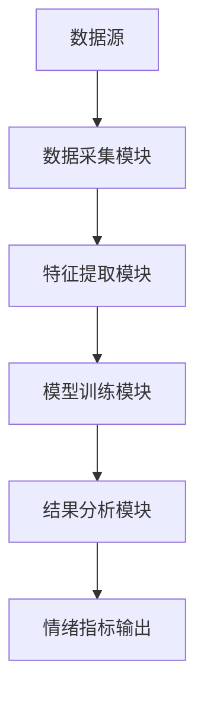

                 

# AI驱动的股票市场情绪指标开发与应用

**关键词：** AI技术、情绪指标、自然语言处理、机器学习、量化交易

**摘要：**  
本文探讨了利用AI技术开发股票市场情绪指标的方法，从数据采集、算法设计到系统实现进行了全面分析。通过自然语言处理和机器学习技术，结合新闻、社交媒体等数据，构建了有效的情绪指标，并展示了其在量化交易中的应用。文章内容详实，结合理论与实践，适合技术与金融领域的读者参考。

---

## 第一章：AI驱动的情绪指标背景与重要性

### 1.1 情绪指标在股票市场中的背景

#### 1.1.1 情绪指标的定义与作用
情绪指标是反映市场参与者情绪状态的量化工具，帮助投资者预测市场走势。它基于文本、交易数据等信息，分析市场情绪的波动。

#### 1.1.2 AI技术的引入
AI技术通过自然语言处理和机器学习，能够高效分析大量非结构化数据，提取情绪特征，从而提升情绪指标的准确性。

### 1.2 情绪指标的重要性

#### 1.2.1 市场情绪与价格波动的关系
市场情绪影响投资者决策，从而影响资产价格波动。情绪指标能够捕捉这些波动，为投资决策提供参考。

#### 1.2.2 情绪指标在量化交易中的应用
情绪指标可作为量化交易的辅助工具，帮助交易者识别市场拐点，优化投资策略。

---

## 第二章：情绪指标的核心概念与理论

### 2.1 情绪指标的构建方法

#### 2.1.1 数据来源与处理
- **文本数据：** 包括新闻、社交媒体、论坛等。
- **交易数据：** 包括成交量、价格波动等。
- 数据清洗与特征提取是关键步骤，确保数据质量。

#### 2.1.2 情感分析算法
- **规则-based方法：** 基于关键词匹配进行情感分类。
- **机器学习方法：** 使用SVM、随机森林等模型进行分类。
- **深度学习方法：** 利用LSTM捕捉序列特征，提升情感分析的准确性。

### 2.2 情绪指标的量化与评价

#### 2.2.1 情绪强度的计算
通过加权平均或其他统计方法，将不同来源的情绪强度综合起来，得到整体情绪指标。

#### 2.2.2 指标的有效性评估
使用回测、统计显著性等方法，验证情绪指标的预测能力。

---

## 第三章：情绪指标的AI算法实现

### 3.1 文本挖掘与情感分析

#### 3.1.1 文本预处理
- 分词处理：将文本分割成单词或短语。
- 去除停用词：移除常见词汇如“and”、“the”等。
- 词干提取：将单词还原为词干。

#### 3.1.2 词袋模型与TF-IDF
- 词袋模型：将文本表示为词汇的集合。
- TF-IDF：计算词项在文本中的重要性。

#### 3.1.3 情感分类算法
- 使用SVM、随机森林等算法进行分类。

### 3.2 基于深度学习的模型

#### 3.2.1 LSTM网络结构
- LSTM能够捕捉长序列中的模式，适合时间序列分析。
- 网络结构包括输入层、LSTM层、全连接层和输出层。

#### 3.2.2 情感预测模型
- 使用预训练的词嵌入（如GloVe）初始化模型。
- 训练模型预测情绪类别或情绪强度。

### 3.3 情绪指标的计算与优化

#### 3.3.1 情绪强度计算
- 基于模型预测结果，计算整体情绪强度。
- 使用滑动窗口技术，平滑情绪指标。

#### 3.3.2 模型调优与优化
- 调整超参数，如学习率、批次大小。
- 使用交叉验证评估模型性能。

---

## 第四章：情绪指标系统的架构与实现

### 4.1 系统架构设计

#### 4.1.1 模块划分
- 数据采集模块：获取新闻、社交媒体数据。
- 特征提取模块：进行文本处理和特征提取。
- 模型训练模块：训练情感分析模型。
- 结果分析模块：计算情绪指标并输出结果。

#### 4.1.2 系统流程图

### 4.2 系统实现

#### 4.2.1 数据采集
- 使用API获取新闻数据，如使用新闻API接口。
- 爬取社交媒体数据，如Twitter、Reddit等平台的帖子。

#### 4.2.2 特征提取
- 使用TF-IDF提取文本特征。
- 将特征输入模型进行分类。

#### 4.2.3 模型训练
- 使用训练数据训练情感分析模型。
- 评估模型性能，调整参数。

#### 4.2.4 结果分析
- 计算情绪指标，分析其与市场波动的关系。
- 可视化情绪指标的变化趋势。

---

## 第五章：情绪指标的项目实战

### 5.1 环境搭建

#### 5.1.1 安装Python库
- 使用pip安装必要的库：numpy、pandas、scikit-learn、keras、tensorflow等。

### 5.2 数据获取与处理

#### 5.2.1 获取数据
- 使用API获取新闻数据，如使用NewsAPI。
- 爬取社交媒体数据，如使用Twitter API。

#### 5.2.2 数据清洗
- 去除无关信息，如广告、噪声。
- 分词处理，提取关键词。

### 5.3 情感分析模型实现

#### 5.3.1 模型训练
- 使用训练数据训练情感分类模型。
- 评估模型准确率、召回率等指标。

#### 5.3.2 情绪指标计算
- 基于模型预测结果，计算情绪强度。
- 使用滑动窗口技术平滑情绪指标。

### 5.4 结果分析

#### 5.4.1 情绪指标与市场波动的关系
- 分析情绪指标与股票价格波动的相关性。
- 通过回测验证情绪指标的有效性。

#### 5.4.2 可视化展示
- 绘制情绪指标的变化趋势图。
- 对比不同时间窗口的情绪指标。

---

## 第六章：情绪指标的实际应用与案例分析

### 6.1 情绪指标在量化交易中的应用

#### 6.1.1 量化交易策略
- 基于情绪指标制定买卖策略。
- 使用情绪指标作为交易信号。

#### 6.1.2 案例分析
- 分析情绪指标在某段时间内的表现。
- 对比情绪指标与实际市场表现的相关性。

### 6.2 情绪指标的市场拐点预测

#### 6.2.1 市场拐点识别
- 使用情绪指标识别市场的顶点和底部。
- 结合其他指标（如技术指标）进行综合判断。

#### 6.2.2 预测模型的优化
- 使用集成学习提升预测准确性。
- 引入外部数据（如宏观经济指标）丰富模型输入。

---

## 第七章：总结与展望

### 7.1 本文总结
- 总结情绪指标的开发与应用过程。
- 强调AI技术在情绪分析中的重要性。

### 7.2 未来展望
- 探讨更先进的算法，如Transformer模型的应用。
- 提出未来的研究方向，如多模态数据的融合。

---

**作者：AI天才研究院 & 禅与计算机程序设计艺术**

