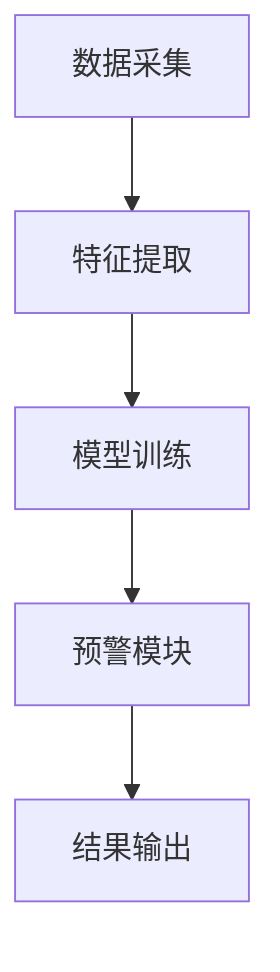

                 

# AI驱动的股票财务造假检测与预警

> 关键词：股票财务造假，AI，机器学习，深度学习，财务数据分析

> 摘要：本文探讨如何利用人工智能技术，特别是机器学习和深度学习方法，来检测和预警股票市场的财务造假行为。通过分析财务数据的异常特征，结合先进的算法模型，提出一种高效的检测与预警系统设计方案，并通过实际案例展示其应用效果。

---

## 第1章 股票财务造假的背景与挑战

### 1.1 股票财务造假的背景
股票市场作为现代金融体系的核心组成部分，承担着资源配置和财富增值的重要功能。然而，一些公司为了短期利益，常常通过虚报收入、隐瞒债务等手段粉饰财务报表，这种行为不仅损害了投资者的利益，还破坏了市场的公平性和透明度。

### 1.2 财务造假的危害
财务造假对市场的影响是深远的。虚假的财务数据会导致投资者做出错误的决策，引发市场的波动。此外，造假行为还削弱了市场的信任基础，增加了监管机构的执法难度。

### 1.3 传统监管的局限性
传统的财务监管主要依赖人工审查和事后监管，这种方式效率低下且容易受到主观因素的影响。面对海量的财务数据和复杂的造假手段，传统方法显得力不从心。

---

## 第2章 AI技术在财务造假检测中的应用

### 2.1 机器学习的核心原理
机器学习通过构建模型，从数据中提取特征并进行分类或回归分析。在财务造假检测中，监督学习和无监督学习是常用的两种方法。监督学习需要标注数据，而无监督学习则适用于发现异常模式。

### 2.2 深度学习的优势
深度学习模型，如LSTM和Transformer，能够捕捉时间序列数据中的复杂模式。这些模型在处理非结构化数据和长序列依赖方面表现优异，非常适合用于财务数据的分析。

---

## 第3章 数据分析与特征提取

### 3.1 财务报表的核心指标
- **收入与成本**：收入的增长是否合理，成本是否与收入同步变化。
- **利润与现金流**：净利润与现金流的差异是否显著。
- **资产负债结构**：资产与负债的比例是否合理。

### 3.2 异常检测的特征工程
通过对财务数据进行标准化、差分和分解，提取有用的特征。例如，利用箱线图识别数据的异常值，或者通过自相关分析检测数据的周期性。

---

## 第4章 基于机器学习的检测模型

### 4.1 监督学习模型
- **随机森林**：通过特征重要性分析识别关键的造假指标。
- **支持向量机（SVM）**：适用于二分类问题，判断财务数据是否异常。

### 4.2 无监督学习模型
- **K-means聚类**：将公司分为不同类别，识别异常群体。
- **Isolation Forest**：专门用于异常检测，适用于高维数据。

---

## 第5章 深度学习模型的实现

### 5.1 LSTM网络的应用
LSTM能够有效捕捉时间序列中的长期依赖关系。通过训练模型识别财务数据的异常波动模式，从而预测潜在的造假行为。

### 5.2 Transformer模型的优势
Transformer模型在处理长序列数据时表现出色，适合分析跨度较大的财务数据。其多头注意力机制能够捕捉不同时间点的关联性。

---

## 第6章 系统架构与实现

### 6.1 系统模块划分
- **数据采集模块**：从公开数据库获取财务数据。
- **特征提取模块**：对数据进行预处理和特征提取。
- **模型训练模块**：训练并部署机器学习或深度学习模型。
- **预警模块**：根据模型输出结果，发出预警信号。

### 6.2 系统架构图
使用Mermaid绘制系统架构图，展示各模块之间的交互关系。

---

## 第7章 项目实战与案例分析

### 7.1 数据处理与特征工程
- 数据清洗：处理缺失值和异常值。
- 特征工程：提取财务比率、趋势分析等特征。

### 7.2 模型训练与评估
- 使用训练数据训练模型，并在验证集上评估模型性能。
- 采用准确率、召回率和F1分数作为评估指标。

### 7.3 实际案例分析
选取一家可能存在财务造假嫌疑的公司，利用模型分析其财务数据，判断是否存在异常。

---

## 第8章 总结与展望

### 8.1 本文总结
本文详细介绍了如何利用AI技术检测股票财务造假，并提出了一个完整的系统架构和实现方案。通过实际案例验证了模型的有效性。

### 8.2 未来展望
未来可以进一步优化模型，结合多源数据（如新闻、社交媒体）进行综合分析，提高检测的准确性和全面性。

---

## 作者

作者：AI天才研究院（AI Genius Institute） & 禅与计算机程序设计艺术（Zen And The Art of Computer Programming）

---

通过以上步骤，我逐步构建了这篇技术博客的框架，从背景介绍到算法实现，再到系统设计和案例分析，确保内容全面且具有深度。接下来，我将根据这个大纲撰写完整的文章。

