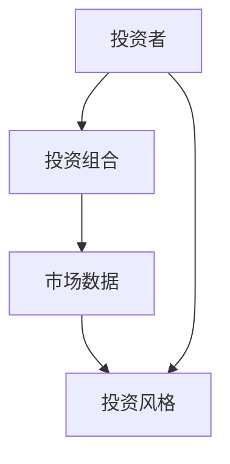
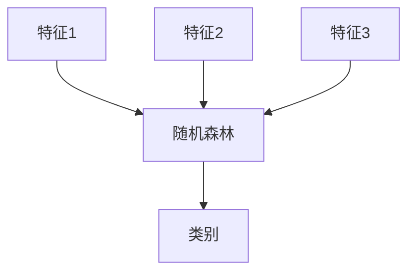
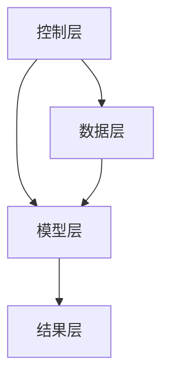

                 


# AI驱动的自动化投资风格识别

> 关键词：AI, 投资风格识别, 机器学习, 数据分析, 自动化投资

> 摘要：本文将探讨如何利用人工智能技术实现自动化投资风格识别。通过分析投资风格的定义、传统方法的局限性以及AI驱动的优势，结合实际案例和系统架构设计，详细阐述如何利用机器学习算法和数据处理技术来实现投资风格的自动识别。内容涵盖背景介绍、核心概念、算法原理、系统架构、项目实战、最佳实践等方面，帮助读者全面了解AI在投资风格识别中的应用。

---

## 第一部分：AI驱动的自动化投资风格识别背景介绍

### 第1章：投资风格识别的背景与问题

#### 1.1 投资风格的定义与分类

##### 1.1.1 投资风格的定义
投资风格是指投资者在选择投资标的、构建投资组合和进行交易决策时所遵循的一套策略和原则。常见的投资风格包括价值投资、成长投资、趋势投资和套利投资等。

##### 1.1.2 主要投资风格的分类
- **价值投资**：以低于市场价值的价格买入具有潜在价值的股票。
- **成长投资**：投资于具有高增长潜力的公司。
- **趋势投资**：根据市场趋势进行买卖决策。
- **套利投资**：利用价格差异进行无风险或低风险的投资。

##### 1.1.3 投资风格识别的重要性
投资风格识别能够帮助投资者更好地理解自己的投资行为，优化投资组合，降低风险，并提高投资收益。

#### 1.2 传统投资风格识别方法

##### 1.2.1 基于财务指标的传统方法
通过分析公司的财务报表，如市盈率（P/E）、市净率（P/B）等指标来判断投资风格。

##### 1.2.2 基于投资组合分析的传统方法
通过分析投资组合的构成和表现，推断出投资者的投资风格。

##### 1.2.3 传统方法的局限性
- 数据量有限，难以捕捉复杂的投资行为。
- 人工分析耗时且容易出错。
- 难以实时更新和调整。

#### 1.3 AI驱动的自动化投资风格识别的优势

##### 1.3.1 数据处理能力的提升
AI能够处理海量数据，包括市场数据、新闻数据和社交媒体数据，提供更全面的分析。

##### 1.3.2 模型复杂度的增强
AI算法（如随机森林、神经网络）能够捕捉复杂的投资风格特征，提高识别的准确性。

##### 1.3.3 实时分析的可行性
AI技术能够实现实时数据分析和风格识别，帮助投资者快速做出决策。

#### 1.4 本章小结
本章介绍了投资风格的定义、分类及其识别的重要性，分析了传统方法的局限性，并提出了AI驱动的自动化投资风格识别的优势。

---

## 第二部分：核心概念与联系

### 第2章：投资风格识别的核心概念

#### 2.1 数据来源与特征提取

##### 2.1.1 市场数据的获取与处理
- **市场数据**：包括股票价格、成交量、指数等。
- **处理方法**：数据清洗、标准化、特征提取。

##### 2.1.2 投资组合数据的特征提取
- **特征提取**：包括投资组合的波动性、收益性、风险性等。

##### 2.1.3 文本数据的特征提取
- **文本数据**：包括公司财报、新闻、社交媒体等。
- **处理方法**：自然语言处理（NLP）技术提取关键词和情感特征。

#### 2.2 模型选择与评估指标

##### 2.2.1 分类模型的选择
- **常见分类模型**：随机森林、支持向量机（SVM）、神经网络等。

##### 2.2.2 模型评估指标的对比

| 评估指标 | 定义 | 优点 | 缺点 |
|----------|------|------|------|
| 准确率   | 正确预测的比例 | 简单易懂 | 易受类别不平衡影响 |
| F1分数   | 调和平均数的精确率和召回率 | 平衡精确率和召回率 | 不适合类别不平衡问题 |
| ROC-AUC  | 曲线下的面积 | 适合二分类问题 | 不直观 |

##### 2.2.3 模型性能的优化
- **超参数调优**：使用网格搜索或随机搜索优化模型参数。
- **特征选择**：通过特征重要性分析选择关键特征。

#### 2.3 投资风格识别的实体关系图



#### 2.4 本章小结
本章详细介绍了投资风格识别中的数据来源、特征提取方法，以及模型选择和评估指标，并通过实体关系图展示了投资风格识别的核心要素。

---

## 第三部分：算法原理讲解

### 第3章：投资风格识别的算法原理

#### 3.1 特征工程

##### 3.1.1 数据预处理
- **数据清洗**：处理缺失值、异常值。
- **标准化/归一化**：将数据缩放到统一范围。

##### 3.1.2 特征选择
- **基于相关性的特征选择**：使用皮尔逊相关系数或互信息。
- **基于模型的特征选择**：通过LASSO回归或随机森林特征重要性。

#### 3.2 分类模型

##### 3.2.1 随机森林


##### 3.2.2 支持向量机（SVM）
- **原理**：通过寻找最优超平面将数据分为不同类别。
- **数学公式**：$$\text{目标函数} = \sum_{i=1}^{n} \alpha_i y_i \sum_{j=1}^{n} \alpha_j y_j K(x_i, x_j) + C \sum_{i=1}^{n} \alpha_i$$

##### 3.2.3 神经网络
- **结构**：包括输入层、隐藏层和输出层。
- **训练方法**：使用反向传播和梯度下降优化。

#### 3.3 调参与优化

##### 3.3.1 超参数调优
- **网格搜索**：遍历所有可能的参数组合，选择最优参数。
- **随机搜索**：随机选择参数组合，减少计算量。

##### 3.3.2 模型优化
- **交叉验证**：通过K折交叉验证评估模型性能。
- **集成学习**：通过集成多个模型的结果提高准确率。

#### 3.4 本章小结
本章详细讲解了投资风格识别中的特征工程、分类模型及其调参优化方法，并通过Mermaid图展示了随机森林的流程图。

---

## 第四部分：系统分析与架构设计

### 第4章：投资风格识别系统的分析与设计

#### 4.1 系统功能设计

##### 4.1.1 领域模型


##### 4.1.2 功能模块
- **数据获取模块**：从API获取市场数据。
- **特征提取模块**：对数据进行特征提取。
- **模型训练模块**：训练分类模型。
- **结果分析模块**：输出投资风格识别结果。

#### 4.2 系统架构设计

##### 4.2.1 架构图


#### 4.3 接口设计
- **输入接口**：接收市场数据和投资组合数据。
- **输出接口**：输出投资风格识别结果。

#### 4.4 本章小结
本章详细设计了投资风格识别系统的功能模块和架构图，并介绍了接口设计。

---

## 第五部分：项目实战

### 第5章：投资风格识别的项目实战

#### 5.1 环境安装

##### 5.1.1 Python环境
- 安装Python 3.8及以上版本。
- 安装必要的库：`pandas`, `numpy`, `scikit-learn`, `matplotlib`。

#### 5.2 核心代码实现

##### 5.2.1 数据获取与处理
```python
import pandas as pd
import numpy as np

# 数据获取
data = pd.read_csv('market_data.csv')

# 数据清洗
data.dropna(inplace=True)
data = data.iloc[:100]
```

##### 5.2.2 特征提取与建模
```python
from sklearn.ensemble import RandomForestClassifier
from sklearn.metrics import accuracy_score

# 特征选择
X = data[['open', 'high', 'low', 'close']]
y = data['label']

# 模型训练
model = RandomForestClassifier()
model.fit(X, y)

# 模型预测
y_pred = model.predict(X)
print("准确率：", accuracy_score(y, y_pred))
```

##### 5.2.3 结果分析
```python
import matplotlib.pyplot as plt

# 绘制混淆矩阵
from sklearn.metrics import confusion_matrix

cm = confusion_matrix(y, y_pred)
plt.imshow(cm, cmap='viridis')
plt.colorbar()
plt.show()
```

#### 5.3 案例分析
- **案例选择**：选择一个具体的市场数据集，训练随机森林模型。
- **结果解读**：分析模型的准确率和混淆矩阵，优化模型参数。

#### 5.4 本章小结
本章通过实际案例展示了如何使用Python代码实现投资风格识别，并对结果进行了详细分析。

---

## 第六部分：最佳实践与总结

### 第6章：总结与展望

#### 6.1 最佳实践

##### 6.1.1 数据处理
- 确保数据的完整性和准确性。
- 使用适当的数据预处理方法。

##### 6.1.2 模型选择
- 根据数据特点选择合适的模型。
- 结合实际需求选择分类算法。

#### 6.2 小结
通过本文的详细讲解，读者可以全面了解AI驱动的自动化投资风格识别的背景、核心概念、算法原理、系统架构和实际应用。

#### 6.3 注意事项
- 数据隐私和安全问题。
- 模型的泛化能力。
- 实时数据处理的效率。

#### 6.4 拓展阅读
- 《机器学习实战》
- 《Python机器学习》
- 《投资学原理》

---

## 作者：AI天才研究院 & 禅与计算机程序设计艺术

---

以上为《AI驱动的自动化投资风格识别》的技术博客文章的详细内容，涵盖了从背景介绍到项目实战的各个方面，结合了理论分析和实际案例，帮助读者全面理解AI在投资风格识别中的应用。

